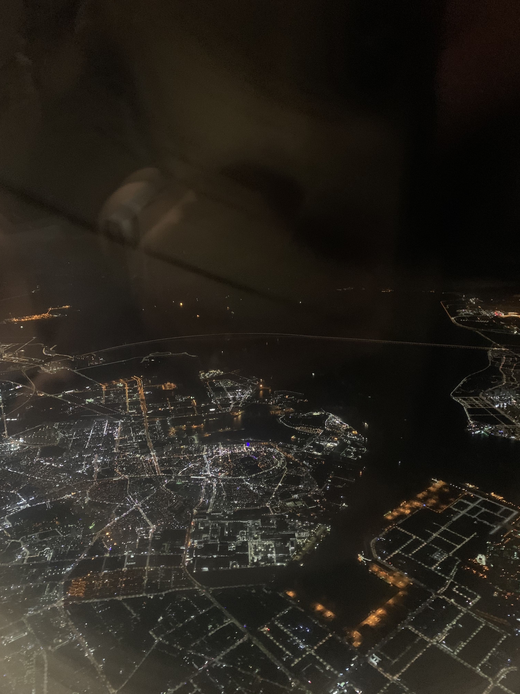
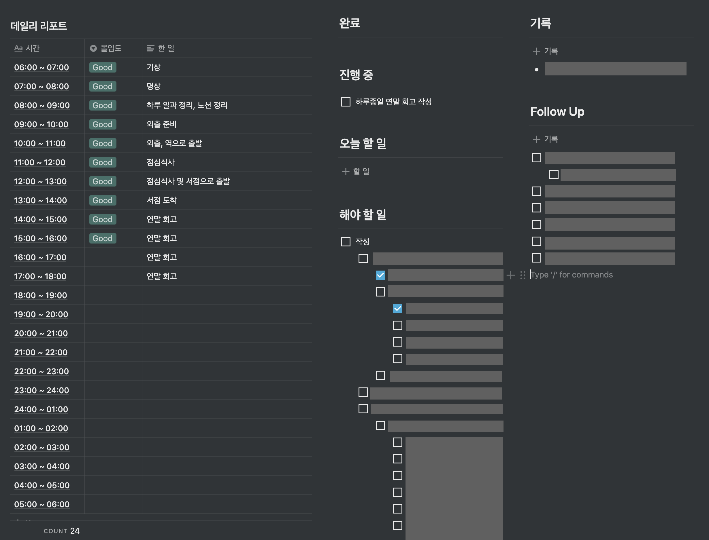

2019년 한 해는 저에게 있어 많은 깨달음과 변화를 주었던 해입니다. 수많은 실패를 말미암아 부족한 점을 찾아 공부하고 다양한 시도를 통해 자기 자신의 AB 테스트를 진행했습니다. 덕분에 작년에 올해의 목표치를 달성하지 못했으나 더 값진 경험을 했다고 생각합니다.

## 해외에서 하는 회고

올해부터는 연말에 항상 해외에 나가서 회고를 진행해보려 합니다. 한국을 떠나 낯선 환경에서 회고를 하는 일은 새로운 깨달음을 주지 않을까하는 마음에서 출발했습니다.

익숙하지 않은 환경에서 일주일간 살면서 다른 나라의 사는 사람들의 생활에 녹아들어 그들의 문화를 받아들이는 건 정말 어려운 것 같습니다. 이런 어려운 환경은 적응을 하기위해서 잡념을 떨치게 해주었고 생각의 확장과 집중력을 높혀주는데 도움이 주었습니다.

## 올해 무엇을 했나

올해 무엇을 했는지 살펴보도록 하겠습니다. 월별로 구분하는게 아닌, 1년 전체를 회고하는 것이므로 카테고리화 시켜서 회고해보도록 하겠습니다.

### 라이프사이클(LifeCycle) 구축

시간은 사람마다 내리는 정의가 다를겁니다. 작년까지 제가 항상 입으로 말했던 버릇은 "시간이 왜이렇게 없지?", "시간이 왜이렇게 안가지?" 등의 절대적인 개념에 대해 이야기를 하는 일이 잦았습니다.

하지만 올해는 시간을 제가 이용하며 써보자는 생각으로 데일리 리포트를 1년간 작성하였고, 작성하면서 어떤 일이 필요하고 해야하는지 한 눈에 볼 수 있게 고도화하였습니다.

몰입도와 어떤일을 행했는지 시간 단위로 쪼개어 기록하고 계속 인지해야할 일들과 TODO 프로세스 레이아웃을 주어 어떤 일을 해야하는지 명확하게 구분하였습니다. 이렇게 1년을 진행하니 역시 기록은 기억을 지배한다는 걸 깨달았습니다.

점점 시간 관리에 익숙해지니 어떤걸 언제 챙겨야하고 언제 진행해야하는지 쉬운 결정이 가능해졌습니다. 데일리 리포트는 결정을 하는데 있어 도와주기도 하지만 그 뿐만 아니라 하루를 되돌아보는데도 많은 도움을 줍니다.

### 이력서 작성과 면접, 그리고 이직

작년과 더불어 올해도 이직이 제겐 큰 화두였습니다. 조그마한 스타트업을 지나 조금 더 큰 기업에서 일하고 싶었고 그러기 위해서는 이직을 해야했기 때문입니다.

[이력서 작성](https://vallista.kr/2019/07/10/2019%EB%85%84-%EC%83%81%EB%B0%98%EA%B8%B0-%ED%9A%8C%EA%B3%A0/#%EC%9D%B4%EB%A0%A5%EC%84%9C-%EC%9E%91%EC%84%B1)을 할 때 여러가지 고민을 통해 레이아웃을 확정하고 웹을 제작했습니다. 해당 링크를 통해서 어떤 고민을 통해 이력서를 작성했는지 확인할 수 있습니다. 여러가지 고민을 통해 이력서 페이지를 만들었던게 좋은 영향이 있었는지 서류와 코딩테스트는 별 무리 없이 통과를 했습니다.

다음은 면접이었습니다. 면접을 보기 전 [만반의 준비](https://www.notion.so/gwangwhi/570cddfd04b64956b52efe8351e4020e))를 진행했습니다. 하지만 면접에서 많은 실수와 부족한 점을 깨닫고 아직 부족하구나를 깨달았습니다. 그렇게 여러 차례의 실패를 통해서 최종적으로 우아한형제들로 이직을 하게 되었습니다. 이직을 하는데 많은 도움을 주셨던 분들이 계십니다. 감사드린다는 인사를 다시 한번 드립니다 :)

> [Resume](https://vallista.kr/resume/)는 여기서 확인할 수 있습니다.

### 과외

재작년부터 진행한 과외를 꾸준히 진행하고 있습니다.

 

- 웹 프론트엔드 그룹 과외: 3명
- 웹 프론트엔드 과외: 1명

 

이번년도는 웹 프론트엔드 개발자가 되기 위해서 어떤 걸 공부해야하고 어떻게 성장해야 하는지를 중점으로 두고 과외를 하고 있습니다. 과외생분들이 훌륭하게 따라오고 계시고, 점차 발전하는 모습에 기분이 좋습니다.

HTML/CSS/JavaScript로 웹 만들기, browserify로 번들링해서 웹 코드 작성, CRA로 리액트 웹 개발, JavaScript ES6 등 기본적으로 현 시대의 웹 프론트앤드 개발자들이 익혀야 할 프로그래밍을 가르치고 있습니다.

과외를 하면서 좋은점은 과외생분들을 가르치기 위해 저도 기초를 다시 공부하면서 다시 기억하고 정리하는데 있습니다. 그러면서 webpack의 최신 스펙이 나왔네? 어떤 기능일까 하고 보기도 합니다. 더군다나 돈을 받기 때문에 어떻게든 준비하게 됩니다. (의지가 약하신 분은 추천드립니다.)

### 헤커톤 참여

올해는 두 군데의 해커톤을 참여했습니다.

 

- [제 1회 우아한형제들 헤커톤 - 우아톤 2019](https://vallista.kr/2019/12/10/%EC%9A%B0%EC%95%84%ED%95%9C%ED%98%95%EC%A0%9C%EB%93%A4-%ED%97%A4%EC%BB%A4%ED%86%A4-%EC%A0%9C-1%ED%9A%8C-%EC%9A%B0%EC%95%84%ED%86%A4-2019-%ED%9B%84%EA%B8%B0/)
- [스포카 헤커톤 - 무쓸모톤](https://vallista.kr/2019/07/10/2019%EB%85%84-%EC%83%81%EB%B0%98%EA%B8%B0-%ED%9A%8C%EA%B3%A0/#%EC%8A%A4%ED%8F%AC%EC%B9%B4-%ED%95%B4%EC%BB%A4%ED%86%A4-%E2%80%98%EB%AC%B4%EC%93%B8%EB%AA%A8%ED%86%A4%E2%80%99-%EC%B0%B8%EA%B0%80)

 

두 헤커톤을 참여하면서 3등과 1등이라는 기록을 내었습니다. 생각해보면 이게 사이드 프로젝트라고 칭할수도 있겠다는 생각이 들었습니다.

헤커톤을 매번 참여하면서 느끼는 거지만 해커톤을 하면서 사람은 자신의 한계를 드러내는 것 같습니다. 얼마나 지구력이 있는가, 정신력이 있는가 등으로요. 그렇기 때문에 의지가 중요하다고 생각됩니다.

가끔씩 회사일에 지치거나 새로운 무언가를 만들어보고 싶을때 해커톤을 나가므로써 아직 내가 건제하구나를 뇌로 각인을 하는 행동은 좋다고 생각합니다. 그래서 내년에도 해커톤이 있다면 최선을 다해 나갈 예정입니다.

### 스타카토 활동

[스타카토](https://www.facebook.com/staccato19/)는 고등학교에 방문하여 학생들에게 고졸 취업, 진학등 고민을 하는데 있어 강연으로 도움을 주는 모임입니다. 자원봉사의 개념의 띄고 있으며 회사원, 대학생 등 다양한 사람들이 모여 자기의 경험을 바탕으로 강연을 진행합니다.

지금까지 2년이라는 시간동안 진행되어 왔고, 작년 회장과 부회장의 임기가 끝나 올해는 스타카토 활동의 부회장을 제가 맡게 되었습니다. 그래서 올해의 목표를 정하게 되었습니다. 올해의 목표는 발표 고등학교 수의 확장와 개발자 뿐만이 아닌, 디자이너와 기획자 강연의 확장 두 가지를 가지고 활동했습니다.

키워드가 **확장**인 만큼 업무 외의 개인시간을 많이 투자하여야 했습니다. 다양한 학교의 선생님들 및 자원을 더 끌어오기 위해서 후원사를 구하거나 하는 커뮤니케이션 시간을요. 위에서 언급했듯 라이프사이클을 구축하므로써 시간을 탄력적으로 사용할 수 있었으나 스타카토 활동의 준비로 유휴 시간을 갖기는 굉장히 어려웠습니다.

더군다나 개인적으로 발표를 하고 싶어하는 욕심도 있었기 때문에 발표자로도 참가하여 PPT를 만들고 강연을 준비하는 시간도 있었습니다. 그래서 이번년도가 바빳던 이유중 하나를 스타카토 활동이 어느정도 차지하지 않았나 싶습니다.

 

- 대경 상업 고등학교 발표
- 대경 상업 고등학교 2차 발표
- 서울 디지텍 고등학교 발표

 

또, 스타카토 활동을 하면서 다양하고 새로운 사람들과 친해지게 되었습니다. 디자이너와 스타트업, 대기업, 대학생과 같은 공간에 있으면서 다양한 이야기를 하고 그들은 어떤 고민을 하는지 함께 생각해볼 수 있는 기회였고 이는 제게 좋은 경험이 되었습니다.

> 참고: [스타카토 홍보문서](https://www.notion.so/staccatokorea/2019-12-02-b65df979913e428da5705e6d6df26da7)

### 스터디

이번년도는 다양한 스터디를 진행하였습니다.

 

- 퇴근길 와인수업: 와인 스터디를 통해 전세계의 다양한 와인을 시음해보고 와인에 대해 조금 더 깊게 알게 된 스터디
- 하드웨어 스터디: 스터디를 전부 따라가지 못했지만, 어셈블리 및 레지스터, 하드웨어 어떻게 동작하는지 알게 되었음.
- 사내 백앤드 개발자를 위한 HTML/CSS 스터디: 아직 1회밖에 하지 못했지만, 내년에는 더 많은 서버 개발자분들께 HTML/CSS에 대해서 쉽게 접근할 수 있게 스터디를 자주 열 생각입니다.

 

### 독서

올해는 개발 및 협업 관련된 독서를 몇 권 진행했습니다.

 

- 그들은 알고리즘을 알았을까?
- 완벽한 공부법
- 피플웨어
- 함께자라기
- 편지
- 또다시 같은 꿈을 꾸었어
- 테스트 주도 개발로 배우는 객체 지향 설계와 실천

 

총 7권의 책을 읽었습니다. 공학관련 책을 읽으면서 실생활에서 자신에게 AB 테스트를 진행하고 팀원분들의 피드백을 바탕으로 점진적으로 발전해 나갔습니다.

이 중에 가장 재밋었던 책을 꼽으라 하면 **피플웨어**를 꼽을 수 있겠습니다. 협업 관련된 훌륭한 팁들과 어떻게 헤결하면 좋을까를 고민할 수 있었던 책이기 때문입니다. 더군다나 큰 회사에서 일해본 경험이 적은 저로써는 도움이 많이 되었습니다.

올해는 책을 이용한 독서보다 MEDIUM과 같은 블로그 플랫폼에서 코드 리뷰 및 협업, React, 테스팅 과 같은 베이스를 구축하는 글을 많이 봤습니다. 그래서 인문학적인 독서를 많이 하지 못했고 내년에는 조금 더 노력해서 읽을 예정입니다.

### 블로깅

올해는 블로그에 적극적으로 포스팅했습니다. AB 테스트를 통해 어떤 글이 더 잘 읽히고 어떻게하면 좋은 글을 작성할까에 대한 고민의 연장선이었습니다. 회사 업무를 하면서, 혹은 자신이 살아가면서 글쓰기 스킬은 필요할 수 밖에 없다는 걸 깨달았기 때문입니다.

 

- [모바일 웹뷰를 탐험하는 개발자를 위한 안내서 (상)](https://vallista.kr/2019/11/10/%EB%AA%A8%EB%B0%94%EC%9D%BC-%EC%9B%B9%EB%B7%B0%EB%A5%BC-%ED%83%90%ED%97%98%ED%95%98%EB%8A%94-%EA%B0%9C%EB%B0%9C%EC%9E%90%EB%A5%BC-%EC%9C%84%ED%95%9C-%EC%95%88%EB%82%B4%EC%84%9C-%EC%83%81/) - 사내의 서버 개발자분들과 정보를 공유하기 위해 작성한 글입니다.
- [놓치기 쉬운 HTML/CSS 지식 몰아보기](https://vallista.kr/2019/11/25/%EB%86%93%EC%B9%98%EA%B8%B0-%EC%89%AC%EC%9A%B4-HTML-CSS-%EC%A7%80%EC%8B%9D-%EB%AA%B0%EC%95%84%EB%B3%B4%EA%B8%B0/) - 사내의 서버 개발자분들과 정보를 공유하기 위해 작성한 글입니다.
- [우아한형제들 헤커톤 - 제 1회 우아톤 2019 후기](https://vallista.kr/2019/12/10/%EC%9A%B0%EC%95%84%ED%95%9C%ED%98%95%EC%A0%9C%EB%93%A4-%ED%97%A4%EC%BB%A4%ED%86%A4-%EC%A0%9C-1%ED%9A%8C-%EC%9A%B0%EC%95%84%ED%86%A4-2019-%ED%9B%84%EA%B8%B0/) - 우아한형제들에서 진행하는 해커톤에 대해 짤막하게 작성한 후기글 입니다.
- [웹 개발자의 지옥, 이메일 폼 개발하기](https://vallista.kr/2019/12/27/%EC%9B%B9-%EA%B0%9C%EB%B0%9C%EC%9E%90%EC%9D%98-%EC%A7%80%EC%98%A5-%EC%9D%B4%EB%A9%94%EC%9D%BC-%ED%8F%BC-%EA%B0%9C%EB%B0%9C%ED%95%98%EA%B8%B0/) - 이메일 폼을 개발하면서 정보들이 산재되어있어 모아둔 정리 글입니다.
- [모바일 웹뷰를 탐험하는 개발자를 위한 안내서 (중)](https://vallista.kr/2019/12/28/%EB%AA%A8%EB%B0%94%EC%9D%BC-%EC%9B%B9%EB%B7%B0%EB%A5%BC-%ED%83%90%ED%97%98%ED%95%98%EB%8A%94-%EA%B0%9C%EB%B0%9C%EC%9E%90%EB%A5%BC-%EC%9C%84%ED%95%9C-%EC%95%88%EB%82%B4%EC%84%9C-%EC%A4%91/) - 사내의 서버 개발자분들과 정보를 공유하기 위해 작성한 글입니다.
- [동시성과 병렬성 (Concurrency & Parallelism)](https://vallista.kr/2019/12/28/%EB%8F%99%EC%8B%9C%EC%84%B1%EA%B3%BC-%EB%B3%91%EB%A0%AC%EC%84%B1-Concurrency-Parallelism/) - 이론 공부를 하면서 정리한 글입니다.

 

(만족스러운 글 몇 가지를 모아 보았습니다.)

올해 총 40개의 글을 작성했습니다. 전반기부터 작성한 글들은 제가 알고있는 지식을 조금 더 구체화시키기 위해서 마구잡이로 쓰는 경향이 있다고 한다면 이직하고나서 작성한 글은 퀄리티를 보장하고 나만이 쓸 수 있는 글을 작성하기 위해 노력했습니다.

첫 글과 최근에 작성한 글을 비교하니 많은 발전을 하고 있다고 스스로 느낍니다. 앞으로도 글을 작성하면서 나만이 작성할 수 있고 많은 분들께 도움이 되는 글을 작성하려 노력하겠습니다.

### 우아한형제들

올해의 가장 큰 임펙트를 이야기하지면 **우아한형제들** 입사를 이야기 해야합니다. 우아한형제들에 입사하고 4개월간(9월, 10월, 11월, 12월) 정말 바빳기 때문입니다. 4개월간 우아한형제들에서의 일은 평생 기억할 것 입니다. 그만큼 커뮤니케이션, 개발 측면으로 성장을 하였습니다.

제가 우아한형제들에 입사하고 들어온 팀은 **B마트 플랫폼팀** 입니다. 당시에는 배민마켓 플랫폼팀이었고, 베타에서 정식버전으로 올리기 위해서 일을 폭팔적으로 하던 시기였습니다. 그래서 들어오자마자 인수인계를 정신없이 받으며 작업을 진행했습니다. 당시 팀의 웹 프론트엔드 개발자는 저 혼자였고, 제가 오기전까지 서버 개발자 분들이 웹 프론트엔드를 Vue.js로 함께 작업을 하셨습니다.

그래서 몇 가지 작업을 장기적으로 함께 했어야 했고 그 중에서 우선순위를 추려냈습니다.

 

- 기존 레거시 소스를 container & presentationals, atomic design과 같이 최소 단위의 공통된 컴포넌트로 쪼개고, 전반적인 프로젝트를 리펙토링 해야함
- 주문쪽과 상품쪽을 분리하여 상품쪽이 뻗어도 주문은 기능할 수 있도록 분리
- 배민 디자인 시스템에 맞게 디자인 컴포넌트를 다시 구축해야 하는 일
- 프론트 Vue.js 코드를 React.js로 이전하기
- 어드민 리펙토링 및 Shape 개발
- 인수인계 및 개발 환경 일원화를 위한 가이드라인 작성
- 등..

 

이 일들을 순차적으로 들어갈 수 없어, 세번째 우선순위까지의 일을 한번에 병렬적으로 처리하였습니다. 혼자 진행하고 있었으나, 서버 개발 및 어드민 프론트를 작업하시던 개발자 한 분과 함께 작업을 하게 되었습니다.

제가 가이드라인을 드리면 함께 개발하시는 개발자분이 데이터 영역을 구현을 해주셨고, 저는 그 데이터 영역을 기준으로 HTML, CSS 레이아웃 및 데이터 바인딩을 진행했습니다. 이렇게 한 이유는 배달의민족 앱은 다양한 디바이스에서 호환되야 했기 때문입니다.

그래서 세 가지의 일(+ low 디바이스 대응)을 결국에 11월 초까지 완료하였습니다. 근 2달간 정신없이 진행하며 틈틈히 함께 개발을 진행하는 개발자 분과 회고도 하고, 부족한 점을 보완하기도 하고 프론트엔드 기반을 제작하였습니다.

하지만 웹 프론트엔드 개발자의 일이 여기서 끝날리가 없습니다. 마케팅 페이지 및 이메일 지면과 같은 다양한 페이지에서 리소스가 필요해졌고, 이 리소스 또한 프론트엔드 팀에서 작업을 해야 했습니다. 그래서 중요한 일들 몇 가지를 1월달로 미뤄놓은 상태인데 사실 좀 무섭습니다 (...) 1월에 다 진행하기에는 무리가 있지만 더이상 미루면 안되기 때문입니다.

여러가지 일을 하지만 저는 항상 즐겁고 힘들지 않습니다. B마트가 편하다고 이야기 하시는 많은 고객분들의 반응을 보면 즐겁고, 개발한 성과가 매출로 바로 보이기 때문입니다.

 

**우아한형제들에서 4개월간 경험한 것**

- 기반을 다지기 위한 설계
- 법률
- JIRA
- 유저 스토리
- 고객에 입장에서 생각하는 방법
- 병렬적으로 일을 하는 방법
- 다양한 부서와의 커뮤니케이션

## 올해 목표 되짚어보기

올해에 다양한 활동을 한 걸 확인했으니, 작년에 설정한 올해 목표와 올해 무엇을 했는지를 비교해보며 얼마나 이루었는지 되짚어 보아야 합니다.

작년에 설정했던 올해 목표의 주제는 **라이프사이클 만들기** 였습니다. 체계적인 라이프사이클을 만들어 규칙적인 생활을 통해 몸이 길들여지게 만드는게 이유였습니다.

- 영어 학원 꾸준히 다니기 **(실패)**

첫 번째로 영어 학원 꾸준히 다니기는 실패했습니다. 올해 중반기 쯔음부터 이직을 준비하면서 영어학원을 취소하고 부족한 프로그래밍 공부를 진행했기 때문입니다.

- 오전 6시 기상 **(성공)**

오전 6시 기상은 유일하게 잘 지킨 목표입니다. 오전 6시 기상을 하고 운동 및 명상을 통해 하루를 기운차게 보낼 수 있었으며 후반기에는 출근 전까지 회사 프로젝트를 추가로 진행하였습니다. 덕분에 생산성과 능률이 좋아졌고 밤이 되면 피곤해서 잘 자게 되었습니다.

- 세미 프로젝트 3개 완성 **(실패)**

세미 프로젝트는 건들지도 못했습니다. `엘레강스 소셜 클럽` 모임을 만들어 소프트웨어를 개발해보려 했지만 역시 사이드 프로젝트를 회사일과 병행하며 진행한다는게 어려운 일이었습니다.

- 일일 커밋 **(실패)**

일일 커밋은 실패했습니다. 올해 일일 커밋을 진행해보려 했지만 저에게는 맞지 않는 공부 방법이라는 사실을 3월 정도에 깨달았습니다. 각자 자신의 공부 방법이 있을겁니다.

공부 방법 중 하나인 일일 커밋은 '잔디밭'이라고 이야기 하는 커밋 그래프를 채우면서 뿌듯함을 느끼며 공부하는 보람을 찾는 방법인데요, 저는 이보다 노션에 매일매일 회고하고 회고를 통해 부족한 점을 공부하는게 조금 더 맞았습니다.

- 발표 두 번 하기 **(절반의 성공)**

올해는 **스타카토 활동**의 일환으로 고등학교를 찾아가 발표하는 활동을 꾸준히 진행했습니다. 스타카토 활동을 하며 올해 3번의 발표를 하게 되었습니다.

개발적인 내용으로 두 번의 발표를 진행했던 작년과 달리 올해는 크게 개발적인 내용으로의 발표는 없어서 성공이라 보기 어렵습니다. 그래서 절반의 성공이라고 텍스트를 써넣었습니다.

다섯가지의 목표 중 한 개만 성공을 했네요. 모든 목표를 이뤘으면 이상적인 이야기였겠지만 아직은 제가 모두 이룰 수 있을 만큼 훌륭한 사람이 아닌 것 같습니다.

하지만 다섯개중 가장 중요하게 생각했던 오전 6시 기상은 이뤄내었으니 절반의 성공이라고 생각합니다. 내년에는 조금 더 근성을 발휘하여 목표를 쟁취하는 사람이 되었으면 좋겠습니다.

## 내년 목표

내년도 목표는 올해처럼 많은 것에 집중하는 게 아닌, 기존에 해왔던 것에 집중을 하는게 목표입니다. 정리하자면 **내실을 다지다** 라고 볼 수 있겠습니다.

- 발표 두 번 하기

개발 관련 컨퍼런스에서 발표 두 번 하는게 목표입니다. 많이 고민해왔던 React.js Folder Structure 및 개발하는 팁에 대해서 이야기 해보고 싶습니다. 또한 Vue.js와 React.js는 어떻게 다르고, 이를 공통으로 충족시켜주려면 어떻게 해야하는가에 대해서도 발표를 해보고 싶습니다.

- 오전 6시 기상 유지하기

올해의 가장 큰 수확은 오전 6시 기상을 유지하는 멘탈을 소유하게 되었다는 것입니다. 이 좋은 습관을 계속 가지고가고 싶습니다.

- 데일리 리포트 유지하기

매일 어떤 일을 했고, 몇 시에 무얼 했는지, 어떤 일을 해야하는지 알려주는 데일리 리포트 작성은 제 삶을 유기적으로 만들어주었습니다. 그래서 앞으로 계속 가져갈 예정입니다.

- Java + Spring 공부하기

자바와 스프링을 공부하려 합니다. 아무래도 우아한형제들에 있으면서 Java + Spring을 모른다는 것은 서버 개발자와 서버 관련 이야기를 할 때 커뮤니케이션이 어려워진다는 걸 의미합니다. 그래서 내년에는 더 좋은 커뮤니케이션을 하기위해 Java와 Spring을 공부할 예정입니다.
