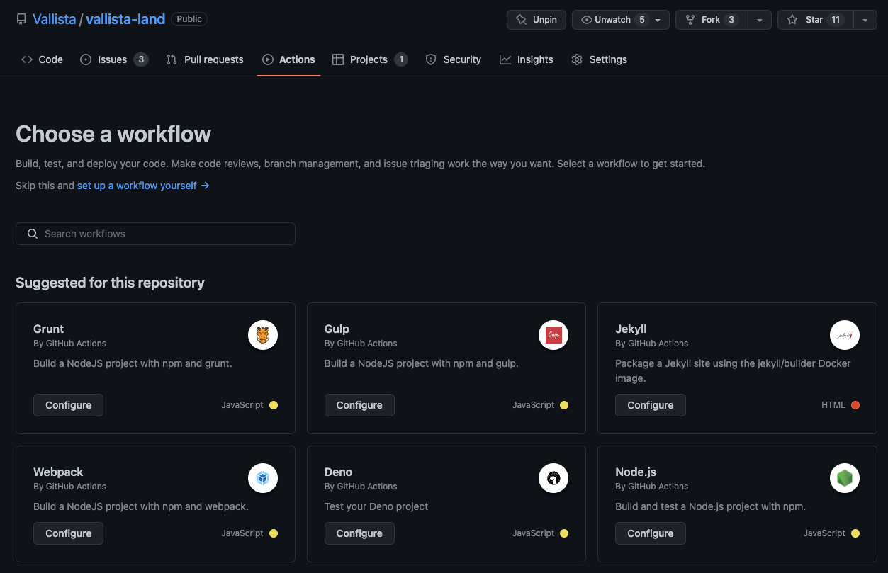
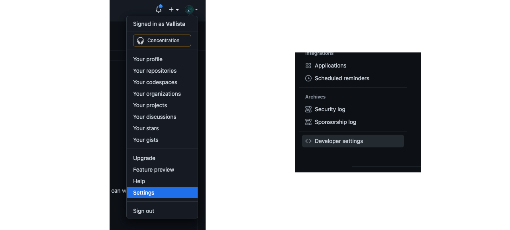
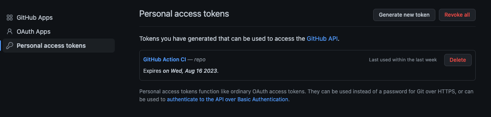
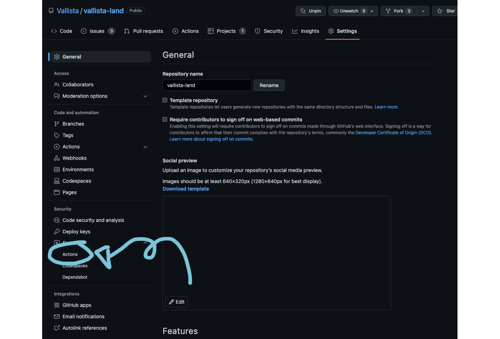
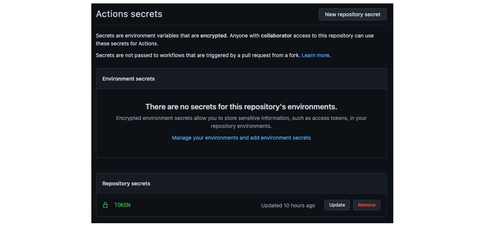
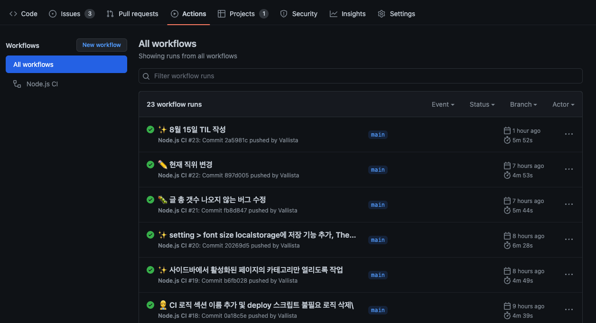
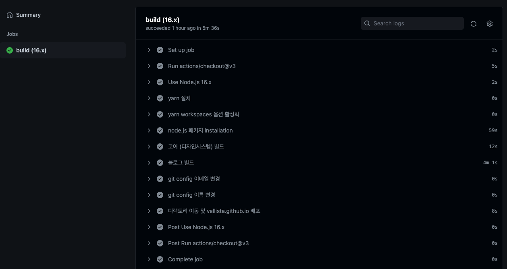

## 오늘 한 일

- 오전 운동 (10시 - 11시), 스쿼트 5세트 / 벤치 프레스 5세트 / 인클라인 벤치 프레스 6세트
- 블로그 개선
  - [환경설정 팝업 > FontSize 변경 시 localStorage에 남도록 수정](https://github.com/Vallista/vallista-land/commit/20269d5260c29b35f1191d562a1040f0fc3aaefd)
  - [기본적으로 접되, 현재 active 페이지로 들어올 경우 해당 챕터만 열도록 구현](https://github.com/Vallista/vallista-land/commit/b6fb028678abe45411cdc75a41f160f69a12a264)
  - [글 총 갯수 나오지 않는 버그 수정](https://github.com/Vallista/vallista-land/commit/fb8d8479912898848faedc0365d0fd59cac037cf)
  - [Header 로직 개선](https://github.com/Vallista/vallista-land/commit/20269d5260c29b35f1191d562a1040f0fc3aaefd)
  - [Sidebar 로직 개선](https://github.com/Vallista/vallista-land/commit/691199334ec03cc0f11909a579006b6c21430bb6)
- [GitHub Action으로 main 브랜치 push 감지 후, github pages 페이지 배포](https://github.com/Vallista/vallista-land/commit/4e332dec859a7cf6794f009a26e70456369df3af)

## GitHub action에서 main 브랜치 push를 감지해서 자동배포하기

현재 블로그는 모노레포로 되어있고, 패키지로 컴포넌트와 블로그 프로젝트가 존재한다. 그리고 프로젝트를 빌드하면 github pages로 배포가 되어 vallista.github.io가 배포된다.
지금까진 수동으로 main에 푸쉬하고 별도로 build후 deploy 되도록 이를 작업했다. 그런데 어느덧 작업이 계속 반복되니 시간이 많이 소비된다는 걸 깨닿게 되었다.

그래서, Github Action으로 main branch에 푸쉬되면 vallista.github.io에 빌드된 결과물을 commit 과 함께 push 하도록 제공을 할 것이다.

### 1. 모노레포 패키지에 GitHub Action Workflow 추가하기



workflow를 선택하면 여러가지가 보이는데, 여기서 js script등이 있으므로 쉽게 Node.js 환경으로 실행했다. 그 후 yml 파일이 만들어지고, 해당 yml 파일에서 로직을 작성해 githuh action script를 작성할 수 있다.

### 2. 스크립트 작성하기

```yml {numberLines}
name: Node.js CI

on:
  push:
    branches: ['main']
  pull_request:
    branches: ['main']

jobs:
  build:
    runs-on: ubuntu-latest

    strategy:
      matrix:
        node-version: [16.x]
        # See supported Node.js release schedule at https://nodejs.org/en/about/releases/

    steps:
      - uses: actions/checkout@v3
        with:
          token: ${{ secrets.TOKEN }}
      - name: Use Node.js ${{ matrix.node-version }}
        uses: actions/setup-node@v3
        with:
          node-version: ${{ matrix.node-version }}
          cache: 'npm'
      - name: yarn 설치
        run: npm install -g yarn
      - name: yarn workspaces 옵션 활성화
        run: yarn config set workspaces-experimental true
      - name: node.js 패키지 installation
        run: yarn
      - name: 코어 (디자인시스템) 빌드
        run: yarn build:core
      - name: 블로그 빌드
        run: yarn build:blog
      - name: git config 이메일 변경
        run: git config --global user.email "mgh950714@gmail.com"
      - name: git config 이름 변경
        run: git config --global user.name "vallista"
      # vallista-blog 들어가서 deploy 스크립트에 TOKEN 주입해 실행
      - name: 디랙토리 이동 및 vallista.github.io 배포
        run: |
          yarn directory:blog
          yarn deploy:blog-ex ${{ secrets.TOKEN }}
```

스크립트를 다음과 같이 작성했다. 문법은 어렵지 않아서 쉽게 이해하게 되었다. 여기서 조금 해메었던 부분은 모노레포 설정과 git config 설정하는 부분이었다. 각각의 어려웠던 부분을 이야기해보면 다음과 같다.

#### 2-1. 모노레포 설정하기

```yml {numberLines}
- name: yarn 설치
  run: npm install -g yarn
- name: yarn workspaces 옵션 활성화
  run: yarn config set workspaces-experimental true
```

블로그 프로젝트는 yarn workspace를 이용해 쉽게 모노레포를 설정했다. 그 외는 lerna의 설정을 받아왔는데, 이를 사용하기 위해선 yarn을 다운로드 받아아 하고, `yarn config set workspaces-experimental true` 설정을 통해 workspaces experimental 설정을 true로 바뀌주어야 한다.

#### 2-2. CI 서버에서 git 설정하기

사실 모노레포 설정하는 것은 크게 어렵지 않다. 하지만 CI 서버에 git 설정을 해주는게 조금 헤메일만한 설정인데, 이 부분도 공식문서에 git 설정이라기보단 token 설정이라는 명목으로 나와있는데, 찾기가 어렵긴 했다. [문서 링크](https://docs.github.com/es/actions/security-guides/automatic-token-authentication)

해당 작업을 하기 위해 다음 작업을 해줘야 한다

- git global config에 email, username 추가
- github page CLI를 스크립트에서 써서 보내주고 있으므로, 계정 인증값을 받아서 CLI에 전달해야한다.

`git global config 설정하기`

```yml {numberLines}
- name: git config 이메일 변경
  run: git config --global user.email "mgh950714@gmail.com"
- name: git config 이름 변경
  run: git config --global user.name "vallista"
```

global config을 설정하기는 매우 쉽다.

`Github page CLI 스크립트에 인증값 주입하기`

```yml {numberLines}
- name: 디랙토리 이동 및 vallista.github.io 배포
  run: |
    yarn directory:blog
    yarn deploy:blog-ex ${{ secrets.TOKEN }}
```

코드를 보면 `yarn deploy:blog-ex ${{ secrets.TOKEN }}`을 실행하고 있다. 그 중에서 `${{ secrets.TOKEN }}`을 보면 되는데, 이 secrets는 간단하게 추가할 수 있다.

1. Github > 개인 설정 > Settings > Developer settings에 접근한다.



<center>좌: Settings / 우: Developer Settings</center>

2. Personal access tokens > Generate new token을 통해 토큰을 생성한다.



<center>토큰을 생성할 때 권한을 repository 접근을 할 수 있게 모든 권한을 주면 된다.</center>

3. 대상 프로젝트의 Settings > Secrets > Actions로 들어간다



<center>Settings > Secrets > Actions</center>

4. Actions secrets에서 TOKEN을 추가한다.



<center>추가하면 Repository secrets에 등록된다.</center>

5. 스크립트에서 `${{ secrets.TOKEN }}` 형태로 호출한다.

등록하면 대상 프로젝트에서 해당 유저의 모든 레포지토리에 접근할 수 있는 권한이 생긴다.



<center>실행하면 다음과 같이 잘 실행된다.</center>



<center>workflow가 가동된 모습</center>
