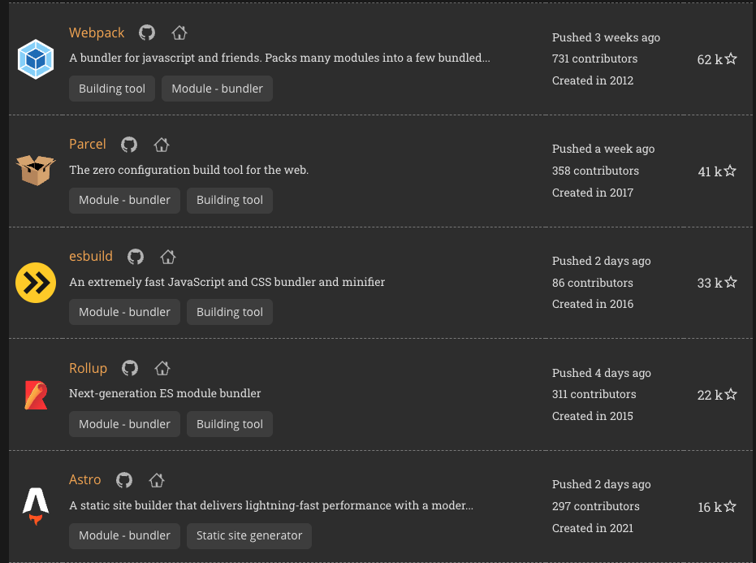
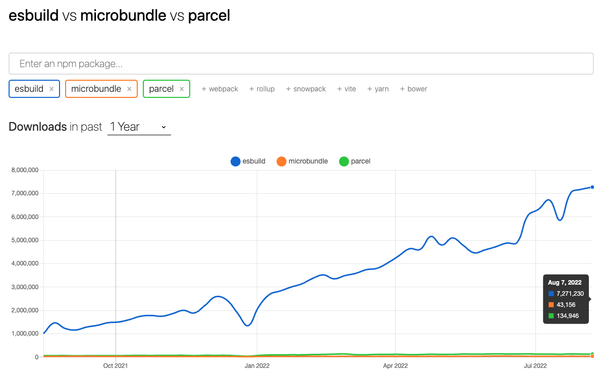

## 오늘 한 일

- @Vallista-land/core library 배포하는 삽질
- 회사 인터널 앱을 만들기 위한 커뮤니케이션 여정 (은 실패)
- 그 외, 푹 쉬었다..

## @Vallista-land/core library 배포하기

@Vallista-land의 core는 yarn workspace로 하여금 빌드된 결과물을 각 모노레포간 사용할 수 있도록 제공한다. 그러기 위해 workspace 설정을 해주어야하는데, 이는 내 블로그의 설정에서 볼 수도 있고 [링크](https://classic.yarnpkg.com/lang/en/docs/workspaces/)에서 볼 수도 있다.

그래서 오늘은 GitHub의 모노레포 프로젝트에 packages/core를 npm 배포를 진행할 것이고, 여러 GitHub 기능을 사용해보려 한다.

- tsc로 트랜스파일링 및 번들링을 하고 있다. tsc는 만족스러운 결과물을 만들지 않으므로 다른 번들러로 변경하는 작업
- npm에 올리기위한 환경 설정 & Github Packages 등록

### 번들러 변경하기

현재 tsc 번들러를 사용하고 있으므로, 여기서 아무거로나 변경해도 더 좋은 효과를 낼 수 있다. (그만큼 tsc가 구리긴 하나, 지금은 꽤 좋아진 것 같기도 하고..) tsc의 가장 큰 문제는 다음과 같다

- 빌드가 되면 정보를 tsconfig.tsbuildinfo 파일에 저장해, 캐싱 및 버전등 빌드에 쓰이는 정보를 들고 있다가 신규 빌드가 되었을때 교체를 진행한다. 문제는 이 부분이 제대로 구현이 안된 것인지 판단을 잘 하지 못한다. 그래서 지속적으로 지우고 리셋을 해주는 문제가 발생하고 있다.
- tsc를 watch로 하여 계속 업데이트 및 실행을 시키는데 tsbuildinfo의 문제로 인해 제대로 업데이트가 안된다. hotreload가 안되는 것 때문에 많은 스트레스를 받았다.

이러한 문제를 갖고있는 tsc를 뒤로하고, 2022년 8월 17일 기준 어떤 번들러가 핫한지 체크해보자.

#### 번들러 현황

과거부터 많이 사용되고 있는 번들러로는 rollup이 있다. 그런데 rollup은 트리쉐이킹이 안되는 버그들도 존재하고 무엇보다 이전에 회사에서 사용을 해봤기 때문에 별로 하고싶지는 않았다. 그래서 rollup은 제외한다.

`Github의 별 개수 확인해보기`

[bestofjs.org](https://bestofjs.org/projects?tags=module)에서 bundler 순위를 확인해보았다.

bestofjs.org 의 bundler 순위

대략 10위까지는 다음과 같다

1. Webpack (62k)
2. Parcel (41k)
3. esbuild (33k)
4. Rollup (22k)
5. Astro (16k)
6. Browserify (14k)
7. System.js (12k)
8. Microbundle (7.2k)
9. esm (5.2k)
10. Metro (4.6k)

Webpack, Rollup, Browserify, esm는 전통적으로 유명했으니 제외하고 나머지의 대다수는 zero configuration 인것들이 많았는데, 각각 어떤 특징이 있는지 확인해봤다.

- `Parcel`: 다양한 파일, 언어등에 대해서 설정이 필요없고, 빠르고 프로덕션 레벨에서 최적화가 된다고 한다.
- `ESbuild`: 실제 회사의 프로덕트에서 사용을 해봤다. parcel의 설명과 비슷하게 최적화나 빠르기가 있다고 했는데, esbuild는 library로써 코드를 작성해야한다.
- `Microbundle`: `package.json`의 디펜던시만 존재하고, ESnext, async/await등의 문법까지 지원한다. 또한 설정 하나도 없이 TypeScript 지원을 한다고 한다.
- `astro`: 번들러의 역할보다 간단하게 웹을 만들 수 있는 Next.js와 같은 프레임워크로 보여서 선택에서 제외한다.
- `System.js`: 이것도 번들러의 역할보단 구동되는 환경을 일컫는 걸로 보여서 제외한다.

`npm trend 지표 확인하기`

결국 `parcel`, `esbuild`, `microbundle` 세 가지 중에 선택을 해야했는데, npm 트랜드상으론 esbuild가 제일 안정적이었지만, 지금 프로젝트는 개인 블로그기도 하고 메이저를 사용할 이유는 딱히 없었다. 그래서 최근에 다운로드수가 높아지고 있는 microbundle이 궁금했고, 이번엔 `microbundle`로 해보려고 했다.

#### Microbundle ..?

결론적으로 말하자면, Microbundle로 변경하면서 에러가 발생했다. 그런데, 에러가 어디서 나는지 갈피를 잡을수가 없었다. 거기다 microbundle의 이슈만 해도 50개가 넘었고, 나의 에러에 해당하는 부분을 찾아도 나오지도 않았다. 한 번 간단하게 써보려다 큰 삽질을 하게 될 것 같아서 parcel로 방향을 바꾸게 되었다.

#### Parcel ...?

parcel은 [문서가 진짜 미친듯이 잘 정리 되어있다](https://parceljs.org/getting-started/webapp/) 그래서 순탄하게 변경했으나, monorepo에서 라이브러리들이 충돌나온 것인지... 이번에도 에러를 봉착하게 되었다. 그런데 찾아보니까 [parcel은 이슈가 675개가 있고](https://github.com/parcel-bundler/parcel/issues) [yarn workspace 의 위치를 제대로 알아오지 못하는](https://github.com/parcel-bundler/parcel/issues/7579) 문제가 있었다. 그래서 이번에도 결국 parcel은 적합치 못한 것으로...

#### 돌고 돌아서 esbuild

결국 많이 돌고 돌았는데, esbuild로 가게 되었고, 내일은 esbuild 삽질과 npm packages에 넣는걸로 진행해보려한다.
