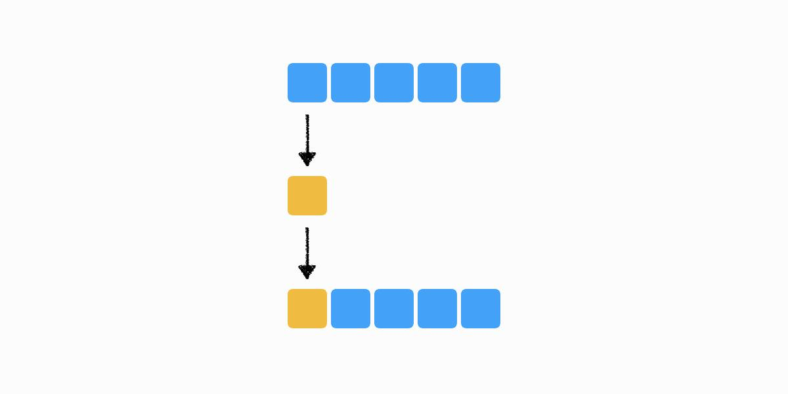
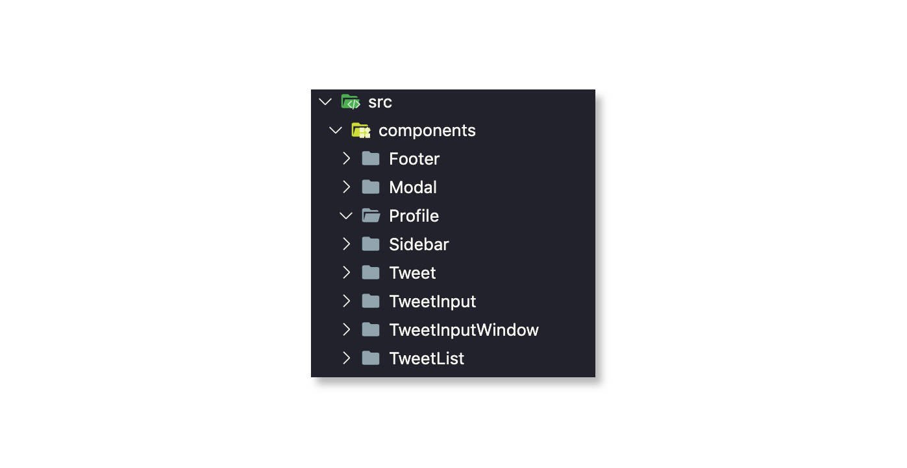
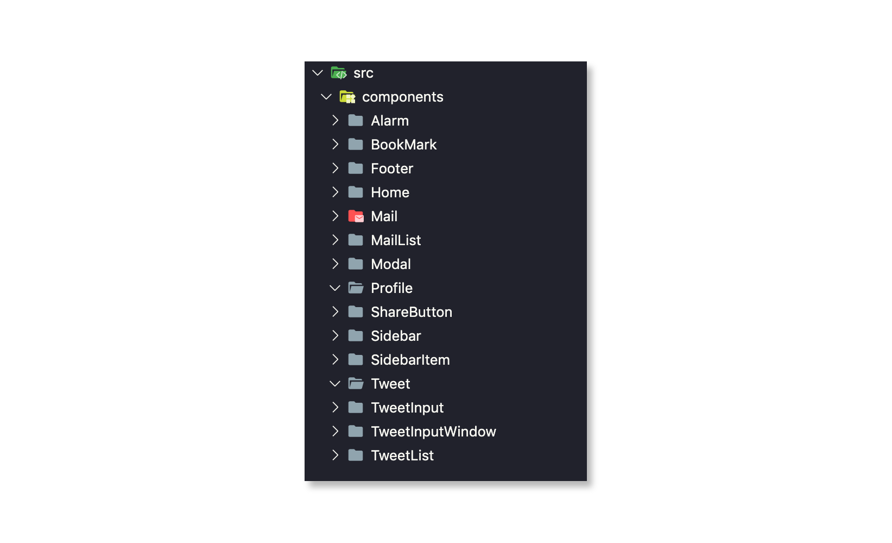
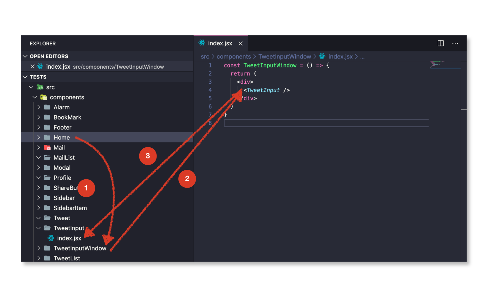
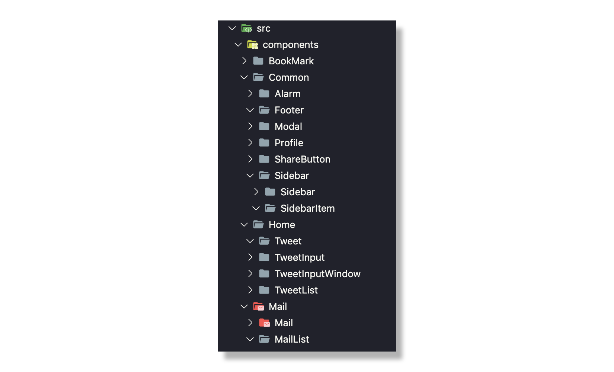
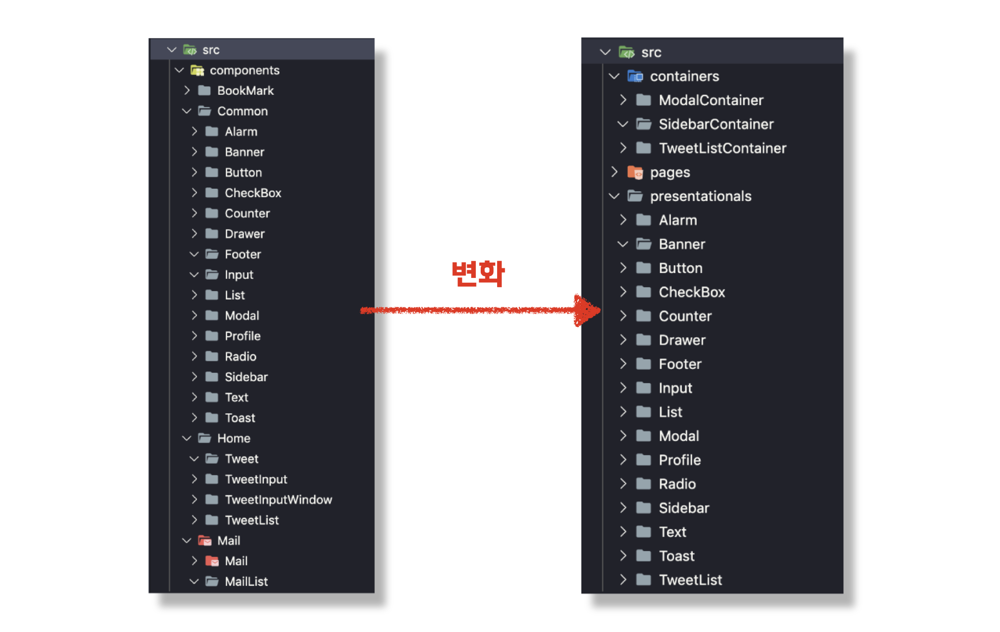
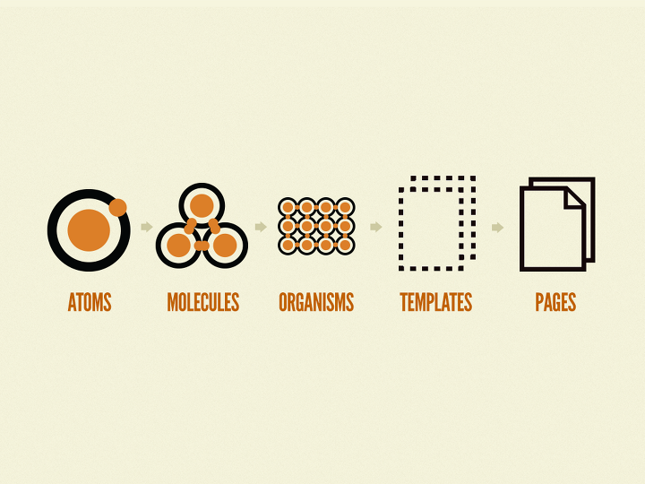
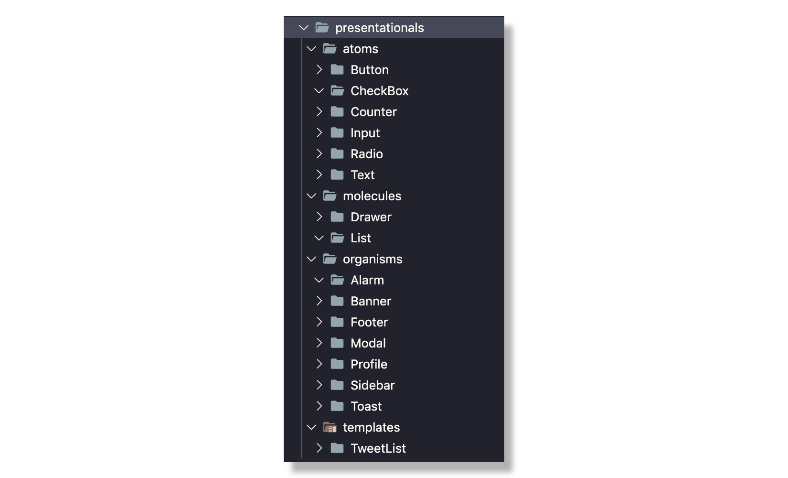
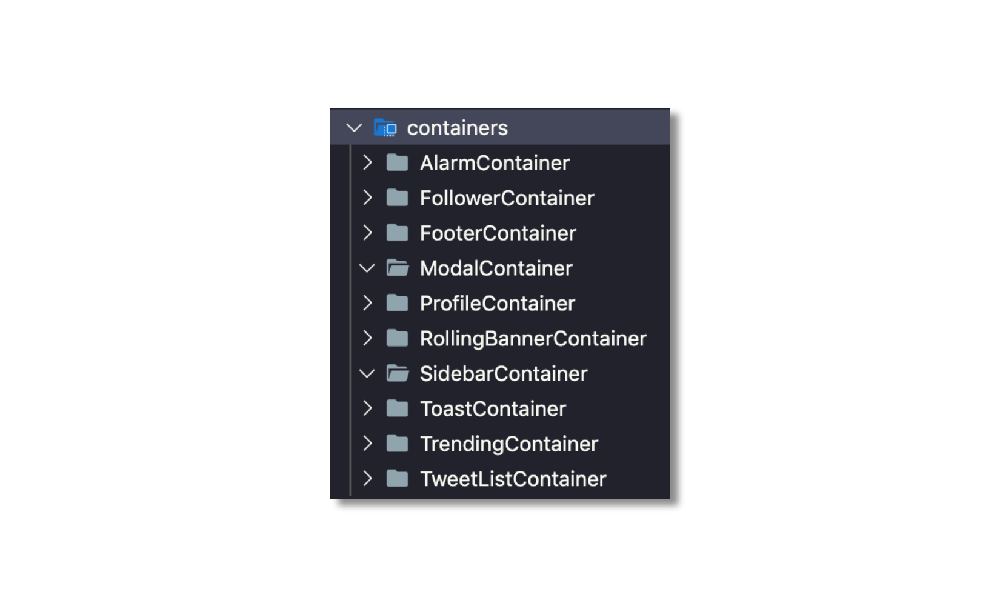
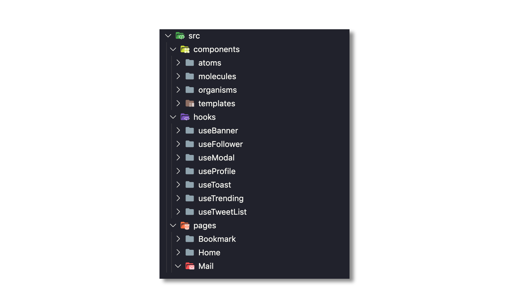

개발을 하다보면 정답이 없는 오묘한 문제가 발생합니다. 이 문제는 잘 잡지 않으면 유지보수에 큰 영향을 주지만 정답은 없습니다. 항상 탐험해야하는 문제에 해당하죠.

이 문제는 바로 `SoC(Separation of concerns) - 관심사의 분리` 입니다. 프로젝트의 규모, 도메인 등에 따라서 효율적인 관심사의 분리 방법이 바뀔 수 있으며 분리가 어떻게 되어 있냐에 따라 진입점 자체도 달라집니다.

웹 프론트엔드 생태계는 발촉된 지 얼마 안되었습니다. 그래서 관심사의 분리가 제대로 이루어진 사례가 많이 없고, 수많은 프론트엔드 개발자는 정답을 찾기위해 헤메이고 있는 중입니다.

오늘의 글은 웹 프론트엔드 업계를 탐험하며 나름대로 얻은 결론과 정답을 찾기위한 몸부림의 과정을 적었습니다.

## 컴포넌트의 정의



컴포넌트는 `독립적인 단위모듈` 입니다.

독립적인 단위모듈이라는 것은 독립적인 실행이 가능하다는 것입니다. 컴포넌트는 해당 기능에 대해서 독립적으로 수행이 될 수 있고, 새로운 모듈로 교환될 수 있어야 합니다.

독립적인 실행이 가능하다는 뜻은 해석하기에 따라서 많은 차이점을 낳습니다. 후술할 여러가지 컴포넌트 관리 기법은 컴포넌트의 정의와 매칭되나, 전혀 다른 구현 방법을 사용하고 있습니다.

## 도메인 중심의 컴포넌트

독립적인 단위모듈에 기반하여 컴포넌트를 `도메인 중심` 으로 개발하는 방법입니다.



컴포넌트가 도메인 단위로 나뉘어져 있습니다. 해당 컴포넌트에서는 관련된 도메인 상태 및 행동을 포함합니다. 이 방법의 장점과 단점에 대해서 알아봅시다.

### 장점

- 컴포넌트를 직관적으로 알 수 있다.

### 단점

- 파일이 많아지면 찾기가 힘들어진다.
- 도메인 컴포넌트가 서로 참조하게 되어 코드가 쉽게 꼬일 수 있다.

도메인 단위로 개발하게 되면 뎁스없이 직관적으로 컴포넌트를 인지할 수 있는 장점이 있습니다. 소규모의 프로젝트에서는 이러한 구현 기법이 잘 먹힐 수 있으나 중규모의 프로젝트를 개발할 때 이 방법으로 컴포넌트를 관리하게 되면 더 다양해진 도메인을 견딜 수 없을 것입니다.



위의 사진처럼 다양한 도메인이 생길수록 네이밍의 한계점도 생기고, 노말하게 펼쳐있으므로 이름 탐색에 어려움을 겪습니다.

탐색에서 어려움을 겪는 문제를 한 가지 더 이야기를 해보면, 수정사항이 있을때 컴포넌트 진입이 하는 과정을 예시로 들 수 있겠습니다. 아래의 사례를 보면 이 구조로 된 컴포넌트 분리 방식은 좋지 않다는 걸 볼 수 있습니다.



"트위터의 인풋 박스를 수정하라" 라는 조건이 주어졌고, 도메인 히스토리를 모르는 개발자가 진행해야 한다고 가정합니다.

동선을 살펴보면,

1. 컴포넌트 리스트에서 전체를 훓으며 Home을 찾습니다. Home 코드 내에서 TweetInputWindow를 탐색하여 이동합니다.
2. TweetInputWindow에서 TweetInput을 찾고, TweetInput을 컴포넌트 리스트에서 훓으며 찾습니다.
3. TweetInput으로 들어옵니다.

<br/>

수정할 컴포넌트를 찾기위해 탐색을 계속 진행하여 컴포넌트로 들어왔습니다. 굉장히 비효율적인 방법으로 찾고 있는 걸 확인할 수 있었습니다. 그렇다면 이보다 더 효율적으로 개발자가 개발을 진행할 수 있게하는 방법이 무엇이 있을까요?

### 도메인 단위로 폴더 구축

위의 상황에서 파일을 좀 더 쉽게 찾는 방법은 폴더 분리를 하여 파일을 묶어 놓는걸로 탐색 범위를 줄이는 방법입니다.



간단하게 페이지 단위로 나누어 보았습니다. 페이지 단위로 나누고 페이지 전역에 해당하는 컴포넌트를 Common 폴더에 넣어둡니다.

이 방법은 아주 간단하고 강력합니다. 탐색 범위를 수정할 페이지 단위로 빠르게 축소시킬 수 있습니다.

이 방법대로 코딩을 해나가니 수정 해야할 컴포넌트는 직관적으로 찾을 수 있었습니다. 하지만 이 방법도 공통 모듈이 많아지고 프로젝트가 커질수록 관리가 어려워짐을 느낍니다.

특히 컴포넌트마다 데이터가 많아지니 레거시 코드도 많아집니다. 레이아웃 요소에 점점 레거시가 많아지는 것이죠. 그렇다면 어떻게 해야할까요?

## 데이터와 레이아웃 컴포넌트 분리

그래서 생각을 거듭한 끝에 데이터 컴포넌트와 레이아웃 컴포넌트를 분리하려는 생각을 하게 됩니다.

> Dan Abramov - Presentational and Container Components
> 링크: https://medium.com/@dan_abramov/smart-and-dumb-components-7ca2f9a7c7d0 > \_
> Facebook의 React 개발자인 Dan Abramov의 데이터 컴포넌트, 레이아웃 컴포넌트 분리 철학에 대한 글 입니다. 그는 현재 이러한 생각을 하고 있지 않으며, React Hooks에 그의 철학이 담겨있습니다.

> 2017년 당시, 저는 이 글을 읽고 참고 했으며 2018년 말, 저는 이 패턴에 대해 발표를 하게 됩니다.
> 링크: https://www.youtube.com/watch?v=_WACO1jIIhE

데이터 영역과 레이아웃 영역이 단독으로 쓰인다면 두 관점에서 재사용을 할 수 있겠죠. 그렇다면 현재 두 관점이 합쳐진 컴포넌트보다 효율적으로 사용될 수 있을것이라 생각을 하게 됩니다.

또한 이 방법의 장점은 레거시를 각각 보존할 수 있다는 장점을 가지고 있었죠.

그래서 `HoC (Higher Order Component)`를 이용해 Container Component가 Presentational Component에 데이터를 주입해주는 방법을 사용하게 됩니다.



컨테이너 컴포넌트 영역과 프레젠테이션 영역을 분리했습니다. 분리를 해놓으니 좀 더 명확해보이네요. 데이터를 수정해야할 때는 데이터 영역을 만지면 되고, 레이아웃 수정해야할 때는 레이아웃 영역만 수정하기 위해 찾으면 되니 찾는데도 더 효율적입니다.

코드상으로는 다음과 같습니다.

<br/>

**TweetListContainer.jsx**

```jsx {numberLines}
import React from 'react'
import axios from 'axios'

import TweetList from '../../presentationals/TweetList'

const http = axios.create({
  baseURI: 'http://blahblah.net/api',
  timeout: 10000
})

class TweetListContainer extends React.Component {
  state = {
    list: []
  }

  componentWillMount() {
    const { userId } = this.props

    http.get(`/users/${userId}/timeline`).then((res) => {
      this.setState({
        list: res.data
      })
    })
  }

  render() {
    return <TweetList list={this.list} />
  }
}

export default TweetListContainer
```

TweetListContainer 에서는 TweetList를 HoC 하고 있습니다. TweetListContainer를 사용하면 TweetList에 데이터가 바인딩 된 채로 내려가는 것이죠.

**TweetList.jsx**

```jsx {numberLines}
import React from 'react'

const TweetList = ({ list }) => {
  const Tweet = ({ user, description }) => (
    <div>
      <div>
        <span>{user.name}</span>
        <span>{user.nickname}</span>
        <span>{user.date}</span>
      </div>
      <div>
        <p>{description}</p>
      </div>
    </div>
  )

  return (
    <div>
      {list.map((tweet) => (
        <Tweet {...tweet} />
      ))}
    </div>
  )
}

export default TweetList
```

TweetList는 다음과 같이 내부 데이터는 하나도 없고, Props로 받은 데이터만 가지고 있습니다.

### 구현 방법의 차이

기존 방법과 다른점은 Container Component에서 데이터를 바인딩하고, Presentational Component 로 데이터를 내려주고 있습니다. 이러한 행위를 `Prop Drilling` 이라고 합니다. Props를 통해 불변하는 데이터만 던져주기 때문이죠.

불변하는 데이터를 넘겨주는 부분의 컴포넌트 구현 방법과 받는 부분의 컴포넌트 구현 방법을 보면, Presentational Component는 Functional Component이고 Container Component는 Class Component로 구현되어 있는 걸 볼 수 있습니다.

왜 이렇게 코딩을 했을까요? 이렇게 코딩을 한 이유는 Functional Component와 Class Component의 차이점에 있습니다. 흔히 리액트에서 겪는 문제인 this binding 문제를 class component는 잠재적으로 야기될 수 있기 때문입니다.

하지만 Functional Component는 그런 해당사항이 없죠. 이미 호출되었을 때부터 값이 고정되기 때문에 레이아웃 관련해서 불변하게 유지할 수 있습니다. 내부에서 this를 쓰지 않기 때문이죠.

> 이 뿐만 아니라 Functional Component를 사용하므로써 Class Component의 렌더링 되는 차이가 있는데, 이 부분은 나중에 추후에 개별 포스팅을 하도록 하겠습니다 :)

이렇게 개발을 하니, 얼추 프로젝트의 레이아웃 로직과 데이터 로직을 분리하는게 효율적으로 느껴집니다. 하지만 개발을 할 수록 레이아웃 로직의 분리가 없어서 중복되는 레이아웃 로직이 많아지고 있습니다. 그러면서 depth 분리도 필요함이 느껴집니다.

레이아웃 컴포넌트에 대해서 내부적으로 쪼개는 효율적인 방법은 없을까요?

## Atomic Design

레이아웃 컴포넌트를 재사용 단위로 쪼개는, `Atomic Design`을 사용하면 해결 할 수 있습니다.

Atomic Design은 레이아웃을 블럭처럼 조립해서 개발하는 방법론입니다.



Atomic Design은 5가지 구성요소로 나뉩니다.

- atoms (원자) : 레이아웃을 구성하는 가장 작은 단위입니다. p, span등 가장 작은 elements 요소를 일컫습니다.
- molecules (분자) : 레이아웃을 조립하는 단위입니다. p, span등을 뭉쳐서 하나의 분자를 만듭니다.
- organisms (유기체) : 원자, 분자를 조합해 만든 커다란 하나의 단위입니다.
- templates (템플릿) : 원자, 분자, 유기체를 조합해 만든 하나의 페이지 틀입니다. 데이터를 전달받기 전 페이지 레이아웃을 말합니다.
- pages (페이지) : templates에 데이터를 주입해서 유저에게 최종적으로 보여주는 페이지입니다.

실제 적용 예를 한번 보면 이해가 쉬우실거에요.



각 레이아웃 단위로 컴포넌트를 분리하였습니다. 여기서 또 재미있는 점은 atoms, molecules, organisms, templates 폴더 이름의 정렬이 크기순으로 알파벳 정렬되어 있다는 점입니다. 그래서 크기 단위로 컴포넌트를 이해하면 파일을 찾는데 더 쉽습니다.

- atoms
  위의 사진에 보면 Button, Checkbox, Counter, Input 과 같은 범용적으로 쓰이는 컴포넌트가 들어있습니다. 그래서 span, p 와 같은 컴포넌트 대신 해당 atoms 컴포넌트를 사용하면 됩니다.
- molecules
  레이아웃을 조립하는 단위를 말합니다. 레이아웃을 감싸는 것들이 들어가는데요, 위에 사진에는 없지만 Block, Card등을 이야기 합니다. 관련해서 후술하도록 하겠습니다.
- organisms
  molecules와 atoms를 조립한 컴포넌트를 이야기합니다. Footer, Sidebar 등의 조립된 영역이 들어갑니다.
- templates
  organisms, molecules, atoms를 가지고 있는 레이아웃 컴포넌트를 이야기 합니다. TweetList의 경우에는 Tweet Component, Profile 등이 들어가므로 Template 레벨로 분리합니다.

코드 레벨에서 접근해서 예제를 보도록 해요.

**templates/TweetList.jsx**

```jsx {numberLines}
import React from 'react'

import P, { TextAlign } from '../../atoms/P'
import Span, { TextColor, TextWeight } from '../../atoms/Span'
import Block, { Direction, Sort } from '../../molecules/Block'

const TweetList = ({ list }) => {
  const Tweet = ({ user, description }) => (
    <Block direction={Direction.COLUMN}>
      <Block sort={Sort.LEFT_CENTER} margin={[0, 0, 24, 0]}>
        <Span weight={TextWeight.BOLD} color={TextColor.GRAY}>
          {user.name}
        </Span>
        <Span color={TextColor.GRAY}>{user.nickname}</Span>
        <Span color={TextColor.GRAY}>{user.date}</Span>
      </Block>
      <Block sort={Sort.LEFT_CENTER}>
        <P align={TextAlign.LEFT} color={TextColor.GRAY}>
          {description}
        </P>
      </Block>
    </Block>
  )

  return (
    <Block direction={Direction.COLUMN}>
      {list.map((tweet) => (
        <Tweet {...tweet} />
      ))}
    </Block>
  )
}

export default TweetList
```

위의 코드에서 일반적인 tag는 안쓰이는 걸 볼 수 있습니다. 이 방법의 장점과 단점을 살펴보겠습니다.

### 장점

- 모든 디자인 요소에 대한 변경을 컴포넌트 스타일 변경으로 한번에 처리할 수 있습니다.
- styles을 최소로 구현할 수 있어 style의 레거시가 줄어듭니다.
- 재사용을 기본적으로 하므로, 컴포넌트가 쌓일수록 작업속도가 매우 빨라집니다.
- 이미 컴포넌트 단위로 레이아웃을 작업했기 때문에 디자인 시스템에 적용하거나, 디자인 시스템에서 적용하기에 용이합니다.

### 단점

- 숙련도가 부족하여 컴포넌트를 잘 분리하지 못한다면 유지보수가 어려워집니다.

<br/>

개인적으로 생각하기에 Atomic Design은 단점보다 장점을 가지는게 많다고 생각합니다. 특히, 컴포넌트가 많아질수록 재사용할 수 있는 부분이 늘어나 작업 능률이 크게 상승됩니다. 또한 디자인 시스템의 적용 관점에서도 굉장히 용이합니다.

다만 단점도 존재합니다. 숙련도가 부족하여 컴포넌트 분리가 어렵다면 컴포넌트가 난잡해지고, 중복되는 레이아웃이 많아지기 때문이죠.

더 자세한 Atomic Design의 예제는 [링크](https://github.com/Vallista/React-Hooks-Context-API-Todo-Example)에서 확인할 수 있습니다.

<br/>

> 번외 : Block의 마술
> \_
> 일반적으로 atomic design을 구현할 때, molecules에는 Box, Block등의 이름을 가진 정렬 컴포넌트를 만들어서 사용하게 됩니다.
> 이 컴포넌트는 하나를 잘 만들어 두면 마진, 패딩, 정렬 등의 작업을 한번에 처리할 수 있어 정렬 및 패딩, 마진등의 작업에서 더이상 스타일 요소에 대한 코딩이 필요없게 됩니다.

## 데이터 컴포넌트 관리

프로젝트가 점점 커져갈수록, HoC로 구현한 데이터 컴포넌트가 많아지는 문제가 생깁니다.



이 데이터 컴포넌트도 레이아웃 컴포넌트처럼 훌륭하게 관리할 수 있는 방법이 없을까요?

일반적으로 Container는 비동기 데이터를 호출하고 비동기 값이 전달되면, prop drilling으로 데이터를 내려주는 역할을 합니다. 하지만 이 비동기 작업의 경우 재사용을 해주기 까다롭습니다. 재사용을 해주기 위해서는 해당 컴포넌트 내의 데이터가 변경이 되었는지 rxjs, proxy api 등을 이용해 상태 관리를 해주어야 하는데요. 이렇게 다른 third party를 사용하기에 React에는 훌륭한 선택지가 존재합니다.

### React Hooks 사용

16.8 버전부터 제공하기 시작한 React Hooks는 중복되는 상태를 관리하기에 좋은 형태를 지니고 있습니다.

**useMountedState.tsx**

```jsx {numberLines}
import { useCallback, useEffect, useRef } from 'react'

function useMountedState() {
  const mountedRef = useRef(false)
  const my = useCallback(() => mountedRef.current, [])

  useEffect(() => {
    mountedRef.current = true

    return () => {
      mountedRef.current = false
    }
  })

  return my
}

export default useMountedState
```

Hooks API로 제공되는 useEffect, useState, useCallback 등의 API를 사용해 Reactive 프로그래밍을 가능하도록 제공하며 이는 굳이 React Component가 아니더라도 제공합니다.

Hooks API를 사용하여 위의 TweetListContainer를 hooks스럽게 변경해보겠습니다.

**containers/TweetListContainer.jsx**

```jsx {numberLines}
import React, { useState, useEffect } from 'react'
import axios from 'axios'

import TweetList from '../../presentationals/templates/TweetList'

const http = axios.create({
  baseURI: 'http://blahblah.net/api',
  timeout: 10000
})

const TweetListContainer = ({ userId }) => {
  const { tweetList, setTweetList } = useState([])

  useEffect(() => {
    http.get(`/users/${userId}/timeline`).then((res) => {
      setTweetList(res.data)
    })
  }, [])

  return <TweetList list={tweetList} />
}

export default TweetList
```

코드를 변경해보았습니다. 하지만 전혀 Hooks스럽다고 표현할 수 없네요. Functional Component로 변경하면서 Hooks API를 사용했을 뿐이지 전혀 재사용에 대한 고려도 되어있지 않습니다.

### Custom Hooks 사용

React Hooks에는 Custom 하게 Hooks를 사용하는 방법이 있습니다. 말 그대로 임의의 훅을 제작하는건데요, 아래와 같습니다.

**hooks/useTweetList.jsx**

```jsx {numberLines}
import axios from 'axios'

const http = axios.create({
  baseURI: 'http://blahblah.net/api',
  timeout: 10000
})

const useTweetList = (userId) => {
  const { tweetList, setTweetList } = useState([])

  useEffect(() => {
    http.get(`/users/${userId}/timeline`).then((res) => {
      setTweetList(res.data)
    })
  }, [])

  return {
    tweetList
  }
}

export default useTweetList
```

API 로직을 custom hooks로 만들어 빼냈습니다.

**containers/TweetListContainer.jsx**

```jsx {numberLines}
import React, { useState, useEffect } from 'react'

import TweetList from '../../presentationals/templates/TweetList'

import useTweetList from '../../hooks/useTweetList'

const TweetListContainer = ({ userId }) => {
  const { tweetList } = useTweetList(userId)

  return <TweetList list={tweetList} />
}

export default TweetList
```

별도로 분리한 useTweetList를 사용합니다.

이렇게 구현을 하고 나니, 굳이 Container 컴포넌트가 있을 필요가 없어졌습니다. HoC를 이용해 데이터를 주입하지 않아도 Hooks를 이용해서 데이터만 전달하면 되므로, Container를 제거하고 page에서 바로 데이터를 주입하도록 구현해볼 수 있습니다.

**Home.jsx**

```jsx {numberLines}
import React from 'react'

import Sidebar from '../../containers/Sidebar'
import TweetList from '../../containers/TweetList'
import Modal from '../../containers/ModalContainer'

import useTweetList from '../../hooks/useTweetList'

const Home = ({ history }) => {
  const userId = history.params.userId
  const { tweetList } = useTweetList(userId)

  return (
    <div>
      <SidebarContainer />
      <TweetList list={tweetList} />
      <ModalContainer />
    </div>
  )
}

export default Home
```

더이상 Container Component가 필요없음을 알게 되었습니다. HoC를 통해 데이터를 내려주지 않으니 뎁스가 줄어들어서 리펙토링시에도 용이합니다.

그렇다면 폴더 구조에서 Container가 필요 없어지므로 변경할 수 있습니다.



폴더 구조가 단순하고 직관적으로 변경되었군요. 난잡했던 과거의 구조보다 훨씬 정돈된 느낌을 받을 수 있습니다.

이 구조는 보기에만 이쁜게 아닙니다. 실제로 개발자가 구현을 하는데 있어 찾는 시간을 줄여주고, 동일한 코드에 대해서 최소한 할 수 있도록 짜여졌습니다.

## 분리의 미학

컴포넌트 분리의 미학이란 겉으로만 이쁘게 보이는게 아닙니다. 아름다움이란 겉도 중요하지만, 사용자가 사용하는데 있어도 아름다워야 한다고 생각합니다.

이 글을 보며 각 프로젝트에 맞는 컴포넌트 분리의 미학을 찾길 바랍니다 :)

읽어주셔서 감사합니다.
