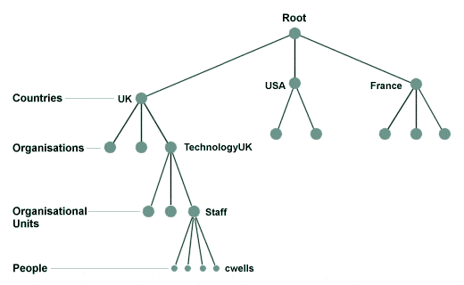
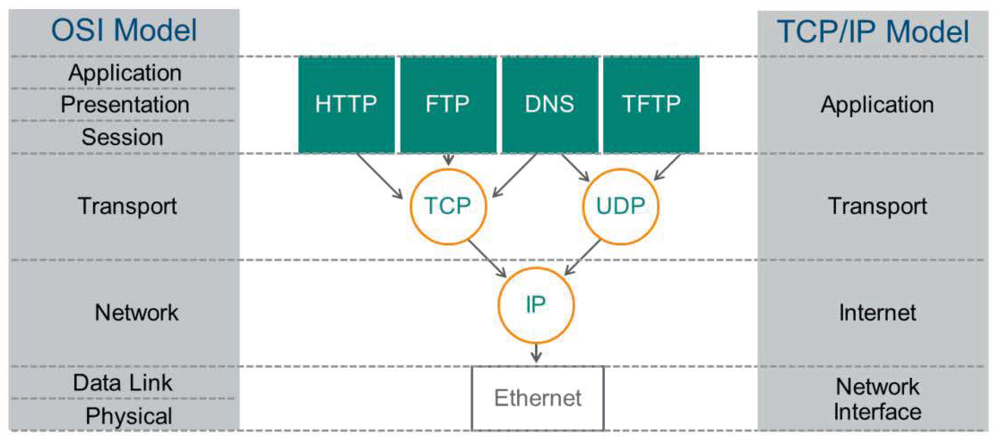
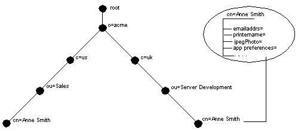

얼마 전, 회사에서 데브옵스 개발을 진행하던 중 회사의 조직도, 회사 구성원의 정보에 접근해야하는 일이 생겼다. 구성원들의 민감한 정보가 아닌, 조직구성도 상에서의 팀원 정보가 필요했기에 회사 구성원의 정보가 있는 DB에 들어가서 해당 데이터를 가져와 새벽 6시마다 변경된 조직도를 대상으로 정보를 업데이트 해주려는 생각이었다. 왜냐하면 데브옵스에서 Slack, Gitlab 등 사내에서 사용하는 툴의 DB에서 각 팀원의 정보에 매칭되는 사용자 정보를 가져와서 각 서비스별 아이디를 이용해 멘션을 하거나 리뷰어를 지정해주는 등 여러 기능이 동작하고 있기 때문이다. 그래서 여러 서비스에서 매칭할 데이터는 소스코드 내 메타데이터를 저장해놓고 조직구성이 변경될때마다 갱신을 해주었는데, 이 부분을 자동화하기 위함이었다.

그래서 사내의 조직도와 유저데이터가 어떻게 관리되는가 보았더니, LDAP이라는 것으로 관리되고 있더라. 그래서 LDAP이라는 것이 무엇인지 궁금하게 되었고, 잘 활용하는 방법이 없을까 고민하게 되었다. 물론 write는 없이 readonly 이기는 하지만 확실하게 알기위해 공부를 하게 되었다.

## LDAP (Lightweight Directory Access Protocol)

LDAP은 네트워크상에서 조직이나 개인, 파일, 디바이스등을 찾아볼 수 있도록 하는 소프트웨어 프로토콜이다. LDAP이 등장하기 전, 디렉토리 서비스의 표준인 X.500의 DAP (Directory Access Protocol)이 있었다.

### X.500

X.500은 전자 디렉토리 서비스를 전달하는 일련의 컴퓨터 네트워크 표준이다. X.500 시리즈는 ITU-T(International Telecommunication Union의 Telecommunication standardization 부문)에서 만들었다. (찾아보니까 지금 ITU-T의 이사는 이채섭이라고 하는 한국분이시더라.) 간단하게 ITU-T가 하는 일을 요약하면 전세계적인 기술 표준을 산업의 속도에 맞게 실시간으로 표준화를 진행하고, 그 과정에서 권고안을 만들어 여러 회사의 비즈니스에서 동일하게 사용할 수 있도록 제공하는 역할을 한다. 그러기 위해 ISO와 IETF 등의 표준개발기관(SDO)과 함께 업무를 진행한다고 한다. [더 자세한 정보를 원한다면 여기로](https://en.wikipedia.org/wiki/ITU-T)

ITU-T에서 만든 여러 표준이 있고, 그 중 [X.500은 1988년에 처음 승인](http://www.collectionscanada.gc.ca/iso/ill/document/ill_directory/X_500andLDAP.pdf)되었다. X.500은 전자 디렉토리 서비스를 전달하는 컴퓨터 네트워크 표준인데, 이 전신은 X.400이 있었고 X.400은 전자 메일을 클라이언트간 교환하고 유저의 이름등을 조회하기 위해 개발되었다. X.500과 X.400과 같이 ITU-T에서 만들었지만 여러 표준개발기관(SDO) ISO/IEC 등에 표준으로 등재되어있다.

#### X.500 프로토콜

- DAP (디렉토리 액세스 프로토콜): DUA와 DSA간 요청 및 결과 교환을 정의, 클라이언트가 디렉토리 시스템과 상호작용하는 방식
- DSP (디렉토리 시스템 프로토콜): 두 DSA간 요청 및 결과 교환을 정의, 두 디렉토리 서버가 상호작용하는 방식
- DISP (디렉토리 정보 섀도잉 프로토콜): 섀도잉 계약을 설정한 두 DSA 간의 복제 정보 교환을 정의, 디렉토리 서버가 정보를 복제하는 방법
- DOP (디렉토리 운영 바인딩 관리 프로토콜): 두 DSA 간의 운영 바인딩을 관리하기 위해 두 DSA 간의 관리 정보 교환을 정의, 디렉토리가 서로 간의 복제와 관련된 계약과 같은 계약을 관리하는 방법

기본적으로 이 프로토콜은 OSI 모델을 사용했기 때문에 인터넷 클라이언트가 TCP/IP 모델을 사용하여 X.500 디렉토리에 액세스 할 수 있도록 여러 대안이 만들어졌다. 그 중의 하나가 오늘 주로 다룰 LDAP이다. 하지만 지금은 DAP과 여러 X.500의 Protocol은 TCP/IP 모델을 사용할 수 있으나, 여전히 LDAP은 유효히 쓰이는 대안이라고 한다. (여전히 우리 회사에서 쓰이고 있는 것을 보면)

> X.500 시리즈의 X.519에서 X.500 프로토콜 데이터 단위 (PDU)가 TCP/IP 계층으로 전달될 수 있도록 IDM(Internet Directly-Mapped) 프로토콜이 도입되었다.
> IDM 프로토콜은 TCP를 통한 ISO 전송과 프로토콜 데이터그램을 프레임화하는 간단한 레코드 기반 바이너리 프로토콜이 포함되어 있어서, 해석할 수 있다.

#### X.500 데이터 모델



<center>출처: https://networkencyclopedia.com/x-500/</center>

X.500의 기본 개념은 DSA(Directory System Agent)라는 하나 이상의 서버에 분산된 항목들의 계층적 조직인 단일 DIT(Directory Information Tree)가 있다는 것이다. 항목은 속성들의 집합으로 이뤄지며 각 속성에는 하나 이상의 값이 존재한다.

각 항목에는 RDN(Relative Distinguished Name), 항목 별 하나의 속성, DIT 루트까지 상위 항목 각각의 RDN을 결합한 고유 이름들이 있다. LDAP은 X.500과 비슷한 구조이나, 데이터 모델에 대한 추가 설명등이 존재한다.

### OSI 네트워크 스택을 사용하면서 TCP/IP 네트워크 스택을 지원해야 하는 이유?

OSI 네트워크 스택과 TCP/IP 네트워크 스택은 다르다. 일반적으로 TCP/IP 모델과 OSI 모델의 차이로 이야기를 많이 한다. 다음의 사진을 보면 쉽게 이해할 수 있다.



<center>모델의 차이</center>

OSI 모델은 7계층으로 되어있다. 각각 Application, Presentation, Session, Transport, Network, Data Link, Physical로 되어있고, 그에비해 TCP/IP 모델은 4계층으로 되어있다.

TCP/IP 모델에서 Application은 OSI Model의 Application, Presentation, Session 3개의 계층이 합쳐져 있다. 두 계층 모두 Transport 에서 TCP/UDP 통신을 지원하며 IP를 각각 OSI Model에선 Network 계층이라 부르고, TCP/IP는 Internet 계층으로 부른다.

이러한 차이로 인해 여러 시스템 및 서비스는 각 TCP/IP, OSI Model을 기반으로 구현한 것들이 다양하게 존재했으므로 둘 다 지원하도록 하는 표준개발기관(SDO)의 권고로 진행했던 것이다.

---

LDAP(Lightweight Directory Access Protocol)은 이름에 붙은 Lightweight 인 만큼 DAP를 경량화해서 만든 것이다. DAP는 전체 프로토콜 스택을 지원하고 사용하며, 운영을 진행하는데 커다란 컴퓨팅 파워를 사용하게 된다. 하지만 LDAP은 TCP/IP 레이어 (Transport, Network)에서만 동작하므로써 더 적은 비용으로 DAP의 많은 부분을 조작할 수 있도록 설계한 것이다.

### 역사

여러 통신 회사들은 전화번호부를 70년동안 관리 및 발달을 시키면서 컴퓨터 네트워킹에 디렉토리 시스템을 도입했다. 80년도에 ITU-T에서 X.500을 도입하면서 절정에 달했고, X.500 DAP을 이용해 OSI Model을 통해 운영되었다. LDAP은 더 단순한 TCP/IP 프로토콜 스택(4계층이니까)을 통해 X.500 Directory Service에 접근하기 위한 경량 대체 프로토콜로 의도되었다.

#### Directory Service?

디렉토리 서비스는 `이름`을 기반으로 대상을 찾아 조회하거나 편집을 하는 서비스를 이야기한다. 여러 서비스 중 우리가 가장 흔히 알고 있는 서비스는 DNS(Domain Name System)이다. 도메인 이름을 기준으로 IP를 탐색한다.

### 용도

LDAP은 정보를 트리 구조로 저장하거나 조회하여 관리할 수 있도록 제공한다.
처음에 언급했듯, 회사에서 구성원의 조직도나 팀별 정보등을 LDAP 서비스로 관리한다. 이러한 정보로 특정 영역에서 이용자명과 패스워드를 확인하여 인증하는 방식도 널리 활용된다. (e.g. LDAP Login)

인증과 같은 방식뿐만 아니라, 트리구조로 검색하고 편집하기 좋은 것들은 LDAP을 활용하여 많은 사용을하며 플랫폼의 제약없이 많이 사용된다. 특히 스마트폰 내에 LDAP 클라이언트가 존재하며, 전화번호부 같은 곳에도 활용된다.

e.g. 유저 권한 관리, 주소록, 조직도, 사용자 정보 관리, 어플리케이션/시스템 설정 정보, 공개 키 인프라스트럭쳐, DHCP나 DNS등의 저장소, 문서 관리, 이미지 저장소 등

### 프로토콜 설명

클라이언트는 TCP/UDP 포트 389, LDAPS 포트 636 에서 DSA(Directory System Agent)라고 하는 LDAP 서버에 연결하여 LDAP session을 실행한다.

클라이언트는 서버에 요청을 보내고, 서버는 응답을 보낸다. 예외 케이스를 제외하면 대다수의 요청은 비동기로 이뤄지고 서버에선 순서대로 응답을 보낼 수 있다. 모든 정보는 BER(Basic Encoding Rules)를 사용하여 전달된다.

클라이언트는 다음과 같은 요청을 보낼 수 있다.

- StartTLS – 보안 연결을 위해 LDAPv3 TLS(전송 계층 보안) 확장 사용
- Binding – 인증 및 LDAP 프로토콜 버전 지정
- Search – 디렉토리 항목 검색 및/또는 검색
- Compare – 명명된 항목에 주어진 속성 값이 포함되어 있는지 테스트
- 새 항목 추가
- 항목 삭제
- 항목 수정
- DN(고유 이름) 수정 – 항목 이동 또는 이름 바꾸기
- Abandon – 이전 요청 중단
- Extended Operation – 다른 작업을 정의하는 데 사용되는 일반 작업
- Unbind – 연결을 닫습니다(바인드의 역이 아님)

기본적으로 LDAP은 SSL을 이용한 636포트를 사용한다.

### 디렉토리 구조

위에서 X.500의 DIT를 설명했다. 대다수는 비슷하며 몇 가지가 다르다. LDAP 자체는 바이너리 프로토콜이며, LDIF(LDAP Data Interchange Format)으로 나타내면 다음과 같다.

```bash
 dn: cn=John Doe,dc=example,dc=com
 cn: John Doe
 givenName: John
 sn: Doe
 telephoneNumber: +1 888 555 6789
 telephoneNumber: +1 888 555 1232
 mail: john@example.com
 manager: cn=Barbara Doe,dc=example,dc=com
 objectClass: inetOrgPerson
 objectClass: organizationalPerson
 objectClass: person
 objectClass: top
```

- `dn`은 항목의 고유 이름이다.
- `cn=John Doe`은 항목의 RDN(Relative Distinguished Name)이다.
- `dc=example,dc=com`는 상위 항목의 `dn`이다. 여기서 `dc`는 도메인 구성 요소를 나타낸다. 다른 행은 항목의 속성을 나타낸다.
- `cn`은 common name을 나타내며, `dc`는 도메인 컴포넌트, `mail`은 이메일 어드레스, `sn`은 surname을 나타낸다.
- 서버는 특정 항목 (e.g. `dc=example,dc=com`)에서 시작하는 하위 트리를 보유한다.
- 기본적으로 바이너리 프로토콜이며, ASN.1이라는 언어로 메시지를 표현한다. 메시지를 BER(Basic Encoding Rules)라는 포맷으로 인코딩하여 주고 받는다. BER 인코딩이 바이너리라서 내용을 알아볼 수 없다.

LDAP은 4가지 모델로 정리될 수 있는데, 조금 더 자세히 알아보면 다음과 같다.

#### Information 모델

인포메이션 모델은 데이터를 통해 디렉토리 구조로 저장하는 방식에 대해 이야기한다. LDAP은 다음과 같이 표현될 수 있다.



<center>LDAP Directory Structure</center>

LDAP의 디렉토리 구조는 Entity들을 트리 형태로 관리한다. 이러한 트리의 형태를 위에서 언급했듯, DIT라고 부른다. (X.500의 DAP를 기조로 하기 때문이다.)

LDAP의 정보구조는 다음과 같이 두 가지 요소로 분리된다.

```
- Entry: 디렉토리에서 정보를 표현하는 기본 단위이다. Entry는 다수의 attribute로 구성된다.
- Attribute: Entry의 각 타입을 저장하는 공간으로 1개의 Attribute에 하나, 또는 다수의 값을 담을 수 있다.
```

#### Naming 모델

각 Entry는 여러 자식 Entry를 가지는 트리 구조로 되어있다. 각 Entry 계층은 고유한 주소등을 가진 Attribute를 갖게되는데 이를 RDN(Relative Distinguished Name)이라고 부른다. 위의 디렉토리 구조 섹션에서 적혀있는 `cn=John Doe,dc=example,dc=com` 과 같은 값이 해당 계층을 나타내는 고유한 값이다.

이렇게 트리구조에서 갖고잇는 RDN 값을 통해 Entry 경로를 찾을 수 있다. 또한 RDN 값을 이어붙여 생성된 고유한 문자/문장을 DN(Distinguished Name)이라 명칭한다.

#### Functional 모델

Functional 모델은 LDAP 디렉토리에서 작업하는 명령을 이야기한다. 8가지의 명령과 3가지의 기능으로 분리된다.

`질문`

- Search: 주어진 조건에 맞는 Entity 도출
- Compare: 특정 Entity의 Attribute 값 비교

`갱신`

- Add: 디렉토리에 신규 Entry 추가
- Delete: 디렉토리에 기존 Entry 삭제
- Modify: 디렉토리에 기존 Entry 수정 및 Entry DN값 변경

`인증 및 제어`

- Bind: 디렉토리 서버 연결 시 사용자 인증
- Unbind: 디렉토리 서버와의 연결 해제
- Abandon: 이전 요청 명령을 취소

#### Security 모델

SSL/TLS 인증 방식을 통해 서버-클라이언트 간 연결을 구성하고, 데이터 전송 시 바이너리 암호화를 적용해 정보를 보호한다. LDAP v3 버전에서는 기존의 보안 방식뿐만 아니라 외부의 인증 방법을 제공할 수 있는 SASL 방식도 제공한다.

## 정리

결론적으로 LDAP은 DIT 구조의 형태로 여러 인증/조회 등 이름기반으로 어떤 데이터를 탐색하고 저장할때 커다란 이점을 가지는 기술이다. 1980년대부터 X.500을 시작으로 계속 발전해온 유서깊은 프로토콜이며, X.500 DAP를 TCP/IP 모델에서 지원하기 위해 나오긴 했으나 현재는 가장 많이 사용되고 있다.

이름 기반으로 찾아내는 특성상 RDN(Relative Distinguished Name) 값을 각 Entity 별로 갖고 있으며, 이어붙여 트리상에서 Entity를 쉽게 검색할 수 있다.
