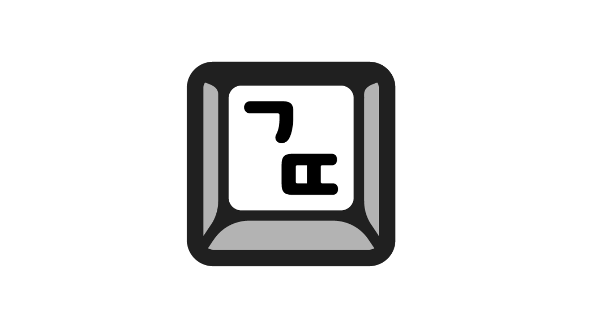

이번 2021년 하반기 6기 글또에 참여하게 되었습니다. 과거에도 글또에 참여했던 적이 있었고, 그 때의 경험이 좋아서 다시 지원하게 되었습니다.
제 블로그에 최근에 쓰였던 글인 [TypeScript에서 Redux, Redux Saga 아름답게 개발하기](https://vallista.kr/2020/07/20/TypeScript%EC%97%90%EC%84%9C-Redux-Redux-Saga-%EC%95%84%EB%A6%84%EB%8B%B5%EA%B2%8C-%EA%B0%9C%EB%B0%9C%ED%95%98%EA%B8%B0/)는 자그마치 작년 7월 20일에 쓰였네요.
거의 1년 가까이 되는 공백기간을 갖고있는 셈입니다. 그래서 1년의 공백기간동안 못썻던 만큼, 한없이 많은 글을 작성해보려 합니다. (글또의 룰이 2주에 글 하나를 쓰는것인 만큼, 적어도 2주에 한 개 이상은 쓰려고 합니다)

그렇다고 쉬는 기간동안 글을 쓰지 않았는가? **그렇지 않습니다.** 오히려 회사에서 문서를 집중적으로 작업하고 있습니다. (회사에서는 정말 우울하게도 컨플루언스 위키를 주로 사용하기 때문에 레이아웃부터 맘에 안듭니다 ㅠㅠ)
그래서, 글을 쓰는 능력이 감퇴하거나 품질이 저하되거나 하진 않겠습니다. 특히나, [2020년 상반기 회고](http://localhost:8000/2020/07/11/2020%EB%85%84-%EC%83%81%EB%B0%98%EA%B8%B0-%ED%9A%8C%EA%B3%A0/)에서도 작성했듯, 품질이 낮은 글은 자체적으로 필터링을 통해 품질을 높히는 작업을 하고 있습니다.
여전히 마음에 안드는 글을 품질향상해서 퍼블리쉬하는 일은 어렵습니다.

# 글또는 무엇인가?

글또는 [글쓰는 또라이 (글쓰는 또라이가 세상을 바꾼다)](https://www.facebook.com/groups/geultto/)의 줄임말로써, 페이스북 그룹이고 활동입니다.
몇 달간 활동을 하면서 2주에 한 번씩 글을 쓰고, 상대방의 글에 리뷰어가 되어 피드백을 해주면 됩니다. 간단하죠? 하지만 예상외로 이 반복되는 루틴을 유지하기는 굉장히 어렵습니다.
그래서 이 유지에 동기부여를 주는 10만원 예치금 제도가 있습니다. 10만원을 사전에 넣어두고, 글 하나가 밀리면 -1만원, 피드백 1회가 밀리면 -5000원. 요런 형태로 글을 탄력적(?)으로 작성할 수 있게 해줍니다.

이번 글또에는 자그마치 100명이 넘는 인원이 함께 진행하고 있네요. 그 안에서 저는 프론트 챕터로써, 프론트 개발자들과 서로 피드백을 주고 받으며 글을 작성할 예정입니다.
다양한 분들과 글을 주고받고 피드백을 받을 수 있다는 이점이 굉장히 크다고 생각합니다.

# 이번 기수에서 하고 싶은 일

비단 2주에 한 개씩 글을 쓰는 것이 글또의 목표이고, 해야할 일이지만 그러면서 다양한 일을 함께 진행하고자 합니다.

- 블로그에 부족한 기능 계속 제작하기: ex) 시리즈물 연재를 위한 레이아웃을 만든다던지. 가장 최근 댓글을 본다던지.
- 일일 커밋 하기
- 기간내에 오픈소스 하나라도 기여해서 기여한 바와 느낀점을 글로 작성하기
- 프론트엔드 챕터의 이야기보다도 다른 이야기를 좀 더 많이 비중을 줄 수 있도록 노력하기

아무래도 회사의 일에 집중을 하고있고, 바쁘다보니 더 많은 것은 이루기가 어려울 것으로 생각했습니다.
그래서 간단하게 4가지만 진행을 하려고 합니다.

하고 싶은 일에는 위의 4가지의 부가적인 요소를 진행하는 것도 있겠지만, 쓸 글을 어떤 카테고리로 어떻게 쓸 것인지도 범위에 들어가겠습니다.

- Rust
- 웹 프론트엔드/백앤드 트러블 슈팅
- 매니지먼트
- 회고
- 독서

주된 글은 위 다섯가지 카테고리에서 유동적으로 작성하려고 합니다.

# 끝으로

가끔 블로그에 들어와주시는 분들은 아시겠지만, 글또 6기에서 고품질의 글을 읽어주시는 분들께서 편히 읽으실 수 있도록 스타일을 개편하고 폰트를 변경했습니다.

- 폰트: [프리텐다드 (Pretendard)](https://cactus.tistory.com/306)
- 레이아웃의 카테고리 진입, 글을 보는 형태를 변경

앞으로 남은 6개월간 많은 발전을 할 수 있도록 노력할 예정입니다.

읽어주셔서 감사합니다.
