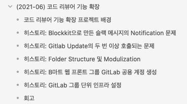

약 1년 반 이라는 기간동안 프론트앤드 챕터의 리딩을 맡아오면서, 지금까지 개발에 대한 리딩만 신경을 써왔음을 자각하게 되었다.
이러한 생각의 바탕에는 첫째로, 작년에 비해 약 2배 이상의 인원이 들어오게 되면서 팀 단위의 생산성을 신경쓰게 되었으며
둘째로, 이러한 생산성을 잘 유지가 되기 위해서는 팀 단위의 방향성의 싱크업을 주기적으로 할 수 있을만한 문화가 필요했다고 느꼈기 때문이다.

오늘 이야기 할 내용은 팀 리딩과 개발 문화에 대한 나의 생각을 적은 글을 작성하려고 한다.

## 소프트웨어 개발에서 리더가 하는 일은 무엇인가

내 직업인 [소프트웨어 엔지니어](https://ko.wikipedia.org/wiki/%EC%86%8C%ED%94%84%ED%8A%B8%EC%9B%A8%EC%96%B4_%EA%B3%B5%ED%95%99%EC%9E%90)는 고객가치를 위해 소프트웨어를 개발하고 운영하면서 어려운 문제를 해결한다.
말 그대로 "소프트웨어" 이기 때문에 유연하게 다양한 니즈에 충족될 수 있는 구조도 제작해야 하며, 그러한 설계, 테스트, 등을 책임진다. 이러한 과정은 온전한 고객가치를 위해 실행되어야 한다.

그렇다면, [소프트웨어 엔지니어](https://ko.wikipedia.org/wiki/%EC%86%8C%ED%94%84%ED%8A%B8%EC%9B%A8%EC%96%B4_%EA%B3%B5%ED%95%99%EC%9E%90)에서 리딩을 하는 개발자는 어떤 역할을 부여받고, 어떤 일을 해야하는 것일까?
일반적으로 소프트웨어 엔지니어를 업계에서 연차나 다양한 경험을 바탕으로 크게 "시니어 소프트웨어 엔지니어"와 "주니어 소프트웨어 엔지니어"로 나누는 것 같다. 여기서 "시니어 소프트웨어 엔지니어"가 리딩을 하는 경우가 많으므로 이 케이스로 정리를 해보자.

- 프로덕트에 적합한 소프트웨어를 설계한다.
- 해당 도메인에 대해 능숙하며, 도메인 기반으로 소프트웨어를 설계한다.
- 프로덕트를 적절한 크기의 모듈로 분리하고, 팀원에게 분배한다.
- 추가되는 피쳐에 대한 영향도 파악이 능숙하다.
- 점점 커지는 소프트웨어를 개발/운영할 인력 충원을 위해 면접을 본다.
- 등등..

위에 대략적으로 정리를 하긴 했지만, 그럼에도 "시니어" 라는 이름을 가지려면 정말 다양한 경험과 개발 노하우를 가지고 있어야 한다.
하지만, 위는 단순히 개발과 관련된 부분만 나열한 것이다.

## 문화를 시도하고 유지하는 일

그렇다면 소프트웨어 개발을 제외한, 리더가 해야하는/하는 일은 무엇인가?

가장 중요한 부분중 하나는 문화를 시도하고 유지하는 일이라고 생각한다.
물론 팀원들과 함께 상의하며 적용하는 일은 당연하지만, 결국 그 과정에서 결정하는 것은 팀 리더의 몫이기 때문에 문화를 시도하고 유지하는데 있어 리더의 영향은 굉장히 크다고 생각한다.

**문화를 시도하고 유지하는 일이 왜 필요한가요?** 라고 물어볼 수도 있다.
필요한 이유는 아래와 같다.

1. 소프트웨어 엔지니어는 현재 자신의 실력에 안주하지 않는다. 그렇기 때문에 오늘의 나보다 더 나은 내일의 나를 원하며, 성장을 위해 좋은 문화로 자극을 주어야 한다.
2. 좋은 문화여도 매일 동일하게 반복되면 질리고, 흥미가 떨어진다. 왜냐하면, 시간이 지날수록 그 문화에서 얻는 자극이나 데이터등이 줄어들기 때문이다. 그렇기에 좋은 문화를 유지하면서도 새로운 문화를 계속 받아들여 시도하고 유지해야한다.
3. 팀원의 성장은, 팀의 성장과 직결된다. 좋은 문화는 더 긴밀한 팀원의 관계를 만들며 서로가 자극을 받는 관계가 되면 신뢰가 구축된다.

팀원들과 함께 문화를 적용한 에피소드 하나를 이야기 해보면,

### 에피소드 1. 회고 문화

우리 팀은 약 1년 6개월정도 매주 회고를 하는 문화를 유지해왔다. 이 회고 문화를 시작했던 이유는 아래와 같다.

- 서로간의 작업에 대한 투명한 공유
- 최근 개발 동향 및 도움이 될만한 정보에 대한 공유

초기 문화를 대입할 때에는 거창한 무언가를 시작하는 것이 큰 허들이 되었다. 그렇기 때문에 초기에는 간단한 부분에 대해서만 시작을 했다.
그렇게 1년여쯤 지났을 때 아래의 문화를 추가로 도입했다.

- KPT 기반 년/분기 단위 회고
- OKR 회고 및 Confidence 체크

시간이 지남에 따라서 **우리가 어떤 일을 했는데, 지나오니까 어떤게 문제였다** 를 공유하는 자리가 필요했다. 동일한 문제가 여러 사람이 해당 일을 하면서 계속 발생하고 있었지만 큰 문제는 아니여서 슬쩍 지나갔던 문제, 커뮤니케이션 상의 문제, 커다란 문제 등 결국 추후에 누군가는 겪을 문제였기 때문에 분기 단위로 회고를 통해 Problem을 산출하고 Try를 해보고자 KPT 기반의 년/분기 단위 회고를 진행하게 되었다. 그렇게 분기 회고는 여태 3번을 했지만, 3번의 기간동안 대다수의 Problem을 Try로 예정하고, 티켓을 생성하거나 커뮤니케이션을 진행해서 분기 회고 이후 바로 처리해왔다. 최근의 와서 분기 단위 회고에는 처음 진행했던 회고처럼 Problem이나 Try가 많이 나오지 않는다. 그래서 성공적으로 진행되고 있다고 생각한다.

이러한 KPT 기반의 회고의 단점은 개인의 목표나 성과에 대해서는 온전히 취급하지 않는다. 그렇기 때문에 온전히 파트 내에서 얼마나 개인이 기여했는지, 혹은 개인이 할 일에 대해서 얼만큼 성취를 했는지 공유하는 일이 필요했다. 이러한 성취를 리더의 입장에서 일방적으로 공유를 하는 것보다 작업을 한 자신이 자랑스럽게 이야기하는게 더 수평적이고 "나도 저렇게 할 수 있다"를 심어줄 수 있다고 생각했기 때문이다. 이러한 방법은 아마존이든, 어떤 회사든 동일하게 고민을 한다. 일반적으로 "주인의식"이라고 부르는 것들인데, 보통 애자일 방법론에서는 프로젝트/팀 간의 주인의식을 주고자 스크럼같은 것으로 행한다.

여러 방법을 고안하던 차, **OKR** 을 실장님께서 공유해주셔서, 찾아보게 되었다. Objective를 분기단위로 설정하고, 매주 회고에서 Objective을 기반으로 설정한 Key Result를 어느정도 이뤗는지 Confidence가 어느정도인지를 공유한다. 그렇게 분기단위로 설정된 OKR을 기반으로 팀원이 주체적으로 설정한 목표가 이루어지는 걸 보면서 서로간 기여한 부분을 자랑스럽게 공유하는 문화를 2,3분기에 적용하여 실험해보았다. 목표가 생기니 지라 티켓이 없거나, 시간이 붕뜨거나, 기다리거나 하는 시간에 틈틈히 Key-Result를 어떻게 이룰지에 대해서 고민하고 자체적으로 티켓을 만들어 처리하는 흐름이 만들어졌다.

이 문화를 만들면서 내가 리더로써 진행했던 건, 어떻게 하면 팀 개개인이 더 만족할 수 있는 형태로 일할 수 있는가를 토대로 우리가 나가야 할 회고 문화의 방향성과 일하는 방법을 고민했다.
그렇기 때문에 팀원들을 설득했고, 결과적으로 지금도 유지되고 있다.

문화를 유지하는 것은 팀원 전체가 노력해야하지만, 방향성과 팀원 전체가 노력할 수 있도록 기둥을 잡는 것은 팀 리더의 몫이라고 생각한다. 뭐던 벡터가 있어야 움직일 수 있기 때문이다.

## 방향을 정하는 일

문화를 시도하고 유지하는 일을 중심 잡는 일은 일종의 방향성을 가진다. 방향성은 보통 팀을 리더의 방향성에 많이 좌우된다. 그렇기 때문에 리더는 끊임없이 맞는가 되물어야 한다.
방향성은 팀과 함께 정해되, 결정을 하는건 리더의 몫이고 이타적인지 생각해야한다.

우리팀의 방향성은 급작스럽게 늘어나는 팀원과 유기적인 협업을 위한 아키텍쳐 방향성을 잡았고, 그에 따른 프로덕션이 늘어나게 되었다.
다만, 프로덕션이 여러개 생겨나게 되면서 여러 이슈가 발생하게 되었는데,

- 각 프로덕션에 대한 히스토리 관리가 어렵게 되었다
- 재택으로 인해, 이슈 트래킹을 위해 커뮤니케이션을 비동기적으로 진행하면서 작업이 비효율적으로 진행된다.

이러한 문제를 해결하기 위해 문서를 기반으로 커뮤니케이션하는 방향성을 잡았다.

### 에피소드 2. 3 Phase 문화의 도입

아마존에는 [6 Pager](https://writingcooperative.com/the-anatomy-of-an-amazon-6-pager-fc79f31a41c9) 라는 문서 포맷이 존재한다. 어떤 특정한 양식보다도 해당하는 내용이 필수적으로 들어가야하는, 어떤 문서 작성 체계이다.
파워포인트로 진행하는 프레젠테이션은 기획에 대한 PR을 강력하게 하는데 의의가 있다. 하지만 IT 회사에서 이 프레젠테이션이라는 것은 굉장히 위험하고, 오해가 발생할 여지가 많기 때문에 드라이한 문서를 제작해 최대한 많은 사람들이 이해할 수 있도록 작성해야한다.

그런 이유로써, `6 Pager`는 아래의 내용이 필수적으로 들어가기 때문에 작성에 오래걸리며, 그만큼 추후에도 기록으로써 가치가 존재한다.

- 배경과 문제
- 문제를 해결하기 위한 접근 방식
- 다양한 접근 방식과 그 비교
- 앞으로 무엇을 할 것인지, 고객과 회사에 어떤 장점/혁신이 있는지

이러한 문서를 작성하면 추후 커뮤니케이션 비용이 내려갈 것이라 생각했다. 하지만, 문서에 익숙하지 않은 우리 팀이 문서를 꼭 작성하는 문화가 뿌리깊게 박히려면 어떤 일련적 흐름이 필요했다.
그래서 6 Pager를 기반으로 하는 `3 Phase`라는 문서 작성 방식을 고안했다.

`3 Phase`는 다음과 같은 사이클을 가진다.

1. `First Phase`: 처음 마주하는 얼굴과 같은 존재인데, 어떤 프로젝트/피쳐에 대해 작업 시작 전 6 Pager를 느슨하게 작성한다.
2. `Nth Phase`: 프로젝트 시작 후 First Phase로 예측하지 못한 다양한 히스토리를 적는다.
3. `Last Phase`: 프로젝트가 종료된 후, 회고를 진행하고 First Phase에서 예상했던 부분과 다른점이 있다면 어떻게 달라졌고 어떤 점이 미흡했는지 다양한 관점에서 포스트모템을 진행한다.

위의 사이클로 작성하면 아래와 같은 문서 형태가 조립된다.

1. 2021년 06월에 진행한 코드 리뷰어 기능 확장 이라는 피쳐이다.
2. `First Phase`로 `코드 리뷰어 기능 확장 프로젝트 배경`을 작성했다. 해당 내용을 보면 프로젝트를 왜 진행해야하고, 어떤 부분에 대한 성과가 있을지 알 수 있다.
3. `히스토리-*` 로 prefix가 붙은 문서는 다양한 개발 중 예측하지 못한 히스토리를 정리해둔 결과이다. 이는 `Nth Phase`에 해당한다.
4. `Last Phase`로 회고를 진행한다.

이렇게되면 장점은 다음과 같다

- 프로젝트/피쳐 단위의 문서화 기록이 남아, 추후 관련 자료가 필요할 때 월단위로 빠르게 찾아볼 수 있다.
- 회고 문서를 통해 어떤 부분을 추후 수정해야하고 문제가 있는지 알기 때문에 프로그래밍상 예측 범위도 코드 전체를 읽지 않아도 스코핑이 된다.
- 다양한 히스토리가 남기 때문에 추후 비슷한 트러블 슈팅이 있을 때 도움받을 수 있다.
- 프로젝트 작업 전, 문서 단위로 피드백을 받을 수 있기 때문에 커뮤니케이션의 효율성이 증대하고 관련 프로젝트를 진행한 사람으로부터 빠진 부분을 보충받을 수 있다.
- AS가 필요없다. 추후 문서를 재작성 할 일이 적다.

`3 Phase`는 우리 팀에 3분기부터 적용이 되기 시작했다. 이 문화가 점점 팀 내에 보편적인 형태로 잡아가면서 커뮤니케이션 비용 및 비동기 커뮤니케이션의 장점을 십분 활용할 수 있었고, 점점 서로간 짬을 내어 미팅을 하는 형상이 줄어들 수 있었다.

### 주기적인 방향에 대한 공유

크래프톤 웨이에서 장병규 의장은 이렇게 말했다.

> 비전이 잘 뿌리내린 조직일수록 다수의 구성원이 해당 비전을 '공공의 선'이라 강하게 믿고 있을 것이기에, 비전을 변경하는 것 자체가 도전이 된다.

이 문구는 기존의 비전에서 새로운 비전으로 방향을 바꾸는 산통에 대한 이야기이다. 하지만 이 이야기는 팀에도 동일하며 작은 회사라고 볼 수 있고, 동일하게 적용될 수 있다.
'공공의 선'은 사람이 많던, 적던 주기적인 커뮤니케이션을 통해 많은 사람들과 합을 맞춰나가야 한다. 그렇기 때문에 주기적인 방향성 공유는 잦게 일어나야 하며, 모두가 이해할 수 있도록 다양한 경로를 통해 공유해야한다.

이러한 공유를 위해 스크럼, 퀵 미팅, 라이트닝 톡 등 다양한 문화를 적용하고 있다. 왜 이런 문화를 계속 적용하려 노력하는 것일까? 관련해서 아마존의 팀장 수업에서는 아래와 같이 이야기를 했다.

> 이 회의는 개발자 스스로가 '왜 이 일을 하고 있는지'를 깨닫게 해준다. 수많은 개발자와 함께 크고 작은 프로젝트를 진행하면서 알게 된 사실은, 개발자들이 좋은 제품을 만들기 위해서는 다른 무엇보다 주인의식이 있어야 한다는 점이다.

주인의식이 있어야 하는 이유는 뭘까? 프로그래머라는 직업의식 때문일까? 아니다. 탑다운으로 이뤄지는 업무를 반복해보면 알겠지만, 개발자 자신이 원하고 필요로해서 적용을 한 결과물이 그저 누군가 하라고해서 만든 결과물보다 훌륭하기 때문이다.
그 이유로, 탑다운으로 오는 업무의 경우에는 온전히 이해를 하기 어렵다. 그래서 철학이나 개발 방향성등이 미리 정해져 내려오는 경우들이 많고, 자신과 맞지 않는 형태로 개발을 진행하거나 커뮤니케이션이 될 확률이 높기 때문이다.

위에서 언급했던 OKR도 Objective는 팀에서 정하고 (혹은 더 위에서) Key - Result는 목표로하는 비전의 방향에 자신의 철학을 바탕으로 생성한다. 일 잘하는 방법을 다루는 여러 책을 보아도 주도적인 업무가 능률과 성과가 좋다고 나와있다.
이런 주도적인 업무를 하기 위해서는 주기적인 방향에 대한 공유가 매우 중요하다. 방향이 없다면 주도적인 업무를 하기 어렵고, 하더라도 성과나 서로간 공유가 되기 어려우니 긴 기간 진행할 수 없다.

## 정리

큰, 작은 소프트웨어 팀 관계없이 결국 일을 잘 하기 위해서는 어떤 하나의 비전이 있어야 한다. 이 비전을 나는 방향성이라 부른다. 결국 소프트웨어 팀에서 리더는 개발 리딩은 물론이며 일을 잘할수 있는 **어떠한 문화**와 **방향성**을 가지고 나아가야 한다.
리더의 방향성은 직관, 철학, 감정 등 다양한 환경에 좌우되며 그렇기 때문에 언제나 선택이 실패할 수 있음을 생각해야한다. 나 또한 팀에 다양한 문화를 적용했으나 실패한 일도 많고, 많은 조직도 동일할 것이다.

그럴때마다 이 방향이 맞는지 오래 고민하지 않는다. 일단 적용해보고 추리는 방식을 사용한다. 수퍼셀(supercell)이라는 게임회사는 실패를 하면 **실패 축하 파티**를 연다고 한다. 그런 것처럼 실패는 성공을 하기위한 움직임이며 이는 나 뿐만 아니라 팀원들에게도 적용된다.
하지만, 단 하나의 중요한 일은 이 방향과 문화가 과연 누구를 위한 것인지는 명확해야한다. **궁극적으로는 소비자이고, 단기적으로는 팀원이여야 한다.**
