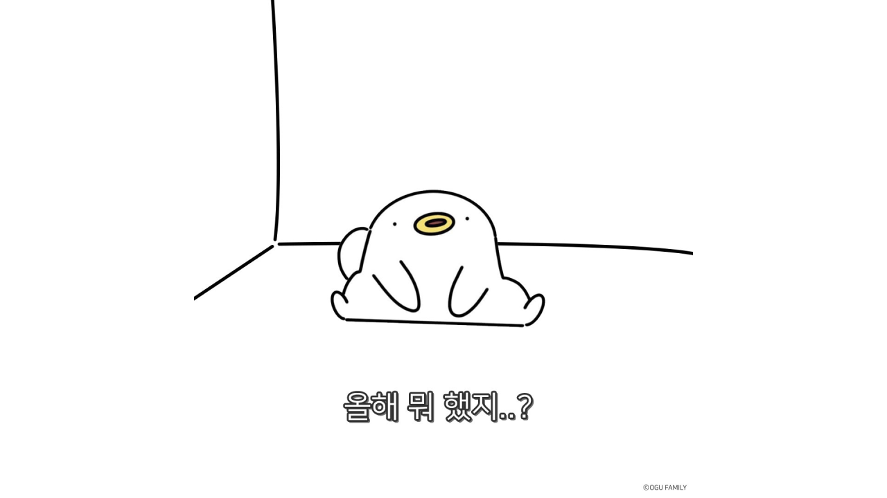
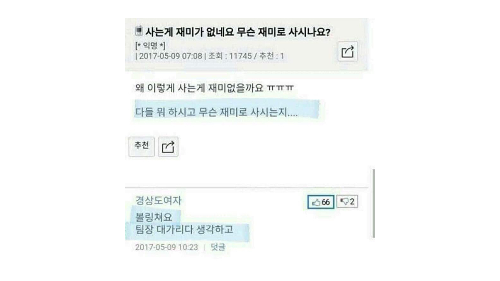
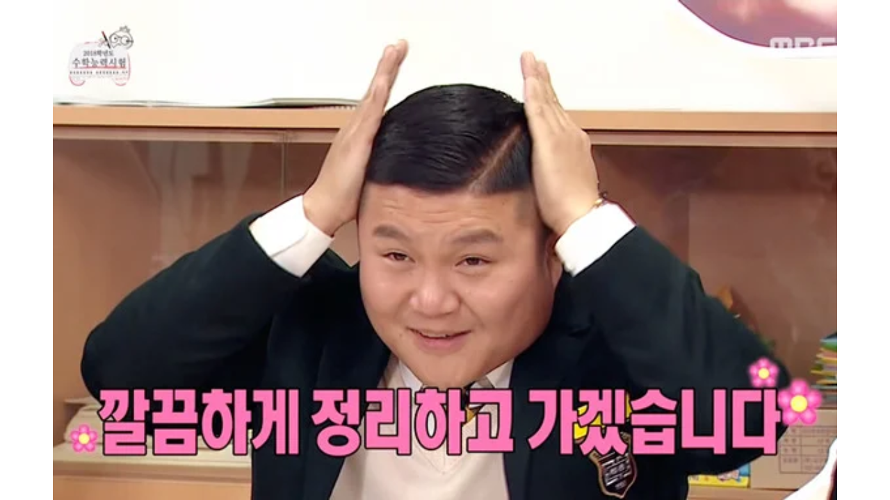

안녕히계세요

우아한형제들에서 약 3년간 근무하면서 올해 상반기가 가장 바빳다. 지난 시간동안 B마트와 배민스토어를 런칭하고 웹프론트 개발 조직을 꾸려왔지만 한 번에 작업을 했던 경우는 없었는데, 한 번에 많은 일을 하느라 상반기는 작년 연말에 이야기했던 나를 위해 투자한다는 것을 실천하지 못했다. 개인적인 개발 역량의 성장은 크게 이루지 못했지만 여러모로 회사의 프로덕트를 위해 상반기를 투자하면서 다른 부분은 성장을 했다고 느낀다.

## 상반기에 했던 일

상반기에 뭐했지.?

여러가지를 하긴 했지만 상반기에 어떤걸 했는지 정리해보면 두 가지로 구별해서 이야기할 수 있을 것 같다.

`회사`

- 조직개편을 세 번 겪었다
- 팀장 직위를 맡게 되었다
- 6개월간 TF의 웹프론트 TL 역할을 맡았다

`개인`

- 캠핑을 자주 갔다
- 그 외엔 없다...

7개월이라는 시간동안 많은 일을 했는데 정작 남는건 회사에서의 기억밖에 없었다. 물론 이러한 경험이 크게 나를 성장시켰지만, 개발 능력이 크게 늘지 않아서 아쉽긴 했다. 그리고 무엇보다, TF를 6개월동안 하면서 많은 체력을 소모하게 만들었고 이는 일시적으로 번아웃이 오도록 만들었다. 하지만 동시에 자랑스럽기도 했고 TF 기간동안 팀이 합쳐지면서 팀원들과 함께 의기투합하는 시간이 되기도 했다.

좋았던 점과 아쉬웠던 점이 공존하는 여러가지 일이 있었던 상반기의 위의 회사와 개인적으로 있었던 이야기를 풀어서 회고를 진행해보면서 돌아보겠다. 이번 회고는 각 단위로 4F 회고를 이용해 진행해보려고 한다.

### 조직 개편

이제 사측의 사람 + 욕먹는 사람이 되었다

상반기에 조직개편을 통해 암묵적으로 진행하고 있던 팀 내 프론트엔드 리드에서, 1월달에 명확하게 웹 프론트 개발자만 존재하는 파트의 파트장이 되었고, 7월엔 웹 프론트 개발자만 존재하는 팀의 팀장이 되었다. 몇 달 단위로 직책이 바뀌다보니, 팀원으로 해야할 일과 파트장으로써 해야할 일 그리고 팀장으로써 해야할 일이 모두 달라져서 정신이 많이 없었다.

`사실(Fact)`

- 세 번의 조직개편이 진행되었다
- 조직개편이 진행되면서 파트장과 팀장을 맡게 되었다
- 팀원이 8명 -> 7명 -> 14명으로 인원이 많이 늘었다
- 팀의 작업 방식을 정리하기위해 위키 및 지라 워크플로우 변경/설정을 했다

우아한형제들의 장점은 고객을 기준으로 빠른 스프린트와 과감한 조직개편으로 빠르게 성과를 낼 수 있도록 조성했다. 그렇기 때문에 이러한 조직에서 팀장이나 파트장은 영향도가 클 수 밖에 없었다. 조직이 변화하게 되면 그에 맞게 조직의 미래 설정과 작업자의 배분 등이 필연적으로 이뤄질 수 밖에 없고, 그러한 시간을 많이 소모하게 되었다.

조직의 미래 설정, 작업자의 배분, 팀의 업무하는 방법, 유관부서와의 논의 등 조직개편이 가져오는 여러 일감은 상반기의 업무를 더 과중하게 만들었고, 팀원이 기하급수적으로 늘어나는 까닭으로 작업자의 배분을 위해 팀원의 특성을 빠르게 파악해야했다.

또한 팀원으로 있을때는 팀이 일하는 방식을 팀장님이 거시적으로 정해주셨지만 파트장이 되었을땐 당시 팀장님께서 웹 프론트의 편의를 많이 봐주셔서 기획자들과 웹 프론트 개발자가 일하는 방법을 쉽게 정할 수 있었다. 하지만, 온전히 개발팀장이 되고 나선 개발자밖에 없다보니 기획자들과 협업을 팀 단위로 하다보니 위클리가 빈번하게 이루어져야 했다.

그래서 내가 정리한 것은, 개발팀이 타 팀과 어떻게 일해야하는지를 고민하고 여러 팀이 우리 팀에 필요한 걸 요청할 수 있도록 미팅을 응집했다. 우리회사의 조직구성은 다음과 같이 되어있었다. 어느 팀은 목적조직, 어느 팀은 기능조직, 디자인팀은 기능조직, 그 사이사이에 QA 조직이 함께 들어와서 일정을 확인하는 구조로 되어있다. 개발조직은 조금 더 자세히 들어가면 조직별로 전시 영역, 플랫폼 영역으로 나뉜다.

우리 팀은 다음과 같은 대응이 되어야 했다.

- 전시
  - B마트/배민스토어/배민쇼핑라이브 서비스 운영 및 개발
- 플랫폼
  - 셀러오피스/커머스어드민 등 B2B 셀러용을 위한 서비스 운영 및 개발

전시는 배민앱용 사용자를 위해 나가는 부분이고, 플랫폼은 배민앱에 상품등을 올리는 셀러를 위한 서비스 영역이다. 그런데, 이 두 영역은 모두 디자인 검수와 QA가 진행되어야 한다. 그래서 간단히, 전시와 플랫폼 둘 다 쓰일 수 있는 배포보드를 만들어 서비스, 플랫폼 따로 위클리를 진행했다. 해당 위클리에는 QA 포함하여 각 기획자들과 함께 일정을 잡게 되며, 웹 프론트 개발자 리소스를 확인하고 일정에 따라 개발을 진행한다.

디자인 같은 경우, 각 팀의 기획자가 기획을 진행해서 가져올때 디자인을 함께 진행해서 가져오기 때문에 함께 포함하진 않았다. 하지만 그와 별도로 웹 프론트 개발은 사용자에게 맞닿아 있는 부분이기 때문에 디자인 시스템이나 여러 코어 로직등이 디자인과 공유되어야 했다. 그래서 별도로 커머스에 해당하는 디자인팀과 위클리를 잡아서 함께 논의를 진행하게 되었고, 그러면서 여러가지를 긴밀하게 이야기할 수 있게 되었다.

결론으로, 조직 개편 기간동안 많은 커뮤니케이션을 얼라인하고 조직 문화를 잡는데 시간을 많이 사용하게 되었다. 그러면서 지금은 조금 안정화가 되어 위클리도 잡고 일하는 방식을 정리했다. 하지만, 여전히 우리 팀이 아닌 다른 조직은 조직개편이 되어가고 있고 그럼에따라 앞으로 대응해야하는 것은 숙제이다.

`느낌(Feeling)`

- 너무 많은 혼란과 그 안에서 팀의 방향을 찾기위한 번아웃이 오게 되었다
- 후술할 TF와 함께 진행하느라 정신이 없었다
- 첫 팀장을 맡으면서 혼자 견디고 감내하는게 굉장히 어려운 일이었다
- 코딩에선 잘 동작하는게 정답이라고 생각하지만, 조직은 정답이 없음을 느꼈다

조직개편과 후술할 TF로 거의 1년의 절반 이상 (7개월)을 하게 되었는데, 그러면서 많은 정신적/육체적 에너지를 쏟게 되었다. 조직 개편과 TF 리딩은 쉬운 일정이 아니었고 그 안에서 조직개편으로 인한 변경을 100% 리소스중에 70%를 할애했던 것 같다.

특히 많이 신경썻던 포인트는 조직개편이 되면서 아키텍처를 전부 변경해야했기 때문이다. 기존엔 B마트라는 하나의 서비스 트랙만 고민해도 되었다면, 지금은 여러 서비스 트랙을 잘 인지하면서 장애 가능성을 낮추고 생산성은 높이는 형태를 고려한 아키텍처를 고안해 나아갈 방향을 제시해야했다. 그래서 이런 아키텍처를 고민하기 위한 시간도 필요했지만 잦은 조직개편으로 인해 생각했던 내용이 계속 달라졌고, 달라지면서 문서를 여러번 갈아엎어야 했다.

나는 문서화를 좋아한다. 하지만 상반기동안 다양한 방면으로 뻗어나가도록 미래를 적은 문서를 여러번 적고, 지우고를 반복하며 과연 문서화란게 의미가 있을까라는 생각도 들긴 했다. 조직개편이 계속 이루어진 중간 부분에 가서는 **정말 명확해지면 문서화를 해야겠다. 선제적인 문서는 피를 볼 뿐이다** 를 생각하며 포기를 하게 되었다. 그런데 이렇게 포기를 해버리니까 조직개편 후에 팀원들이 방황하는게 있었다. 여튼, 그 중간을 맞추기 위해서 줄다리기를 많이 했는데, 팀원들에겐 말로만 표현하면 안됨을 알게 되었고, 명확한 문서로 가이드라인을 제시하는게 **문서가 있으니 안정감이 배가된다** 라는 말처럼 큰 안정감을 주게 되더라.

팀장은 모든 것을 알지 못한다. 최대한 모든 것을 알 수 있도록 노력하고 틀을 만들고, 팀원을 신뢰하고 지지해서 더 좋은 성과를 내도록 도와주는 사람이다. 거기에 더불어, 개발팀의 팀장은 개발자로써 리딩을 하는 것도 있지만 그 리딩이 독단적이어선 안되고, 타당한 선택지를 팀원들이 제안하면 선택을 해준다거나, 회사에서 가려고 하는 방향이 팀에서 진행하고 있는 기술적 방향에 맞는지 체크해 사전에 팀원과 방향성을 얼라인 해야한다.

그 속에서 개발팀의 팀장은 본인이 개발을 잘하니까 내 말이 맞다 보단, 반대로 팀원에게 의견을 물어보고 왜 그러한 의견인지, 그게 왜 타당한지를 명확하게 체크해 팀원들이 주체적으로 성장할 수 있는 팀을 만들어야함을 깨달았다. 지난 상반기동안 나는 "팀장이 포함되어 있을때 기술적 성장의 속도"와 "팀원이 주도한 기술적 성장의 속도" 두 가지가 어떤 것이 타당한지 실험을 해보았다.

가장 좋았던 성과는 **팀원이 주도해서 성장을 했던 방향**이었고, 거기서 보충해 **팀장은 거시적인 기술 성장 방향만 제공하는게 낫다** 라는 결론을 내게 되었다. 상반기동안 어떤 큼지막한 문제를 이런 형태로 풀었으면 좋겠다 정도를 제안하고, 세부적인 요구사항은 팀원이 알아서 생각하고 만드는 형태의 방향으로 문화를 만들었다. 원래는 적극적인 제안을 하는 것이 나의 장점중 하나였지만, 팀장일때는 내가 적극적인 제안을 할수록 **적극적인 제안을 하는 팀원들이 위축되고 그들의 성과를 빼았는** 것임을 알게 되었다.

팀장은 어떤 일을 해야하는지 나의 팀장 스타일은 어떤지 많은 고민을 하게 되었던 상반기였고, 보통 고민은 여러 사람과 함께 나누면서 해결했는데 이번엔 온전히 혼자 고민하고 혼자 해결할 수 밖에 없던 상황이어서 더 어려웠던 것 같다. 앞으로 팀장으로써 더 많은 일을 혼자 고민하고 해결하게 될 것이고 그 과정에서 많이 성장할 것임을 느꼈다. 하지만 불안한 부분은 개발적으로 내가 더 성장할 수 있을까 라는 생각이 들었다. 지금은 커뮤니케이션의 미네르바 부엉이인데 이 삶 속에서 내가 매니징 역량이 아닌, 개발 역량은 성장할 수 있을지..

`교훈(Finding)`

- 회사에서 90일간 리더 온보딩을 하면서 성과를 오래 유지하기 위해선, 팀원이 자유와 안정감을 느끼는 환경을 만드는 것이 중요함을 알게 되었다
- 팀장이 일방적으로 진행하거나 결정하는 것보다 팀원이 자유로운 분위기에서 의견을 나누고, 그 안에서 경험치를 쌓아 성장시키는 것이 더 중요함을 알게 되었다
- 팀장은 기술리드 일수도 있지만, 기술리드는 모든 기술을 혼자 정하는 것이 아니다. 간혹 실패할 리스크에 대해서 결정을 하므로써 속도를 내어 결정을 하지만, 최대한 팀원들의 생각을 듣고 맞는 방향으로 제안할 수 있도록 이끌어내야 한다.
- 팀장은 코딩을 하면 안된다. 코딩을 하는 순간 여유가 없어지고 해당 코딩으로 인해 팀원의 성과를 줄이는 역효과를 낳는다.
- 매니징은 개발자의 트랙과 완전히 다른 영역임을 인지하자. 기술 리드와 매니징은 다르다.
- 매니저는 시간이 여유롭고, 우리가 더 잘 할 일을 수치화해서 찾아 팀원이 성과를 잘 낼 수 있도록 환경을 조성해야한다. 궁극적으로 생각할 수 있는 시간이 많아야 한다.
- 길게 시간을 할애해서 완벽한 제품을 만드는 것보다 빠르게 개발해서 부족한 점을 찾고 개진하는 것이 100배 더 낫다.

6개월간 매니징을 하면서 기존의 업무 형태와는 다른 형태의 업무를 하게 되었다. 그렇게 되면서 많은 깨달음을 얻었다. 굉장히 많은 업무를 소화하면서 미쳐 챙기지 못한 부분에 대해 아쉬웠던 것도 있고, 내 자신이 부족해서 못했던 것이 있었다. 그러한 부분을 깨달았으니 앞으론 선제적으로 생각해 대응해볼 수 있을 것으로 생각한다.

개발팀장이란 역할은 한국에서 **기술리드**와 **매니저**를 함께 하는 경향이 많은 것 같다. 아무래도 개발 인원이 압도적으로 부족한 국내의 특성상 이러한 일이 빈번할 것 같은데, 그 중에서도 웹 프론트는 업계가 형성된지 얼마 되지 않았기에 더 헤메이고 있지 않나 싶다. 그 안에서 얻는 교훈은 내가 개발자로 돌아가거나 했을때도 리더의 생각을 먼저 읽고 도와줄 수 있다는 측면에서 큰 도움이 될 것 같기에, 아직까진 매니저 트랙을 더 해보고 싶다는 생각이 든다.

`향후 행동(Future Action)`

- 팀에서 안보이게 뒤를 받춰줄 수 있도록 외부로 의견을 많이 이야기 하되, 팀 내에선 없어도 잘 동작하는 그런 팀장이 되고자 한다
- 웹 프론트 개발 전문 조직이기 때문에 해당 조직의 포함된 개발자가 웹 프론트에서 스타 개발자가 될 수 있도록 외부 활동의 기회를 많이 제공하고자 한다
- 그럼에도 언제든지 코딩을 할 수 있기 때문에 (급박하거나, 긴급히 해야한다거나) 사적인 시간에 여러 도움되는 유틸(혹은 사이드 프로젝트)을 개발하면서 감을 죽지 않도록 유지한다

향후엔 더 성장할 수 있도록 환경을 만드는 것, 언제든지 할 수 있는 감을 유지하는 것이 중요하다. 명심하자. 나는 팀에서 가장 조용한 존재이며 듣는 것을 잘하고, 말하는 것을 최소화하여, 외부에서 더 많은 말을 하므로써 팀 내에서 자유로운 문화를 활성화 시키는게 중요하다는 것을 기억해야한다.

### 커머스플랫폼기반교체TF

빨려들어간다..

1월부터 7월말까지 7개월이라는 기간동안 회사에서 TF에 매몰되어 있었다. 거기에 위의 조직개편의 영향으로 팀장이 된 것과 겹쳐서 상반기는 **인생의 10년 현업 개발자로써 일하는 기간동안 제일 힘들었다** 아무래도 익숙한 개발을 하는 것보다 주변을 챙기고 고양시키는 작업이 제일 어려웠기 때문이라고 생각한다.

뭐던지 단순히 코딩하는 작업은 어렵지 않은 것 같다. 오히려 코딩 전, 의견을 취합하고 정리해서 무언가를 확정짓기위한 과정이 험난함을 느꼈다. 더군다나 배민의 프로덕트는 수많은 이해관계가 형성되어있고, 이미 대기업과 같이 모든 조직이 세팅된 상태에서 신규 사업을 펼칠려다보니 유관부서와의 회의만 몇 달 내내 진행하게 되었다. (물론 삼성, LG와 같은 조직보단 작지만.. 왜 사내벤처를 하는지 이해가 되었다)

여기서 여러 문제가 있었던 부분은, TF를 진행하면서 유관부서는 많아지는데 TF 소속 인원들은 생활을 갈아넣으면서 프로덕트를 뽑아냈지만, 상대적으로 유관부서는 TF에 소속되어 있지 않기 때문에 워라벨을 유지하면서 대응하는 경우들이 많았다. 여기서의 문제는 아무래도 TF로 편입을 하지 않아버리니 목적성이 명확하지 않고 이들에게 전파가 되는 시간도 늦었다. 그래서 함께 작업을 하려면 업무 시간 대다수를 써야만 했고, 그러면서 저녁엔 다른 작업으로 컨텍스트 스위칭 비용이 지속적으로 들게 되었다. 물론 배민은 아직까지 완전히 대기업은 아니기 때문에 이러한 문제는 TF 말미로 갈수록 많이 완화가 되었지만 어느정도 규모가 있는 상황이라 아쉬운 점도 있는게 사실이었다.

여러 아쉬운 점을 뒤로하고 결론적으로 "배민스토어" 라는 프로덕트로 하여금 우아한형제들에서의 1년 반을 TF로 진행했다. 기존엔 이렇게 길게 진행할 것이란 생각은 안했는데 이해 관계와 프로덕트의 유연성을 고려하다보니 전사적으로 더 커진 프로젝트가 되어 거시적 관점에서 셀러를 통합하는 일종의 플랫폼이 되었다. 그래서 이번에 커머스 전체를 한 사이클을 구축하게 되면서 커머스 도메인 전문가로써 역량이 더 성장하게 되었음을 느꼈다.

가장 고생을 많이 한 것은 나보다 팀원들이 아닐까 싶다. 작년 배민스토어 TF를 할 때엔 거의 코드량의 60%를 내가 작성했고, 회의도 들어가면서 하루의 20시간을 일에 쏟아부었다. 하지만 이렇게 되니, 어떤 팀원은 더 성장할 수 없음을 깨닿고 이직을 하게 되었다. 올해는 다르게, 코드의 1%도 작성을 하지 않았고 거시적인 아키텍처만 잡으면서 흔히 말하는 아키텍처 놀이에 집중했다. (놀이라고 표현한 이유는 설계를 잘 했다고 생각하지 않기 때문이다) 반대로 이렇게 되니 업무가 과중해지는 팀원이 생겼다. 그 팀원은 TF를 마지막으로 팀을 떠나게 되었다.

무언가 실제 코드화 시키지 않은채 아키텍처를 제안하고 이 것을 팀원에게 설명해 대신 구현할 수 있도록 이야기 하는 것은 큰 스트레스와 비용을 유발한다. 그 과정에서 조직개편이 되고 계속 인원수가 바뀌었으며 적정 아키텍처는 인원수와 서비스 규모에 비례한다는 원칙을 지키기위해 지속적으로 변경이 되었다. 그러면서 팀원은 지속적으로 새로운 개발을 해야했으며 TF 기간내 많은 성장을 이루긴 했지만 스트레스는 말도 못할 수준이었을 것이다. (하지만 우리팀의 분위기 메이커들이 많아서 비교적 잘 넘어간 것 같다.)

그 외로 회사에 감동받았던 포인트가 몇 가지 있었다. 기나긴 TF 기간동안 물심양면으로 지원해준 회사와 고정된 환경에서 생각할 수 있도록 TF 전용 룸까지 만들어주었다. 끝나가는 시점엔 회사에서 우리 작업이 얼마나 중요했는지, 어떤걸 했는지 전사적으로 알려주고 다양한 이벤트를 마련해주기도 했다. 그 과정에서 우리 팀원들이 많이 즐기고 스트레스를 풀어 다행이라고 생각했다.

`사실(Fact)`

- 7개월간 프로젝트를 진행하면서 팀원의 장점과 단점을 보기위해 TF 내에서 다양한 업무를 주었고, 그러면서 각 팀원의 장점을 알게 되었다.
- 과도한 아키텍처 변경으로 인해 컴포넌트의 안정성이 떨어졌고, 그러면서 여러군데 레거시 코드가 생기게 되었다.
- TF 기간동안 새로운 팀원이 충원되었다.
- 개발을 거의 하지 않았다. 완전히 매니징에만 초점을 맞춰 작업을 진행했다.

이번 TF를 하면서 코드를 거의 짜지 않았기 때문에 내부의 코드가 어떤 형태인지 읽을 시간이 많이 없었다. 그렇기 때문에 앞서 이야기 한 것 처럼 많은 리소스를 커뮤니케이션 비용에 쏟아부어야 했다. 하지만 TF 기간이라는게 일정이 명확히 박혀있는채 해당 시간동안 집중해 프로덕트를 완성시켜야 했기 때문에 이러한 커뮤니케이션 비용조차 사치였다.

그렇기에 실제 코드 레벨은 거의 팀원을 신뢰하고, 장애 유발할 수 있는 코드 정도만 코드리뷰하고 전반적으로 로직을 수용했다. 이렇게 되니 문제가 일관성이 없어져 팀원간 코드 싱크업 하는데 비용이 발생했다. 초기에 이런 부분을 잘 짚었다면 오버헤드가 적었을텐데 그러한 부분에서 아쉬운 것들이 있었다.

TF 기간동안 아쉬운 점도 많았지만 좋았던 점도 명확히 있었던 것은, 해당 기간동안 팀원과 친밀감을 많이 갖게 되었고 각자 어떤 특성을 갖고 있는지 알게 되었다. 그래서 여러 배치를 하면서 각자의 강점을 살리는 방향을 어느정도 알 수 있게 되었다.

`느낌(Feeling)`

- 난생 처음으로 번아웃이라는 것을 알게 되었다. 모든 일에 무력하고 내가 할 수 있는게 없어서 무기력함을 느꼈다.
- 팀원을 신뢰한다는 것은 때로 매니저를 미치게 한다. 그럼에도 불구하고 계속 믿고, 만약 안되었을때도 팀원을 탓하기보다 왜 안되었는지 파악하고 다시 재발하지 않도록 드라이하게 풀어내는게 중요하다.
- 우아한형제들은 구성원에게 진심이고, TF 기간동안 많은 편의와 도움을 주었다. 회사가 적극적으로 구성원을 케어해주고 도와주려고 하는 의지가 느껴졌다.
- 아직 체계가 잡히지 않은 스타트업과 보수적인 대기업의 문화가 섞여있는 아직 혼란스러운 회사임을 느꼈다.

개발을 팀원에게 일임하면서 생겼던 가장 큰 일은, 기존엔 답답하면 내가 다 코딩을 해버리고 빠르게 런칭을 시키거나 마음에 안드는 부분이 있다면 바로 논의를 통해 바꿔버리는 등 개발자로써 자유로운 부분이 있었다. 하지만 팀장이 되면서 팀원의 성장이 나의 성과이며, 팀원의 성과가 나의 성과가 되면서 내가 혼자 무언가를 한다는 건 생각할 수 없는 부분이 되었다.

그러한 상황에서 프론트 뿐만 아니라 TF 내의 개발 프로세스, 프론트의 영향을 최소화하는 백앤드 아키텍처 구성 등 무언가를 제안하려고 해도 **프론트 팀장** 이라는 허들이 자꾸 걸리게 되었다. 그래서 무언가를 이야기해도 제대로 전파가 되지 않았고 끝내 그 문제를 해결하지 못해 팀원들은 계속 변동되는 서버 스펙으로 인해 지속적인 프론트의 변경을 맞이했고, 초기에 생각했던것과 다른 흐름으로 동작하게 되었다.

그러고선 느꼈다. **프론트 전문가** 라는 것은 정말 의미가 없다는 것을. 그리고 팀장이라는 직책도 결국엔 여러 프론트를 효율적으로 다루기위한 회사의 직책이라는 것을. 그런데 이게 내 미래에 과연 도움이 될까? 하는 생각을 많이 했다. 물론 매니징 역량은 언젠가 분명 필요로 하게 될 것이다. 그러면서 앞으로 내가 어떤 개발자가 되어야 할지 고민을 하기 시작했다.

첫 팀장이 되었을땐 열심히 팀장일을 해야지하며, 30살까진 팀장일을 해보자는 생각을 했다. 하지만 3년이란 시간이 짧은 것도 아니고 금방 가게 될 것이고 동일한 일을 반복해서 팀장에 익숙해지는게 좋은 것인지... 얼마전 (이라고 해도 꽤 되었다.) 존경하는 분께 이런 상담을 드렸고, 그 분은 팀장을 맡긴하고 하면 무조껀 하지 말라고 하셨고, 그게 회사에서 허락되지 않는다면 퇴사하는게 지금 나이와 연차에 맞다라고 말씀주셨다. 그때부터 계속 생각하면서 결국 팀장을 받아버리긴 했으나, 그 이전에 내가 앞으로 어떤 개발을 해야할지 고민이다. 한 가지 명확한 사실은 웹 프론트만 하는것은 개발자로써 맞지 않고, 모든걸 다 하는 제너럴리스트를 향해 꿈꾸는게 맞다고 생각이 들었다.

`교훈(Finding)`

- 미래를 명확하게 상위에서 알려주지 않은채 제한된 상황에서 개발을 한다면 많은 리소스 낭비가 일어날 수밖에 없고, 실제로 동일한 프론트 프로젝트를 만들고 엎는 작업을 많이해서 기존의 로직을 아에 활용할 수 없었다.
- TF를 하면서 조직개편이 되고 그 과정에서 무언가를 정리하는 일은 굉장히 고통스럽다. 개발팀장을 가장한 잡부 역할을 하는것은 번아웃을 더 빠르게 당긴다. 보통 팀장이 되는 사람들은 성과를 잘 내서 팀장이 되는 경우가 많고 그 상황에서 여전히 개발을 계속 해왔었기 때문에 아직 개발을 하고 싶다고 느껴서 더 그런 것이라고 생각한다.

작년에 배민스토어 TF를 진행하면서 만들었던 코드의 대다수는 재활용하지 못했다. 이는 규모가 너무 커졌기 때문과 비즈니스가 완전 달라졌기 때문이다. 여기서 생각이 드는 사실은 이전의 비즈니스가 확정되진 않았겠지만 추후 어떻게 될 것이다를 사전에 더 논의를 깊게 해서 어떻게 앞을 나가야 하는지 틀이 조금이라도 있었다면 지금과 같은 비효율은 적어졌을거라 생각한다. 그렇기 때문에 우리는 앞으로 나아갈 비즈니스의 방향과 프로덕트의 방향을 잘 맞추어서 비효율이 일어나지 않도록 조심해야한다. 이러한 비효율이 생기면 기존에 코드를 작성했던 프로그래머는 좌절을 하게 되고, 의욕을 잃게된다.

TF와 조직개편 두 가지 업무를 진행하면서 번아웃이 오게 되었는데, 그러면서 교훈을 얻게 되었다. 조직개편이든 TF든 둘 다 중요하지만 결국에 가장 중요한 것 하나를 더 앞에 두고, 그 것에 더 큰 집중을 해야한다는 것이다. 물론 두 개를 다 하면 좋으나, 그만큼 어느 하나는 부족할 수 밖에 없고, 아쉬운 점이 생길수 밖에 없다. 실제로 프로젝트를 하면서 조직개편에 따라 실장님과 얼라인을 맞추고 조직의 미래를 그리느라 TF에 소홀해질 수 밖에 없었고, 그 기간동안 프론트의 QA 티켓이나 그런것들이 제대로 해소되지 않았다.

`향후 행동(Future Action)`

- 앞으로 올해와 같은 조직개편 + TF가 함께 되는 경우엔 더 중요한 것을 체크하고, TF가 더 중요한 일이라면 후에 들어오는 모든 인원을 TF에 끌어당겨서 모두가 TF에서 온보딩을 할 수 있도록 제공하는게 더 낫다는 판단을 했다. 왜냐하면 생각을 할 필요 없이 하나에만 집중할 수 있기 때문이다.
- 회사에서의 업무와 개인의 성장을 할 수 있는 업무를 분리하자.

지금까지 다양한 업무를 해왔고, 성장을 회사와 함께 했다. 그런데 이젠 회사에서 내가 성장을 하면 주변 동료가 힘들어지는 상황에 처했다. 왜그러냐면 팀장이 하자고 하면 곧 해야한다는 의미를 띄우게 되고, 그렇기 때문에 내가 무언가 일을 벌리게 되면 팀원이 힘들어지기 때문이다. 그렇게 되는 상황을 이젠 막아야 한다. 개발자였을땐, 내가 하면 되었기 때문에 마음껏 일을 벌렸지만 이젠 그렇지 않다.

그렇기에 회사에서의 업무를 더이상 내 성장으로 이어지기 위해 일을 벌리는 것을 하면 안된다. 그럼에따라 팀장의 일만 진행하고 나머지는 우리 팀원들에게 맡기는 그러한 역할에 집중하되, 개인의 역량은 따로 시간을 짜내어 개발하는 것으로 하는게 낫겠다는 생각을 했다. 앞으론 개인의 성장을 위해 조금 더 깊게 파고들고 하는 시간을 매일매일 더 확보할 예정으로, 야근을 최소한으로 줄일 예정이다.

### 디자인시스템TF

한 번 정리하고 가겠습니다

상반기에 많은 조직개편과 다양한 일을 진행하게 되었다. 그 중 커머스플랫폼기반교체TF와 디자인시스템TF 두 가지의 TF를 진행했고, 앞서 커머스플랫폼기반교체T는 이야기 했으니 이번엔 디자인시스템TF를 이야기하려고 한다. 디자인시스템TF는 말 그대로 배민의 전사적인 디자인시스템을 개발하는 TF이다. 일반적으로 다양한 회사에서 일컫는 디자인시스템은 사실, **시스템이 아닌 컴포넌트를 모아둔 일종의 레포지토리**에 불과했다. 이전에도 배민의 여러 디자인시스템이라 칭하는 것들도 대세를 따라 명칭했을 뿐이지 그 것이 시스템화 되지 않았다.

그래서 배민에선 과거서부터 웹 프론트 개발을 시스템화 하거나 자동화해서 해결할 수 있는 방안을 지속적으로 찾아왔다. 그리고 마침내, 아키텍처를 정리하고 개발을 진행하게 진행하면서 컴포넌트를 만들고 디자이너와 싱크를 맞추는 과정을 잘게 잘라내어 프론트 개발자가 여러 파트 단위로 쪼개져 일할 수 있도록 구성했다. (조금 더 상세한 정보가 궁금하다면 하반기 우아콘 2022에서 확인해보라) 그 중 내가 TF에 들어가서 진행한 것은 디자인시스템의 아키텍처를 이해하고 현업에서 함께 하는 팀원과 디자이너를 묶어 배민 앱 내 디자인시스템을 개발할 수 있도록 일정 산정 및 정리를 했다.

가장 어려웠던 일은 디자인시스템은 **디자인 언어**이기 때문에 앱 개발자 / 디자이너 / 웹 개발자가 동일한 용어를 바라보게끔 해야만 했다. 앱 개발자, 디자이너와 많은 논의를 진행했고, 몇 가지 정리가 되지 않은 부분이 있긴 했지만 얼추 방향성을 맞추어 개발할 수 있도록 환경을 구축했다. 그 과정에서 업무를 진행하는 방법 (프로세스)를 정돈해 실제 개발을 팀원에게 인계했다. 이러한 과정이 되게 고단했는데, 첫 번째로 시스템을 구축하는 과정에서 들어갔기 때문에 온전히 가려는 방향 이해가 어려웠고, 그 과정에서 계속 변경되는 것을 전파하기 어려웠다.

결론적으론 작업할 수 있도록 커뮤니케이션 정리를 진행하고 리드를 동료에게 맡겼는데, 이 과정에서 리드였던 동료가 나가면서 혼란스러운 상황이 여러번 연출되곤 했다. 그 과정까지 온전히 버티고 꾸준히 진행해왔지만 앞서 이야기한 TF와 조직개편까지 모두 책임진채, 디자인시스템TF까지 챙기는건 굉장히 어려운 일이었다. 심지어 가끔씩 시스템의 코드리뷰까지 날라왔는데, 실제로 보지도 못했다. (미안합니다 ㅠㅠ)

이후부턴 팀원에게 넘겨서 잘 진행이 되었고 그러면서 다양한 문제점을 알아서 판단하고 잘 개발하는 것으로 보였다. 디자인시스템TF는 4F 회고까지 할 필요는 없어서 이정도로 마무리 하는 것으로..

### 그 외

- 개발 외 여러 워크숍/미팅/이벤트 등을 팀원 혹은 회사의 개발자들에게 인계했다.
- [우아한테크세미나](https://www.youtube.com/watch?v=QutIXPbKWpw)에 참가했다.
- [우아한테크코스 4기 리뷰어](https://github.com/orgs/woowacourse/teams/fe-reviewer-2022)로 참가했다.
- 프로그래머스에서 프론트 코스 참여자 분을 대상으로 비공개 강연을 진행했다.
- 우아한테크코스 4기 참여자 분을 대상으로 비공개 강연을 진행했다.

바쁜 와중에도 시간을 짬내어 발표자료를 만들고, 여러 가지 일정을 소화했다. 하필 조직개편/TF 2개 를 진행하면서 코드리뷰도 함께 진행하게 되었는데 작년에도 세 가지 프로젝트를 한 번에 하느라 코드 리뷰를 제대로 못해드렸는데, 이번에도 코드 리뷰를 제대로 못해드려서 아쉬웠다. 그래서 오프라인으로 만나서 여러가지 이야기도 드리고 노력을 하긴 했는데... 여전히 아쉬움으로 남는다.

## 중간점검

2022년도 절반 이상이 지나갔다. 여기서 잠시 중간점검을 해보자. 중간점검은 2021년 회고때 2022년 목표에 서술한 내용을 기반으로 다뤄볼 것이다.

`2022년 목표`

- 조금 더 나 자신에게 시간을 할애하기. 올해는 회사 일의 비중이 50%까지 떨어지도록 유지하기
- 일주일에 두 번 이상 운동하기 (테니스, 헬스)
- 발표 두 번 이상 하기 (어떤 컨퍼런스이던 상관없이)
- 러스트에 더 집중하기 (무엇이든 만들어보기)
- 오픈소스에 기여하기 (생각을 하는 애니메이션 라이브러리 구체화?)
- 영어/일본어 공부
- 서버 개발 경험에 집중하기
- 책 10권 이상 읽기
- 일주일에 야근 20시간 이상 하지 않기
- 한 달에 스터디 2개 이상씩 유지하기

`지켜지고 있는 것`

- 일주일에 두 번 이상 운동하기 (테니스, 헬스)
- 발표 두 번 이상 하기 (어떤 컨퍼런스이던 상관없이)

지켜지고 있는 것은 슬프게도 두 가지 밖에 없다. 일단 기본적으로 일주일에 3회 이상씩은 헬스장에가서 웨이트를 하고 있으며, 건강을 챙기기 위해 살을 빼는 중에 있다. 그런데 적어둔 테니스는 거의 접다시피해서 못하고 있는데, 다른 유산소 운동이 있다면 더 해보고 싶은 마음이 있다. 몸무게를 좀 줄여서 클라이밍을 해볼까 한다.

발표는 앞서 비공개 강연이라던지 여러개를 진행해서 달성은 했다고 생각하나, 문제는 기술적으로 발표를 하진 않아서 아쉬운 부분들이 있다. 그렇기 때문에 남은 기간동안 컨퍼런스를 나가서 발표할 수 있도록 노력해보겠다. 그런데 문제는 팀장이여서 실무랑 조금 동떨어진 이야기를 하지 않을까 생각한다.

`지켜지고 있지 않은 것`

- 조금 더 나 자신에게 시간을 할애하기. 올해는 회사 일의 비중이 50%까지 떨어지도록 유지하기
- 러스트에 더 집중하기 (무엇이든 만들어보기)
- 오픈소스에 기여하기 (생각을 하는 애니메이션 라이브러리 구체화?)
- 영어/일본어 공부
- 서버 개발 경험에 집중하기
- 책 10권 이상 읽기
- 일주일에 야근 20시간 이상 하지 않기
- 한 달에 스터디 2개 이상씩 유지하기

그 외 나머지인 8개를 제대로 지키고 있지 않다. 야근과 일의 비중을 줄이는 것이 첫째 목표였는데 회사일이 바빠서 전혀 하지 못했다. 그 과정에서 번아웃이 오기도 했는데, 그러면서 정말 절실하게 떨궈야겠다는 결심을 하게 되었다. 팀원의 성과가 다 챙겨지면 오케이라고 생각하고, 내 개인적인 성과는 신경쓰지 않고 팀장일만 진행하도록 할 것이다. 그렇게 업무와 공부 시간을 분리 해야겠다는 생각을 또 가지면서.. (하반기엔 이렇지 않겠지?) 기대해본다.

그리고 오픈소스에 기여하는 것들과 책 읽기, 스터디를 유지하기는 앞서 이야기한 여러 바쁜상황이 겹치면서 거의 신경을 쓰지도 못했다. 책은 남은 기간동안 잘 읽어보는 것으로 하고, 스터디도 알고리즘과 러스트 스터디를 만들어서 유지해야할 것 같다. 그러면서 서버 개발로 이어지게 하고 싶은데, 어떻게 해야할지 고민이 좀 필요하다. 러스트로 서버 만드는 것은 녹록치 않고, 서버의 훌륭한 경험은 대게 현업에서 나오기 때문이다.

영어/일본어 공부는 알게모르게 진행해서 조금 나아졌다고 생각한다. 밤과 아침마다 했던 전화영어가 도움이 된 것인지... 어찌되었던 작년의 목표는 잘 이뤄지지 않고 있으며, 4개월 남짓한 남은 시간동안 열심히 살아야겠음을 느낀다.
