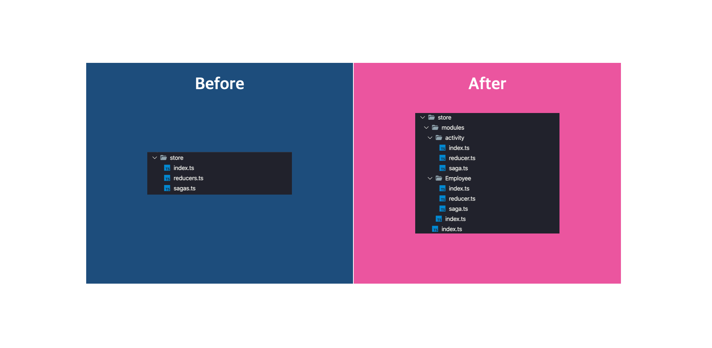

<br/>

Redux는 웹 생태계에서 상태 관리를 위해 쓰이는 프레임워크입니다. 물론 Redux 말고도 MobX와 같은 유명한 상태관리 모듈이 존재하지만 Redux가 비교적 나온지 오래되어서 사용하는 회사와 정보가 더 많습니다. 그렇기 때문에 일반적으로 상태관리 프레임워크라고 한다면 Redux를 사용하는 경우가 많습니다.

<br/>


(최근 6개월간 다운로드 추이)

Redux와 MobX를 비교한 다운로드 추이표를 보면 조금 더 와닿을거라 생각합니다. 흔히 웹 프론트엔드의 정석이라고 불리는 **React + Redux** 조합은 많은 회사에서 채택하고 있고 개인 프로젝트로도 다양하게 쓰이고 있습니다.

이렇게 많이쓰이는 Redux, Redux의 라이프사이클을 이용해 개발자가 개발을 하는데 확장, 도움이 될 수 있도록 Middleware 기능을 제공합니다. Middleware에 다양한 기능을 추가할 수 있지만 그 중에서 비동기 동작에 대한 제어를 도와주는 **Redux Thunk**, **Redux Saga** 두 모듈은 Redux에서 많이 사용됩니다.

<br/>


<br/>

Redux Thunk는 Saga 이전에 나온 비동기 제어 미들웨어입니다. 하지만 비동기를 위해 Thunk는 방대한 양의 코드를 작성해야 했고, 유려하지도 않았습니다. 그에 비해 Redux Saga는 javascript의 generator를 이용해 다양한 비동기 통신을 한데 묶어 처리도 가능했고, 유려하게 개발이 가능하여 Redux Thunk보다 늦게 나왔지만 더 많이쓰이고 있습니다.

그래서 이 글의 주제는 React, Redux, Redux Saga, TypeScript를 이용하여 프로젝트를 개발했을 때, 비대해지는 TypeScript, Redux Saga, Redux에 초점을 맞추어 깔끔하고 아름답게 코드를 작성하는 방법에 대해서 이야기를 해보려 합니다.

> 이 글의 예제는 [여기서 (Beautiful-React-Redux-TypeScript)](https://github.com/Vallista/Beautiful-React-Redux-Typescript) 확인할 수 있습니다.

## 1. 일반적인 적용

React와 Redux, Redux Saga 그리고 TypeScript를 가이드 문사를 참고하여 작성하였을때 어떠한 구조가 되는지 확인해보도록 합시다.

> 아래의 코드는 [1. standard](https://github.com/Vallista/Beautiful-React-Redux-Typescript/tree/1.standard)에서 자세히 볼 수 있습니다.

### src/apis

**modules/employee.ts**

```ts {numberLines}
import fetch from 'node-fetch'

export interface IEmployee {
  id: string
  employee_name: string
  employee_salary: string
  employee_age: string
  profile_image: string
}

export const fetchEmployees = (): Promise<IEmployee> => {
  return fetch('http://dummy.restapiexample.com/api/v1/employees').then((res) => {
    if (!res.ok) {
      throw new Error(res.statusText)
    }
    return res.json() as Promise<IEmployee>
  })
}
```

API는 비동기 통신을 하는 코드입니다. 예를 들어 서버에서 Employee 데이터를 받습니다.

### src/store

Redux를 사용한 스토어입니다. 상태와 액션을 생성하고 관리합니다.

**reducers.ts**

```ts {numberLines}
import { ActionType, createReducer, createAsyncAction } from 'typesafe-actions'
import { IEmployee } from '../apis/modules/employee'

const FETCH_EMPLOYEES = {
  REQUEST: 'EMPLOYEES_FETCH_REQUEST',
  SUCCESS: 'EMPLOYEES_FETCH_SUCCESS',
  FAILURE: 'EMPLOYEES_FETCH_FAILURE'
}

interface IRequest {}

interface IResponse {
  employees: IEmployee[]
}

interface IError {
  message: string
}

export const fetchEmployees = createAsyncAction(
  FETCH_EMPLOYEES.REQUEST,
  FETCH_EMPLOYEES.SUCCESS,
  FETCH_EMPLOYEES.FAILURE
)<IRequest, IResponse, IError>()

const actions = {
  fetchEmployees
}

type Actions = ActionType<typeof actions>
type State = { employees: IEmployee[]; message: string }

const initialState: State = { employees: [], message: '' }

const reducer = createReducer<State, Actions>(initialState)
  .handleAction(fetchEmployees.success, (state, action) => {
    return { ...state, employees: action.payload.employees }
  })
  .handleAction(fetchEmployees.failure, (state, action) => {
    return { ...state, message: action.payload.message }
  })
  .handleAction(fetchEmployees.request, (state) => {
    return { ...state }
  })

export default reducer
```

Reducer에는 현재 상태를 새로운 상태로 바꾸는 로직이 존재합니다. Action에 대한 반응과 내부 상태 변경을 하는 것이 바로 Reducer 입니다. 이 reducer를 만들어주기 위해 action과 상태를 생성하는 로직이 함께 들어가 있습니다. 일반적으로 reducer에 등록을 할 때 위 코드와 다를 수 있습니다. 예제에서는 [typesafe-actions](https://github.com/piotrwitek/typesafe-actions)을 사용해 좀 더 깔끔하게 구현을 진행하였습니다. [typesafe-action](https://github.com/piotrwitek/typesafe-actions)은 타입스크립트에서 action을 생성할 때 좀 더 편리하게 사용하게 해주는 모듈입니다. 이 모듈을 사용하여 구현하면 위 코드처럼 currying 형태로 구현이 가능해집니다.

살펴볼 또 한 가지의 중요한 부분은 비동기 액션에 대한 컨트롤입니다. `FETCH_EMPLOYEES`는 요청, 성공, 실패의 세 가지 상태에 이름을 갖고 있습니다. 각각 REQUEST, SUCCESS, FAILURE의 이름으로 말이죠. 한데모아 유니크한 이름(EMPLOYEES_FETCH_REQUEST ...)을 갖고있는 이유는 궁극적으로 액션에 대해서 감지를 진행할 때 rootReducer에서 Redux가 이벤트를 찾습니다. 찾는 와중 다른 액션과 이름이 겹치면 제대로 실행이 안되기 때문에 유니크한 이름을 지어주어 갖고있게 됩니다.

**sagas.ts**

```ts {numberLines}
import { takeEvery, call, put } from 'redux-saga/effects'

import { fetchEmployees } from '../apis/modules/employee'

function* fetch() {
  try {
    const employees = yield call(fetchEmployees)
    yield put({ type: 'EMPLOYEES_FETCH_SUCCESS', payload: { employees: employees.data } })
  } catch (e) {
    yield put({ type: 'EMPLOYEES_FETCH_FAILURE', payload: { message: e.message } })
  }
}

export default function* sagas() {
  yield takeEvery('EMPLOYEES_FETCH_REQUEST', fetch)
}
```

Sagas에서는 프로젝트에 쓰이는 다양한 비동기 로직은 javascript의 generator 함수를 통해 이벤트를 등록하고 제작합니다. fetch 함수는 API에 만들어 둔 fetchEmployees를 실행하고 성공, 실패 유무에 따라 이벤트를 반환합니다. 성공시에는 Reducer에서 만들어 둔 유니크 아이디인 EMPLOYEES_FETCH_SUCCESS, 실패시에는 EMPLOYEES_FETCH_FAILURE를 타입으로 payload에 실패 값을 담습니다.

1. takeEvery로 `EMPLOYEES_FETCH_REQUEST`를 지속적으로 감시합니다.
2. dispatch로 `EMPLOYEES_FETCH_REQUEST` 가 호출되면 fetch generator가 실행됩니다.
3. fetch가 실행되고 fetchEmployees 함수를 호출하여 API 통신을 합니다.
4. 통신이 끝나면 성공여부와 실패여부를 확인하여 값을 전달합니다.
5. reducer의 `EMPLOYEES_FETCH_SUCCESS`혹은 `EMPLOYEES_FETCH_FAILURE`를 실행합니다.

**index.ts**

```ts {numberLines}
import { applyMiddleware, createStore } from 'redux'
import createSagaMiddleware from 'redux-saga'

import sagas from './sagas'
import reducers from './reducers'

const sagaMiddleware = createSagaMiddleware()

export type RootState = ReturnType<typeof reducers>

const store = createStore(reducers, applyMiddleware(sagaMiddleware))

sagaMiddleware.run(sagas)

export default store
```

`index.ts` 에서는 store를 설정하고 saga middleware를 실행시킵니다. saga가 실행되면 지속적으로 감시를 시작하게 됩니다.

### src/hooks

**useEmployee.tsx**

```ts {numberLines}
import { useSelector, useDispatch } from 'react-redux'
import * as actions from '../../store/reducers'
import { RootState } from '../../store'

function useEmployee() {
  const dispatch = useDispatch()
  const employeeState = useSelector((store: RootState) => store.employees)

  const fetchEmployees = () => {
    dispatch(actions.fetchEmployees.request(''))
  }

  return {
    employeeState,
    fetchEmployees
  }
}

export default useEmployee
```

hooks에서는 react와 redux의 쉬운 바인딩을 위해 `react-redux`를 사용하면 쉽게 구현할 수 있습니다. 이러한 hooks를 flux에서는 `controller-views`라고 부릅니다.

useSelector와 dispatch를 이용해 액션과 상태를 실시간으로 요청하거나 변경된 결과를 제공받을 수 있습니다. 그리고 반환값으로 해당 상태와 액션을 반환합니다.

### src/pages

**home.tsx**

```ts {numberLines}
import React, { useEffect } from 'react'

import useEmployee from '../../hooks/useEmployee'

import Employee from '../../components/Employee'

const Home: React.FC = () => {
  const { employeeState, fetchEmployees } = useEmployee()

  useEffect(() => {
    fetchEmployees()
  }, [])

  return (
    <div>
      Home!
      {employeeState.map((employee, index) => (
        <Employee {...employee} key={index} />
      ))}
    </div>
  )
}

export default Home
```

`useEmployee`로 받은 값을 custom hooks로 가져와 뿌려줍니다. 그리고 useEffect로 컴포넌트 동작 최초 1회에 `fetchEmployee`를 진행합니다.

---

코드를 보면 모듈 단위에 적합하지 않다는 걸 확인할 수 있습니다. Reducer와 Saga가 공통으로 사용되고 있으니 추후에 모듈이 새로 생기거나 사가 코드가 길어진다면 효율적이지 못하게 됩니다. 먼저 이러한 문제를 야기하는 공통 Reducer와 Saga를 모듈 단위로 분리해보도록 합시다.

## 2. Reducer, Saga 모듈화

> 아래의 코드는 [2. modularization](https://github.com/Vallista/Beautiful-React-Redux-Typescript/tree/2.modularization)에서 자세히 볼 수 있습니다.

먼저 모듈화를 어떻게 진행할 지 구조를 잡아봅시다.


모듈화를 진행하는 이유는 프로젝트가 커지면서 도메인이 많아지고 로직이 커지면 대응을 쉽게 할 수가 없기 때문입니다. 이 구조 말고도 거시적으로 action-creators, reducers 등의 사용관점에서 폴더 구조를 나누는 경우도 많은데 그렇게 되면 다양한 도메인의 로직이 하나의 폴더에 다 담기게 되므로 장기적으로 **매우 안좋습니다**.

그래서 이 글에서 추천드리는 것은 도메인 단위로 Module Layer를 만들고, 해당 모듈은 폴더 하나로 대변되며 index.ts, reducer.ts, saga.ts를 품고 있습니다. 내부에서 reducer는 action과 reducer를 생성하며 saga와 함께 index.ts로 연결됩니다.

각각의 모듈은 index.ts에서 actions, reducer, saga를 가지며 외부에서 index.ts로만 참조하여 가져오게 됩니다.

그렇다면 일반적인 적용과 달리 새로 추가된 Activity 도메인의 코드를 보면서 좀 더 살펴보도록 합시다.

### src/store

**store/modules/activity/reducer.ts**

```ts {numberLines}
import { ActionType, createReducer, createAsyncAction } from 'typesafe-actions'

import { IActivity } from '../../../apis/modules/activity'

export const FETCH_ACTIVITIES = {
  REQUEST: 'FETCH_ACTIVITIES_REQUEST',
  SUCCESS: 'FETCH_ACTIVITIES_SUCCESS',
  FAILURE: 'FETCH_ACTIVITIES_FAILURE'
}

interface IRequest {}

interface IResponse {
  activities: IActivity[]
}

interface IError {
  message: string
}

export const fetchActivities = createAsyncAction(
  FETCH_ACTIVITIES.REQUEST,
  FETCH_ACTIVITIES.SUCCESS,
  FETCH_ACTIVITIES.FAILURE
)<IRequest, IResponse, IError>()

const actions = {
  fetchActivities
}

type Actions = ActionType<typeof actions>
type State = { activities: IActivity[]; message: string }

const initialState: State = { activities: [], message: '' }

const reducer = createReducer<State, Actions>(initialState)
  .handleAction(fetchActivities.success, (state, action) => {
    return { ...state, activities: action.payload.activities }
  })
  .handleAction(fetchActivities.failure, (state, action) => {
    return { ...state, message: action.payload.message }
  })
  .handleAction(fetchActivities.request, (state) => {
    return { ...state }
  })

export default reducer
```

reducer는 기존의 reducers와 별 다르지 않습니다. 다만 `FETCH_ACTIVITIES`가 export 되어 외부에도 쓰일 수 있게 변경이 되었는데 이는 saga에서 쓰이기 위함입니다.

**store/modules/activity/saga.ts**

```ts {numberLines}
import { takeEvery, call, put } from 'redux-saga/effects'

import { fetchActivities } from '../../../apis/modules/activity'
import { FETCH_ACTIVITIES } from './reducer'

function* fetch() {
  try {
    const activities = yield call(fetchActivities)
    yield put({ type: FETCH_ACTIVITIES.SUCCESS, payload: { activities: activities } })
  } catch (e) {
    yield put({ type: FETCH_ACTIVITIES.FAILURE, payload: { message: e.message } })
  }
}

export default [takeEvery(FETCH_ACTIVITIES.REQUEST, fetch)]
```

saga에서는 `FETCH_ACTIVITIES` 를 가져와서 type에 넣어줍니다. 기존에는 string 으로 직접 타이핑을 진행했지만 이렇게 불러와서 사용하게 되면 실수 없이 사용할 수 있습니다.

그리고 기존에는 generator function을 바로 반환해주었지만 지금은 배열형태로 전달하는 걸 확인할 수 있습니다. 이렇게 하는 이유는 rootSaga를 좀 더 쉽게 정의하기 위함입니다. 자세한 내용은 아래에서 살펴보도록 합시다.

**store/modules/activity/index.ts**

```ts {numberLines}
import reducer from './reducer'
import saga from './saga'

import * as actions from './reducer'

export default {
  reducer,
  saga,
  actions
}
```

위에서 언급했듯 reducer와 saga, actions를 index.ts에서는 한데 모아 반환해줍니다.

**store/modules/index.ts**

```ts {numberLines}
import { combineReducers } from 'redux'
import { ForkEffect } from 'redux-saga/effects'

import employee from './employee'
import activity from './activity'

const combineSagas = (param: { [key: string]: ForkEffect<never>[] }) =>
  function* () {
    const targetSagas = Object.values(param).flat()

    for (let i = 0; i < targetSagas.length; i++) {
      yield targetSagas[i]
    }
  }

export default {
  rootReducer: combineReducers({ employee: employee.reducer, activity: activity.reducer }),
  rootSagas: combineSagas({ activity: activity.saga, employee: employee.saga })
}
```

modules/index.ts에서는 모듈들을 한데 모아서 rootReducer와 rootSagas로 만들어줍니다. 중요한 점은 combineReducers와 동일하게 saga도 combine할 수 있도록 combineSagas 함수를 만들었습니다. 그래서 reducers와 동일하게 등록해주도록 구현하였습니다.

위에서 잠시 언급했던 saga에서 배열로 반환해주는 이유가 바로 이것입니다. 배열이 아니라 generator function으로 반환을 하여 등록해주게 되면 rootSaga에서 해당 generator가 끝났는지 판단을 못하여 첫 회 실행 후, 뒤에 추가된 generator를 못읽고 실행이 되지 않습니다.

### src/pages

**src/pages/home.tsx**

```ts {numberLines}
import React, { useEffect } from 'react'

import useEmployee from '../../hooks/useEmployee'
import useActivity from '../../hooks/useActivity'

import Employee from '../../components/Employee'
import Activity from '../../components/Activity'

const Home: React.FC = () => {
  const { employeeState, fetchEmployees } = useEmployee()
  const { activities, fetchActivities } = useActivity()

  useEffect(() => {
    fetchEmployees()
    fetchActivities()
  }, [])

  return (
    <div>
      Home!
      {employeeState.map((employee, index) => (
        <Employee {...employee} key={index} />
      ))}
      <hr />
      {activities.map((activity, index) => (
        <Activity {...activity} key={index} />
      ))}
    </div>
  )
}

export default Home
```

fetchEmployees와 동일하게 custom hook도 만들어주고 useEffect에서 실행해줍니다.

---



이렇게 구조를 분리했더니 확실히 체계적으로 변하였고 어딜 수정해야 하는지 명확해졌습니다.

하지만 코드를 보면 여전히 비효율적이라는 것을 알 수 있습니다. 새로운 Store Module이 생기면 그에 따라서 새로운 세팅을 해주어야 합니다. 모듈단위로 중복되는 코드가 많으니 일어나는 일로 보입니다. Reducer에서 공통되는 코드를 분리해보도록 합시다.

## 3. 재사용 로직 분리

> 아래의 코드는 [3. Reuse](https://github.com/Vallista/Beautiful-React-Redux-Typescript/tree/3.reuse)에서 자세히 볼 수 있습니다.

이번 챕터에서는 코드 재사용을 통해 모듈 단위의 중복된 코드를 줄이고 기존 로직의 문제들도 해결해보도록 합니다.

### src/apis

**modules/activity.ts**

```ts {numberLines}
import fetch from 'node-fetch'
import { IActivity } from '../../store/modules/activity/reducer'

export interface IRequest {}
export interface IError {
  message: string
}

const fetchActivities = (): Promise<IActivity[]> => {
  return fetch('http://fakerestapi.azurewebsites.net/api/Activities').then((res) => {
    if (!res.ok) {
      throw new Error(res.statusText)
    }
    return res.json() as Promise<IActivity[]> // 수정 필요
  })
}

export default {
  fetchActivities
}
```

**modules/employee.ts**

```ts {numberLines}
import fetch from 'node-fetch'
import { IEmployee } from '../../store/modules/employee/reducer'

export interface IRequest {}

export interface IResponse {
  status: string
  data: IEmployee[]
}

export interface IError {
  message: string
}

const fetchEmployees = (): Promise<IResponse> => {
  return fetch('http://dummy.restapiexample.com/api/v1/employees').then((res) => {
    if (!res.ok) {
      throw new Error(res.statusText)
    }
    return res.json() as Promise<IResponse>
  })
}

export default {
  fetchEmployees
}
```

먼저 API 쪽 로직을 보도록 하겠습니다. 위의 코드와 비교를 해보면 IRequest, IResponse, IError와 같은 인터페이스들이 API로 옮겨졌습니다.

두 API는 차이가 좀 있는데, activity.ts는 Response 인터페이스가 없고, employee.ts는 Response 모델이 있는 API를 기준으로 구현하였습니다.

### src/store

이번에는 store를 보도록 합시다. Store는 변경사항이 많아 내용이 조금 길 수 있습니다.

**lib/index.ts**

```ts {numberLines}
import {
  createAsyncAction as asyncActionCreator,
  AsyncActionCreatorBuilder,
  ActionType,
  createReducer
} from 'typesafe-actions'
import { call, put, ForkEffect } from 'redux-saga/effects'

export type AsyncAction = {
  REQUEST: string
  SUCCESS: string
  FAILURE: string
}

export type PromiseCreatorFunction<P, T> = ((payment: P) => Promise<T>) | (() => Promise<T>)

export const createAsyncAction = (actionName: string): AsyncAction => {
  const asyncTypeAction: string[] = ['_REQUEST', '_SUCCESS', '_FAILURE']

  return {
    REQUEST: actionName + asyncTypeAction[0],
    SUCCESS: actionName + asyncTypeAction[1],
    FAILURE: actionName + asyncTypeAction[2]
  }
}

export const createActionEntity = <R, S, F>(asyncAction: AsyncAction) =>
  asyncActionCreator(asyncAction.REQUEST, asyncAction.SUCCESS, asyncAction.FAILURE)<R, S, F>()

export function createAsyncSaga<RequestType, RequestPayload, SuccessType, SuccessPayload, FailureType, FailurePayload>(
  asyncAction: AsyncActionCreatorBuilder<
    [RequestType, [RequestPayload, undefined]],
    [SuccessType, [SuccessPayload, undefined]],
    [FailureType, [FailurePayload, undefined]]
  >,
  asyncFunction: PromiseCreatorFunction<RequestPayload, SuccessPayload>,
  successFunc?: any,
  failureFunc?: any
) {
  return function* saga(action: ReturnType<typeof asyncAction.request>) {
    try {
      const result: SuccessPayload = yield call(asyncFunction, (action as any).payload)
      yield put(asyncAction.success(result))
      if (successFunc) {
        yield call(successFunc, result)
      }
    } catch (err) {
      yield put(asyncAction.failure(err))
      if (failureFunc) {
        yield call(successFunc, err)
      }
    }
  }
}

export function createCustomReducer<S, A extends { [key: string]: any }>(state: S, action: A) {
  type Actions = ActionType<typeof action>
  type States = typeof state

  return createReducer<States, Actions>(state)
}

export const combineSagas = (param: { [key: string]: ForkEffect<never>[] }) =>
  function* () {
    const targetSagas = Object.values(param).flat()

    for (let i = 0; i < targetSagas.length; i++) {
      yield targetSagas[i]
    }
  }
```

lib/index.ts는 Redux에서 공통으로 사용되는 함수의 모음입니다. 하나하나씩 차근차근 보도록 합시다.

<br/>

```ts {numberLines}
export type AsyncAction = {
  REQUEST: string
  SUCCESS: string
  FAILURE: string
}

export type PromiseCreatorFunction<P, T> = ((payment: P) => Promise<T>) | (() => Promise<T>)

export const createAsyncAction = (actionName: string): AsyncAction => {
  const asyncTypeAction: string[] = ['_REQUEST', '_SUCCESS', '_FAILURE']

  return {
    REQUEST: actionName + asyncTypeAction[0],
    SUCCESS: actionName + asyncTypeAction[1],
    FAILURE: actionName + asyncTypeAction[2]
  }
}

export const createActionEntity = <R, S, F>(asyncAction: AsyncAction) =>
  asyncActionCreator(asyncAction.REQUEST, asyncAction.SUCCESS, asyncAction.FAILURE)<R, S, F>()
```

Redux는 Reducer에서 어떤 이벤트가 들어왔는지 감시를 진행합니다. 비동기 통신의 경우 3가지 이벤트에 대해서 감시를 진행해야 합니다.

1. Request: 비동기 이벤트의 요청
2. Success: 비동기 이벤트의 성공
3. Failure: 비동기 이벤트의 실패

그래서 이 3가지의 상황에 대해서 핸들링을 쉽게 할 수 있도록 위의 코드를 작성하였습니다.

`AsyncAction`은 비동기 상황에 대해 감시를 진행할 수 있도록 각각의 고유한 유니크 이름을 부여할 수 있게 모아둔 타입입니다. Redux의 reducer는 고유한 이름으로 현재 액션에 대한 타입을 감지하기 때문에 유니크한 이름이 필요합니다.

`PromiseCreatorFunction`은 사용할 비동기 함수를 타입으로 제작해주는 래퍼입니다. 이 친구를 사용하여 Promise를 래핑합니다.

`createAsyncAction`은 비동기 액션 이름을 제작합니다. 위에서 언급한 AsyncAction에 알맞는 값을 넣어줍니다. 액션에 알맞는 이름을 받아 해당 액션 이름과 뒷 이름에는 REQUEST, SUCCESS, FAILURE와 같은 prefix를 붙여집니다. 이렇게 만들어진 고유의 이름은 액션을 제작하는데 쓰입니다.

`createActionEntity`는 createAsyncAction으로 만든 액션 이름을 가져와서 REQUEST, SUCCESS, FAILURE 액션에 대해 실제로 제작합니다.

<br/>

```ts {numberLines}
export function createAsyncSaga<RequestType, RequestPayload, SuccessType, SuccessPayload, FailureType, FailurePayload>(
  asyncAction: AsyncActionCreatorBuilder<
    [RequestType, [RequestPayload, undefined]],
    [SuccessType, [SuccessPayload, undefined]],
    [FailureType, [FailurePayload, undefined]]
  >,
  asyncFunction: PromiseCreatorFunction<RequestPayload, SuccessPayload>,
  successFunc?: any,
  failureFunc?: any
) {
  return function* saga(action: ReturnType<typeof asyncAction.request>) {
    try {
      const result: SuccessPayload = yield call(asyncFunction, (action as any).payload)
      yield put(asyncAction.success(result))
      if (successFunc) {
        yield call(successFunc, result)
      }
    } catch (err) {
      yield put(asyncAction.failure(err))
      if (failureFunc) {
        yield call(successFunc, err)
      }
    }
  }
}
```

`createAsyncSaga`는 generator 함수인 saga를 만드는데 쓰입니다. saga를 제작할 때 쓰이는 parameter로는 위에서 제작했던 액션과 서버에 비동기 요청을 할 함수 두 가지가 기본적으로 들어가며, 성공 및 실패했을 때의 함수 두 가지가 들어갑니다.

내부 함수는 redux saga를 조금이라도 알면 쉽게 유추할 수 있습니다. 비동기 요청을 하고 실패시 failure 액션 요청을 reducer에 보내고 실패 함수를 실행하며, 성공이라면 success 액션 요청을 진행하고 성공 함수를 실행합니다.

<br/>

```ts {numberLines}
export function createCustomReducer<S, A extends { [key: string]: any }>(state: S, action: A) {
  type Actions = ActionType<typeof action>
  type States = typeof state

  return createReducer<States, Actions>(state)
}

export const combineSagas = (param: { [key: string]: ForkEffect<never>[] }) =>
  function* () {
    const targetSagas = Object.values(param).flat()

    for (let i = 0; i < targetSagas.length; i++) {
      yield targetSagas[i]
    }
  }
```

`createCustomReducer`는 Reducer를 쉽게 만들어주는 함수입니다. 이 함수를 사용하게 되면 state와 action에 대해서 타입을 생성하지 않아도 됩니다.

`combineSagas`는 combineReducer처럼 reducer를 모듈단위로 사용할 수 있는 것과 같이 Saga도 모듈단위로 사용할 수 있게 도와주는 함수입니다.

**modules/activity/reducer.ts**

```ts {numberLines}
import { createAsyncAction, createActionEntity, createCustomReducer } from '../../lib'
import { IRequest, IError } from '../../../apis/modules/activity'

export interface IActivity {
  ID: number
  Title: string
  DueDate: string
  Completed: boolean
}

const FETCH = createAsyncAction('activity/FETCH')
export const fetch = createActionEntity<IRequest, IActivity[], IError>(FETCH)

const actions = { fetch }
const state = { activities: [] as IActivity[], message: '' }

const reducer = createCustomReducer(state, actions)
  .handleAction(fetch.success, (state, action) => {
    return { ...state, activities: action.payload }
  })
  .handleAction(fetch.failure, (state, action) => {
    return { ...state, message: action.payload.message }
  })

export default reducer
```

기존 activity/reducer.ts와 비교하여 코드가 많이 줄어버린 것을 볼 수 있습니다. 특히 createCustomReducer를 사용해서 action, state의 타입을 제작하지 않고 reducer를 만들 수 있다는게 좋은 포인트입니다.

또한 그 외에도 비동기 함수를 만드는데 필요한 로직이 전반적으로 줄었습니다.

**modules/activity/saga.ts**

```ts {numberLines}
import { takeEvery } from 'redux-saga/effects'

import API from '../../../apis/modules/activity'
import { createAsyncSaga } from '../../lib'
import { fetch } from './reducer'

const asyncFetchSaga = createAsyncSaga(fetch, API.fetchActivities)

export default [takeEvery(fetch.request, asyncFetchSaga)]
```

saga 또한 기존 activity/saga.ts와 비교해 코드가 많이 줄은 것을 확인할 수 있습니다. modules/activity를 예로 들었지만 modules/employee도 동일하게 코드가 최적화된 걸 확인할 수 있습니다.

## 마무리

redux는 많은 곳에서 사용되고 있습니다. 다만 js 기반에서 ts 기반으로 이동하다보니 아직은 매끄럽지 않은 부분이 있어 코드가 늘어나고 있습니다. 이번 글은 그런 상황에서 이를 최소한으로 줄이는 노력에 대해서 서술한 글 입니다.

이 글을 보고 Redux, Redux saga를 적용할 때 겪는 큰 문제인 다량의 코드 작성의 늪에서 조금이나마 벗어나셨으면 좋겠습니다.

읽어주셔서 감사합니다.
