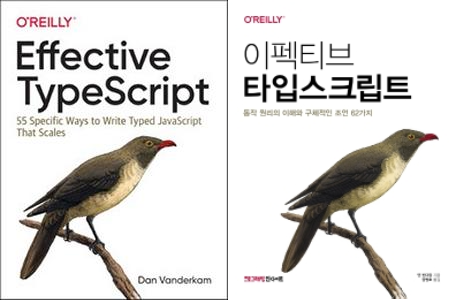
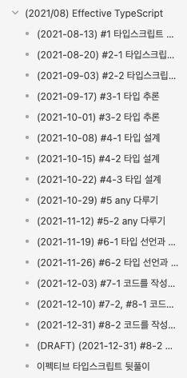
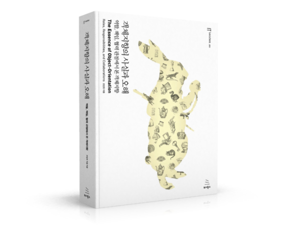
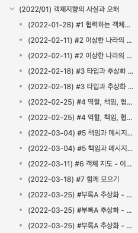
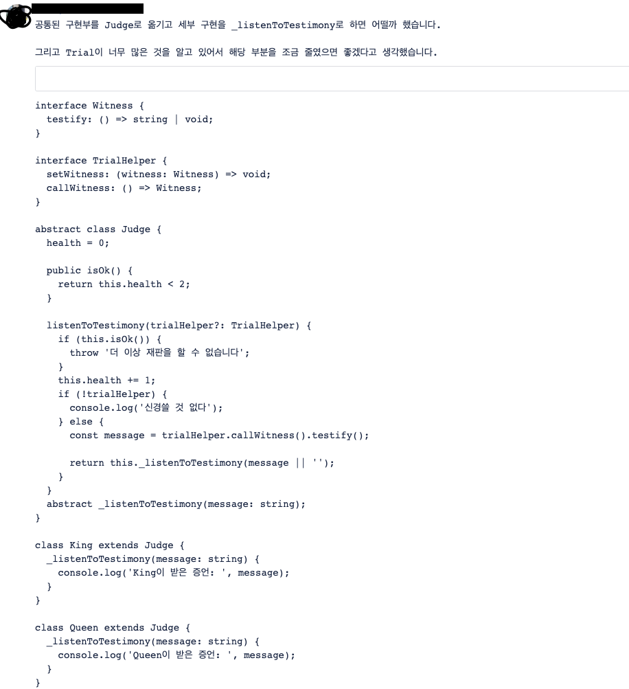
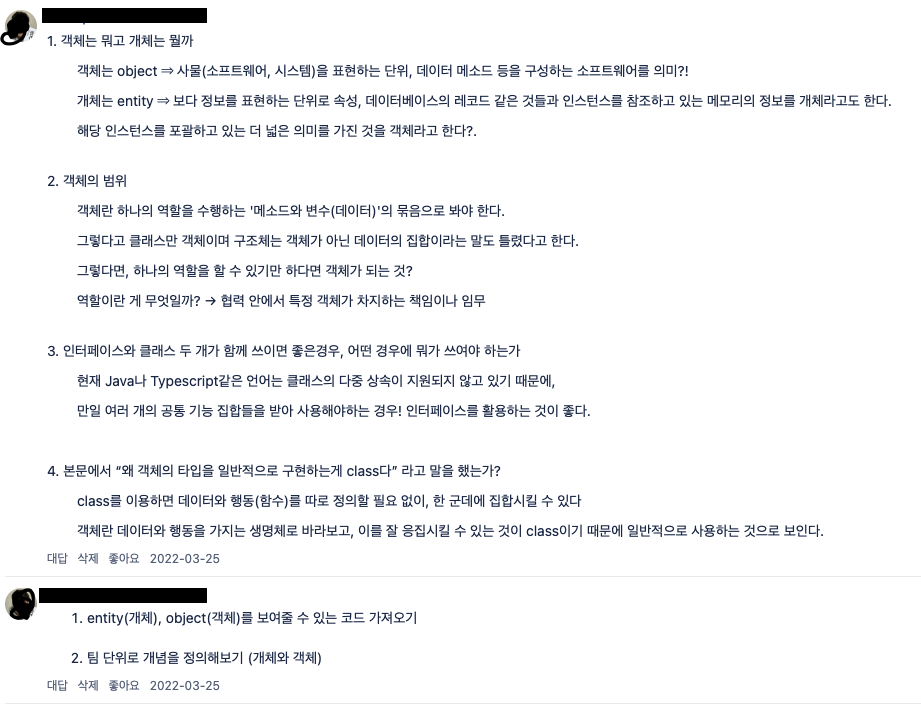

약 2년이 되는 시간동안 사내 웹 프론트엔드 개발자들과 함께 매주 금요일 한 시간을 짬내어 워크숍을 진행해왔다. 그러면서 점진적으로 프론트 개발자 능력 향상을 도모하고 있는데, 나름 두 워크숍을 차례로 끝내며 능력을 끌어올리고 있다는걸 느꼈다.

평균적으로 10~20명과 개발자들과 함께 진행했으며, 배민의 사내 총 웹 프론트 개발자는 약 90명인데 그 중에 1/9 ~ 1/4 정도의 개발자가 함께 했다. 가장 많은 인원이 참여했을땐 50명 정도도 참여했었다.

특히, 이펙티브 타입스크립트를 진행했을때 많은 인원이 참가했는데, 배민의 전사 웹 프론트 기술 스택에 타입스크립트가 필수로 있기 때문이라 생각이 든다. 그러면서 타입스크립트를 단순히 타입 명세를 통한 단순한 타이핑 요소로만 쓰기보다 복합적인 타입으로 생산성을 더 늘리고 싶은 개발자들의 마음이 동했던 것 같다.

## 이펙티브 타입스크립트

(이펙티브 타입스크립트, 왼쪽은 원서 오른쪽은 번역서이다.)

이펙티브 타입스크립트는 약 4달 정도 진행을 했다. 진행하게 된 계기는 이전에 원서가 나왔을때 바로 사서 읽었는데 함께 읽어보면 좋을 부분들이 많아 언젠가 스터디를 헤야겠다 생각했고, 그러던 와중 한국어로 번역된 번역서가 나왔다. 그래서 금요일 워크숍때 진행을 하면 좋겠다 생각을 하게 되어 주도하여 이펙티브 타입스크립트 문서를 정리하고, 개발자들에게 타입스크립트에서 주요로 생각해야할 개념을 전파했다.

두 달 정도 사람들에게 스터디를 전파하기 위해서 가장 중요한 앞선 세 챕터를 짬내어 정리했고, 여기서 가장 중요한 내용인 "타입을 신경써야한다"를 전파했다. 이미 이 시점에서 나의 목표는 이루었다고 생각했다. 그 후 4번째 챕터부턴 실제 타입을 설계하고 다루는 영역이기에 웹 프론트 개발자 몇 명을 로테이션 돌면서 준비하도록 스터디를 운영했다.

위키 문서

이펙티브 타입스크립트를 함께 진행하면서 느낀점은 현업에선 타입스크립트를 모두 잘 사용하려고 노력하기 이전에, 잘 사용할 데를 쉽게 찾을 수 없다는 것이다. 하지만 타입을 더 잘 사용할 수 있는 곳은 굉장히 많고, 타입스크립트에 대한 개념을 알아야 현재 어디가 잘못 사용되고 있는질 파악할 수 있겠다 싶었다.

타입스크립트는 일반적인 nominal typing 언어 (자바, C++, C#)처럼 사용할 수도 있지만, 엄연히 structural typing을 권장하기 때문에 우리는 이 "structural typing (구조적 타이핑)"에 대해서 이해해야한다. [구조적 타이핑에 대해서 이전, 살짝 블로그에서 다룬적이 있었는데](https://vallista.kr/%EB%8D%95-%ED%83%80%EC%9D%B4%ED%95%91%EA%B3%BC-%EA%B5%AC%EC%A1%B0%EC%A0%81-%ED%83%80%EC%9D%B4%ED%95%91/), 간단하게 이야기를 하면 "최대한 필드의 중복없는 타입을 만들어 범용적으로 사용하도록 하는 것"이 주된 개념이다.

이는 기존 웹 환경에서 주요로 사용되던 자바스크립트를 "점진적 타이핑" 형태로 제공될 수 있도록 하는 타입스크립트의 철학적인 부분에서도 기인한다. 그렇기에 기존 자바스크립트로 사용되던 코드에서 공통적으로 뽑아낼 수 있는 타입을 체크한 다음, 최대한 범용적으로 사용할 수 있게 제공하며, 이를 쉽게 [커스터마이징 할 수 있도록 다양한 유틸리티 타입](https://www.typescriptlang.org/ko/docs/handbook/utility-types.html)을 제공한다.

이러한 개념으로, 타입스크립트는 인터페이스와 타입 키워드 두 개를 통해 일종의 타입에대한 추상화를 할 수 있다. 인터페이스는 명세를 제공하고, 그 명세를 이용해 각 상황에 맞는 타입을 설게할 수 있다는 것이다. 이 두 개의 키워드만 해도 다양한 부분에서 수정할 부분들이 존재할 것으로 생각했다.

**정리하면**

- 타입스크립트의 점진적, 구조적 타이핑을 주된 개념으로 지금 현재 코드가 얼마나 철학적으로 벗어나있고, 대략적으로 어떻게 수정해야할지 방향성을 제시하는 것
- 인터페이스와 타입 두 가지 키워드를 어느상황에 써야하는지에 대해 방향성을 제시하는 것
- 결론적으로 현재 사용하고 있는 타입이 잘 쓰는게 아니며, 얼마든지 더 좋은 방향으로 갈 수 있다는 걸 전파하고 싶었다.

최소한의 전파로는 두 가지 정도로 생각했다. 그 외의 것으로는 다음과 같다.

- 타입스크립트는 런타임에 코드가 포함되지 않는다.
- enum등을 사용하는것보다 string literal union으로 표현하는게 더 좋을 수 있다. (트리쉐이킹 등.)
- jsdoc을 이용해서 꼼꼼히 주석을 통한 타입 인터페이스 링크등을 활용할 수 있다.
- 등등..

실제로 타입스크립트를 잘 활용하는 사례는 현업에서 많이 볼 수 없다. 그렇기 때문에 반복적으로 강조하여 기본 역량을 향상시켜야한다. 아마.. 1년뒤에 이펙티브 타입스크립트 스터디를 또 진행하지 않을까 싶다. 만약 사내에서 이펙티브 타입스크립트 스터디를 진행하는 회사/팀이 있다면 목적은 "타입 시스템"에 초점을 맞춰서 진행해보는걸 추천한다. 지금 사용하고 있는 코드의 타입들이 제대로 된 타입이 아니라는 걸 인지시킨다면 이펙티브 타입스크립트 스터디를 올바르게 끝냈다고 볼 수 있겠다고 생각한다.

## 객체지향의 사실과 오해

객체지향의 사실과 오해

이펙티브 타입스크립트를 끝내고, 웹 프론트 개발자들이 객체지향에 대해 취약하다는걸 알게 되었다. 그래서 객체지향 지식 함양을 위해 워크샵에서 객체지향을 본격적으로 파는걸 시작했다. 그래서 시작으로 "객체지향의 사실과 오해"를 진행했다. 우연히도 얼마전, 객체지향의 사실과 오해 저자이신 조영호님께서 우형으로 돌아오셨기에, 언제든 여쭤볼 수 있었다. 이 이후엔 오브젝트를 진행할 것이기 때문에 큰 도움이 되는게 확실했다.

위키 문서

객체지향의 사실과 오해의 책은 실제 코드는 많이 없고, 코드보다 개념과 철학적인 부분이 많아 실제 코드레벨에서 어떻게 적용할 수 있을지에 대한 논의를 주로 진행했다. 그래서 예시를 통해 각자 코드화를 진행하여 공유하는 시간을 주로 가지게 되었다.

코드리뷰 논의 시간

코드에대해 논의를 진행하고, 모호한 개념은 명확하게 알기 위해 객체나 개체 등 정의를 찾아보고 알아오는 시간을 가지는 것으로 스터디를 마무리했다.

개념, 정의 논의 시간

객체지향의 사실과 오해를 진행하면서 객체에 대한 개념을 알게되었고, 실제 프로젝트에 적용을 어떻게 할지는 여전히 오리무중인 상태였기 때문에 여러 논의를 통해서 보완해나갔고 그러면서 오브젝트로 넘어가기 위한 구색을 갖추게 되었다.

## 끝으로

워크숍을 진행하면서 수많은 인원이 함께 공부를 진행하게 되는데, 수많은 인원이 진행하는 만큼, 한 명, 한 명 모두가 동일하게 정보를 습득한다는 생각을 가질순 없었다. 그래서 여러번 반복을 통해 시간을 주기적으로 가져서 다양한 인원이 파악할 수 있게 하는게 앞으로의 몫이라 생각한다.
