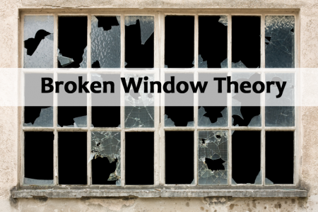
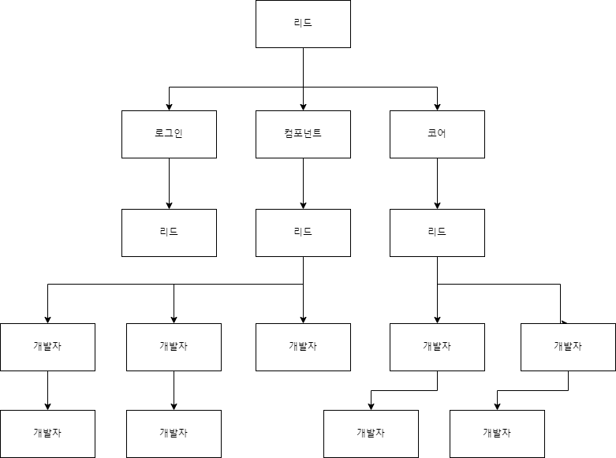
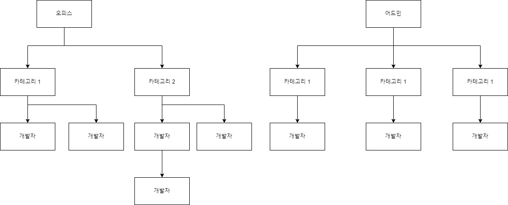

깨진 유리창 이론

이번 회사에서 진행인원 약 30명, 연관된 인원이 60명이 넘어가는 거대한 프로젝트를 진행하고 있다. 거기서 프론트엔드 테크리드로 13명 규모의 프론트 개발자와 함께 프로젝트를 진행하는 중이다.

진행하면서 예상해서 잘 진행이 되었던 것과, 예상하지 못해 깨진 유리창으로 들어오는 그런 문제들이 존재했고, 프로젝트가 약 한 달 남은 지금 시점에서 잠시 짚고 넘어가면 좋을 것 같아 글을 적어보려한다.

## 프로젝트의 성격

지금 진행하고 있는 프로젝트는 거대한 하나의 기반을 변경하는 프로젝트이다. 기존에 만들어진 서비스의 데이터베이스부터 서버, 그리고 프론트 서비스까지 풀 스펙을 변경하고 있다.
그러면서 사내 내부적으로 모두 플랫폼화가 되어가서 신규 플랫폼을 연결하기도 한다. 그러면서 본의 아니게 회사 최신 스펙을 기준으로 개발되는 프로젝트가 되었고 관심도가 굉장히 높아지고 있다.

그럼에따라, 기존의 스펙을 따라가는게 아닌 새로운 스펙으로 개발을 해야했다. 그런데 개발 기간은 확실하게 정해져있기 때문에 이를 잘 조율해야했다.

## 프론트의 역할

일정과 인원에 맞춰 프론트 개발을 어떻게 진행할지 고민을 하기에 앞서, 웹 프론트 개발자는 프로젝트에서 어떤 역할을 담당해서 진행하는지 생각해보자.

- 웹 프론트 개발자는 고객이 사용하는 화면을 담당하는 개발자이다.
- 화면을 개발하고, 백앤드 API가 나오면 해당 API를 연결해 실제 DB에서 불러오고, 저장할 수 있도록 한다.
- 최종적으로 QA 진행시 디자인과 사용성 포함해서 고객이 사용할 수 있도록 완성시킨다.

즉, 프로젝트가 진행되면 레이아웃 컴포넌트를 만들고 화면 기획서 대로 컴포넌트를 이용해 개발까지 한다. 그 후 기다렸다가 실제 API가 나오면 최종 결과물까지 책임지는 역할을 담당한다.
그렇기 때문에 기획이나 서버가 바뀔 경우가 빈번하다. 프론트에선 이러한 바뀐 부분에 대해 수정이 유연하도록 아키텍처를 만들고 변경이 있는 각각의 부분에서 조금의 수정으로 빠르게 적용될 수 있도록 제공해야한다.

## 깨진 유리창

그렇다면, 제목에 있던 깨진 유리창은 무엇일까? 깨진 유리창 이론이라고 표현하며, "깨진 유리창 하나를 방치해 두면, 그 지점을 중심으로 범죄가 확산되기 시작한다는 이론"이다. 질서가 없기 때문에 사람들은 자기 마음대로의 생각을 주입하기 때문이다.

웹 프론트에서 이런 "깨진 유리창"은 범죄까진 아니지만 서로가 너무나 다른 개발자간 편차가 발생해, 균열이 발생하고, 그 균열이 계속 커져가는 상황을 말할 수 있겠다.

이번 프로젝트에서 이런 상황이 굉장히 많았고, 이러한 상황이 생기지 않도록 미리 설계를 하는것과, 상황을 조율하는게 나의 역할이었다.

## 프론트 개발 방식 세팅

이번 프로젝트는 사용자에게 나가는 프론트 페이지와 내부 임직원이 사용하는 프론트 페이지 두 개를 개발해야했다.
그렇기 때문에 두 페이지의 공통 로직을 빠르게 개발하면서 공통 컴포넌트를 사용하기 위해 컴포넌트 조직을 꾸렸고,
나머지는 프론트 페이지의 API등 코어로직 작성하는 조직 두 갈래의 파트로 나뉘어 진행했다. 여기서 번외로, 로그인 등의 프로세스를 한 명이 전담하여 작업할 수 있도록 제공했다.

프로젝트 세팅 다이어로그

## 깨진 유리창의 발견

그렇게 진행은 문제없이 되었지만.. 이후 진행하는 상황에서 몇 가지 문제들이 발생했다.

- 컴포넌트를 공통으로 개발했으나, 프로젝트가 달라서 공통 컴포넌트를 적용한 두 프로젝트 시점에서 각자 컴포넌트가 진화되어 중간중간 큰 기능이 들어갔을때 업데이트가 쉽게 되지 않았다. 계속 업데이트가 되면서 컴포넌트의 간격은 계속 커져갔다.
- API 인터페이스가 계속 변경되면서 공통 API 인터페이스가 달라지고 있었고, 이또한 공통 컴포넌트처럼 간극이 생겨나 커져갔다.

## 허술하게 판자로 유리창을 보수하기

컴포넌트와 API 코어 로직은 계속 간극이 커져갔고, 그럼에 따라 각 작업자는 자신의 프로덕트에 머지된 작업물을 적용되지 않은 프로젝트로 옮겨 컨플릭트와 함께 기능을 계속 보수해나갔다.

그러던 2주간의 시간동안 시간이 없어 컨플릭트를 수정하거나 보완되는 로직은 점차 얽혀가기 시작했고, 추후엔 리베이스 하고 머지하는 시간이 기하급수적으로 늘어나게 되었다.

이러한 필요없는 리소스를 쓰므로써 유리창을 보수하는 것은 별로 썩 유쾌하지 않은 프로덕트 완성에 좋지 않은 것임이 자명했다.

## 깨진 유리창을 버리고, 새로운 유리창을 마련하기

유리창을 발견하고, 일정이 급히 돌아가고 있었기 때문에 주기적으로 맞추는 시간을 가지려 했다. 하지만 모두가 그런 시간을 가질 수 없었다. 그래서 과감하게 두 프로젝트를 아에 분리해버렸다.

분리를 하는 이유는 어찌보면 명확한데, 오피스는 사용자향 서비스이고, 어드민은 내부 임직원용 이기 때문이다. 그렇기 때문에 오너쉽을 갖는 팀이 서로 다르기 때문에 모노레포 등으로 진행했을때 각 팀에서의 확장이 유연하지 못했을 것이다.

그렇기 때문에 아에 별도로 가도록, 조직의 구성도 유연하게 변경했다.

변경된 조직 구조

## 조직이 변경되고, 또 다른 깨져버린 유리창

깨진 유리창은 넓은 집에서 돌아다니며 계속 봐야하지만, 우리는 자신의 방이 제일 중요할 것이 아닌가? 그렇기 때문에 깨진 유리창을 보기란 쉽지않다.

그렇기에, 바쁘게 움직이는 이런 프로젝트에서 발견하는 상황은 꽤나 빈번했다. 그렇기에 나는 개발을 진행하기보다, 이런 깨진 유리창을 보수하고 해결하는데 시간을 더 많이 쏟았다.

실제로 이전 프로젝트를 리드로 진행했을땐, 개발 인원도 적고 시간이 꽤나 있었기에 내가 기여했던 코드의 총량이 60%에 근접했다. (5명이 진행한 프로젝트였음)

그러나, 이번 리드의 역할은 개발은 개발자에게 넘겨두고, 이러한 유리창을 보수하고 해결하는것이 나의 일이라고 믿었다.

이번 깨져버린 유리창은 커뮤니케이션에 대한 내용이었고, 이 내용은 5월 말쯤 프로젝트가 끝나고 다음 글로 적어보려한다.

## 결론

리더는 프로젝트에 따라 유동적으로 자신의 하는 역할을 체크하고, 바꿀 수 있어야 한다. 때로는 코딩에 집중하지만, 때로는 깨진 유리창을 주시하고 해결할 수 있도록 전체 프로세스를 제어하고 조직을 만들어 이끌어야 한다.

깨진 유리창은 급하게 돌아가는 프로젝트에 더 빈번하게 보이기 마련인데, 이러한 프로젝트에선 때론 좋지 않은 판단이어도 일장일단을 진행하는게 오히려 좋을 수 있다.

깨진 유리창은 급할수록 판자로 덮기보다. 아에 새로운 유리창으로 교환하는게 더 유리할 수 있다.
