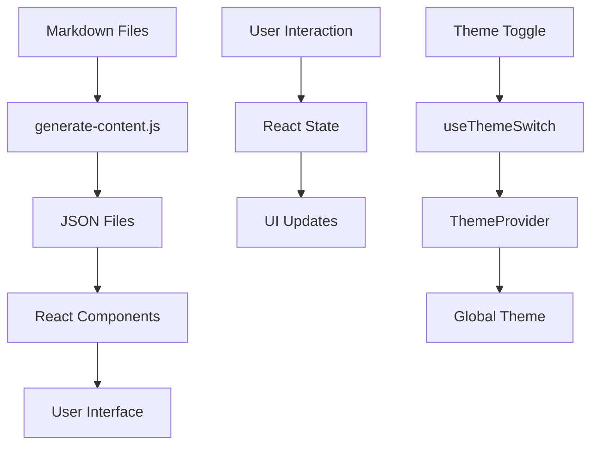

# New Blog Architecture

## 📁 프로젝트 구조

```
services/new-blog/
├── 📁 src/
│   ├── 📁 app/                    # 애플리케이션 레벨 컴포넌트
│   │   ├── App.tsx               # 메인 앱 컴포넌트
│   │   └── providers/
│   │       └── index.tsx         # 전역 프로바이더 (React Query, Helmet, Theme, Sidebar, Router)
│   │
│   ├── 📁 pages/                 # 페이지 컴포넌트
│   │   ├── home/
│   │   │   ├── index.tsx         # 홈페이지
│   │   │   └── HomePage.css.ts   # 홈페이지 스타일
│   │   ├── article/
│   │   │   ├── index.tsx         # 아티클 상세 페이지
│   │   │   └── ArticlePage.css.ts
│   │   ├── about/
│   │   │   ├── index.tsx         # 소개 페이지
│   │   │   └── AboutPage.css.ts
│   │   └── resume/
│   │       ├── index.tsx         # 이력서 페이지
│   │       └── ResumePage.css.ts
│   │
│   ├── 📁 widgets/               # 재사용 가능한 위젯 컴포넌트
│   │   ├── layout/
│   │   │   ├── index.tsx         # 레이아웃 컴포넌트
│   │   │   └── Layout.css.ts
│   │   ├── article-card/
│   │   │   ├── index.tsx         # 아티클 카드 위젯
│   │   │   └── ArticleCard.css.ts
│   │   ├── article-header/
│   │   │   ├── index.tsx         # 아티클 헤더 위젯
│   │   │   └── ArticleHeader.css.ts
│   │   └── series/
│   │       ├── SeriesWidget.tsx  # 시리즈 위젯
│   │       └── Series.css.ts
│   │
│   ├── 📁 features/              # 비즈니스 로직 기능
│   │   ├── search/
│   │   │   ├── index.tsx         # 검색 기능
│   │   │   └── Search.css.ts
│   │   └── comments/
│   │       └── GiscusComments.tsx # 댓글 기능 (Giscus)
│   │
│   ├── 📁 shared/                # 공유 리소스
│   │   ├── 📁 ui/                # 공유 UI 컴포넌트
│   │   │   ├── Header/
│   │   │   │   ├── index.tsx     # 헤더 컴포넌트
│   │   │   │   ├── Header.css.ts
│   │   │   │   ├── ThemeToggle.tsx    # 테마 토글
│   │   │   │   ├── ThemeToggle.css.ts
│   │   │   │   └── SidebarToggle.tsx  # 사이드바 토글
│   │   │   ├── NavBar/
│   │   │   │   ├── index.tsx     # 네비게이션 바
│   │   │   │   ├── NavBar.css.ts
│   │   │   │   ├── NavBarTop.tsx      # 상단 네비게이션
│   │   │   │   └── NavBarBottom.tsx   # 하단 소셜 링크
│   │   │   ├── Sidebar/
│   │   │   │   ├── index.tsx     # 사이드바
│   │   │   │   ├── Sidebar.css.ts
│   │   │   │   └── SidebarContent.tsx # 사이드바 내용
│   │   │   ├── Heading/
│   │   │   │   ├── index.tsx     # 제목 컴포넌트
│   │   │   │   └── Heading.css.ts
│   │   │   ├── MarkdownRenderer/
│   │   │   │   └── index.tsx     # 마크다운 렌더러
│   │   │   ├── LoadingSkeleton/
│   │   │   │   ├── index.tsx     # 로딩 스켈레톤
│   │   │   │   └── LoadingSkeleton.css.ts
│   │   │   └── TagCloud/
│   │   │       ├── index.tsx     # 태그 클라우드
│   │   │       └── TagCloud.css.ts
│   │   │
│   │   ├── 📁 hooks/             # 커스텀 훅
│   │   │   ├── index.ts          # 훅 export
│   │   │   ├── useLocalStorage.ts
│   │   │   ├── useDebounce.ts
│   │   │   ├── useWindowSize.ts
│   │   │   └── useThemeSwitch.ts # 테마 스위치 훅
│   │   │
│   │   ├── 📁 context/           # React Context
│   │   │   └── SidebarContext.tsx # 사이드바 상태 관리
│   │   │
│   │   ├── 📁 lib/               # 유틸리티 라이브러리
│   │   │   ├── content.ts        # 콘텐츠 로딩 로직
│   │   │   └── utils.ts          # 공통 유틸리티
│   │   │
│   │   ├── 📁 types/             # TypeScript 타입 정의
│   │   │   └── index.ts
│   │   │
│   │   ├── 📁 constants/         # 상수 정의
│   │   │   └── layout.ts         # 레이아웃 관련 상수
│   │   │
│   │   └── 📁 assets/            # 정적 자산
│   │       └── 📁 icons/         # SVG 아이콘들
│   │           ├── article.svg
│   │           ├── note.svg
│   │           ├── folder.svg
│   │           ├── github.svg
│   │           ├── twitter.svg
│   │           ├── facebook.svg
│   │           ├── header-split-btn.svg
│   │           ├── header-darkmode-sun.svg
│   │           └── header-darkmode-moon.svg
│   │
│   ├── 📁 contents/              # 마크다운 콘텐츠
│   │   ├── 📁 articles/          # 블로그 포스트
│   │   ├── 📁 notes/             # 노트
│   │   └── 📁 projects/          # 프로젝트
│   │
│   ├── main.tsx                  # 앱 진입점
│   └── vite-env.d.ts             # Vite 타입 정의
│
├── 📁 public/                    # 정적 파일
│   ├── 📁 contents/              # 생성된 콘텐츠 JSON
│   ├── content-index.json        # 콘텐츠 인덱스
│   └── favicon.ico
│
├── 📁 scripts/                   # 빌드 스크립트
│   ├── generate-content.js       # 콘텐츠 생성 스크립트
│   ├── generate-seo.js           # SEO 생성 스크립트
│   └── deploy.js                 # 배포 스크립트
│
├── package.json                  # 프로젝트 설정
├── vite.config.ts               # Vite 설정
├── tsconfig.json                # TypeScript 설정
└── ARCHITECTURE.md              # 이 문서
```

## 🏗️ 아키텍처 패턴

### 1. Feature-Sliced Design (FSD)
```
app/     - 애플리케이션 레벨
pages/   - 페이지 레벨
widgets/ - 위젯 레벨
features/ - 기능 레벨
shared/  - 공유 레벨
```

### 2. Path Aliases
```typescript
'@/'           → src/
'@shared/*'    → src/shared/*
'@entities/*'  → src/entities/*
'@features/*'  → src/features/*
'@widgets/*'   → src/widgets/*
'@pages/*'     → src/pages/*
'@app/*'       → src/app/*
```

## 🎨 디자인 시스템

### 1. @vallista/design-system 패키지 사용
- **컴포넌트**: Button, Text, Container, Toggle, Icon 등
- **테마**: Light/Dark 모드 지원
- **스타일링**: Vanilla Extract CSS-in-JS

### 2. 스타일링 전략
- **Vanilla Extract**: 타입 안전한 CSS-in-JS
- **CSS Modules**: 컴포넌트별 스타일 격리
- **반응형 디자인**: 모바일/데스크톱 대응

## 🔧 기술 스택

### Frontend
- **React 19**: 최신 React 버전
- **TypeScript**: 타입 안전성
- **Vite**: 빠른 개발 서버 및 빌드 도구
- **React Router**: 클라이언트 사이드 라우팅
- **React Query**: 서버 상태 관리
- **React Helmet**: 메타 태그 관리

### Styling
- **Vanilla Extract**: CSS-in-JS
- **@vallista/design-system**: 디자인 시스템

### Content Management
- **Markdown**: 콘텐츠 작성
- **Gray Matter**: Front Matter 파싱
- **Custom Scripts**: 콘텐츠 자동 생성

### Development Tools
- **ESLint**: 코드 품질
- **pnpm**: 패키지 매니저
- **Monorepo**: workspace 구조

## 🚀 주요 기능

### 1. 콘텐츠 관리
- **자동 콘텐츠 생성**: 마크다운 → JSON 변환
- **카테고리별 분류**: Articles, Notes, Projects
- **태그 시스템**: 태그 기반 필터링
- **시리즈 기능**: 연관 포스트 그룹핑

### 2. 사용자 경험
- **다크/라이트 테마**: 시스템 테마 감지
- **반응형 레이아웃**: 모바일/데스크톱 최적화
- **사이드바 토글**: 콘텐츠 네비게이션
- **검색 기능**: 실시간 콘텐츠 검색

### 3. SEO 최적화
- **메타 태그**: 동적 SEO 메타데이터
- **Open Graph**: 소셜 미디어 공유 최적화
- **Structured Data**: 검색 엔진 최적화

## 🔄 데이터 플로우



## 📱 반응형 디자인

### Breakpoints
- **Desktop**: 1025px 이상
- **Tablet**: 768px - 1024px
- **Mobile**: 767px 이하

### 레이아웃 변화
- **Desktop**: 사이드바 + 메인 콘텐츠
- **Mobile**: 헤더 + 네비게이션 바 + 메인 콘텐츠

## 🎯 성능 최적화

### 1. 코드 분할
- **Route-based**: 페이지별 코드 분할
- **Component-based**: 위젯별 지연 로딩

### 2. 정적 최적화
- **Pre-built Content**: 빌드 타임 콘텐츠 생성
- **Image Optimization**: 자동 이미지 최적화

### 3. 캐싱 전략
- **React Query**: 서버 상태 캐싱
- **Browser Cache**: 정적 자산 캐싱

## 🔐 보안 고려사항

- **CSP**: Content Security Policy
- **XSS 방지**: React의 기본 XSS 방지
- **HTTPS**: 프로덕션 환경 HTTPS 강제

## 🚀 배포 전략

### 1. 빌드 프로세스
```bash
npm run generate-content  # 콘텐츠 생성
npm run build            # 프로덕션 빌드
npm run preview          # 빌드 결과 미리보기
```

### 2. 배포 환경
- **Static Hosting**: Netlify, Vercel 등
- **CDN**: 글로벌 콘텐츠 전송
- **CI/CD**: 자동 배포 파이프라인

## 📈 모니터링 및 분석

- **Error Tracking**: 에러 모니터링
- **Analytics**: 사용자 행동 분석
- **Performance**: Core Web Vitals 추적

---

*이 문서는 new-blog 프로젝트의 아키텍처를 설명합니다. 프로젝트 구조나 기술 스택이 변경될 때마다 이 문서를 업데이트해주세요.*
