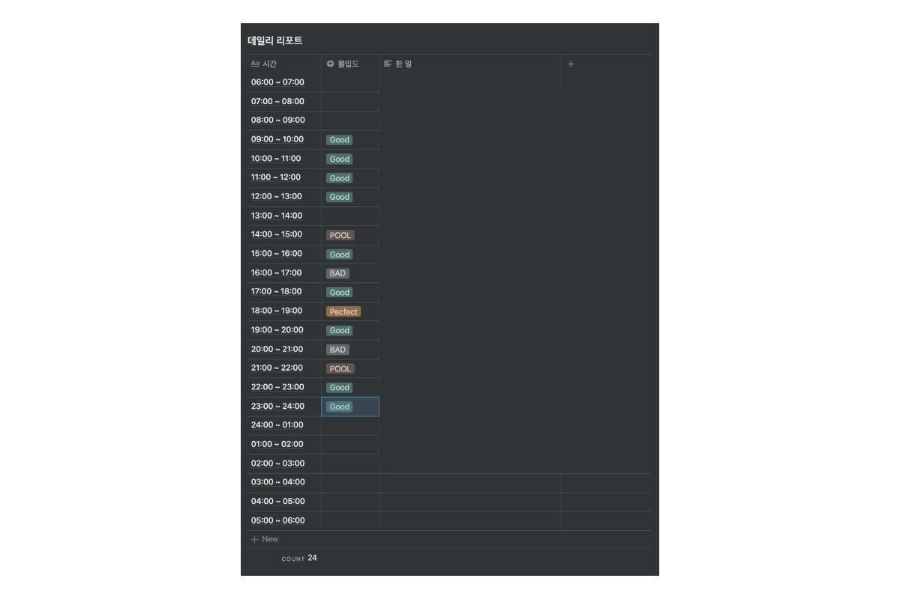
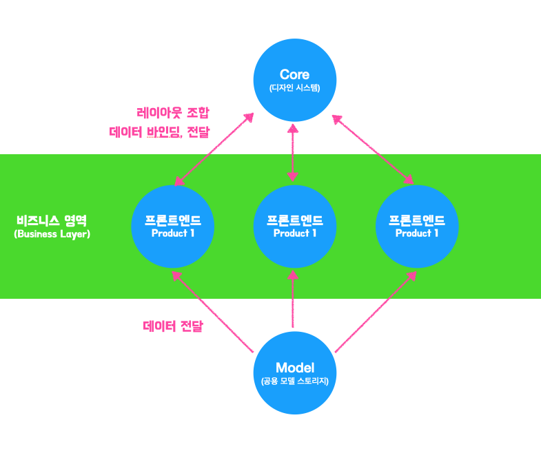
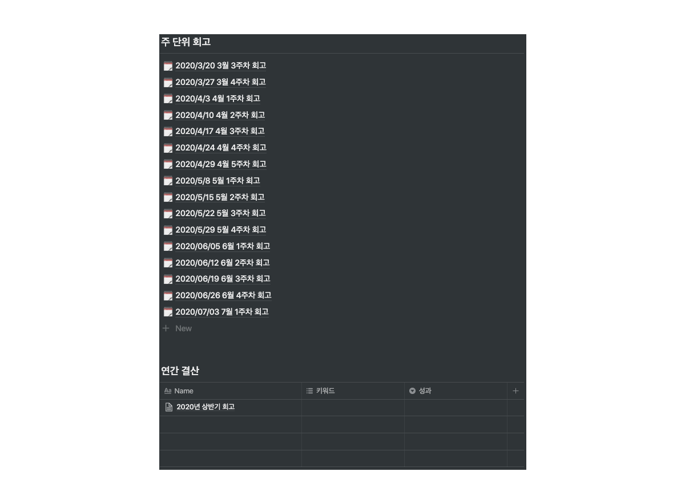
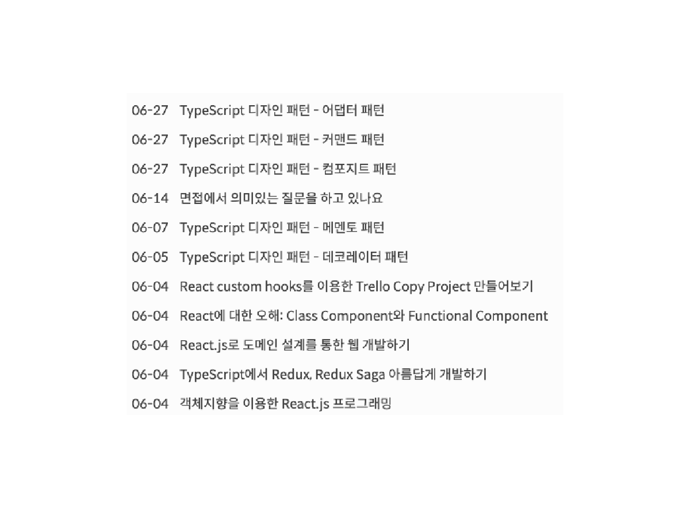
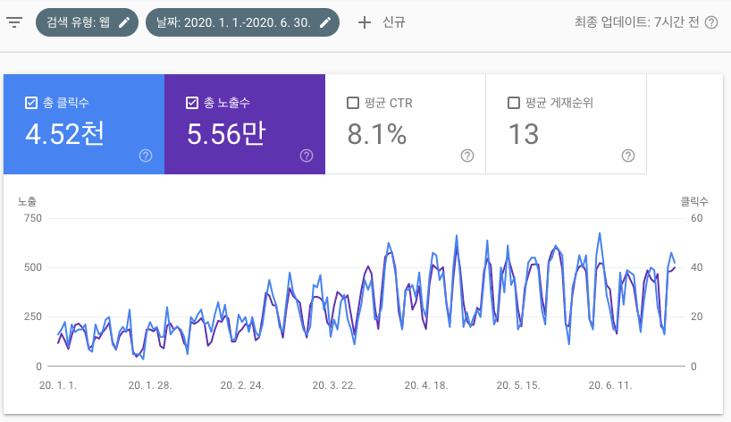
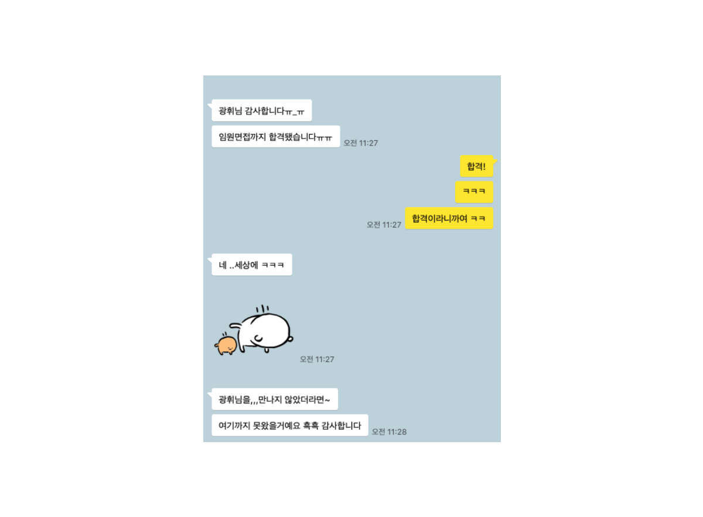
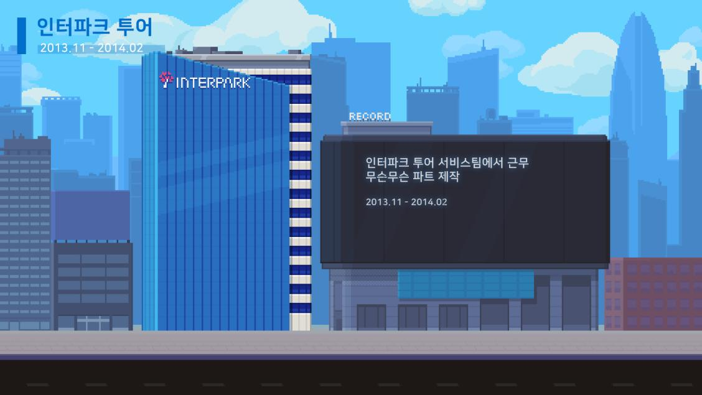

2020년, 올해 상반기는 많은 일이 있었습니다. 그래서 2020년 12월에 총합한 회고를 하기보다 중간 점검을 통해 한번 짚고 넘어가는게 좋을거라 생각되어 회고를 진행하려 합니다.

## 변화

작년과 올해는 **코로나바이러스 감염증 (COVID-19)**로 크나큰 변화가 있었습니다. 재택근무로 업무의 형태에 변화가 생겼고, 모임이나 만남도 온라인 미팅으로 적극적으로 변화하였습니다. 이 변화는 재택근무로 진행하여도 회사는 잘 운영될 수 있다는 걸 증명하게 된 계기가 아닐까 생각합니다. 하지만 회사가 잘 운영되는 것과 개발이 잘 진행되는 것은 별도의 이야기 라고 생각합니다. 그래서 협업에 대해 깊게 생각해보는 계기가 되었습니다.

### 협업

협업을 잘 진행하려면 커뮤니케이션이 중요합니다. 온라인 협업은 오프라인보다 직접 이야기를 진행하는게 어려워진 만큼, 최대한 자신이 이야기할 수 있는 논리를 잘 함축해서 글로 녹여내야 합니다. 이렇듯 글의 중요성이 커지니 저절로 어떤 글이 좋은 글인가? 하는 생각이 들어 정리를 하게 되었습니다.

 

**커뮤니케이션을 할 때 어떤 글이 좋은 글인가?**

1. 쉬운 단어를 사용하여 빠르게 이해되도록 한다.
2. 하고자 하는 목적을 정확하게 표현하여 전달한다
3. 쓸데없이 길게 글을 표현하지 않는다.
4. 자신 기준으로 생각하지 말고, 전달받는 사람 기준으로 설명한다.

과거 제 커뮤니케이션을 비추어 생각해보니, 1번과 3번은 잘 지켜지고 있었으나 여전히 2번과 4번은 잘 지켜지지 않았습니다. 그래서 2번과 4번을 해결하기 위해서 아래와 같은 노력을 진행하였습니다.

**더 좋은 글을 쓰기위해**

1. 독서를 작년과 비교해 2배 정도 시간을 내어 진행 (작년 주 평균 2시간)
2. 한번 더 목적, 전달받는 이를 생각하고 수정
3. 작성해서 보내기 전에 맞춤법 검사
4. 매우, 가장 등의 부사를 제외

간단한 방법이지만, 월 초의 커뮤니케이션을 진행하던 때와 많이 달라졌습니다. (1번)독서를 작년보다 많이 진행하므로써 의도를 파악하는데 걸리는 시간이 짧아졌고, 보내기 전 한번 더 (2번)목적과 전달받는 이를 생각하므로써 커뮤니케이션 시간을 줄일 수 있었습니다. 3,4번을 진행하니 글의 전문성이 높아진 덤이구요.

이 변화는 제 블로그 글을 통해서도 확인을 할 수 있습니다.

### 가치관

많은 변화가 일어나면서 가치관이 달라졌습니다. 기존에는 막연하게 "오늘 뿌듯했다" 혹은 "오늘 일 많이했다" 등의 감상적인 경험을 바탕으로 하루에 대해서 평가했다고 하면, 현재는 공부할 것도 많아지고 (왜 많아졌는지는 아래에서 서술) 여러가지 사이드를 진행하면서 시간에 대해 받아들이는 가치관이 달라졌습니다.

#### 데일리 리포트

최근 몇 년간 **데일리리포트**를 하루마다 작성해서 시간단위로 평가를 진행했었습니다. 하지만 시간단위 평가에 대해서 후하게 점수를 주고 있어 제대로 된 평가가 어려웠습니다. 그래서 좀 더 확실한 평가를 위해 체계화를 진행했습니다.

 

**기존 시간 단위의 평가**

1. 시간을 사용하고 무얼 썻는지 적는다
2. 시간 제대로 못썻다면 감상적으로 평가한다.
3. 자기 전 다음날 할 일과 오늘 못한 일을 정리한다.

**변화**

1. 할 일에 대한 견적(시간)을 정하고 착수한다.
2. 제한 시간동안 진행하고 해당 시간내에 작업에 대한 회고를 진행하면 PERFECT, 아니라면 GOOD을 준다.
3. 시간을 넘기거나 연장하면 BAD를 준다
4. 연장을 2번 이상, 완수 실패 시 POOL을 준다.
5. 오늘 하루 더 효율적으로 진행할 수 있었던 일에 대해 자기 전, 고민을 하는 시간을 가진다.

약 3개월간 시간단위 평가를 수정하여 반영했습니다. 이 전보다 확실히 일의 능률이 향상되었으나, 집중도가 올라가서 스트레스가 많이 쌓이게 되었습니다. 그래서 효율적인 스트레스 해결 수단을 찾고있는 중 입니다.

최근에는 게임을 하면서 풀어보려 하고 있습니다.

#### 과외

작년까지는 지식에 대해서 네이버 카페나 오픈톡방에서 이야기를 통해 무보수로 많은 일을 해주었지만, 올해부터는 가치관이 조금 달라졌습니다. 알려주는 것에 대해서 별 생각이 없었던게 지금은 알려줄거면 제대로 알려주고, 해당 시간에 대해서 보수를 받아 의무를 가져 확실히 처리하자 라는 마인드로 말이죠.

올해는 그래서, 시간에 대해 내가 제공받아야 하는 금액은 얼마인지, 내가 가치를 더 올리려면 어떤 것을 해야하는지에 대해 고민을 하게 되었습니다. 그래서 패스트캠퍼스, 과외와 같은 일을 점차 늘려나갔습니다.

이러한 일들은 비단 돈으로만 이익이 돌아오는게 아닙니다. 돈도 돈이지만 나 자신에게도 성장이 되는 요소가 있습니다.

 

**과외로 이룬 성장**

1. 과외를 하기 위해서 준비를 하게되며, 기본기를 튼튼하게 공부하고 과외하면서 복습하게 됩니다.
2. 다른 사람을 가르치는 일을 하므로써 커뮤니케이션 능력이 올라갑니다.

### 기록

집에서 화상으로 일을 하게 되면서 궁금한 점이 생기면 바로 물어보기가 힘들어졌습니다. Google Meet은 한 번에 한 명에 대해서만 마이크가 켜지다보니 갑자기 궁금증이 있어도 말을 못하게 되는 것이죠. 그러다보니 맥락에 대한 이야기가 다 끝나야 다른 이야기를 할 수 있어, 언제 말할 지 몰라 기록을 하게 되었습니다.

3개월, 5개월 점점 기록하고 하는 행위가 길어짐에 따라 지금은 하나의 라이프사이클이 되어 아이패드에 적게 되었습니다. 이렇게 되니, 어떤 일을 언제 했고 어느 걸 챙겨야하는지 기억에도 잘 남게 되어 좋았습니다.

## 공부

웹 프런트엔드 개발자로써 트랜드, 기본기를 계속 공부해나가고 있습니다. 올해 상반기에 공부하고 경함한 내용은 다음과 같습니다.

- 하드웨어 가속과 웹 성능 개선
- React App 컴포넌트 설계
- React hooks와 TypeScript를 이용한 모델 기반 설계 및 개발
- 디자인 시스템
- 에러 핸들링 / 트러블 슈팅
- 테스트 (통합, e2e)
- Rust

 

1. 신규 프로젝트를 맡다보니 계속 보다 좋은 설계를 통해 유지보수를 쉽게 할 수 있도록 설계 공부와 성능 개선 쪽을 중점적으로 보고 있습니다. 지금 만들고 있는 구조가 완벽하다고 생각은 하지 않기에 코딩을 할 때마다 아쉬운 점들이 많은데 시간을 어떻게 짜내어도 리펙토링 할 시간이 부족합니다. 하반기에는 이런 부족한 부분을 중심으로 개선해나가고 싶습니다.

2. Store에서 데이터를 선형적으로 관리를 하다보면 배열을 처리할 때 index를 가져와서 삭제하거나 보여주지 않는 행위를 하면서 로직이 복잡해집니다. 그래서 객체 내부에서 자신을 삭제하거나 내용물을 바꾸거나 하는 형태를 가질 수 있도록 모델을 구현했습니다. 이렇게 하게 되니 인덱스로 찾는 코드 없이, 객체만 전달해주면 되어서 훨씬 로직이 간단해졌습니다.

3. 요즘 핫한 디자인 시스템을 이해를 하고자 자료를 읽고 적용을 해보고 있습니다. 디자인 시스템을 왜 써야하는지, 어떤 효과가 있는지는 이해를 하였으나 디자인 시스템을 구현하므로써 어떤 효과를 극대화 할 수 있는지는 아직 감이 와닿지는 않습니다. 회사의 웹 프로덕트에도 적용은 해놓았으나 개발자의 기준으로 만들어 놓다보니 부족한 점이 많습니다. 하반기 혹은 내년 상반기 쯤에는 디자인 시스템을 디자인 직군, 기획 직군과 함께 기획하여 고도화를 시키고 싶습니다.

4. 운영을 진행하면서 인원이 적다보니 안정적인 웹 제공을 위해 에러에 대한 처리, 해결 방법에 대해 고민을 하고 있습니다. 범용적이고 응집도 있게 코딩을 작성해야 하다보니 에러 로직에 대한 부분이 중앙집중 형태로 작성이 되는 걸 볼 수 있었습니다. 일반적으로 에러가 많이 나오는 부분은 API를 호출하거나 받아서 처리를 하는 부분입니다. HTTP 응답에 대해 래핑을 해놓은 클래스를 구현하거나 모듈을 사용한다면 서버 개발자와 HTTP Response 코드를 맞추어 에러를 처리할 것입니다. 그렇기 때문에 대다수의 경우 400, 403, 404 등 400대의 에러를 핸들링 하고, 이러한 에러 처리에 대해서 클라이언트에게 피드백을 주도록 구현을 하게 됩니다. 그렇게 앞서 서술한 생각을 바탕으로 코딩을 작성하고 있었는데, 마침 [리액트 앱에서의 중앙 집중식 API 에러 핸들링](https://ui.toast.com/weekly-pick/ko_20200623/)라는 글을 발견하여 읽게 되었습니다. 그래서 이 글에서 영감을 많이 얻은 부분이 있어 혹시나 동일하거나 비슷한 사례를 가지신 분이라면 글을 읽어보시길 권합니다.

5. 테스트 코드를 하반기에는 강제적으로 팀에 도입하려 생각중입니다. 저희 회사의 결제 프로세스는 대부분 웹으로 작업되기 때문에 테스트가 매우 중요합니다. 물론 우스갯소리로 `QDD(QA Driven Develop)` 이라고 말하긴 합니다만 QA에서 모든 예외상황이 캐치될 수는 없습니다. 그렇기 때문에 테스트 프로세스는 필수불가결하며 적용을 할 수록 안정성 있는 웹이 완성됩니다.
   그래서 테스트 코드를 어디서부터 추가를 하면 좋을까 고민을 하게 되었습니다. 저희 코드는 레이아웃 상태를 모델에서 데이터가 수정되는데로 prop drilling으로 렌더링 해주기만 하기 때문에 컴포넌트 테스트를 할 필요가 없었습니다. 그래서 유닛테스트는 최우선 테스트는 아니라고 판단이 되었습니다.
   또한 유닛테스트의 큰 부분 중, React 기능에 대한 테스트도 포함되어 있는데 React가 빌드되기 전에 많은 QA를 거쳤을꺼라 생각되기 때문에 React를 믿는걸로 진행하였습니다. 통합 테스트와 e2e 테스트 둘 중에 무얼 먼저 할까 고민을 해본 결과, e2e 테스트가 더 중요하다고 생각이 들었습니다. 그 이유는 e2e 테스트에서 통합 테스트 부분까지 테스트를 할 수 있다고 생각했기 때문입니다. 그래서 e2e 테스트로 정상적인 행동에 대한 테스트 코드를 작성하고 예외적인 부분을 통합 테스트로 가져가면 좋을 것 같다는 판단이 들었습니다.

6. 최근 Deno가 가파르게 성장하고 있습니다. deno는 node.js가 가지던 문제점을 해결 할 수 있다고 이야기가 많습니다. 특히 중앙 집중형 모듈 시스템의 탈피 라던가, TypeScript를 어셈블리 레벨로 바로 컴파일 한다던가. 우리가 여태까지 겪고 있던 문제를 해결해줄 수 있다고 생각합니다. 저는 deno가 node.js를 대체할 수 있다고 믿습니다. 당장은 아니지만 근 미래에는 말이죠. 그렇기 때문에 Rust 언어를 공부하기 시작했습니다. Rust 자체도 큰 규모로 성장하고 있고 Deno도 성장하고 있으니 Rust를 공부하면서 Deno의 오픈소스들에 기여할 수 있게 말이죠.

 

많은 기술이 대두되면서 생각이 깊어졌습니다. 과연 이 기술을 익히는게 올바른걸까? 하고 말이죠. 그래서 점점 깊이있게 이 기술의 근본기술은 무엇이고, 왜 이렇게 만들었는지에 대해서 고민하게 되었습니다. 점점 깊게 파고드니 기술의 철학에 대해서 고민하게 되었습니다. 이렇게 고민하니 확실하게 왜 써야하고, 어느 순간에 해결을 잘 해줄 수 있는지, 어떻게 구현해야 하는지 알 수 있게 되었습니다.

이번 상반기는 당연하게 생각하던 기술이나 철학에 대해서 더 깊게 파고들고 공부를 심도있게 하는 방법을 익힌 상반기였습니다.

## 회사

상반기동안 프로덕트의 발전을 위해 많은 기여를 하고자 노력했습니다. 일반적으로 프로덕트의 발전이라고 한다면 프로덕트를 더 이쁘게 만들고 성능을 좋게 만드는 작업을 일컫을 것 입니다. 하지만 제 생각은 좀 다릅니다. **좋은 프로덕트는 혼자 만드는게 아닙니다.** 프로덕트에 기여하는 개발자, 마케터, 디자이너 등등.. 다양한 직군의 사람이 모여 좋은 프로덕트를 만듭니다. 그런 의미에서, 프로덕트에 관여하는 팀원이 퍼포먼스가 훌륭하게 나온다면 1 + 1 = 3 이상이 될 수 있다고 생각합니다.

그래서 내가 가진 기술로 어떻게 하면 팀원의 퍼포먼스를 높일 수 있을까 고민했습니다.

### 이벤트 페이지 자동화

작년과 올해 상반기까지 이벤트 페이지를 개발자가 만들거나 마케터분이 이벤트 페이지를 만들었습니다. 그렇게 되다보니 자잘하게 텍스트가 틀리거나 기능이 제대로 동작을 안하는 휴먼에러가 가끔 발생했습니다. 그래서 이벤트 페이지를 자동화를 해야겠다는 생각이 들어, 남는 업무 시간과 개인시간을 투자해서 이벤트 페이지 자동화 툴을 개발했습니다. 혼자 기획, 개발, 디자인, 인프라를 개발했고 개발 기간은 한 달정도 걸렸습니다.

지금 B마트의 대다수의 마케팅 페이지는 이벤트 페이지 자동화 툴에서 제작이 되고 있습니다. 지속적인 유지보수를 통해 신규 기능을 추가하고 있으며, 이벤트의 안정성이 높아지고 있습니다.

### 개발 어드민 개발

B마트 개발을 하면서 필요한 필수적인 키값, 가상 주문을 넣어주는 어드민을 개발했습니다. 기존에는 서버 로그에서 가져오거나 앱에서 발급을 받았다면 이 부분을 커스텀하게 할 수 있도록 어드민을 개발하였습니다.

이 시점에 개발을 하려고 하던 차, 웹 프론트엔드 개발자가 새로 입사하셔서 함께 합을 맞춰본 프로젝트 였습니다.

### 개편

업무를 진행하면서 점진적으로 Vue에서 React로 옮기고 있습니다. 1년 가까이 진행을 하고 있는 프로젝트였으며 곧 운영에 배포 될 예정이라 두근거리기도 합니다. 기술 스택은 React + Redux + TypeScript + hooks 조합으로 개발하고 있으며 여타 프로젝트와 좀 다른 점은 객체지향 형태로 모델을 만들고 모델 기반으로 데이터를 담고 있습니다.

B마트는 급성장을 하고 있고 급성장을 함에 따라 외부의 요건들이 급작스럽게 변경되는 것이 많습니다. 예를 들자면 API, 타 팀의 데이터를 끌어오기 위한 모듈 등이 해당됩니다. 그래서 아래와 같은 구조를 설계했습니다.

(적용하고 있는 구조)

1. 모델의 분리: 서버와 연계되는 다양한 응답 및 요청이 클라이언트에 즉각적으로 영향도가 있다면 서버 데이터가 변경이 되었을때 영향 받는 범위가 넓고 취약한 코드를 작성하게 됩니다. 그래서 내부에서 사용되는 웹 프론트엔드 전용 모델과 Request, Response 모델을 분리했습니다. 이렇게 되면 Request, Response 모델이 수정이 된다 하더라도 내부에서 사용되는 웹 프론트엔드 용 모델에서 변경을 해주면 실제 프로덕트 요소에는 큰 영향이 가지 않도록 구현할 수 있습니다.

2. 비즈니스 영역: 비즈니스 영역은 프로덕트 단위의 노드가 존재합니다. 해당 영역에서는 Core에서 나온 레이아웃과 Model 데이터를 가지고 프로덕트를 개발합니다. 그래서 비즈니스 로직, API 연계 등 레거시 코드들이 중앙으로 모이게 됩니다. 그래서 레거시 코드에 대한 리펙토링은 이 영역을 중심으로 구현하면 되며 Core와 Model은 고도화를 계속 진행하면 됩니다.

3. 코어 디자인 시스템: 공통 레이아웃을 가지고 있는 라이브러리입니다. 디자인 시스템의 역할도 하며 atomic design으로 구현되어 있습니다.

B마트 프로젝트는 앱 위에 출력이 되므로, 앱의 native storage를 잘 이용하면 어떨까? 하는 생각이 들었습니다. 그래서 공통 모델을 만들어 두고 데이터가 fetch 될 때, native storage에 해당 데이터를 주입하고 모든 지면에서 사용할 수 있도록 설계를 하고 있습니다. 특히 유저 데이터의 경우에는 공통적으로 사용되므로 이러한 데이터를 웹 지면에서 편리하게 가져다 쓸 수 있도록 구현하는 방법을 고민중입니다.

이렇게 분리하게되면 테스트를 하는데도 큰 장점이 있습니다. 프로덕트 단위로 e2e, 통합 테스트를 진행하면되고, Core와 Model에서 유닛 테스트 진행을 해주면 됩니다.

### 코드리뷰

상반기부터 코드리뷰를 빡세게 진행하고 있습니다. 하반기에는 코드리뷰 및 테스트 커버리지가 일정 수준 되지 않으면 머지할 수 없도록 고민중입니다. 이 코드리뷰는 웹 프론트엔드 개발자가 직접 핸들링하는 앱의 웹지면 뿐만 아니라, WMS 모바일 웹 지면에 대해서도 까다롭게 코드리뷰를 하고 있습니다. 이렇게 진행을 하니 코드가 전반적으로 어떻게 돌아가는지, 누가 어떤 작업을 하는지, 상대방이 코드를 어떻게 짜는지도 알 수 있게 되어 큰 도움이 되고 있습니다.

바빠서 못한다는 코드리뷰보다 바쁘기 때문에 코드리뷰 한다는 생각을 갖고 리뷰를 하고 있습니다. 바쁘면 그만큼 실수를 잦게 할 수 있기 때문입니다.

### 회고

웹 프론트엔드 개발을 혼자 진행할 때에는 자체적으로 혼자 회고를 했으나, 이번에는 웹 개발자가 두 명이기 때문에 회고를 주마다 진행하고 있습니다. 그러면서 서로 어떤 점을 진행했는지, 무얼 앞으로 해야하는지, 정기배포에는 무엇이나가야 하는지, 그 외 잡담 등등 다양한 이야기를 하고 있습니다. 어서 B마트 프론트엔드 개발자가 많이 늘어나서 더 성숙한 회고 문화를 잡아가고 싶습니다.

(벌써 16주차 회고와 2020년 상반기 회고를 진행했습니다.)

## 블로그

상반기에 블로그 글을 꾸준히 쓰려 노력했지만 점점 글에 대해서 퀄리티에 집착하게 되어 간단한 글 조차 제대로 쓰지 않는다면 내 자신에게 컨펌이 안나고 있습니다.

(제발 날 내보내줘!!)

이 글들이 컨펌이 나지 않는 이유는 퀄리티가 낮다고 개인적으로 판단을 했습니다. 구글 검색을 한번만 하면 나오는 정보보다 깊은 수준의 지식이 더 많으면 했으나 그러기 쉽지 않았습니다. 계속 글을 작성하다보면 깊은 수준의 지식을 이해시키려 더 어려운 지식을 인용하고 있어서 글의 내용이 매끄럽지 않았습니다.

추후에 나갈 글은 TypeScript 디자인 패턴 글과 TypeScript로 Redux, Redux saga를 아름답게 개발하는 방법이 퍼블리시 될 것 같습니다.

### 성장

블로그는 꾸준히 검색 노출이 일어나고 있고 성장하고 있습니다. 과거 글을 작성했을때와 비교해 지금은 클릭률이 훨씬 높아졌다는 걸 알 수 있었습니다.

최근에는 글을 2주 간격으로 올리고 있는데, 이 또한 부족하다고 느낍니다. 시간이 없다는 건 핑계일 뿐이고 제가 시간을 부족하게 쓰기 때문입니다.

글을 작성하면서 과거부터 공부를 진행했었는데 글이 안올라오는 것 만큼 개인적인 공부가 부족하지 않은가? 라는 생각이 들고 있습니다. **회사에서의 바쁜 일정과 개인의 성장은 비례하지 않습니다.** 회사에서는 일을 해결하기 위해서 사파의 방법으로 해결하는 경우도 굉장히 많은데, 이는 시간의 촉박함이라던가 다양한 레거시에 의해 일어납니다. 그래서 올바른 방법에 대한 해결방법은 개인 시간을 이용해 공부해야 한다고 생각합니다.

## 외부활동

이번 상반기는 외부 활동을 많이 할 수 없었습니다.

### 과외

상반기에 과외를 총 7분을 바쁜 시간을 쪼개서 틈틈히 진행했습니다. 4분은 마무리를 했고 지금 3분을 여전히 진행하고 있습니다. 과외를 진행하면서 위에 살짝 이야기하긴 했지만 제 자신의 성장을 크게 했던 것 같습니다. 뭐니뭐니해도 과외를 하면서 가장 크게 즐거움을 받는 순간이 있습니다.

(합격!!)

요번에 과외를 진행하셨던 분이 유망한 기업에 성공적으로 웹 프론트엔드 개발자 포지션 전환을 완료하셨습니다. (그러기엔 이제부터 시작이지만!) 제 과외로 하여금 개발자로써 성공적인 커리어 시작을 진행하시는 분들이 더 많아졌으면 좋겠습니다.

### 패스트캠퍼스 모의면접관

우연한 기회로 패스트캠퍼스에서 모의 면접관을 2달 정도 진행하게 되었습니다. 피드백을 드리면서 공통적으로 학원생 분들께 **자신만의 엣지 포인트를 만들어라** 라고 안내해드리고 있습니다. 이 이야기를 드리는 이유는 같은 환경, 같은 공부 프로세스를 진행한 분들이 매년 쏟아져 나오고 있습니다. 넷상에서 웹 프론트엔드 개발에 대한 정보도 많이 쏟아져 나오고 있구요.

그래서 말씀드리는 것은 그러한 개발자분과 비교해 다른 포인트가 있어야 본인이 잘 팔린다는 소리입니다. 그래서 각 학원생분에 맞는 엣지 포인트를 충고해드리고 있습니다.

웹 프론트엔드 개발자가 현재 핫한 직업중 하나인 것은 맞습니다. 다만 핫하다고 해서 쉽게 진입이 가능한 건 아닙니다. 최근 뽑는 수준이 엄청 높아짐에 따라서 (복잡한 웹이 많아지면서) 그에 맞는 엣지 포인트가 없다면 서류조차 떨어지기 마련입니다. 만약 취업이 된다고 하더라도 빠르게 성장하는 웹 프론트엔드 업계에서는 타 업계보다 더 치열한 공부가 필수적이라고 생각이 됩니다.

가끔 준비하시는 분 중에 너무나 훌륭하신분을 만나곤 합니다. 그럴때는 큰 깨달음을 얻고 돌아가곤 합니다.

## 하반기 목표

하반기에는 좀 더 나 자신에게 투자할 수 있게 되었으면 좋겠습니다.

### 회사

B마트가 급속도로 성장하는 만큼 튼튼한 구조가 중요하다고 생각이 됩니다. 그래서 앞서 말했던 웹 프론트엔드 구조를 100%는 아니더라도 50%는 작업했으면 좋겠습니다. 이 작업을 위해서는 다양한 준비를 진행해야 하는데 해당 작업들은 아래와 같습니다.

1. 사내 팀 위키 프론트엔드 부분 재정리
2. 레거시 프론트엔드 코드 정리
3. 디자인 시스템, 공통 모델 프로젝트에 적용

함께 진행하는 웹 프론트엔드 개발자와 함께 하반기에도 일이 많겠지만 의미있는 개발자로써의 커리어를 위해 함께 노력하고 싶습니다.

### 사이드 프로젝트

사이드 프로젝트로 몇 가지를 상반기부터 진행하고 있습니다. 하반기에는 이 사이드 프로젝트를 오픈했으면 좋겠는데 아직 확정된 건 없어서 조심스럽습니다.

3가지의 사이드 프로젝트를 진행하고 있고 그 중에 하나를 프리뷰로 슬쩍 오픈!

(이력서를 주제로 canvas를 이용해 게임같은 이력서 페이지를 구현중..)

## 끝으로

시간이 너무 빨리 흘러갑니다. 무언가를 하고 싶어도 눈을 떠보니 반년이 지나있네요. 상반기에 수많은 일을 진행한 만큼 하반기에도 알차고 재밋는 일들이 기다렸으면 좋겠습니다.
