2022년이 되어, 어김없이 2021년 회고를 진행하려합니다. 이번 회고는 2020년 하반기도 진행을 안 했기 때문에, 살짝 2020년 이야기도 넣었습니다. 회고를 진행하면서 느꼈던 점은, 점점 해가 지날수록 더 많은 일을 하고 있다고 느끼며, 일하면서 비즈니스를 더 깊게 고민하면서 성장하고 있었습니다.

다만, 회사 업무적으로 성장하고 개인의 기량도 증가했지만 몸 건강이나 개인의 취미, 나 자신의 해야 할 일은 잘 챙기지 못해서 아쉬웠던 점이 많은 1년이었습니다. 올해는 업무와 라이프를 함께 챙길 수 있도록 노력해야겠습니다.

## 2020년, 우수사원을 받다

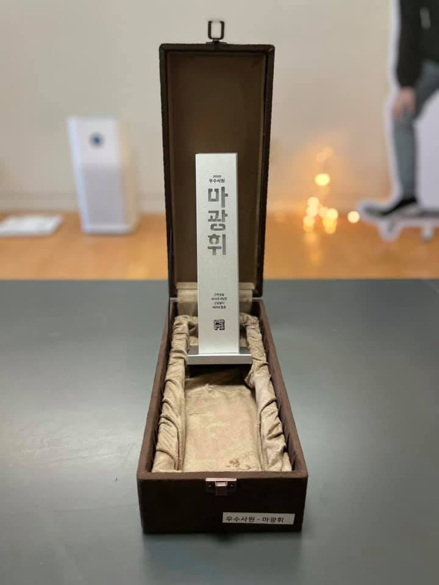

우아한형제들에서 1년 반 정도 되는기간 동안 다양한 프로덕트를 완수하면서 배민다운 인재가 되기 위해 노력했던 것 같습니다. 물론, 우수사원을 받은 것은 저 혼자만의 노력이 아니었습니다. 훌륭한 동료 개발자가 있기 때문에 추진력을 낼 수 있었고 동료를 위하는 마음에 여러 프로덕트를 주도적으로 만들었습니다. 2020년에 가장 잘한 일을 뽑는다면, 단연 `이벤트 페이지 메이커`를 만든 것이 아닐까 싶습니다.

이벤트 페이지 메이커는 현재 배민에서 운영되고 있는 만다오가 만들어지기 이전, B마트의 마케터가 수기로 마크업을 하던 형태를 개선하기 위해 만들어진 에디터입니다. 이 툴이 만들어짐으로써, 마케터분들은 마케팅의 본질에 집중하여 쉽게 이벤트를 발행할 수 있게 되었습니다.

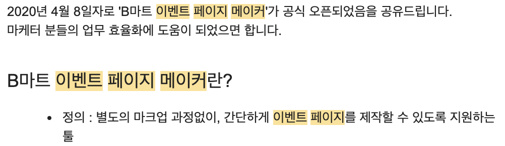

이벤트 페이지 메이커 오픈!

이벤트 페이지 메이커 오픈을 진행하고 나서, 마케터분들의 반응이 뜨거웠습니다.

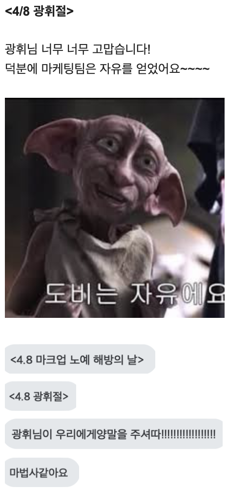

마케터분들의 반응

이 툴이 만들어짐으로써, 이벤트 운영을 위한 인력 절감 및 시간상으로 큰 이득을 만들어냈습니다. 중요한 사실은 `이 프로젝트를 진행하면서 업무시간을 쓰지 않고 개인 시간을 짬 내서 만들었다는 것입니다. (약간 자부심 있음)` 그래서 더 기억에 남고 사람들에게 도움 되는 프로덕트를 만드는 것이 의미 있었던 사례였습니다.

앞으로도 B마트 내에서 더 많은 병렬적 프로젝트를 팀원들과 함께하려고 준비 중이에요.

## 2021년, 목표 달성?

[2019년 회고 #내년 목표](http://vallista.kr/2019%EB%85%84-%ED%9A%8C%EA%B3%A0/#%EB%82%B4%EB%85%84-%EB%AA%A9%ED%91%9C)에서 2021년 목표를 다음과 같이 잡았습니다.

- 발표 두 번 하기 (실패)
- 오전 6시 기상 유지하기 (실패)
- 데일리 리포트 유지하기 (성공)
- Java + Spring 공부하기 (절반의 성공)

`발표 두 번 하기`는 실패했습니다. 엄밀히 말하자면 사내에서 두 번 이상의 발표를 했으나, 본래 목적인 외부 채널에서 발표였기 때문에 지키지 못했다고 생각합니다. 또, `오전 6시 기상 유지하기`도 실패했습니다. 회사일로 야근을 많이 하니, 6시에 일어나면 잠을 많이 잘 수 없는 상황이 나오게 되었습니다. 최소 4시간 이상 잠을 자지 않으니 다음날 업무를 진행하는 3시쯤 엄청 피곤해져서, 최소 4시간 이상 수면으로 변경하게 되었습니다.

`데일리 리포트 유지하기`는 성공했습니다. 비록 애매한 날이 있었으나 그럼에도 시간 카운팅은 진행하여 탄력적으로 1년간 운영했습니다. 총 합 데일리 리포트를 운영한 지 거의 3년이 되어갑니다. 3년동안 지속적으로 퍼포먼스는 올라갔고, 어떤 일을 했는지 로깅을 해두니 과거에 어떤 일을 언제 했는지 회고하기 쉬웠습니다.

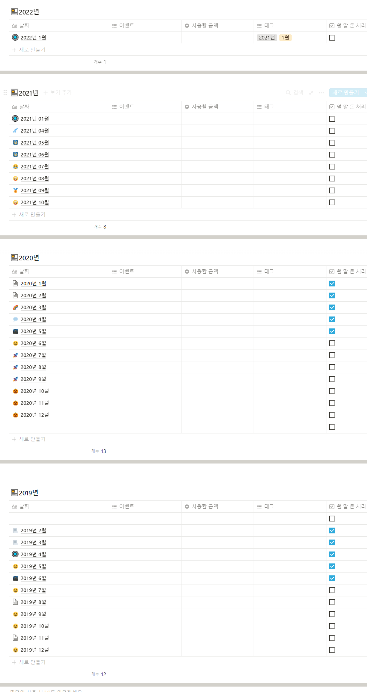

3년간 유지된 데일리 리포트

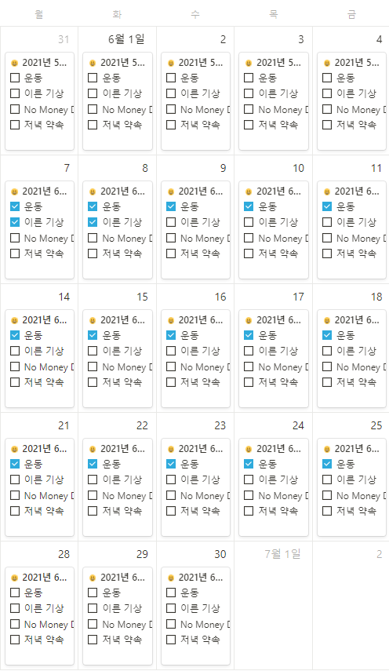

유지된 데일리 리포트

`Java + Spring 공부하기 (절반의 성공)`는 절반의 성공인데, java 언어는 공부하지 않고, spring 프레임워크와 비슷한 형태로 아키텍쳐를 설계한 `nest.js` 기반의 백앤드 서버를 만들고 운영했기 때문입니다. 추후 후술할 예정이지만, 프론트엔드 전용 데브옵스를 개발하여 여러 생산적이지 않은 일을 최적화 하는 서버를 만들었습니다. 대표적 예로, 코드리뷰어 룰렛인데 이는 후술하도록 하겠습니다.

## 2021년, 무엇을 했나?

2020년, 2021년은 본격적으로 프론트 개발자가 팀으로 입사하면서 이끌어나가기 위해 리드를 맡아서 진행했습니다. 또한, 웹 프론트 개발은 전문적 직군이 된 지 얼마 되지 않았습니다. 그럼에 따라, 제 연차가 상대적 시니어 연차였기 때문에 회사에서 시니어 임무를 부여받았습니다.

<strong>해야 할 일</strong>

- 퀵커머스프로덕트실 내 웹 프론트 리딩, 문화 조성
- 전사적인 시니어 업무 (면접, 다른 팀 기술 조언, 워크숍 운영)
- 프로젝트/과제 개발
- 회의 (싱크업, 타 부서, 등)

보통 회의와 시니어 업무를 진행하면 업무시간이 끝나버리는 경우가 잦았습니다. 하지만 팀 내 인원이 충분하지 않았기 때문에 업무도 함께 진행해야 했습니다. 그래서 두 가지를 효율적으로 처리하기 위해서 정신을 잘 집중해야 했습니다. 특히 어려웠던 것은 거대한 프로젝트를 1년의 기간 동안 세 가지를 진행했던 것입니다. 그중에 두 가지는 함께 진행했었어요.

### 결제 플랫폼과 B마트 리뷰

올해 상반기는 한마디로 정의하면 "전쟁" 이었습니다. 3~4개월 동안 커다란 프로젝트를 2개 진행하기 위해 더욱 꼼꼼하게 나를 검토해야 했고, 그러면서 위에서 언급한 다른 것을 (리딩, 시니어 업무 등) 수행해야 했습니다. 가장 크게 야근했던 주간은 거의 100시간 가까이 야근을 했었고, 야근했음에도 제 기준에서 만족스러운 프로덕트는 아니었습니다.

`결제 플랫폼`은 배달의민족 앱 내 전체 결제 플로우를 통합하는 작업입니다. 처음 목표로 배민과 B마트 통합하는 작업을 진행했고, 새로운 베이스 위에서 배민의 코드로 B마트를 전환해야 했습니다. 이 작업은 추후 만들어질 기틀을 만들어야 했기에, 더 섬세하게 생각하고 제작해야 했습니다. 여기서 문제가 생기는데, 이는 후술하도록 하겠습니다.

`B마트 리뷰`는 배달의민족 B마트 내 주문한 상품에 대해서 고객이 리뷰를 남길 수 있는 기능입니다. 파트 내에서 리뷰를 구현하기 위한 상품 상세를 앱으로 전부 포팅하기로 했습니다. 다만 이 프로젝트를 진행하면서 `배민원`이 오픈하게 되면서 B마트 내에서 대응이 필요해졌고, 이 두 가지 프로젝트를 B마트 앱 개발자가 한 번에 작업해야 했습니다. 그러면서 리뷰에 작업 일손이 부족해져, 웹 프론트로 몇 부분이 이관되어야 했습니다.

그런데, 저도 일정을 두 가지 프로젝트와 여러 작업을 병행하기 때문에 잘 정리해서 해두었으나, 급작스럽게 제게 큰일이 모바일 쪽에서 웹으로 넘어오게 되었습니다. 이것이 큰 암초가 되어, 3개의 페이지를 긴급하게 웹에서 처리하게 되었고, 여기서 맘에 들지 않는 포인트가 발생했습니다. 그래서 이 세 가지를 처리하기 위해 거의 며칠간 밤을 새웠고, 기존에 진행했던 결제 플랫폼을 놔두게 되었습니다. 이때 웹 프론트의 인원은 세 명이었으며, 다른 두 명도 각각 커다란 일을 진행하고 있어서, 더 큰 오버헤드를 줄 수 없었습니다.

결국, 큰 프로젝트 두 개를 제가 처리해서, 제한된 시간 내에 만들어 냈습니다. 잘 구동은 되었지만 이내 문제가 생겼습니다. `결제 플랫폼 오픈 후 장애`가 생긴 것이었습니다. 장애는 서버에서 예약 가능한 시간을 받아오는 API를 처리하는 과정에서 index가 out of index에 접근해 터지는 현상이었습니다. 그래서 8시 이후에 터졌습니다. (8시 이후의 인덱스 정보를 다르게 접근했기 때문) 그런데 사소한 문제여서 디버깅으로 찾기가 어려웠고. 약 1시간 정도 장애를 유지했습니다.

#### TL;DR

- 사전에 대응하기 위해서 여러 안전장치를 만들어두어야 합니다. 특히 핵심 기능은 무조건 테스트 코드가 포함되어야 합니다. 오로지 TDD 등의 방법론을 고수해서 100% 적용하는 것보다, 일단 핵심로직은 방어하기 위해 테스트 코드를 무조건 짜야 합니다.
- 장애가 만들어지면, 장애 대응 프로세스를 구축하고 빠르게 대응할 수 있도록 해야 합니다. 2021년, `배민 전사 장애 프로세스`가 도입되면서 장애를 겪고 나서 처리하고 더 재발하지 않도록 전사 단위에서 서포트해주는 프로세스가 있습니다. 이러한 부분을 겪으면서 어떤 것을 만들어야 하고 대응하는 방법을 익혔습니다.
- 장애는 빠르게 파악해야 합니다. 프론트도 백앤드처럼 다양한 로그를 쌓아야 하며, 이러한 툴이 사전에 구비 잘 되어있어야 합니다. 그래서 이번 장애로, 전사 모든 웹 지면에 센트리를 심게 되었습니다. 프론트도 로그는 필수적이며 잘 쌓아야 합니다.

이후 장애를 내고 나서, B마트는 장애가 일절 없었습니다. 또한 사용자가 조그마한 딜레이도 없이 사용할 수 있게 큰 최적화를 진행했죠. 커다란 프로젝트를 두 개 진행하면서 장애도 경험해보고 많은 고민을 진행할 수 있었습니다. 비록 매출에 큰 타격을 입혀서 마음이 굉장히 쓰리고 불안하고 여전히 답답하지만, 그래도 경험적인 측면에서는 큰 도움이 되었습니다.

### 배민스토어

`배민스토어`는 B마트와 달리, 서비스를 이미 진행하고 있는 업체를 대상으로 상품을 배달의민족 배민스토어에서 노출하고, 결제하면 배민과 매칭된 라이더를 배차하는 서비스입니다. 플랫폼 성격을 띠고 있으며, 자체 물류를 제공하지 않다 보니 프론트 서비스상으로 B마트보다 고려해야 할 대상이 많았습니다. 프론트 작업은 크게 두 가지로 나뉩니다.

- 배민 앱 내 배민스토어 화면들 = 이하 배민스토어 앱
- 입점한 셀러가 배민 앱 내 배민스토어를 컨트롤 할 수 있는 어드민 = 이하 셀러어드민

오픈할 때 두 개의 기능이 함께 제공되어야 했고, 셀러어드민은 새로 구축해야 했습니다. 새로 구축하면서 커다란 프로젝트이기 때문에 많은 개발자를 필요로 했고, 웹 프론트 개발자는 7명이 투입되었습니다. 배민스토어 앱에 개발자를 4명 투입하고, 셀러어드민에 3명을 투입했습니다. 기존 히스토리를 잘 알고 있던 인원을 배민스토어 앱으로 배치하고, 저는 새로운 셀러어드민을 구축하여 새로운 인원이 빠르게 작업할 수 있도록 베이스 코드와 구조를 잡는 리딩을 진행했습니다.

#### 비즈니스 상황에 맞는 구조를 설계하기

배민스토어는 사업, 기획, 서버개발, 프론트개발이 동시에 개발되는 구조로 진행되었습니다. 그만큼 급박하게 진행이 되어 프로그래밍하면서 요구 조건이 변경되고 스펙이 추가되거나 변경되는 일이 잦았습니다. 그러다 보니 명확하게 미래를 바라볼 수 있는 큰 규모의 튼튼한 설계를 진행할 수 없었고, 최대한 변경되지 않는 코어 로직을 생산성 있게 보존할 수 있도록 하는 구조가 필요했습니다.

먼저, `불변하는 것`은 디자인 컴포넌트라고 생각했습니다. 해당 프로젝트는 디자이너가 따로 붙지 않기 때문에 전사에서 사용되고 있는 디자인 컴포넌트 시안을 갖고 실제 개발을 구현해야 했습니다. 그래서 사장님을 위한 대시보드형 디자인 시스템의 시안을 보고 개발했습니다.

아직 전사 통합 디자인 시스템이 나와 있지 않은 상황이었기 때문에 실제로 구현해야 했고, 이 상황에서 모든 디자인 컴포넌트를 구현할 수 없었습니다. 그래서 기획과 커뮤니케이션하여 필수적인 컴포넌트를 추리고, 컴포넌트의 우선순위를 파악하여 프론트 개발자 3명이서 컴포넌트를 하나씩 개발하고, 빠르게 개발하면 우선순위대로 다음 컴포넌트를 개발하는 과정을 거쳤습니다.

#### 기술 스택 선정

개발할 때에는 여러 서드파티 라이브러리를 일절 사용하지 않고, `React, TypeScript, Emotion` 정도로만 작업하였습니다. 그 이유는 tailwind나 여러 상태관리 라이브러리의 경우 오히려 초기 상황에서 명확하게 가이드라인을 잡지 않고 개발자 개인마다 자신의 신념을 갖고 개발하게 되면 상대방의 소스 코드를 해석하기 힘들어지기 때문입니다.

그래서 초기 개발은 최대한 모두 범용적으로 사용할 수 있는 기술로 선택하며, 이후 문제가 생기거나 오버헤드가 발생했을 때 문제 해결을 위해 추가 서드파티를 적용하는 것이 바르다고 생각했습니다. 초기부터 어떠한 문제가 있는지 진단이 안 되어있는 상황에서 `이 기술 좋대~, 이 전에 내가 써보니까 편하더라`는 현재 비즈니스에서 적합한지 확인하기 어렵습니다. 모든 기술은 현재 비즈니스 기준으로 생각해야 하며, 상황을 잘 판단 해야 합니다. 개인적인 주관은 여유가 있을 때, 커뮤니케이션을 통해 설득이 필요하다고 생각합니다.

상태관리 라이브러리를 따로 쓰지 않은 이유는 `Context API와 Hooks`를 이용하면 대다수의 어드민 페이지는 커버가 된다고 생각하기 때문입니다. 대다수의 대시보드형 어드민은 페이지별 API를 찔러 페이지별로 서버 상태를 처리하고 들고 있게 됩니다. 그래서, 전역 상태는 dark mode 유무라던지, 로그인 등의 극소수 유저 데이터만 들고 있을 것입니다. 또한 유저 데이터도 cookie 등을 이용해 갖고 있을 것이므로 전역으로 상태를 공유하는 일은 빈번하지 않습니다. 있다고 하더라도 SPA의 root route에서 상태를 들고 있으면 됩니다.

또한, 아직 성능적 이슈가 없음으로 안정적으로 사용할 수 있는 CRA 기반으로 프로젝트를 구축했습니다. 이후에 이슈가 생긴다면 Next.js나 Remix 등으로 옮기면 됩니다.

#### 폴더 스트럭쳐

프로젝트의 유연성은 폴더 스트럭쳐로 결정이 될 정도로, 폴더를 명확하게 설정해두면 해당 아키텍처를 이해하지 못해도 자동으로 룰을 따르게 됩니다. 일종의 그라운드 룰인데 저는 이러한 아키텍처를 설명도 초기에 진행하지만 이를 코드 짤 때 무의식적으로 몸이 개발하도록 유도하는 걸 더 좋아합니다.

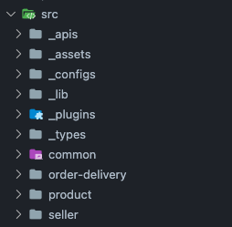

폴더 구조 요약

- 폴더 구조를 요약하면 `_ prefix를 필두로 한 공통 코드`돌과 `_ prefix가 없는 페이지 단위`의 폴더가 존재합니다.
- `_ prefix 폴더`는 프로젝트 전역에 쓰이는 공통 코드를 담고 있습니다.
- `_ prefix가 없는 폴더`는 프로젝트의 페이지들에 쓰이는 페이지 단위 코드를 담고 있습니다.

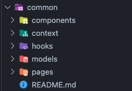

카테고리 단위 폴더링

- 페이지별 컴포넌트와 컨텍스트, 훅, 모델 등을 가집니다.
- `_ prefix`가 없는 페이지 단위의 폴더는 현재 프로젝트의 계층 구조를 나타냅니다. 예를 들어 common, order-delivery, product, seller, manage 4가지가 있다면 폴더구조는 아래와 같은 사진이 됩니다.

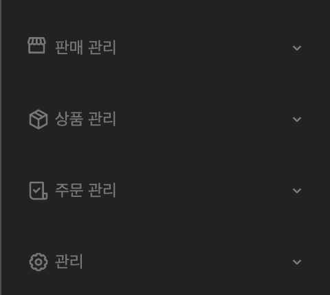

폴더 구조에 따른 사진

- common이 없는 이유는, common은 공통 페이지를 표현합니다. 404, 홈 등 공통으로 사용되는 페이지 데이터를 들고 있습니다.
- 각각의 카테고리별 명확한 구조로 되어 있습니다. 이렇게 구현한 이유는 카테고리별 대응되는 폴더 구조로 빠른 접근을 통해 고칠 포인트를 쉽게 고칠 수 있도록 제공하려 했습니다.
- 어드민의 경우 중복되는 코드나 장황한 코드가 많아질 수 있기 때문에 이렇게 만드는 게 좋다고 판단했습니다.

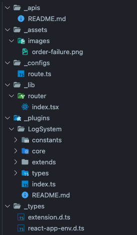

prefix 폴더 구조

- `_ prefix`가 있는 폴더는 전역으로 공통으로 쓰이는 코드들입니다.
- 그래서 최우선 정렬을 위해 `_`를 사용하였습니다.

이러한 폴더구조는 사실 명확한 아키텍쳐 설계에 의해 구축한 구조입니다. 하지만 아키텍처를 설계해 이야기를 지속하면 오랜 기간이 걸리기 때문에 바로 적용하여 제공하였습니다.

#### 협업

3명의 개발자가 위의 폴더 스트럭쳐를 기준으로, 디자인 컴포넌트를 개발하며 합을 맞춰나가기 시작했습니다. 세 명 다 이번 프로젝트로 처음으로 함께 작업해보는 시간이었습니다. 그래서 합을 맞추며 코드리뷰 프로세스 (이미 비마트에 구축되어 있던 코드리뷰어 봇을 사용했습니다. 이 친구는 추후 후술합니다.)를 통해 서로의 코드를 싱크업 해나갔습니다.

하지만 작업은 디자인 컴포넌트만 존재하는 게 아니었습니다. 공통 화면들과 인증체계가 존재했기 때문에 이 부분을 담당해야 했고, 이는 서버 개발자나 여러 사람과 커뮤니케이션이 많이 필요한 일이었습니다. 프론트 파트의 대다수 커뮤니케이션을 제가 받아서 전파하고 있었기 때문에, 이 작업을 제가 진행했습니다. 공통 작업을 진행하면서 개발 상황을 매니징하고 리딩해야 해서 문서화를 미친 듯이 진행했습니다.

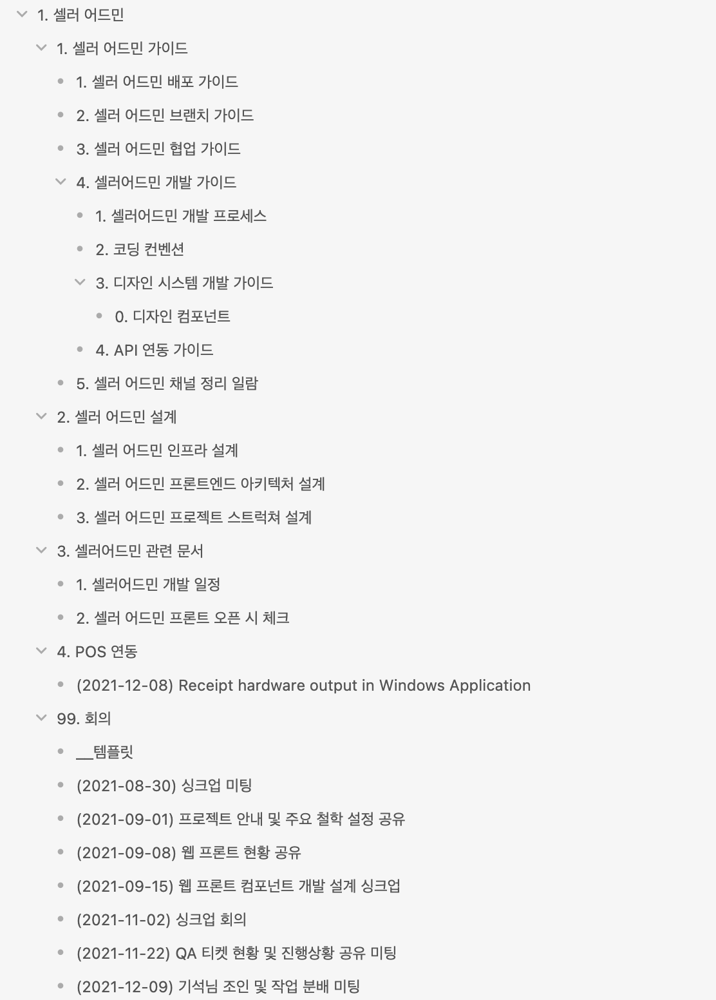

3개월간 진행한 문서 흔적

문서화를 통해 협업 프로세스를 문서화된 문서를 보며 진행할 수 있도록 만들었고, 다양한 팀과의 커뮤니케이션 포인트를 명확하게 정리할 수 있었습니다. 또한 기억이 나지 않는 과거 히스토리도 문서에서 모두 확인할 수 있었습니다.

#### 아쉬웠던 문제

사실 고려했던 문제이기도 한데, 안일하게 크롬 브라우저 기반으로 기술을 선택하여 개발하였습니다. 그러다 보니 셀러들의 운영 환경에 대한 대응이 미흡했고 여전히 윈도우XP 기반의 POS OS를 사용하는 셀러에서 동작하지 않았습니다. 그래서 일단 문제를 해결하기 위해 별도의 노트북을 제공해야 했고, 이는 꼭 해결되어야 할 문제였습니다.

관련된 트러블 슈팅은 이전에 글로 공유해두었습니다.

- [영수증, React 그리고 emotion](https://vallista.kr/%EC%B2%A9%EC%B2%A9%EC%82%B0%EC%A4%91,-POS-%EC%8B%9C%EC%8A%A4%ED%85%9C%EC%9D%84-%EB%8C%80%EC%9D%91%ED%95%98%EC%9E%90/)
- [첩첩산중, POS 시스템을 대응하자](https://vallista.kr/%EC%B2%A9%EC%B2%A9%EC%82%B0%EC%A4%91,-POS-%EC%8B%9C%EC%8A%A4%ED%85%9C%EC%9D%84-%EB%8C%80%EC%9D%91%ED%95%98%EC%9E%90/)

React 기반의 코드 베이스에서 브라우저에서 영수증을 개발할 수 있도록 제공하고, 영수증을 컨트롤 할 수 있도록 C# .net 프레임워크의 윈도우 애플리케이션을 구축하여 그 안의 웹 뷰에서 현재 오픈된 셀러 어드민을 사용할 수 있도록 제공했습니다. 하지만 여전히 문제는 C# 기반의 프로젝트를 운영할 수 있는 인력이 적다는 사실입니다. 그렇기에 nw.js 등으로 윈도우 os를 js로 컨트롤 할 수 있도록 제공해야 합니다. 이는 추후 블로그 글로 이야기해보도록 하겠습니다.

#### TL;DR

- 비즈니스 상황에 맞는 유연한 프로젝트 운영 구조를 통해 각 파트 간 커뮤니케이션을 진행하여 적합한 기술을 설계해, 개발을 완료하였습니다.
- 조금의 아쉬운 점이 있었으나, 이는 지속해서 해결할 수 있게 기술적인 방법 말고도 금액 등을 사용한 유연한 대응을 진행할 수 있었습니다.

### 매니징

위처럼 커다란 프로젝트와 자그마한 과제를 모두 진행하면서 제한 시간 내로 필요한 개발을 완료했습니다. 하지만, 개발을 진행하면서 해야 할 일이 매니징도 있었습니다. 한 해 동안 많은 리드로서의 일을 진행했습니다.

리드로써 해야 하는 일은 제가 생각하기에 이러한 업무가 아닐까 생각합니다.

- 개발 문화 조성
- 기술적 미래 과제 고민

#### 개발 문화 조성

이번년도에 B마트 웹 프론트 파트 문화를 만들고 조성한 것을 몇 가지 추리면 다음과 같습니다.

- 코드리뷰어 봇
- 매주 금요일 개발 워크숍
- 3 Phase 문서화 문화
- OKR을 통한 개인 목표 도출
- 온 보딩과 파일럿 프로젝트
- 여전히 동작하는 주간 회고

먼저, `코드리뷰어 봇`은 우리 B마트 웹 프론트엔드 파트의 권기석 님이 작성하신 [내가 경험한 B마트 프론트엔드의 온보딩 프로세스](https://techblog.woowahan.com/6851/)에서 자세히 보실 수 있습니다. 간단하게 이야기하면, 코드리뷰 MR을 올렸을 때 자동으로 코드 리뷰어를 매칭해주고 매칭된 코드 리뷰어가 리뷰하고 일정 approval이 되면 자동으로 머지하게 됩니다.

프론트엔드 데브옵스로 추가된 코드리뷰어 봇

기존에는 모든 개발자가 개발하다가 MR이 올라오면 모두가 달려들어 리뷰를 진행해주었는데, 이렇게 되면 모두의 리소스 낭비와 누군가는 리뷰하지 않게 되는 상황이 발생할 수 있습니다. 그렇기 때문에 리소스 낭비를 방지하기 위해 자동으로 필수적인 리뷰어 두 명 혹은 필요하다면 모두를 호출할 수 있도록 여러 기능을 제공합니다. 이 기능이 제공되고 나서, 개발 리소스가 적절히 분배되어 코드리뷰가 효율적으로 동작하게 되었습니다. 더 자세한 내용은 위의 기석 님 글을 읽어보시면 궁금증이 해소가 될 듯합니다.

두 번째로, `매주 금요일 개발 워크숍` 입니다. B마트 웹 프론트는 운이 좋게도 모두 열심히 공부하고 성장하는데 큰 관심을 두고 있습니다. 그래서 이러한 상황에서 혼자만 공부하기보다 서로 간 공부한내용을 공유하면 도움이 될 것으로 생각했습니다. 또한 대외적으로 블로그 거리가 나올 수도 있겠죠. 그래서 강제성을 부여하여 금요일 업무 1시간을 강제 워크숍을 생성했습니다. 일찍 끝내더라도 무조건 하도록 시간을 잡고 초반에는 들어가서 잡담이라도 진행했습니다. 시간이 지나면서 모두 워크숍에서 유의미한 시간을 보내기 위해 이야기를 할지 고민하게 되었고 그러면서 팀원들의 노력으로 자유 발표 주제로 서로가 공유하게 되었습니다.

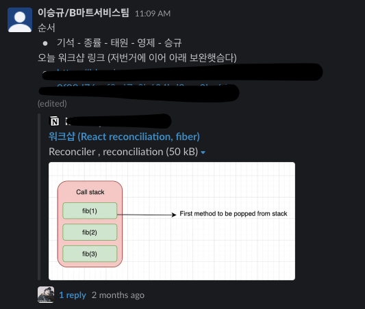

자율적으로 진행되는 개발 워크숍

항상 제가 강하게 문화를 만들고 푸쉬하는 과정으로 강력한 문화가 탄생했던 반면 이번 워크숍 문화는 팀원이 자유롭게 워크숍 문화를 만들 수 있도록 한발 뒤로 물러나 1시간의 강제성만 부여했습니다. 그 내부의 어떤 것을 어떻게 할지 팀원이 자율적으로 정했다는 사실이 굉장히 의미 있었습니다.

세 번째로 `3 Phase 문서화 문화` 입니다. 이 문화도 우리 B마트 웹 프론트엔드 파트의 권기석 님이 작성하신 [내가 경험한 B마트 프론트엔드의 온보딩 프로세스](https://techblog.woowahan.com/6851/)에서 자세히 보실 수 있습니다.

간단하게 이야기하면 다음과 같은 과정을 거쳐서 프로젝트 및 피쳐를 완수하는 것입니다.

1. `First Phase`: 과제/피쳐가 산정되면 작업 전, 프로젝트에서 어떤 부분을 수정하고 어떤 문의 사항, 문제점, 필요한 사항 등을 정리하는 문서를 만들어 작성합니다.
2. 작업한 문서를 바탕으로 실제로 작업합니다.
3. `Nth Phase`: 작업하면서 트러블 슈팅이 생긴 것을 히스토리로 문서화합니다.
4. `Last Phase`: 마지막으로 작업이 끝나고 프로젝트 회고를 개인적으로 진행하고 문서를 작성합니다.

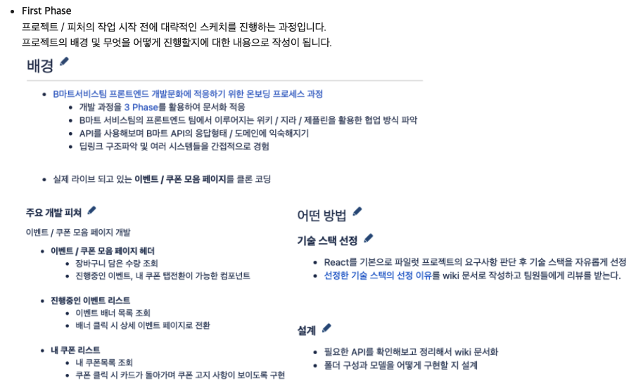

First Phase

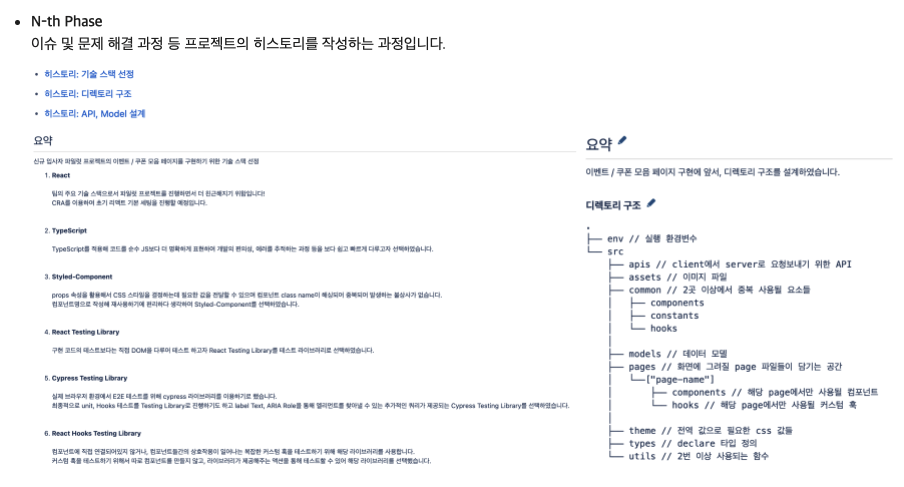

Nth Phase

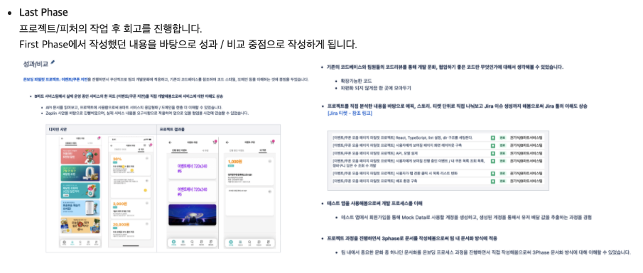

Last Phase

`3 Phase 문서화 문화`의 가장 큰 장점은 우리 팀의 태원님이 잘 설명해주셔서, 대신해보겠습니다.

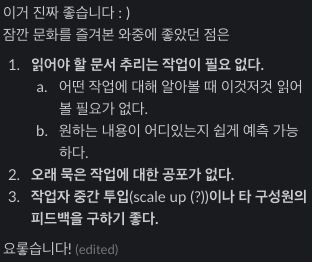

태원님이 작성해주신 가장 큰 3 Phase 문서화 장점

네 번째로 `OKR을 통한 개인 목표 도출` 입니다. OKR은 Objectives and Key Results의 약자로 조직이 달성해야 하는 목표를 설정하고 조직원이 달성하기 위해 노력을 하고 실제로 어디까지 달성되었는지 성과를 수치화하는 것입니다. 초기에 이 OKR을 도입한 이유는 B마트 프로덕트를 개발하면서 의미 없이 과제만 처리하는 게 아닌, 능동적으로 기술적 요구사항도 추가하고 본인이 하고 싶은 것을 함께 녹여내서 더 좋은 프로덕트로의 목표를 잡자는 취지로 진행했습니다.

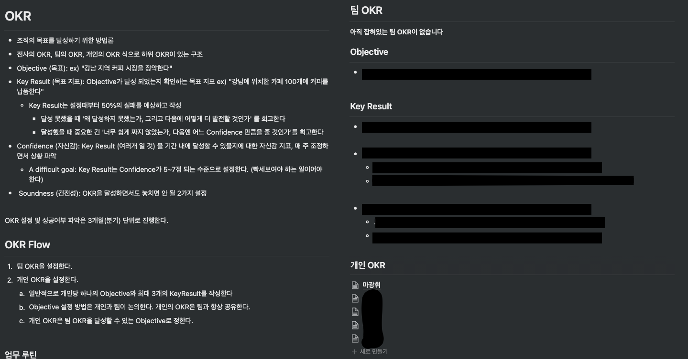

팀 OKR

보통 OKR은 전사 단위에서 실, 팀, 파트 단위로 Objective들이 내려오는 게 보통이지만, 저희는 전사적으로 OKR을 아직 도입하지 않았으므로 프론트 파트 내에서 사용자가 더 훌륭한 프로덕트를 경험하게 하기 위해 프로덕트의 기술적인 부분에서 어떤 것을 해야 할까? 를 Objective로 잡고 목표를 추출했습니다. 목표로 추출한 Objective를 기반으로 큰 3가지 Key Result를 만들고, Key Result에 해당하는 개인 Objective를 형성, Key Result를 또 만듭니다.

매주마다 자신의 Key Result를 체크하고, confidence를 지속해서 체크합니다. 달성량보다 왜 달성이 안 되고 있는지에 중점을 두고, 해당 문제를 해결할 방안을 팀원들이 같이 고민하여 진행합니다. 매주 진행하다가, 분기별로 정산을 진행합니다. 분기별로 서로 간의 OKR을 확인하면 어떤 사람은 목표를 완수했고, 완수하지 못한 사람은 그걸 보며 자극을 받습니다. 그렇게 현재 약 1년여 기간 동안 OKR을 운영해왔고, 병렬적으로 OKR로 진행한 과제는 약 10개 정도 됩니다.

다섯 번째로 `온보딩과 파일럿 프로젝트` 입니다. 이 문화도 우리 B마트 웹 프론트엔드 파트의 권기석님이 작성하신 [내가 경험한 B마트 프론트엔드의 온보딩 프로세스](https://techblog.woowahan.com/6851/)에서 자세히 보실 수 있습니다. 크게 다른 온보딩 문화와 다른점은, 신입과 경력을 구별한 파일럿 프로젝트에 있겠습니다. 저희 팀은 경력 온보딩 프로젝트로 실, 팀 등에 도움이 되는 유틸리티 어드민을 제작하여 `B마트 어드민 유틸리티 페이지`에 신규 탭으로 개발해서 넣어둡니다. 해당 기능을 다른 개발자나 기획자 등이 쉽게 사용할 수 있도록 제공하는데, 이렇게 하면 새로 오신 분도 프로젝트를 통해 의미가 있으리라 생각했습니다.

다만 신입은 조금 다른데, 신입은 첫 회사인 만큼 결과물로 나오는 것보다 차근차근 쉽게 이해하고 러프하게 싱크업을 할 수 있도록 기존 페이지를 동일하게 만들어보는 일을 진행합니다. 그러면서 다양한 사람들의 코드리뷰가 들어가며 점진적으로 스며들게 됩니다. 하지만, 모두가 동일한 것은 온보딩 기간이 6주라는 점입니다. 온보딩은 너무 길어도, 너무 짧아도 안 된다는 생각으로 6주를 잡았습니다. 벌써 4분이나 이 프로세스를 거치면서 스며 들으셨는데, 큰 문제가 없었습니다. 또한 이후 퍼포먼스도 훌륭했고요. 큰일이 있지 않은 이상 지속해서 유지할 것입니다.

> 신규입사자 권기석 님의 후기
>
> 입사 후 6주간의 시간이 흘러 온보딩 프로세스가 마무리되었습니다.
> 처음 입사할 당시, 내가 뭘 모르는지조차 모르기 때문에 "무엇을 ‘질문’ 해야 하는 걸까?"와 같은 막막함이 있었던 것 같습니다.
>
> 이런 걱정을 완전히 덜어준 것이 바로 팀에서 마련해 준 온보딩 프로세스였습니다.
> 제가 경험한 온보딩을 한 문장으로 표현하자면 "질문을 던질 수 있게끔 질문 리스트를 한가득 모아놓은 보따리" 입니다.
> 보따리에서 새로운 과제를 하나씩 꺼낼 때마다 모르는 것이 생겨났고, 그럴 때마다 자연스럽게 팀원분들에게 질문하며 차근차근 팀 문화에 적응할 수 있었습니다.
>
> 무엇보다도 온보딩 프로세스를 진행하면서 매번 어려움은 없는지 물어봐 주시고 어려움이 있다면 함께 문제해결을 해주시는 건 물론, 항상 아낌없는 피드백을 제공해 주신 팀원분들의 열렬한 서포트가 있었기에 6주간의 시간을 재밌고 알차게 보낼 수 있었습니다
> (감사합니다!! 😊)

여섯 번째로 `여전히 동작하는 주간 회고` 입니다. 여전히 주간 회고를 안 하는 팀도 많지만, 저희는 주간 회고를 의미 있게 약 90주간 해오고 있습니다. 그러면서 정보 글도 압도적으로 많아졌고 주간의 이슈를 모아서 효율적으로 커뮤니케이션하고 있습니다.

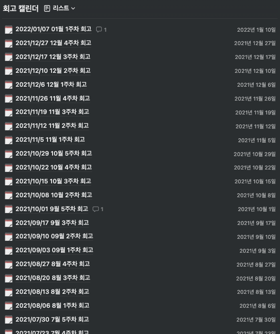

팀 회고.. 어마무시하게 많음

#### 기술적 미래 과제 고민

OKR 등의 문화를 통해 자신이 원하는 고도화나 과제를 주도적으로 진행하도록 제공했습니다. 하지만 팀 내의 기술 고도화와 맞물리지 않을 수 있습니다. 그렇기 때문에 팀 내의 프로젝트나 상황에 맞추어 내년도 과제를 선정해 더 빠르고 유연하도록 커버할 수 있도록 고도화 과제를 생각해야 합니다.

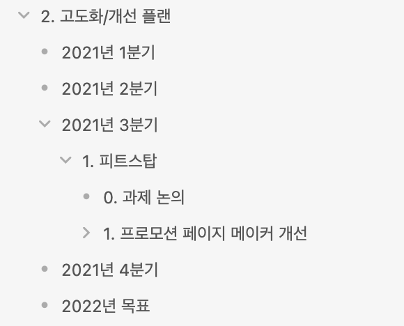

올해부터 시작된 분기별 고도화/개선 플랜

2021년은 크게 다섯 가지 과제를 선정 했습니다.

- 데이터가 흐르는 파트 만들기
- 모노레포로 전환
- 테스트 코드 정리 및 보완
- BFF (Backend For Frontend) 적용
- 로테이션 실시

`데이터가 흐르는 파트 만들기`는 프론트 팀원 모두가 데이터를 바탕으로 의사결정 및 본인이 성장할 수 있는 구체적인 지표를 볼 수 있도록 제공하는 것입니다. 내년이면 햇수로 B마트 프론트파트가 3년 동안 운영 되었습니다. 인원이 10명 정도가 되면, 케어를 1:1로 불가능해집니다. 그러므로 누군가가 어떤 일을 했는지 데이터로 정량적 측정을 해야합니다.

그래서, 반복적인 보고서 발행과 여러 대시보드를 통해 자신의 기여도나 데이터를 확인할 수 있도록 제공할 예정입니다. 몇 가지 발행할 보고서를 보면,

1. 코드 커버리지 보고서: 이전달 대비 상승량, 하락폭, 어떤 코드가 추가되고 삭제되었는지?
2. 코드 리뷰어 보고서: 코드 리뷰를 누가 가장 많이 했는지, 제일 많은 discussion 및 issue
3. 정보 공유글 결산
4. 지라 티켓 결산: 스프린트마다 발행

이 기능이 가능한 이유는, 2021년에 프론트엔드 데브옵스를 미리 만들어두었기 때문입니다.

`모노레포로 전환`은 멀티레포로 운영되는 프로젝트가 많아짐에 따라, 각 프로젝트간 공통 로직이 많았습니다. 또한 이후로도 프로젝트는 폭팔적으로 증가할 예정이기 때문에 이를 통합하기 위한 시도가 필요했습니다. 그래서 모노레포 기반으로 전환하고 시스템을 하나로 합병하는 작업할 예정입니다. 크게 나누는 것은 모바일 서비스와 셀러 및 어드민쪽 모노레포를 분리하려고 합니다.

`테스트 코드 정리 및 보완`은 B마트의 경우 E2E 테스트와 비즈니스 테스트 로직이 부족합니다. 그래서 이 로직을 최대한 작성하여 안정성을 높히려 합니다. 또한 이 작업이 사전되어야 `데이터가 흐르는 파트 만들기`도 가능해집니다.

`BFF (Backend For Frontend) 적용`은 전사적으로 마이크로서비스 형태를 갖춰감에 따라 여러 마이크로서비스별 인터페이스를 하나의 인터페이스로 응집하고 프론트에서 쉽게 API 데이터를 응답받을 수 있도록 BFF를 구축할 예정입니다. 이 또한 사전 프론트엔드 데브옵스를 통해 아키텍쳐 테스트를 진행했습니다. 이 레이어가 형성되면, 지금 프론트엔드 프로젝트에서 각각 API 인터페이스를 만드는 레이어가 존재했는데, 하나로 통합할 수 있겠습니다.

`로테이션 실시`는 프로젝트와 개발자가 많아짐에 따라 하나의 프로젝트만 수직적으로 파고들면 팀 전반적으로 좋은 영향이 있지 않습니다. 그러므로 로테이션을 구축하여 분기, 반 년 마다 담당자를 변경할 예정입니다.

이런 미래를 그리는 일은 중요합니다. 왜냐하면 미래가 명확해야 코드의 범위를 명확하게 산정하고 고도화를 진행할 수 있기 때문입니다.

#### TL;DR

- 여러 문화를 적용하면서 문서화, 개발문화 등 다방면으로 필요한 워크 프로세스의 중요성을 알게 되었습니다.
- 문화를 유지하는 일은 꾸준함이 필요합니다. 제가 1년 이상 유지하면서 지구력이 좋은 사람인 걸 알게 되었습니다.
- 기술적 미래는 실무자 입장에서 매우 필요합니다.

### 채용

올해부터 크게 진행하게 된 일로는, 시니어 업무 중 하나인 채용이 있습니다. 이런 말이 있는데, 시니어 업무의 30%는 채용이라고 했습니다. 엄연히 채용도 시니어의 임무이며, 이를 달성하기 위해 여러 방면에서 지인을 끌어오거나 자신의 가치를 높여서 나를 보고 지원하는 사람을 늘려야 합니다.

물론 지인과 1:1 디너를 통해 수많은 사람을 만났지만, 경력직이 오는 건 흔한 일이 아닙니다. 모두의 사정이 있고 우아한형제들은 모두에게 맞는 회사가 아닐 수 있기 때문이죠. (또한 면접에서 떨어지는 경우도 많기 때문에)

그래서 2021년은 면접 스킬을 올리는 데 큰 집중을 했습니다. 그래서 다방면으로 면접을 보았고 면접 질문이 적절한지 팀원과 다양한 사람들에게 물어가면서 벨런스를 맞추는 노력을 진행했습니다.

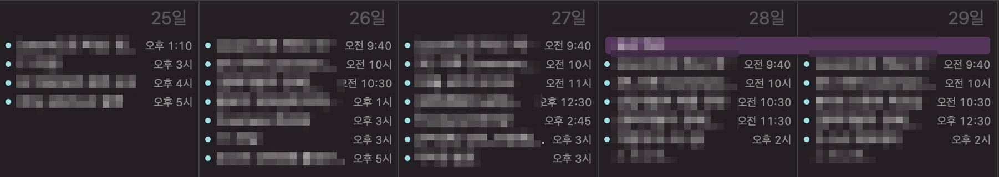

면접과 미팅으로 꽉 찬 시간

이번 연도는 B마트 프론트의 채용도 담당했지만 다른 팀과 우아한테크코스, 우아한테크캠프도 담당하여 절찬리에 면접을 본(?) 알찬 1년이 되었습니다. 얼추 면접을 보니까 어떤 분을 합격시켜야 하고 우리 회사에 맞는 분인지 판단할 수 있는 기준이 형성되었습니다.

또 B마트의 채용을 늘리기 위해서 `B마트 전체 채용 자료를 주도적으로 제작` 했습니다. B마트 내 여러 조직의 개발자/기획자/리드 분들께 자료를 받아 [B마트 홍보자료](https://baeminbmart.notion.site/baeminbmart/B-4afaa425660d4840bf9dd0933b2401dc)를 만들게 되었습니다. 이게 큰 도움이 될지 모르겠지만 일단 홍보자료를 만들었으니 다음에는 한 군데에서만 수정하고 홍보하면 되니, 응집도를 높였다고 생각하며 의미 있었던 일이라고 생각합니다.

#### TL;DR

- 채용에 대해서 많은 경험을 진행해서, 어떤 사람이 좋은 인재인지 면접에서 어떤 질문/답변을 해야 하는지 깨달았습니다.
- 회사의 작업과 마찬가지로 면접도 굉장히 중요한 일이며, 리소스가 많이 드는 일이라는 것을 깨닫게 되었습니다.
- 면접을 보기 며칠 전부터 면접 질문에 대해서 준비해왔는데, 이를 어느 정도 효율적으로 하기 위해, 공통 면접 질문을 구축해서 준비 시간을 단축했습니다.

### 전사 활동

올해부터 크게 신경 쓴 것 중 하나는 전사적으로 행동하려는 노력이 있었습니다.

- 전사 정보 공유 채널 개설
- 전사 이펙티브 타입스크립트 스터디
- 2020, 2021 웹 프론트 컨퍼런스 정리 모임

첫 번째로 `전사 정보 공유 채널 개설` 은 B마트 만의 정보 공유 채널을 전사 단위로 사용할 수 있는 공유 채널로 변경한 것입니다. 기존 B마트 공유 자료들도 남아있으니 사람들이 자극받을 수 있도록 채널을 오픈했습니다. 최근엔 B마트 팀원뿐만 아닌 다양한 사람들이 정보 글을 남겨주어서 점점 풍부해지고 있는걸 느낍니다.

두 번째로 `전사 이펙티브 타입스크립트 스터디`는 프론트엔드 개발자 다수가 모여 일주일에 3번 워크숍을 진행하고 있는데, 금요일에 타입스크립트 기술적 수준을 높이기 위해 이펙티브 타입스크립트를 주도해서 진행했습니다. 현재 책을 다 읽고 마무리하는 상황이며, 다음으로 타입스크립트를 활용한 객체지향 프로그래밍을 운영할 예정입니다.

세 번째로 `웹 프론트 컨퍼런스 정리 모임` 운영입니다. 매년 주요한 컨퍼런스를 10명 가까이 모여서 서로 공부하고 문서를 정리해 의견을 공유하고, 전사에 퍼뜨리는 일을 합니다. 이렇게 연말에 정리해서 모두에게 한 번씩 공부하도록 하는 데 의의가 있습니다.

#### TL;DR

- 실, 팀뿐만 아니라 전사 단위로 훌륭한 개발자가 많은데, 그들의 시너지가 전사 단위로 나오고 모두가 의견을 서슴없이 전사적으로 제시할 수 있는 문화를 만들려 노력했습니다.
- 여전히 세 가지밖에 하지 못해 아쉽지만, 올해에는 더 많은 이벤트와 상호 소통할 수 있는 모임의 장을 더 열어보려 합니다.

## 외부 활동

2021년은 2020년에 비해 더 많은 외부활동을 진행했습니다. 이렇게 진행한 이유는 내가 유명해져야 더 많은 좋은 분이 B마트 웹 프론트 조직으로 입사하리라 생각했습니다. 더 많이 있지만 추려보면 다음과 같습니다.

- 우아한테크코스 3기 코드리뷰어
- 우아콘 발표
- 우아한스터디
  - 우아한 멘토링
  - 우아한 러스트
- 글또 6기

첫 번째로 `우아한테크코스 3기 코드리뷰어`를 진행했습니다. 코드리뷰를 전문적으로 하는 작업은 처음 해보았는데, 시간을 지키면서 퀄리티를 준수하는 게 상당히 어려웠습니다. 또한, 상반기에 커다란 프로젝트를 두 개 병렬적으로 진행한 만큼, 엄청 바빠서 시간적 여유도 주어지지 않았습니다. 하여튼, 힘든 상황에서 크루들은 제 피드백이 굉장히 소중했다는 걸 알기에 최선을 다해서 시간을 오버해도 퀄리티를 최대한 높게 내자. 라는 생각으로 임했습니다. 왜냐하면, 시간에 너무 몰입하면 퀄리티 좋은 피드백이 나오지 못할 거라 생각했습니다.

결론적으로 퀄리티 좋은 피드백을 만족하는 크루들은 많았으나 크루들에게 온 피드백으로 코드리뷰가 너무 느리다는 이야기가 많이 나왔습니다. 이러한 단점을 올해 `우아한테크코스 4기 코드리뷰어`를 진행하면서 개선하도록 노력해볼 예정입니다. 작년에 진행해본 만큼, 더 빠른 피드백이 가능할 것 같습니다. 그리고 크루들을 보면서 다양한 관점으로 코드를 생각할 기회가 주어졌습니다. 그러면서 신입이 팀에 들어오면 어떤 프로세스를 거쳐서 서로가 만족할 수 있는 수준이 될지 생각을 할 수 있었습니다.

코드 리뷰를 하면서 신입은 피드백이 정말 중요하겠구나, 피드백이 중요한 이유는 열정이 가득한 신입의 경우 자신이 더 나은 개발자로 성장하고 싶고 좋은 방향으로 가고 있는지 끊임없는 물음을 자신에게 하기 때문입니다. 물론, 이 피드백을 완벽하게 해줄 수 있는 사람은 드물 것이나, 적어도 많은 사람의 커뮤니케이션을 통해 피드백을 자신이 정리하여 후회 없는 본인의 선택으로 나아갈 수 있게 만든다면, 이는 의미 있지 않을까 생각했습니다.

두 번째로 `우아콘 발표`를 했습니다. [웹앱 서비스 히스토리를 관리하기 위한 여정](https://www.youtube.com/watch?v=q_NBDCtZaQU)이라는 주제로 B마트 파트 내에서 경험한 내용을 바탕으로 타입스크립트를 홍보하는(?) 발표자료를 만들어봤습니다. 발표하면서 느낀 점은 우아한형제들이라는 타이틀을 달고 더 좋은 발표자료를 만들기 위해 노력하는 게 굉장히 힘들었지만, 준비를 끝내고 발표를 마친 후 정말 개운했습니다. 또한 청중들의 피드백을 받을 자리도 있었는데, 피드백에서 큰 욕이나 이야기가 없어서 다행이었습니다. (휴) 올해도 기술적으로 노력해서 발표할 거리를 만들 수 있는 한 해가 되었으면 좋겠습니다.

세 번째로 `우아한 스터디`를 진행하고 있습니다. 2021년 말부터 진행한 우아한 스터디는 배민 DR 팀에서 주도적으로 외부 개발자들과 소통하는 자리를 스터디로 만들었습니다. 굉장히 의미 있는 일이라 생각해서 두 가지를 참여하게 되었습니다. 첫 번째 스터디로 `우아한 멘토링`입니다. 우아한 멘토링은 커리어가 고민인 외부 개발자를 내부 우아한형제들 개발자들이 함께 고민해주는 스터디입니다. 저도 예전에 거의 3년 가까이 방황했었는데, 그 기억을 더듬어 가공한 후 스터디 멤버분들께 질문의 답변으로 드리고 있습니다. 두 번째 스터디로 `러스트 스터디`는 이미 사내에서 저와 사내 개발자 두 분, 총 3명이 2021년 초부터 진행하던 스터디입니다. 진행하면서 러스트의 대한 경험이 좋던 찰나, 우아한 스터디 공고를 보고 추진하게 되었고 현재 외부 개발자 4분과 함께 진행하고 있습니다.

네 번째로 `글또 6기`를 진행했습니다. 비록 올해 후반부에 커다란 프로젝트를 진행하느라 글 몇 개를 제출하지 못했지만, 개인 블로그도 다듬고 하는 좋은 기억이 남은 활동이었습니다.

그 외에도 다양한 외부활동을 진행했습니다. 우아한 인터뷰, 해커리어 등..

### TL;DR

- 외부 활동을 하면서 사내의 훌륭하신 분뿐만 아니라 외부의 훌륭하신 분을 보면서 참고를 많이 하게 됩니다. 외부에서 겪는 일을 잘 대응해 자신의 것을 만든 후, 회사 내부의 프로젝트에서 자주 해결방법으로 써먹는 부분들이 있습니다. (멘토링 하면서 얻은 결론을 1:1 할 때 이야기 한다든지)

## 책읽기

올해 읽은 책은 다음과 같습니다.

- OKR
- 크래프톤 웨이
- 일의 격
- 사피엔스
- 데브옵스 도입 전략
- 눈 떠보니 선진국
- 이펙티브 타입스크립트
- 코딩호러의 이펙티브 프로그래밍
- 왜 리더인가
- 왜 일하는가
- 아마존의 팀장수업
- 실리콘벨리 리더쉽

총 12권을 읽었습니다. 가장 기억에 남는 책이라고 한다면, 여러 기술서적도 있었지만, 스터디를 중심으로 풀어나간 책이어서 개인적으로 읽은 `크래프톤 웨이`와 `아마존의 팀장수업`이 많이 남습니다. 특히, 아마존의 팀장수업은 6 Pager를 비마트 프론트에서 3 Phase로 녹여내어 문서화 문화를 만들었고, 크래프톤 웨이에선 서비스와 비즈니스의 방향성이 중요하다는 경험을 간접 체험했습니다. 둘 다 재밋는 책이어서 헬스 갔다 오는 동안 시간 가는 줄 모르고 읽었던 기억이 나네요.

## 2021년, 느낀 점

올해를 돌아보면서 느낀 점을 총합해서 적어보겠습니다.

- 무엇이든 기록을 남기는 것은 중요하다. 그것이 로그, 한 줄 텍스트, 든 무엇이든 상관없다. 빠르게 무언가를 파악하고 진행하려면 뭐든지 기록이 되어있어야 한다!
- 과거의 경험은 쓸모 있습니다. 비록 그게 다른 업계의 일이어도요! 제가 윈도우 어플리케이션을 개발할 줄 몰랐지만, 과거의 경험으로 빠르게 해결할 수 있었습니다.
- 커다란 방향성 안에 조그마한 갈등은 되도록 자율성을 보장하고, 팀원을 믿고 팀원들의 방향으로 가도록 독려하는 게 바르다고 생각했습니다.
- 개발자는 비즈니스를 잘 이해해야 하고, 비즈니스 크기와 결정에 따른 적합한 기술 및 문화를 만들 수 있도록 노력해야 합니다!
- 좋은 팀을 빌딩 하려면, 나 자신이 좋은 사람이어야 하고, 나 자신이 잘해야 하며, 겸손하고 업계에서 저명해야 합니다. 결론적으로, 나부터 잘해야 합니다.
- 2021년은 마광휘가 폭팔적으로 성장한 한 해였습니다. 많은 것을 했고 경험 했습니다.

2021년은 성장했지만, 회사일의 비중이 너무 높아 회사일이 거의 70%에 육박했습니다.

## 2022년, 목표

2021년 느낀점을 바탕으로 2022년 목표를 설정해보겠습니다.

- 조금 더 나 자신에게 시간을 할애하기. 올해는 회사 일의 비중이 50%까지 떨어지도록 유지하기
- 일주일에 두 번 이상 운동하기 (테니스, 헬스)
- 발표 두 번이상 하 기 (어떤 컨퍼런스이던 상관없이)
- 러스트에 더 집중하기 (무엇이든 만들어보기)
- 오픈소스에 기여하기 (생각을 하는 애니메이션 라이브러리 구체화?)
- 영어/일본어 공부
- 서버 개발 경험에 집중하기
- 책 10권 이상 읽기
- 일주일에 야근 20시간 이상 하지 않기
- 한 달에 스터디 2개 이상씩 유지하기

올해는 회사 일의 비중을 떨어뜨리고 나 자신의 성장이 목표입니다. 여태까지 못 했던 일과 나빠진 건강을 복귀시키고 전반적으로 안정을 찾는 안식년(?)으로 정했습니다. 할 수 있을지 모르겠지만, 최선을 다해 안정화해보는 한 해를 보내보도록 하겠습니다.
