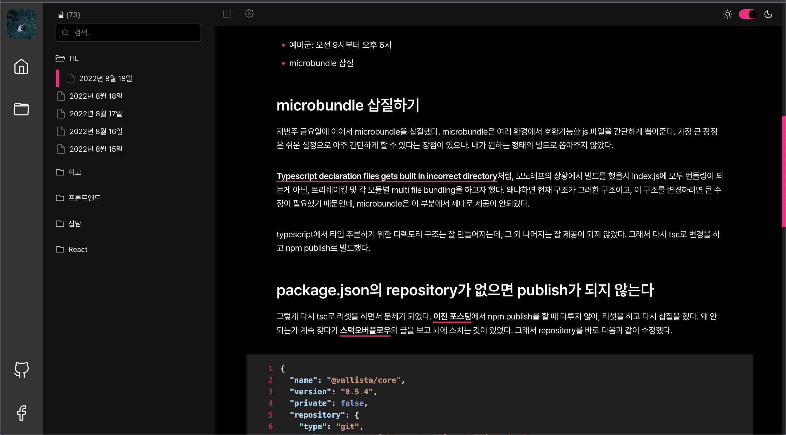

## 오늘 한 일

- 예비군: 오전 9시부터 오후 6시
- microbundle 삽질

## microbundle 삽질 후, 포기

저번주 금요일에 이어서 microbundle을 삽질했다. microbundle은 여러 환경에서 호환가능한 js 파일을 간단하게 뽑아준다. 가장 큰 장점은 쉬운 설정으로 아주 간단하게 할 수 있다는 장점이 있으나. 내가 원하는 형태의 빌드로 뽑아주지 않았다.

[Typescript declaration files gets built in incorrect directory](https://github.com/developit/microbundle/issues/854)처럼, 모노레포의 상황에서 빌드를 했을시 index.js에 모두 번들링이 되는게 아닌, 트리쉐이킹 및 각 모듈별 multi file bundling을 하고자 했다. 왜냐하면 현재 구조가 그러한 구조이고, 이 구조를 변경하려면 큰 수정이 필요했기 때문인데, microbundle은 이 부분에서 제대로 제공이 안되었다.

typescript에서 타입 추론하기 위한 디렉토리 구조는 잘 만들어지는데, 그 외 나머지는 잘 제공이 되지 않았다. 그래서 다시 tsc로 변경을 하고 npm publish로 빌드했다.

## package.json의 repository가 없으면 publish가 되지 않는다

그렇게 다시 tsc로 리셋을 하면서 문제가 되었다. [이전 포스팅](https://vallista.kr/2022%EB%85%84-8%EC%9B%94-18%EC%9D%BC/)에서 npm publish를 할 때 다루지 않아, 리셋을 하고 다시 삽질을 했다. 왜 안되는가 계속 찾다가 [스택오버플로우](https://stackoverflow.com/a/61021072)의 글을 보고 뇌에 스치는 것이 있었다. 그래서 repository를 바로 다음과 같이 수정했다.

```json {numberLines}
{
  "name": "@vallista/core",
  "version": "0.5.4",
  "private": false,
  "repository": {
    "type": "git",
    "url": "https://github.com/vallista/vallista-land"
  },
  "publishConfig": {
    "access": "public",
    "registry": "https://npm.pkg.github.com/"
  },
  "files": ["lib"],
  "main": "./lib/index.js",
  "types": "./lib/types.d.ts",
  "peerDependencies": {
    "@emotion/react": "^11.4.1",
    "@emotion/styled": "^11.3.0",
    "react": "^17.0.1",
    "react-dom": "^17.0.1"
  },
  "devDependencies": {
    "@emotion/babel-plugin": "^11.3.0",
    "@emotion/react": "^11.4.1",
    "@emotion/styled": "^11.3.0",
    "@types/jest": "^26.0.15",
    "@types/node": "^12.0.0",
    "@types/react": "^17.0.0",
    "@types/react-dom": "^17.0.0",
    "react": "^17.0.1",
    "react-dom": "^17.0.1"
  },
  "scripts": {
    "run:core": "tsc --watch",
    "build:core": "rm -rf lib && tsc"
  },
  "dependencies": {
    "@testing-library/react-hooks": "^7.0.2"
  }
}
```

여기서 중요한 점은 다음 부분이다.

```json {numberLines}
{
  "name": "@vallista/core",
  "repository": {
    "type": "git",
    "url": "https://github.com/vallista/vallista-land"
  },
  "publishConfig": {
    "access": "public",
    "registry": "https://npm.pkg.github.com/"
  }
}
```

- name: npm으로 publish할 이름이며, org-name (레포지토리의 위치 ex: Vallista/vallista-land)와 이름을 적어야 한다. 매칭되지 않으면 에러가 나타난다.
- repository: url을 명시하지 않으면 해당 레포지토리를 체크하지 못해 문제가 생긴다
- publishConfig: `https://npm.pkg.github.com/`를 registry에 적어주어야 한다.

또한, `.npmrc` 파일도 맞춰주어야 한다.

```{numberLines}
@Vallista:registry=https://npm.pkg.github.com/:_authToken={TOKEN}
```

## tsc로 npm publish 하기

위에서 이야기 했듯, 파일별 위계상 js 파일이 만들어지지 않아서, microbundle로 삽질을 했지만, 문제가 있어서 결론적으로 tsc로 변경을 했다. 그래서 tsc로 변경하고 나서 bundle을 올리고, `npm install @vallista/core@0.5.4` 을 진행해서 실행했다. 이전엔 정상적으로 실행이 되지 않았지만 이번엔 제대로 실행이 되었다.



<center>정상적으로 구동되는 사진</center>
