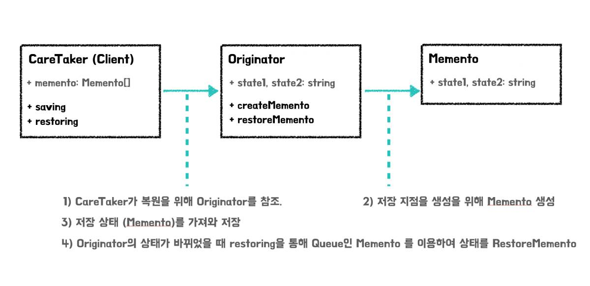

## 메멘토 패턴

설계 문제에 대해서 해답을 문서화 해놓은 디자인 패턴에는 생성, 구조, 행동, 동시실행과 같은 분류가 있습니다. 그 중에서 메멘토 패턴은 동작에 대한 패턴입니다.

메멘토 패턴은 초기 HP 제품을 위해 `Noah Thompson`과 `Dr.Drew Clinkenbeard`에 의해 제작되었으며, 객체는 `구현 변경 테스트 재사용이 쉬워야 한다` 는 것을 기술한 `23가지 GOF의 디자인패턴` 중 하나입니다.

이 패턴이 해결할 수 있는 문제는 `객체 내부 상태를 저장하므로써 객체 상태가 변경되었을 때 이전 상태로의 복구` 입니다. 즉, 쉽게 이야기 하면 이전 상태(원상태)로 되돌리는 역할을 합니다. 이 패턴이 주요로 사용되는 곳은 에러 콜백, 삭제에 대한 되돌림와 같은 유저 액션에 대해서도 충분히 대응이 가능합니다.

특히나 메멘토 패턴은 `캡슐화를 해치지 않는 선에서 내부 상태에 대한 원복`을 목표로 하기 때문에, 객체지향 관점에서 효과적이라 볼 수 있습니다. 하지만 캡슐화가 잘 된 객체는 데이터 구조가 잘 숨겨져 있기 때문에 객체의 외부에서 접근이 쉽지 않습니다. 어떻게 접근할 수 있을까요?

## 메멘토 패턴

메멘토 패턴은 캡슐화가 잘 된 객체에 접근할 수 있도록 3가지 객체로 이루어집니다.

### 오리지네이터 (Originator)

오리지네이터는 내부의 상태를 가지고 있는 객체입니다.

- 객체에 내부 상태를 저장
- 객체로부터 이전 상태를 복구

오리지네이터는 단독으로 객체에 접근할 수 있습니다.

### 케어테이커 (Caretaker)

케어테이커는 오리지네이터에 대해서 액션을 제공하지만, 변경에 대한 취소 및 저장에 대해서만 제공합니다. 다른 기능도 제공하게 되면 단일-책임원칙에 위배되기 때문입니다.

### 메멘토 (Memento)

메멘토 객체는 Originator와 반대로, 변경되기 이 전의 상태를 갖고있는 객체입니다.

<br/>

위의 3가지 객체는 아래의 순서대로 작동합니다.

1. 케어테이커는 오리지네이터에 대해서 변경에 대한 실행 취소를 진행합니다.
2. 그러기 위해 오리지네이터에게 메멘토 객체를 요청합니다.
3. 오리지네이터는 내부 상태를 변경하기위해서 메멘토 객체를 반환하며 케어테이커는 반환된 메멘토 객체를 적용합니다.

<br/>

케어테이커(클라이언트)는 오리지네이터로 부터 메멘토를 요청합니다. 이는 오리지네이터의 내부 상태를 저장하기 위함이며, 오리지네이터에게 메멘토를 다시 돌려줄 수 있습니다.

## 구조


(사진 1. 메멘토의 구조)

<br/>


(사진 2. Saving, Restoring 프로세스)

<br/>

이 프로세스를 React 프로젝트를 적용하기 이전에 코드를 살펴봅시다.

<br/>

```jsx {numberLines}
class Originator {
  public state1: string
  public state2: string

  constructor(state1: string, state2: string) {
    this.state1 = state1
    this.state2 = state2
  }

  createMemento(): Memento {
    return new Memento(this.state1, this.state2)
  }

  restoreMemento(memento: Memento): void {
    this.state1 = memento.state1
    this.state2 = memento.state2
  }
}

class Memento {
  readonly state1: string
  readonly state2: string

  constructor(state1: string, state2: string) {
    this.state1 = state1
    this.state2 = state2
  }
}

class CareTaker {
  private memento: Memento[] = []

  saving(originator: Originator): void {
    this.memento.push(originator.createMemento())
  }

  restoring(originator: Originator): void {
    if (this.memento.length === 0) return

    originator.restoreMemento(this.memento[this.memento.length - 1])
  }
}


const originator: Originator = new Originator('first', 'one')

const careTaker: CareTaker = new CareTaker()

careTaker.saving(originator)

originator.state1 = 'second'
originator.state2 = 'two'

console.log(originator)

careTaker.restoring(originator)

console.log(originator)
```

`careTaker` 객체는 originator 객체를 받아 저장 및 복원을 진행합니다. Originator는 Memento를 만들어낼 뿐이지, 자신의 상태에 대해서만 가지고 있습니다. 실제로 일을 하는 곳은 `CareTaker`라 보시면되고, 스냅샷을 `Memento`라고 이해하시면 되겠습니다.

그렇다면 이렇게 이해한 코드를 바탕으로 구현을 해보도록 합시다.

## 구현

해당 코드는 [React-Memento-Pattern-Use-TypeScript](https://github.com/Vallista/React-Memento-Pattern-Use-TypeScript)에서 확인할 수 있습니다.


(사진 3. 실행 결과)

Todo List 예시를 사용하여 변화에 대해서 롤백할 수 있는 기능을 메멘토 패턴으로 추가를 해보겠습니다.

### 모델

**src/models/memento.ts**

```jsx {numberLines}
export interface IOriginator<T> {
  createMemento(): T
  restoreMemento(memento: T): void
}

export class CareTaker<T> {
  private mementoList: T[] = []

  saving(originator: IOriginator<T>): void {
    this.mementoList.push(originator.createMemento())
  }

  restoring(originator: IOriginator<T>): void {
    if (this.mementoList.length === 0) return

    originator.restoreMemento(this.mementoList[this.mementoList.length - 1])
    this.mementoList.splice(this.mementoList.length - 1, 1)
  }
}
```

메멘토 패턴에 들어가는 기본적인 인터페이스와 클래스입니다.

IOriginator는 Original 객체에 대해서 느슨한 결합으로 추가할 수 있게 도와줍니다. 현재 객체의 상태에 대해서 저장하기 위해, Generic으로 T를 받아, 해당 타입을 반환하고 restore시 parameter로 받을 수 있도록 함수를 만듭니다.

CareTaker는 단독으로 사용될 수 있어야 합니다. 그렇기 때문에 느슨한 연결보다, 클래스로 기능을 명시합니다. CareTaker에서 진행할 내용은 저장과 롤백 두 가지 기능을 진행할 것 입니다. 해당 객체에 대해서 상태를 저장할 수 있도록 generic으로 T를 받고, T 타입에 대해서 상태를 여러개 물 수 있도록 T[] 와같은 배열 형태로 구현합니다. 이 배열은 힙으로 사용할 예정입니다. 저장할 때에는 T를 받아 push를 진행해주고, 롤백시에는 힙으로 사용하므로 가장 뒤에 있는 T를 가져와 적용하고, replacement 하도록 설계합니다.

<br/>

**src/models/Removable**

```jsx {numberLines}
export enum RemoveState {
  IDLE = 0,
  REMOVE
}

export interface IRemovable {
  getRemoveState(): RemoveState
  remove(): void
}
```

Removable은 상태에 대한 enum 값과, 삭제가능한 객체인지를 알려주는 Interface로 구성됩니다. Removable을 구현하는 클래스는 느슨한 결합으로 쉽게 추가하고 붙일 수 있습니다.

<br/>

**Todo.ts**

```jsx {numberLines}
import { IRemovable, RemoveState } from "./Removable"

class Todo implements IRemovable {
  private removeState: RemoveState
  private readonly message: string

  constructor(message: string) {
    this.removeState = RemoveState.IDLE
    this.message = message

    this.remove = this.remove.bind(this)
  }

  getMessage() {
    return this.message
  }

  getRemoveState() {
    return this.removeState
  }

  remove() {
    if (this.removeState !== RemoveState.REMOVE)
      this.removeState = RemoveState.REMOVE
  }
}

export default Todo
```

Todo 객체를 추상화한 Todo 클래스는 삭제상태와 메시지를 멤버 변수로 갖고 있습니다. 캡슐화를 완성하기 위해서 멤버변수는 은닉화를 해주었고, 외부 진입에 대해서 한정적이게 하도록 get 함수로 외부로의 연결통로를 두었습니다.

<br/>

**TodoList.ts**

```jsx {numberLines}
import Todo from "./Todo"
import { RemoveState, IRemovable } from './Removable'

class TodoList implements IRemovable {
  private todos: Todo[]
  private removeState: RemoveState = RemoveState.IDLE

  constructor(todos: Todo[] | null = null) {
    if (todos) {
      this.todos = todos

      return
    }

    this.todos = [new Todo('테스트')]

    this.add = this.add.bind(this)
    this.remove = this.remove.bind(this)
  }

  getTodos() {
    return this.todos.filter((todo) => todo.getRemoveState() !== RemoveState.REMOVE)
  }

  add(message: string) {
    this.todos.push(new Todo(message))
  }

  remove() {
    if (this.removeState !== RemoveState.REMOVE)
      this.removeState = RemoveState.REMOVE
  }

  getRemoveState() {
    return this.removeState
  }
}

export default TodoList
```

TodoList는 생성 말고도 데이터를 덮어쓰기 가능하도록 constructor에 예외를 줍니다. 해당 부분은 뒤에서 설명이 좀 더 이루어 집니다.

<br/>

**TodoListCollection.ts**

```jsx {numberLines}
import TodoList from "./TodoList"
import { IOriginator } from "./Memento"
import Todo from "./Todo"

class TodoListCollection implements IOriginator<TodoListCollection> {
  private todoList: TodoList[] = []

  constructor(list: TodoList[] | null) {
    if (list) this.todoList = list
  }

  setTodoList(list: TodoList[]) {
    this.todoList = list
  }

  getTodoList() {
    return this.todoList
  }

  createMemento(): TodoListCollection {
    return new TodoListCollection(this.todoList.map(list => {
      const todoList = new TodoList(list.getTodos().map(todo => new Todo(todo.getMessage())))
      return todoList
    }))
  }

  restoreMemento(memento: TodoListCollection): void {
    this.todoList = memento.getTodoList()
  }
}

export default TodoListCollection
```

TodoListCollection은 실제 렌더링은 되지 않지만 상태를 갖고있는 Originator 클래스 입니다.

해당 클래스에서 메멘토를 만들고, 상태에 대해서 적용하는 코드가 탄생합니다.

createMemento에서는 TodoListCollection단위로 객체를 재 생성합니다. 이렇게 재생성 하는 이유는 JavaScript의 Prototype의 한계가 있기 때문입니다. 그래서 DeepCopy를 통해 데이터를 재바인딩 합니다.

## React component, hooks 구현

이제 이 모델을 사용해야하는데 React와 객체지향 모델과의 결합을 하는 예제는 많지 않기 때문에 생소할 수 있습니다. 그래서, 최근 가장 많이 사용한다는 hooks와 functional component 형태로 제작해보겠습니다.

<br/>

**src/hooks/useTodo.tsx**

```jsx {numberLines}
import { useState } from 'react'
import TodoList from '../models/TodoList'

import { CareTaker } from '../models/Memento';
import TodoListCollection from '../models/TodoListCollection';

const careTaker = new CareTaker<TodoListCollection>()
const originator = new TodoListCollection([])

function useTodo() {
  const [todoListCollection, setTodoListCollection] = useState<TodoList[]>([])

  const reRender = (other: TodoList[] = []) => {
    setTodoListCollection(
      [...todoListCollection, ...other]
    )
  }

  const addTodoList = () => {
    originator.setTodoList(todoListCollection)
    careTaker.saving(originator)

    const todoList = new TodoList()

    reRender([todoList])
  }

  const addTodo = (TodoList: TodoList, message: string) => {
    originator.setTodoList(todoListCollection)
    careTaker.saving(originator)

    TodoList.add(message)
    reRender()
  }

  const allAddTodo = (message: string) => {
    originator.setTodoList(todoListCollection)
    careTaker.saving(originator)

    todoListCollection.forEach((list) => {
      list.add(message)
    })
    reRender()
  }

  const allRemoveTodo = () => {
    if (window.confirm('정말 삭제하시겠습니까?')) {
      originator.setTodoList(todoListCollection)
      careTaker.saving(originator)

      console.log(originator)

      todoListCollection.forEach((list) => {
        list.getTodos().forEach(todo => {
          todo.remove()
        })
      })

      reRender()
    }
  }

  const rollback = () => {
    careTaker.restoring(originator)
    console.log(originator)
    setTodoListCollection(originator.getTodoList())
  }

  return {
    todoListCollection,
    addTodoList,
    addTodo,
    allAddTodo,
    allRemoveTodo,
    rollback
  }
}

export default useTodo
```

custom hook인 useTodo 입니다. 모델과 대응되고 있으며, 모델의 코드를 프론트에 제공해주기 위해 리액트 코드로 변환하는 과정입니다.

1. CareTaker와 originator를 최상단에 선언해줍니다. hooks안에 선언하면 매 갱신시마다 새로 할당이 되므로, 메모리에서 못써먹습니다. 그러므로 useHooks 파일이 불렸을 때 메모리에 로드되도록 선언합니다.
2. custom hooks의 todoListCollection을 useState로 상태를 만듭니다. 상태의 타입은 모델이므로 TodoList[]로 지정합니다. 해당 부분을 TodoListCollection Class로 하지 않는 이유는, 상태 변경으로 리스트 갱신이 React에서는 클래스 단일로 진행하기 어렵기 때문입니다.
3. reRender 함수는 shallow copy를 통해 React Component가 재랜더링 할 수 있도록 도와주는 함수입니다.
4. addTodoList, addTodo등 추가하거나 삭제하는 함수들의 내부에서는 상태 변경 전에 현재 스냅샷을 찍어 originator에 등록하고, careTaker에서 배열에 저장합니다.

그리고 상태와 함수를 추출하여 밖으로 내보냅니다.

<br/>

**src/components/Todo.tsx**

```jsx {numberLines}
import React from 'react'
import '../App.css'

interface IProps {
  message: string;
}

const Todo: React.FC<IProps> = ({ message }) => {
  return <div className='todo'>{message}</div>
}

export default Todo
```

Todo Component는 간단하게 message만 prop으로 받아서 렌더링을 해줍니다.

<br/>

**src/components/Todos.tsx**

```jsx {numberLines}
import React from 'react'
import '../App.css'

import TodoList from '../models/TodoList'
import Todo from './Todo'

import { convertNumberToKorean } from '../utils'

interface IProps {
  todos: TodoList
  index: number
  addTodo(TodoList: TodoList, message: string): void
}

const Todos: React.FC<IProps> = ({ todos, index, addTodo }) => {
  return (
    <div className="todos">
      <h1 className="todos-title">{convertNumberToKorean(index)}</h1>
      <div className="todos-wrapper">
        {todos.getTodos().map((todo, idx) => <Todo message={todo.getMessage()} key={idx} />)}
      </div>
      <button className="button bottom-absolute" onClick={
        () => { addTodo(todos, `${todos.getTodos().length} 번째 테스트`) }
      }>+</button>
    </div>
  )
}

export default Todos
```

Todos에서는 TodoList 모델을 받아서 렌더링 해줍니다.

1. index를 받는 이유는 실행하고 하나, 둘, 셋 등의 한국말로 텍스트를 띄워주기 위해 index 번호를 받습니다.
2. addTodo는 추가 된 후 렌더링을 해주어야 하므로 hooks에서 만든 함수를 Prop Drilling 으로 내려줍니다.
3. convertNumberToKorean은 하나, 둘, 셋 과 같이 한글 숫자로 번역해주도록 만든 함수입니다.

<br/>

## App 적용

App에서 실제로 적용해줍니다.

```jsx {numberLines}
import React, { useEffect } from 'react'
import './App.css'

import useTodo from './hooks/useTodo'
import Todos from './components/Todos'

const App = () => {
  const { todoListCollection, addTodoList, addTodo, allAddTodo, allRemoveTodo, rollback } = useTodo()

  useEffect(() => {
    addTodoList()
  }, [])

  return (
    <div id='app'>
      <div className='collection'>
        {todoListCollection.map((todoList, index) => (
          <Todos todos={todoList} index={index + 1} addTodo={addTodo} key={index} />
        ))}
      </div>
      <div>
        <button className='button' onClick={addTodoList}>
          콜렉션 추가
        </button>
        <button
          className='button'
          onClick={() => {
            allAddTodo('전체 추가')
          }}
        >
          전체 추가
        </button>
        <button
          className='button'
          onClick={() => {
            allRemoveTodo()
          }}
        >
          전체 삭제
        </button>
        <button
          className='button'
          onClick={() => {
            rollback()
          }}
        >
          롤백
        </button>
      </div>
    </div>
  )
}

export default App
```

## 실행


(사진 4: 결과)

실행을 해보면 롤백이 제대로 동작하는 걸 볼 수 있습니다.

## 결론

메멘토 패턴을 사용해 현재 상태를 저장하고, 롤백하는 구현을 쉽게 진행하였습니다. 다만 상태가 많아지면 메모리를 많이 먹으므로 최대 배열의 갯수를 잡아 코딩을 진행하는게 좋습니다.

또한 메멘토 패턴은 커멘드 패턴을 통해 커맨드에 대한 롤백 및 미래에 대한 커맨드를 기억하고 추가하거나 하여 시뮬레이팅 시스템을 구현할 수도 있습니다.
