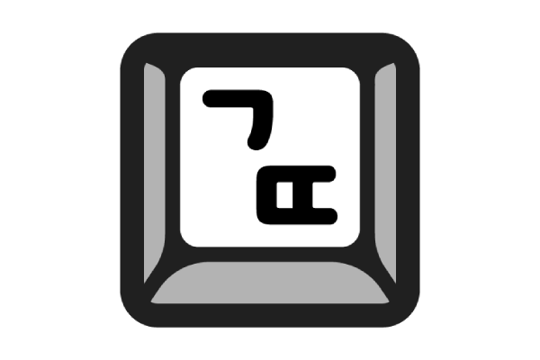
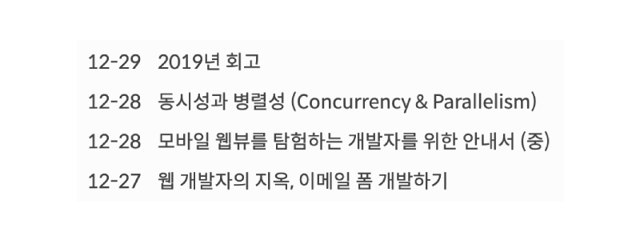
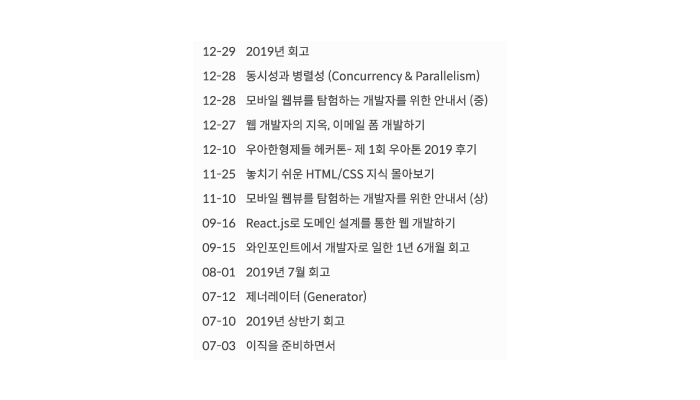

글또 3기에 이어서 글또 4기도 시작하게 되었습니다.

## 글또 4기

(글또 아이콘, 나영님 감사합니다!)

 

글또는 글쓰는 또라이의 약자로써, 2주에 한 글씩 작성하는 모임이에요. 이번 4기에는 총 68분(헉) 많은 분들이 참석하게 되셨어요. 사람이 많아진 만큼 훌륭한 분들이 많이 오셔서, 다양한 분들과 이야기를 나눌 수 있게 되었습니다.

저번 기수에도 많은 개발자분들의 글을 보면서 많은 성장을 할 수 있었는데, 올해도 어김없이 성장을 하는 계기가 될 거라 생각합니다.

## 목표

완성도와 글을 하루도 빠짐없이 게시하자는 두 가지를 잡아보고자 몇 가지 목표를 정하기로 했습니다.

- 완성도 있게 글을 쓰되, 분량이 긴 글은 시리즈를 이용하자.
- 2주동안 하루에 한 문단씩 작업하여 **일일 커밋**을 진행한다.
- 한번에 여러글을 작업하지 말고 하나의 글만 작업한다.
- 이미지를 가공하여 퍼블리쉬한다.

### 완성도 있게 글을 쓰되, 분량이 긴 글은 시리즈를 이용하자

(이전에도 한 달 단위로 시리즈를 작업한 적 있다.)

 

글이 상당히 길어질수록 제대로 된 시간에 제출을 못하는 일이 잦았습니다. 그렇기 때문에 저번 글또 3기에서는 분량 컨트롤을 제대로 못했다고 생각합니다.

앞으로는 시리즈를 이용하여 분량을 컨트롤 해볼 예정입니다.

### 2주동안 하루에 한 문단씩 작업하여 일일 커밋을 진행하자

(게시 날짜를 보라!)

 

저번 3기때의 목표는, **글을 하루도 빠지지 않고 게시하자!**가 목표였습니다. 하지만 이직 및 바쁜 회사일 일정으로 인해서 글을 모두 작성하지 못했습니다. 그래서 4번정도 글이 지연되어 막판에 몰아서 글을 작성했었습니다.

이렇게 몰아서 작성하니 문제는 글의 퀄리티가 들쭉날쭉하다는 것입니다. 글을 쓸 때 다른건 못챙겨도 꼭 챙기자고 마음속으로 결심했던 **완성도** 측면에서 아쉬운 글이 많았습니다.

그래서 글을 쓰는 2주간 하루에 한 문단씩 작업하여 **일일 커밋**을 진행하면 점진적으로 완성도 있는 글을 작업할 수 있을꺼라 생각했습니다.

### 한번에 여러글을 작업하지 말고 하나의 글만 작업한다

(드래프트된 글을 보라!)

 

작년에 **많은 글을 작업하고 싶으니 한번에 많은 주제의 글을 작업해보자** 라고 생각해서 진행을 했었습니다. 하지만 이 방법은 다른 글을 쓰다 돌아오면 문맥이 깨져버리는 문제가 도출되었고, 올해부터는 한번에 한 글만 작성하기로 마음먹었습니다. (...)

### 이미지를 가공하여 퍼블리쉬한다.

(이미지를 가공하지 않아서 한 화면에 이미지로 도배된 모습)

 

이미지가 한 화면에 도배되어서 아에 안보이던 문제가 있었습니다. 이런 문제는 글의 퀄리티를 떨어뜨린다 생각을 했고, 외관적으로도 정리를 잘해야겠다는 생각이 들었습니다.

## 글의 방향성

목표와 별개로, 이번년도는 글의 방향성을 보다 전문성있는 개발자의 포스팅을 목표로 하고자 합니다. 작년의 글은 대다수가 회고 혹은 HTML/CSS 부분이 많았습니다.

(대다수의 글이 HTML, CSS 관련 글이었다)

 

그래서 이번년도에는 보다 JavaScript, TypeScript, React, Vue등 조금 더 프론트앤드 개발자로써 전문적인 글을 작성하고자 합니다.
