하나의 프로덕트를 개발하면서 웹은 들어갈 수 밖에 없는 필수 존재입니다. 특히나 최근의 웹 시장은 웹 프론트앤드 개발자가 부족해짐에 따라 서버 개발자들이 어드민을 개발하는 일이 종종 일어나고 있습니다. 하지만 서버 개발자 중에서 HTML/CSS를 잘하시는 분도 있지만 자신 없는 분도 있기 마련입니다. 이 포스팅은 이러한 HTML/CSS에 약하신 분을 위해 중요한 개념만 짚고 넘어가고자 준비한 글 입니다.

부디 이 글로 인해서 많은 개발자가 고통에서 조금이나마 벗어났으면 좋겠습니다.

## HTML의 이해

이 세상에 이해하면 어려운게 어딧나 싶지만, HTML은 이해하면 굉장히 쉽습니다. 밑의 예시를 들어볼께요.

### 뷰포트 (Viewport)와 사각형 (Rectangle)

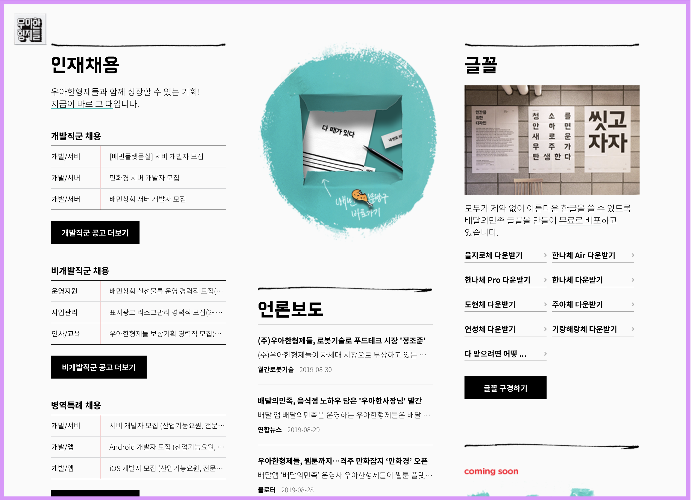

<br/>

이미지에서 가장 바깥쪽에 그어져 있는 분홍색 라인이 보이시나요? 바로 이 라인부터 안의 모든 영역을 `뷰 포트 (Viewport)`라고 부릅니다. 이 부분이 브라우저에서 실제 웹 페이지가 렌더링 되는 곳이에요. Viewport 안의 웹 요소들은 기본적으로 `사각형 (Rectangle)` 형태를 띕니다.

<br/>

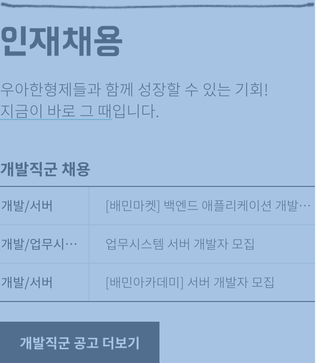

위 사진을 보면 사각형의 형태를 띄는 파란색 상자를 볼 수 있을꺼에요. 모든 HTML의 Element는 사각형의 형태로 생겼습니다. 그 예외는 없어요. 그렇다면 이런 질문을 할 수 있을꺼에요. `어떤 레이아웃은 모서리가 둥근데 이 친구들은 둥근 형태가 아닐까요?!` 이 질문에 대해서는 `아니요! 그 친구들도 사각형 안에서 둥글게 만든 레이아웃이 존재하는거에요!` 라고 말할 수 있습니다.

단순하게 생각하세요. **모든 HTML요소는 사각형으로 이루어져 있고, 사각형을 단장시키는 행위가 `CSS`입니다**.

### Div (Division)

위 사진의 파란색 상자 안에서 `첫 번째 버튼, 개발직군 공고 더보기`를 한번 봐 볼께요.

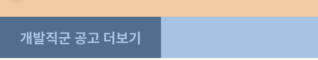

버튼을 감싸고 있는 div 영역이 있네요.


그리고 div 영역 안에 a 태그로 된 버튼이 있습니다.

그 외에도 대다수의 레이아웃은 div로 감싸져 있어요. 여기서 궁금해지죠. `왜 div로 감싸는 걸까?`, `div가 뭔데??`와 같은 질문들이요. 그 질문에 대답을 하지면 `div는 요소를 묶는 존재이고`, `동시에 다른 element와 구분을 하기 위해 사용하기 때문`이에요. 그리고 제일 중요한 `div` 태그의 특징은 **정렬등의 스타일을 적용하는데 매우 편리하다**는 점이에요.

#### Div 활용 첫 번째, 요소를 묶고 구분하기

Div는 요소를 묶는 역할과 동시에 구분하는 역할로도 사용되요. 아까 봤던 이미지를 한번 더 보실께요.


<br/>

위의 레이아웃은 아래의 코드와 같습니다.

<br/>

```html {numberLines}
<div>
  <h2>인재채용</h2>
  <p>우아한형제들과 함께 성장할 수 있는 기회!<br /><em class="highlight">지금이 바로 그 때</em>입니다.</p>

  <table style="margin-top:40px">
    <caption>
      개발직군 채용
    </caption>
    <tbody data-role="bind" data-name="recruits_develop" data-type="main-recruit-tech-item">
      <tr>
        <th>개발/서버</th>
        <td><a href="/recruit/tech?pidx=10571">[배민마켓] 백엔드 애플리케이션 개발자 모집</a></td>
      </tr>

      <tr>
        <th>개발/업무시스템</th>
        <td><a href="/recruit/tech?pidx=10567">업무시스템 서버 개발자 모집</a></td>
      </tr>

      <tr>
        <th>개발/서버</th>
        <td><a href="/recruit/tech?pidx=10698">[배민아카데미] 서버 개발자 모집</a></td>
      </tr>
    </tbody>
  </table>
  <div class="btn-area-table">
    <a href="#/recruit/tech" class="btn">개발직군 공고 더보기</a>
  </div>
</div>
```

위의 소스는 하나의 큰 Div에 여러가지 요소가 들어가있는 걸 볼 수 있습니다. 각각의 요소가 div element로 구분되어 있는 것도 확인할 수 있구요. div는 코드를 보면 알 수 있듯 요소를 묶거나 구분하는데 쓰입니다.

#### Div 활용 두 번째, 요소를 정렬하거나 스타일 적용하기

위의 코드를 아래와 같이 수정해볼께요.

```html {numberLines}
<div style="opacity: 0.1">
  <h2>인재채용</h2>
  <p>우아한형제들과 함께 성장할 수 있는 기회!<br /><em class="highlight">지금이 바로 그 때</em>입니다.</p>

  <table style="margin-top:40px">
    <caption>
      개발직군 채용
    </caption>
    <tbody data-role="bind" data-name="recruits_develop" data-type="main-recruit-tech-item">
      <tr>
        <th>개발/서버</th>
        <td><a href="/recruit/tech?pidx=10571">[배민마켓] 백엔드 애플리케이션 개발자 모집</a></td>
      </tr>

      <tr>
        <th>개발/업무시스템</th>
        <td><a href="/recruit/tech?pidx=10567">업무시스템 서버 개발자 모집</a></td>
      </tr>

      <tr>
        <th>개발/서버</th>
        <td><a href="/recruit/tech?pidx=10698">[배민아카데미] 서버 개발자 모집</a></td>
      </tr>
    </tbody>
  </table>
  <div class="btn-area-table">
    <a href="#/recruit/tech" class="btn">개발직군 공고 더보기</a>
  </div>
</div>
```

<br/>

최상위 div에 opacity를 0.1을 주었습니다. opacity는 알파값인데요, 요소의 흐린 정도를 나타냅니다. 0.1로 변경하면 div 요소들이 엄청 흐려지겠군요! 결과를 한 번 봐보겠습니다.

<br/>

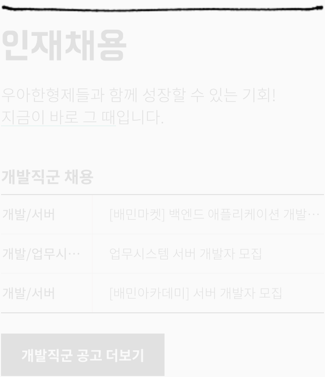

<br/>

엄청 흐려졌네요! 이로써 `div` 태그에 CSS 옵션을 주게되면 한번에 내부의 CSS 속성을 줄 수 있는 걸 확인했습니다. 다음으로 정렬을 살펴보도록 하겠습니다. 현재 정렬을 수직으로 하고 있는데 수평으로 변경해보겠습니다.

<br/>

```html {numberLines}
<div style="display: flex; flex-direction: row;">
  <h2>인재채용</h2>
  <p>우아한형제들과 함께 성장할 수 있는 기회!<br /><em class="highlight">지금이 바로 그 때</em>입니다.</p>

  <table style="margin-top:40px">
    <caption>
      개발직군 채용
    </caption>
    <tbody data-role="bind" data-name="recruits_develop" data-type="main-recruit-tech-item">
      <tr>
        <th>개발/서버</th>
        <td><a href="/recruit/tech?pidx=10571">[배민마켓] 백엔드 애플리케이션 개발자 모집</a></td>
      </tr>

      <tr>
        <th>개발/업무시스템</th>
        <td><a href="/recruit/tech?pidx=10567">업무시스템 서버 개발자 모집</a></td>
      </tr>

      <tr>
        <th>개발/서버</th>
        <td><a href="/recruit/tech?pidx=10698">[배민아카데미] 서버 개발자 모집</a></td>
      </tr>
    </tbody>
  </table>
  <div class="btn-area-table">
    <a href="#/recruit/tech" class="btn">개발직군 공고 더보기</a>
  </div>
</div>
```

<br/>

이번에도 최상단 `div`에 `display: flex`와 `flex-direction: row` 옵션을 주었습니다. 옵션을 주면, 레이아웃이 수평으로 변하겠죠? 결과값을 보도록 합시다.

<br/>

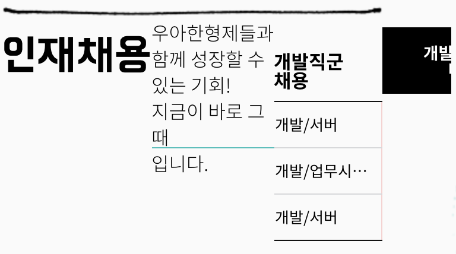

와! 정렬이 수평으로 변했어요! 이와 같이, 간단한 옵션의 조작으로 div 래핑을 통해 쉽게 레이아웃을 조정할 수 있습니다.

<br/>

> display: flex는 레이아웃에 혁혁한 기여를 해주는 옵션입니다. 조금 있다 다시 보도록 해요.

### P 태그와 Span 태그의 함정

P 태그와 Span 태그는 HTML에서 글자를 나타낼 때 가장 많이 사용하는 태그 중 하나입니다. 하지만 이 친구들을 자칫 모르고 사용하면 제대로 된 레이아웃이 구성이 안될 때가 많습니다.

먼저 아래의 예제를 살펴볼꼐요.

```html {numberLines}
<!DOCTYPE html>
<html>
  <head>
    <title>p와 span의 차이</title>
    <link href="index.css" type="text/css" rel="stylesheet" />
  </head>
  <body>
    <div>
      <p>P 1 이에요.</p>
      <p>P 2 이에요.</p>
    </div>
    <div>
      <span>Span 1 이에요.</span>
      <span>Span 2 이에요.</span>
    </div>
  </body>
</html>
```

<br/>

위 소스를 실행시키고 윈도우라면 F12, 맥이라면 커맨드 + 옵션 + I를 눌러보세요. 아래와 같은 화면이 나올꺼에요.

<br/>


차이점 하나가 바로 보이네요. 위의 사진에서 알 수 있는 사실은 **P 태그는 한 줄을 전부 사용하고, Span은 태그가 라인 전체를 사용하지 않습니다.** 중요한 것은 **P는 문단에 사용하는 태그**이며 그래서 `Paragraph`를 뜻합니다. **Span은 한 단어 등 짧은 문구에 사용되는 태그** 입니다. 한 가지 차이점을 더 알기 위해, 개발자 도구의 Inspect로 P 태그 부분에 커서를 올려보세요.

<br/>

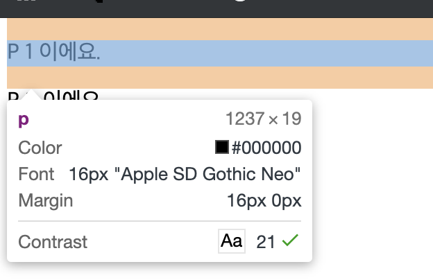

<br/>

P 태그의 위 아래에 보면 주황색 구역이 있습니다. 이 부분은 margin을 나타냅니다. P 태그는 기본적으로 margin을 갖고 있는 태그입니다. 문단에 쓰이는 태그이다 보니, 기본적으로 CSS가 없을때를 상정하여 기본적인 Margin이 들어가 있는 것이죠. 그런데 여기서 굉장히 주요한 특징이 하나 더 있습니다. 그 위의 감싼 div에 커서를 올려보세요.

<br/>

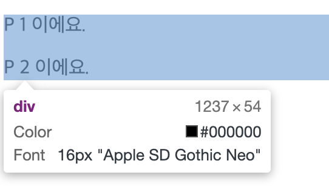

<br/>

에에? 커서를 올렸는데 두 p 태그가 겹쳐지는 사이 부분이 두 마진이 겹쳐서 표기가 되고 있어요. 원래는 높이가 2배가 되야 하는데 한개어치의 간격 차이밖에 안나네요. 우리가 의도를 안했다면 이런 레이아웃은 문제가 되겠죠? 그래서 일반적으로 P 태그에는 Margin 옵션을 0으로 설정하는 경우가 많습니다.

## CSS의 이해

HTML의 Element가 직사각형으로 이루어진 요소들의 집합이라는 사실을 알게 되었어요. 이제, CSS에서 알면 편한 정보를 알아보도록 해요.

### flex

위에서 잠시 마주했던 `display: flex`는 display를 flex(유연한, 유연하게)로 바꿔주는 친구에요. 먼저 기본 display 옵션을 보고 가도록 해요.


<br/>

위 이미지의 CSS를 한번 봐보세요. `div`의 기본 `display` 값이 어떻게 되어있나요?

<br/>

```css {numberLines}
div {
  display: block;
}
```

기본값이 `block`으로 되어있는 걸 볼 수 있어요. `block`을 보면 어떤 생각이 나시나요? 단단한 블록이 생각날꺼에요. 맞습니다. `display: block`은 영역 자체를 단단한 블록처럼 만들어서 크기가 외부에 의해 변경되지 않도록 하는 속성이에요. 그래서 block으로 지정된 여러 element가 있으면 해당 element는 넓이에 따라서 밑으로 개행되거나 합니다.

그렇다면 `display: flex`는 무엇일까요? `flex`옵션을 주게되면 유연하게 내부를 조작할 수 있게 됩니다. 기존 `block` 속성은 내부를 `float`과 같은 옵션으로 정렬을 해주었지만 `float`은 워낙 브라우저마다 버그도 많고 중첩되면 랜덤으로 버그가 걸리는 문제가 있습니다. 그렇기 때문에 정렬을 위한 `flex`를 고안하게 된 것이에요. 즉, `display: flex`를 적용하면 해당 영역은 독자적인 `flex`영역으로 잡혀, 기존 방식과 다르게 조작할 수 있게 됩니다. 그렇다면 `flex`로 다룰 수 있는 몇 가지 옵션에 대해서 알아볼께요.

#### flex-direction

`flex-direction`은 flex element의 그려지는 진행 방향을 설정하는 Property에요.

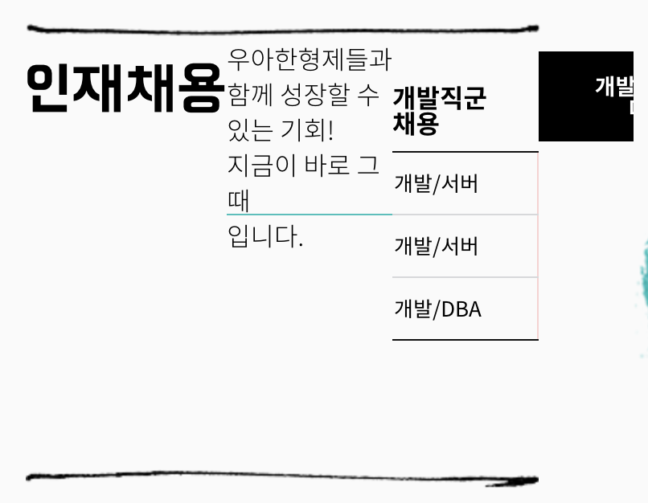

<br/>

위 사진은 `display: flex` 옵션을 적용하고 `flex-direction: row` 옵션을 주었습니다. 어떤가요? 그려지는 순서가 가로로 진행되죠?

<br/>

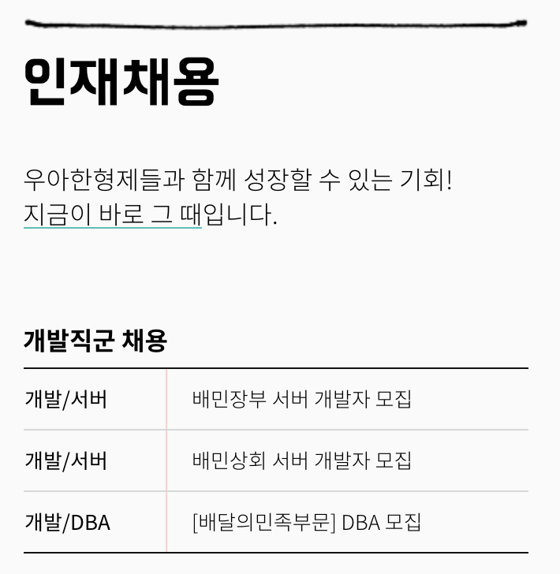

위 사진은 `display: flex` 옵션을 적용하고 `flex-direction: column` 옵션을 주었습니다. 이는 row와 다르게 세로로 진행 되는 걸 볼 수 있습니다.

#### justify-content

`justify-content`는 가로축 정렬을 하는데 쓰이는 Property에요.

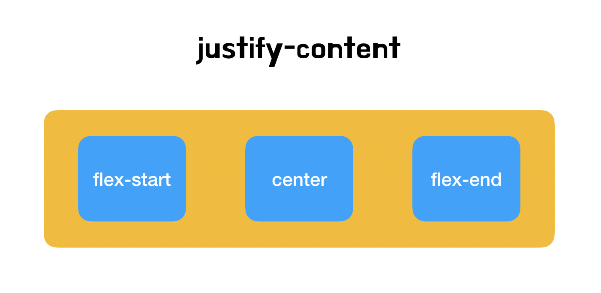

- `justify-content: flex-start` : 시작 부분부터 정렬을 합니다.
- `justify-content: center` : 가운데 부분부터 정렬을 합니다.
- `justify-content: flex-end` : 마지막 부분부터 정렬을 합니다.

기본적인 방향을 바꾸는 세가지 옵션입니다. 해당 옵션 말고 간격 자체를 변경하는 속성도 있습니다.

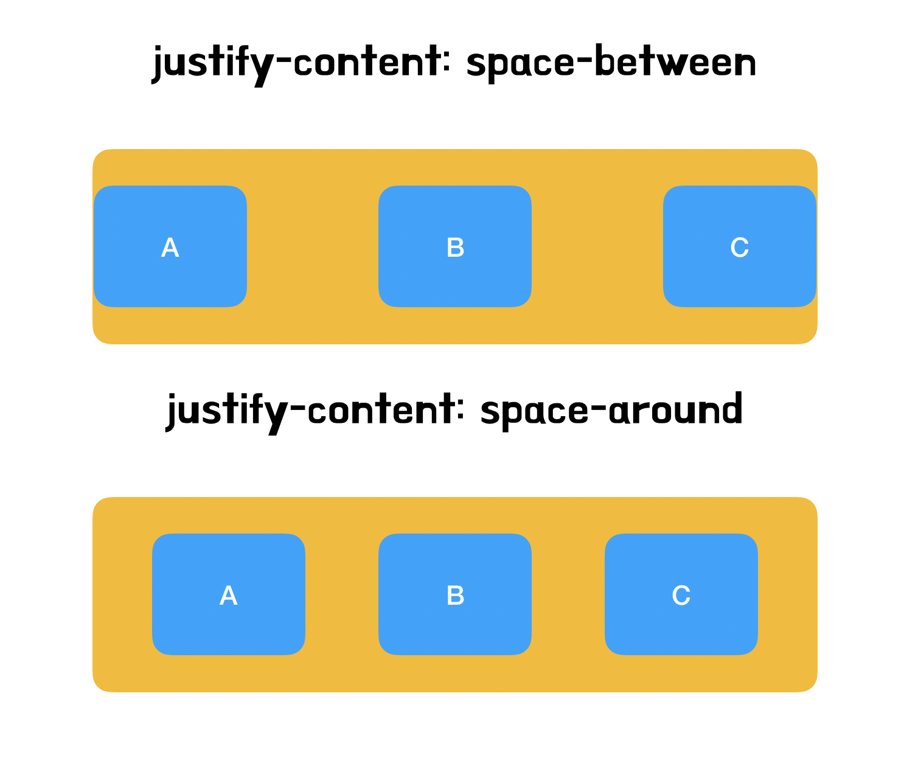

- `justify-content: space-between`: 사이 간격을 유지하지 않고 끝 점으로 나눕니다.
- `justify-content: space-around`: 사이 간격을 유지하면서 요소를 나눕니다.

#### align-items

`align-items`는 세로축 정렬을 하는데 쓰이는 Property에요.

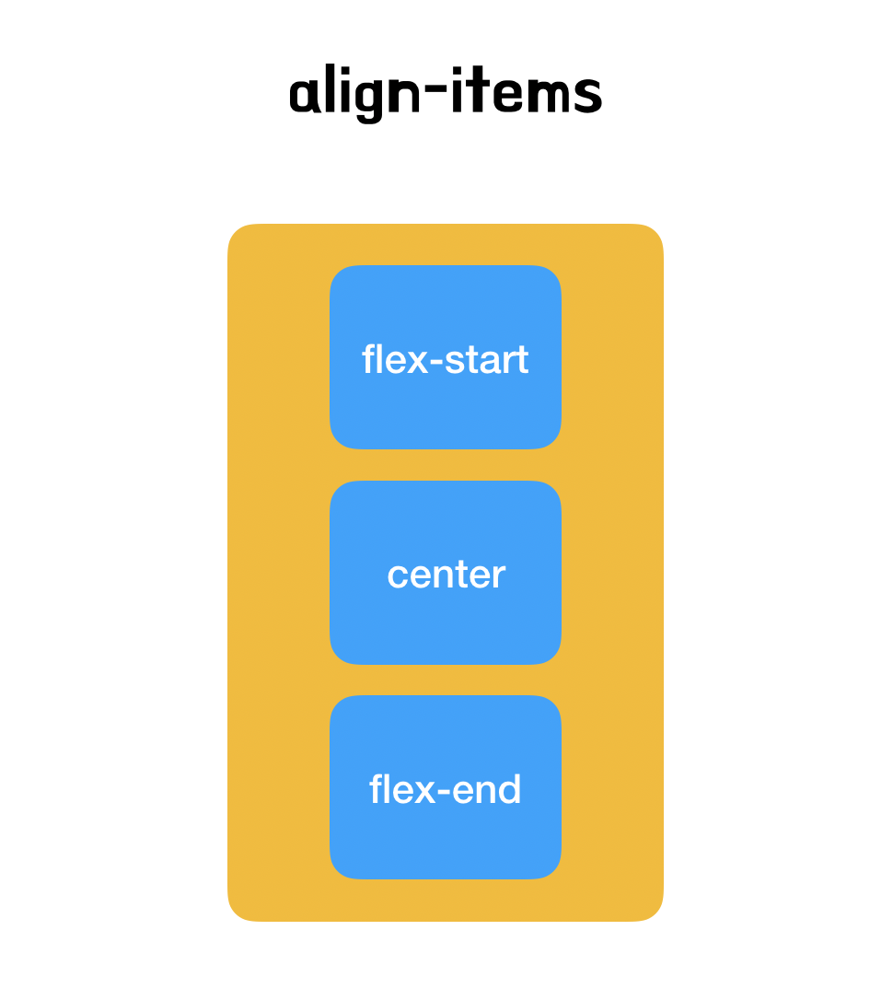

- `align-items: flex-start` : 시작 부분부터 정렬을 합니다.
- `align-items: center` : 가운데 부분부터 정렬을 합니다.
- `align-items: flex-end` : 마지막 부분부터 정렬을 합니다.

<br/>

> ## 여기서 중요한 포인트!
>
> flex-direction: row에서 column으로 변경할 경우, 정렬 방법이 바뀝니다. row에서 justify-content의 역할은 align-items로 변경되고, align-items의 역할은 justify-content로 변경되는데 직접 해보고 보시면 좋습니다!

### Margin과 Padding, 그리고 Border

쉽게 정리하면, Margin은 Element와 Element 사이의 간격을 말하고 Padding은 Element 내부의 간격을 뜻합니다. Border는 Margin과 Padding 사이의 영역을 일컫는데, 대부분 아웃라인으로 사용하는 경우가 많습니다. 한번 아래의 예제를 실행해보도록 합시다.

```html {numberLines}
<!DOCTYPE html>
<html>
  <head>
    <link rel="stylesheet" type="text/css" href="./index.css" />
  </head>
  <body>
    <div class="section-1"></div>
    <div class="section-2"></div>
  </body>
</html>
```

```css {numberLines}
.section-1 {
  margin-bottom: 20px;
  background-color: #000;
}

.section-2 {
  padding: 20px;
  background-color: #333;
}
```

예제를 실행시키면 section-1과 section-2로 지정된 친구들이 간격이 떨어져있고, section-2는 section-1보다 크기가 큰 걸 볼 수 있어요. 왜 크기가 클까요? 그 이유는 section-2에 padding이 있기 때문이에요. padding은 앞서 설명한대로 Element 내부의 간격을 말해요. 그래서 Element 내부의 사이즈로 칭해집니다. 만약 늘어나는게 원치 않다. 나는 사이즈를 고정하고 padding 영역만큼 contents 사이즈를 줄이겠다 라고 한다면 아래와 같이 CSS를 수정해주세요.

```css {numberLines}
.section-1 {
  margin-bottom: 20px;
  background-color: #000;
}

.section-2 {
  padding: 20px;
  background-color: #333;
  box-sizing: border-box;
}
```

실행해보시면 알겠지만 사이즈가 일정해진 걸 볼 수 있어요. 무엇이 추가되었는지 한번 볼까요?

`box-sizing`가 추가 되었네요. `box-sizing`은 현재 box의 크기를 어디 기준으로 잡을지 지정하는 옵션입니다. 위에서 말했지만 모든 html의 element는 직사각형 박스로 되어있어요. 그렇기 때문에 box의 사이즈 기준을 정하는 건 중요한 설정입니다. `box-sizing`은 두 가지 옵션을 많이 사용합니다.

- border-box: box의 크기를 border까지로 설정합니다.
- content-box: box의 크기를 content까지로 설정합니다.

먼저 이 옵션을 보기전에 아래의 그림을 볼 필요가 있습니다.

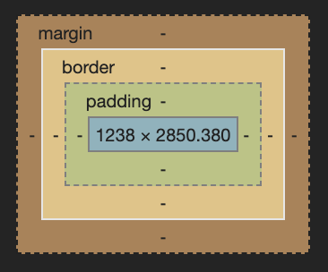

색깔 단위로 인지를 해봅시다. 짙은 주황색 영역은 margin, 옅은 주황색 영역은 border, 초록색 영역은 padding, 파란색 영역은 content 라고 칭합니다. 이렇게 이야기를 하고 나니, 위의 이야기가 조금 이해되기 시작하셨죠? 맞습니다. border-box는 border영역, 즉 padding까지 사이즈로 잡는거에요.

해당 element의 크기가 120x120이라면, border-box 옵션을 줄 때 120x120을 고정하면서 내부 영역의 사이즈를 줄여서 해결합니다. content-box는 content 영역, 파란 영역을 그대로 두고, 120x120에서 padding을 20px 주면, 160x160 크기가 되는 것 입니다. (왜 140이 아니고 160이냐면 왼쪽, 오른쪽 전부 20이 붙으니 두 배의 값이 붙습니다.)

우리가 의도한 레이아웃이 아닐때는 대다수 border-box를 주면 해결되는 경우가 많습니다. 이 점을 이용해서 한번 해결해보세요!

## 마치며

이 문서를 보시면서 백앤드 개발자 분들이 편-안한 HTML/CSS 코딩을 하길 바랍니다. 읽어주셔서 감사합니다.


