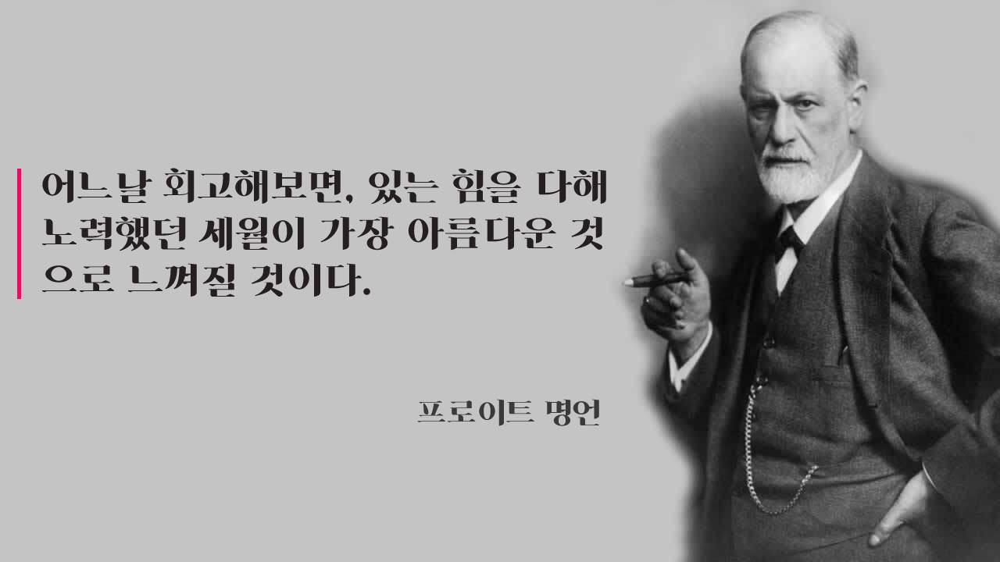

<center>지금까지 블로그를 회고해보자</center>

웹 프론트 개발자로 전향하기 전, 게임 개발자 일 때 [티스토리 블로그](https://vallista.tistory.com)을 사용했다. 티스토리를 사용한 이유는 비교적 단순한데, 당시 티스토리는 초대장을 받아야 들어갈 수 있는 약간 프리미엄(?) 같은 고귀한 느낌이 들었고 또 기본 테마가 네이버나 다음에 비해 이뻣던 것이 한 몫 했다. 커스터마이징이 가능해서 나만의 블로그를 만들 수도 있었고 당시 핫한 개발자가 티스토리를 쓰고 있기도 했다.

그래서 티스토리를 사용하노라면 댓글 혹은 방명록에 초대장을 달라는 글이 아우성이었고, 그 아우성에서 나름(?) 가진자의 느낌을 느끼기도 했다. 티스토리 블로그는 운영을 2013년부터 2017년까지 약 5년정도를 운영했다. 티스토리 블로그에서 가장 오래된 글이 2014년으로 되어있으나, 당시 여러 글을 많이 작성했었지만 숱하게 삭제해서 남아있는 기록이 많이 없다.

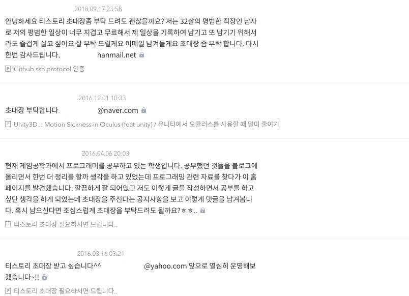

<center>당시 초대장으로 댓글은 가득했다</center>

아까 잠시 언급했듯, 티스토리 블로그의 가장 큰 장점은 마크업을 자기 마음대로 수정할 수 있다는 장점이 있었다. 그래서 무수한 테마 고민과 함께 그 흔적이 여실히 남아있는데, 당시는 마크업을 내가 잘 하지 못했기 때문에 그렇게 테마의 퀄리티가 높지 않다. 과거와 지금을 비교하면 정말 큰 일취월장을 했다 싶다.

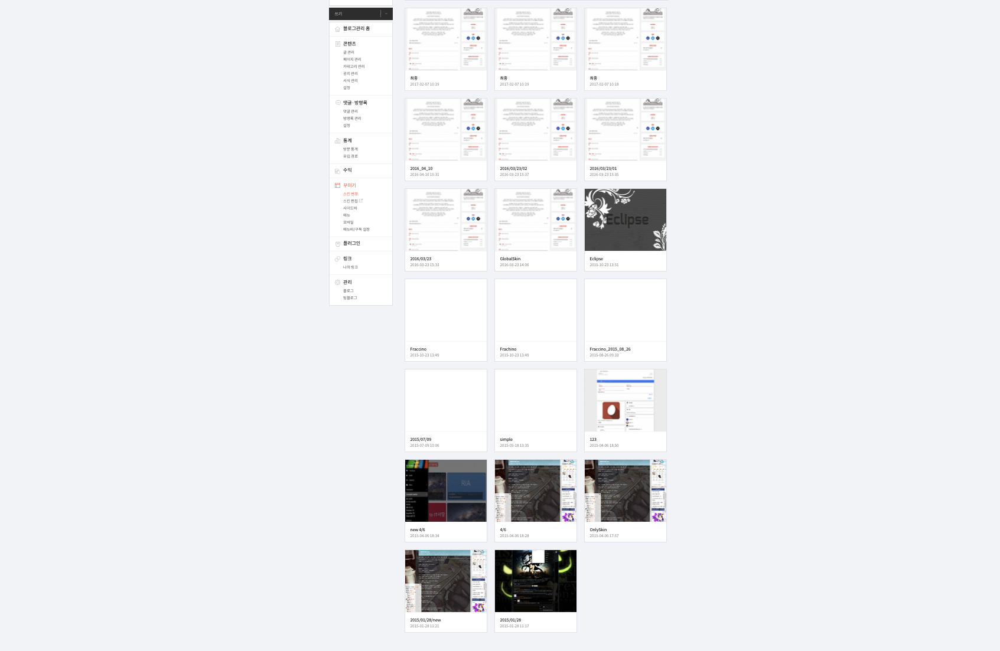

<center>무수한 스킨의 무덤</center>

티스토리 블로그의 가장 큰 목적은 게임 개발하면서 여러 트러블 슈팅을 경험하고, 해당 트러블 슈팅을 다시 겪지 않도록 아카이빙 하는게 주된 목적이었다. 초기 글은 잘 쓰기위한 노력도 없이 담백하게 몇 줄 적고 끝났다. 지금봐도 성의가 너무 없는 글인데, 당시엔 저런 블로깅 자료가 있는 것조차 감사하던 시절이었다.

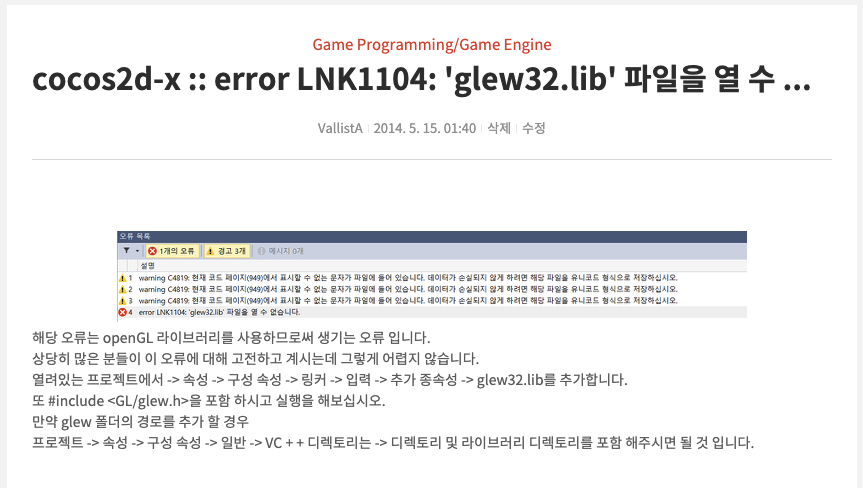

<center>초기에 적은 글 중 하나</center>

당시 주로 개발하던 섹션이 게임 엔진(유니티, cocos2d-x) 기반의 게임 개발이다보니, 게임 개발에 관련된 자료는 많이 찾을수가 없었다. 특히 엔진 시장이 폭팔적으로 크고 있는 상황이라 개발자는 엔진 혹은 라이브러리에 오류가 나오면 해당 에러를 해결하기위해 많은 시간을 활용해야했다. 당시 회사의 수익 모델이 게임에서 모바일 광고를 붙여, 광고로 수익을 얻고 있었다. 그 프로젝트의 중심엔 내가 있었고, 그래서 다양한 프로젝트에서 사용하기위해 모듈을 만들어야 하는일이 빈번했다.

그래서 이왕 개발하면서 블로그 글도 정리하고, 해당 블로그 글로 다른 개발자에게 전달하면 일석이조라는 생각을 했다. 이 생각을 가진 이후부터 글을 못쓰더라도 최대한 상세히 적는 것이 버릇이 되었고 딱히 공유하지 않았는데 많은 분들이 블로그를 찾아오셔서 문제를 해결했다고 감사의 이야기를 주셨다. 그 중 기억에 남는 일화는 **Unity3D** 엔진에서 iOS 버전 빌드를 진행할 때 당시 iOS의 shared memory 정책의 변경으로 여러 라이브러리에서 동작을 제대로 수행하지 않는 문제가 있었다.

[당시 작성된 글](https://vallista.tistory.com/entry/Unity3D-iOS-%EB%B9%8C%EB%93%9C-%EC%8B%9C-ERROR-ITMS90535-Unexpected-CFBundleExecutable-Key-The-Bundle-at-GooglePlusbundle-does-not-contain-a-bundle-this-Issues?category=535633) 내용을 보면 알겠지만, 여러 라이브러리가 복잡하게 얽혀있는 경우 풀어내기 어려운 상황이고, 게임의 특성상 소프트웨어 엔지니어링을 제대로 모르지만, 엔진을 이용해 개발을 하는 사람이 많았으므로, 트러블 슈팅이 어려웠을꺼라 생각했다. 그래서 빠르게 블로그 글을 올렸고, 그 글로 인해서 댓글에 어떤분이 "살려주셔서: 감사합니다" 로 답변을 달았던 일화가 있었다.

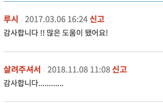

<center>살려주셔서 감사합니다...</center>

가장 큰 인기를 단기간에 얻었던 글이라 하면, [유니티 엔진에 구글 플레이 게임 서비스를 연동](https://vallista.tistory.com/entry/Unity3D-Google-Play-Game-Service-%EA%B5%AC%EA%B8%80-%ED%94%8C%EB%A0%88%EC%9D%B4-%EA%B2%8C%EC%9E%84-%EC%84%9C%EB%B9%84%EC%8A%A4-%EC%97%B0%EB%8F%99-1?category=535633)하는 글이 가장 인기 있었다. 이 글은 시리즈로 2개의 글이 연결되었는데 두 글을 본 다음 [두 번째 글](https://vallista.tistory.com/entry/Unity3D-Google-Play-Game-Service-%EA%B5%AC%EA%B8%80-%ED%94%8C%EB%A0%88%EC%9D%B4-%EA%B2%8C%EC%9E%84-%EC%84%9C%EB%B9%84%EC%8A%A4-%EC%97%B0%EB%8F%99-2-%EB%A1%9C%EA%B7%B8%EC%9D%B8-%EB%B0%8F-%EB%A7%A4%EB%8B%88%EC%A0%80-%ED%81%B4%EB%9E%98%EC%8A%A4-%EB%A7%8C%EB%93%A4%EA%B8%B0?category=535633)에 많이 적는 것 같더라. 그래서 해당 글에서 질문 답변을 많이 진행했고, 생각외로 뜨거운 관심을 많이 받았다.

여전히 구글 문서와 구글은 불친절하지만, 이 글에서 굉장히 하이라이트를 찍는데, 바로 [이 글](https://vallista.tistory.com/entry/Tip-Authorise-your-app-now-enabled-popup-%EC%A7%80%EA%B8%88-%EC%95%B1-%EC%8A%B9%EC%9D%B8-%ED%8C%9D%EC%97%85%EC%9D%B4-%EC%95%88%EB%B3%B4%EC%9E%84%20)을 보면 알 수 있다. 도중 구글 플레이 게임 서비스를 연동하기위해 앱 승인을 받는 절차에서 갑자기 흰 화면이 나와버린다. 이 흰 화면에서 무엇을 해야할지 몰라 거의 며칠을 계속 삽질을 했는데, 결론적으로 어딘가 구석에 Note: 로 적어놨더란다. 지금 생각해보면 이들도 급변하는 엔진을 라이브러리를 제공해주면서 문서화와 SDK를 제공해준다는게 감사할 뿐이었다. 만약 제공 안해줬다면 직접 만들었어야 했는데, JNI 안했다는 생각에 너무 감사한다.

블로그를 운영하면서 여러 재미있는 일화들이 있지만, 가장 기억에 남는 경험은 리듬게임에 관련되어 모든 정보를 담고있는 블로그를 만드려다 실패한 경험이 있다. 일단, 나는 리듬게임을 좋아한다. [고등학교 당시 Crazy Color 라는 게임을 만들어 많은 공모전에서 상을 받았고](http://www.21kwc.com/2021/sub06/2013.html) 여전히 리듬게임을 자주 즐기고 있다. 그래서 사이드 프로젝트로 언젠가 리듬게임을 만들어보고 싶었고, 최신 게임 엔진 기반으로 오픈소스를 만들고 싶었다. 그 타겟으로 cocos2d-x와 unity3d로 리듬게임을 [BMS(Be-Music Script)](https://ko.wikipedia.org/wiki/Be-Music_Script) 기반으로 만들었다. 만들고나서, 리듬게임 개발 프로세스와 실제 영상등과 함께 게시를 했고 몇년동안 해당 게시글의 댓글로 풀 소스를 공유해달라고 하는 분이 많았다. 그래서 이 계기로 처음으로 github을 사용하게 되었다.

- [GitHub BMS Reader](https://github.com/Vallista/Cocos2dx_BMSReader)
- [BMS 기반 리듬게임 개발 포스팅](https://vallista.tistory.com/entry/BMS-%EA%B8%B0%EB%B0%98-%EB%A6%AC%EB%93%AC%EA%B2%8C%EC%9E%84-%EA%B0%9C%EB%B0%9C?category=539550)

2017년 7월, 병특이 끝나고 "게임 프로그래머로 쭉 가면 안되겠다"라는 생각으로 서비스로 전환을 하게된다. 2017년은 이직 준비를 위해 블로그 글을 별로 쓰지 못했으며, 바로 서비스 회사로 운좋게 이직을 바로 하게된다. 하지만 이직한 회사가 바로 망해버리는 바람에 제대로 블로그를 쓸 수 있는 시간이 주어지지 않았고 그 다음 회사인 와인포인트에 와서야 블로그 쓸 시간을 마련하여 적극적으로 글을 작성하게 된다.

그러면서 티스토리 블로그를 지나, 웹 프론트 개발자로 이직을 하는 만큼 블로그를 "내가 만들어야겠다, 그래야 웹 프론트 개발자로써 스웩을 보여줄 수 있다"는 이상한(?) 신념하에 제작에 이르게 된다. 그렇게 개발된 블로그가 2017년도경 만들어진 블로그 버전 v1이다.

## 블로그 v1

- 기간: ~ 2021/06 (약 3년)

나의 실제로 바닥부터 만든 첫번째 블로그이다. 버전 1은 디자인에 대해 공부한 것도 없고, 모티브도 크게 잡지 않아 심플하게 만들었다. 크게 디자인에 뜻을 두진 않았고, 경력과 블로그 글 정도만 가지면 되겠지 라는 생각으로 대충 카드랑 그림자, 보더 정도만 줘서 각 이미지를 큼지막하게 보여주는 형태로 제작했다. [web.archive.org](https://web.archive.org/web/20190912141100/https://vallista.kr/)로 가면 사용해볼 수 있다.

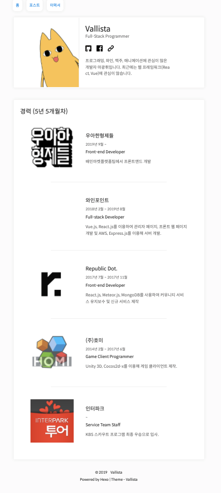

<center>2019년 9월 12일 v1 블로그 화면</center>

기술적 스택은 다음과 같다.

1. Hexo
2. javascript
3. github pages

초기에는 이러한 빌드 시스템을 직접 구축해서 vallista.github.io에 올리는 형태를 고려했으나, 실제로 구현하면 추후 유지보수가 안될 것 같아 프론트 기술만 집중하자 라는 생각에 개발했다. 초기에 javascript를 조금 더 깊게 공부하자 수준으로 hexo를 선택했지만 hexo가 최적화도 안되고 구린 부분이 많아 빠르게 변경하는 목표를 잡고 추후 블로그는 gatsby를 이용해서 개발하자 라는 생각을 갖게 되었다.

### v1 포스팅

블로그 v1 때 포스트로는 javascript, browser등 웹 개발자에 기본적인 것을 정리했다. 사실 이 글들은 노션에 끄적이던 글을 복붙해서 퀄리티가 좋지 않은 글인데, 2년이나 지난 뒤인 2019년부터야 정신을 붙잡고 제대로 된 퀄리티의 글을 작성하기 시작했다. 이 때 가장 인기 있었던 글은 [이직을 준비하면서](https://vallista.kr/%EC%9D%B4%EC%A7%81%EC%9D%84-%EC%A4%80%EB%B9%84%ED%95%98%EB%A9%B4%EC%84%9C/) 였다. 여러 회사의 이직 경험을 풀어놨고, 특히 연관 검색어 중 **토스 코딩테스트**가 제일 많았다.

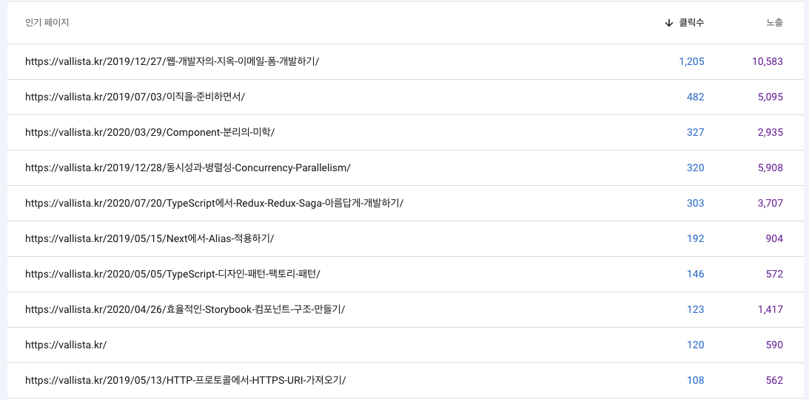

<center>제일 인기있던 글 목록</center>

연관검색어는 **토스 코딩테스트**가 제일 인기 많았으나, 가장 인기 있는 글은 **웹 개발자의 지옥 이메일 폼 개발하기** 였다. 이 글의 경우 첫 작성 때 굉장히 높은 텐션으로 글을 작성해서 글을 읽는 내내 정신이 없어, 도중에 전체 글 맥락을 수정해버렸다. 그 효과인지 노출과 클릭수가 많아졌고, 결과적으론 좋은 효과를 얻었다.

**웹 개발자의 지옥 이메일 폼 개발하기** 글은 퀄리티를 높이기 위해 다양한 책을 열람하면서 작성한 글이다. 그러면서 이 시기에 급속도로 글 작성하는 능력이 좋아졌다. 특히 크게 성장한 글은 [컴포넌트 분리의 미학](https://vallista.kr/Component-%EB%B6%84%EB%A6%AC%EC%9D%98-%EB%AF%B8%ED%95%99/)이고, 글을 쓰면서 큰 성장을 했던 것 같다.

**컴포넌트 분리의 미학**은 의외로 뜨거운 관심을 받았다. 여러 군데 공유가 되어 다양한 곳에서 공감을 해주셨다. 컴포넌트의 정의와 현 시대 웹에서 이야기하는 컴포넌트란 무엇인지, 어떤 요소가 존재해야 하는지 등을 이야기했다. 그렇게 이야기하고 지금와선 여러 회사, 개발자들이 컴포넌트 설계나 코딩에 대해 많은 고민을 하고 있어 이러한 생각을 하는데 내 글이 조금이나마 영향을 주지 않았을까? 하며 자화자찬을 해본다.

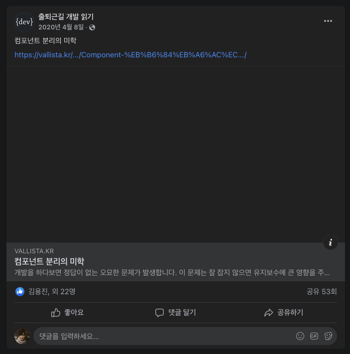

<center>컴포넌트 분리의 미학의 관심</center>

정리하자면, 블로그 V1에서 가장 큰 목적을 가졌던 것은 자체 블로그의 구축이었고, 자체 블로그를 구축하면서 글을 나름대로 잘써보기 위해 퀄리티가 높지 않은 글을 지나 어느정도 잘 작성된 글을 다수 작성했다. 그러면서 든 생각은 글은 많이 써봐야 실력이 늘어난다는걸 깨달았다.

그렇게 여러 글을 작성하고, 공부하면서 다양한 블로그를 거치게 되었는데, 그 중 하나의 블로그를 보고 레이아웃을 변경해야겠단 생각이 들었다. 생각이 들지마자 바로 블로그 디자인을 변경했고, 이윽고 V2가 탄생했다.

## 블로그 V2

인상깊었던 블로그는 좌측에 사이드바 형태의 네비게이션 바가 존재하고, 네비게이션 바에서 카테고리를 누르면 2 Depth로 사이드바가 하나 더 출력되어 해당 카테고리에 맞는 글 목록이 출력되는 것이었다. 그래서 해당 레이아웃으로 구성해봐야겠다 생각한 후 빠르게 개발하게 되었다. 개발하면서 독자적인 색깔과 레이아웃을 추가했다.

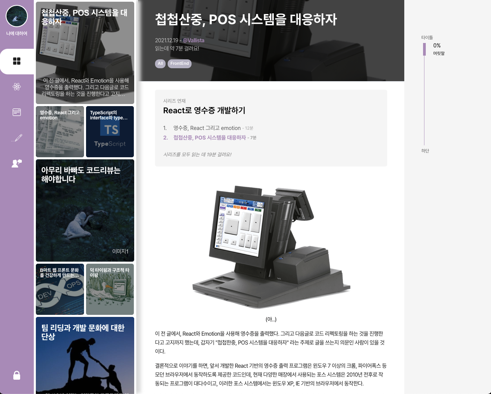

<center>블로그 V2 디자인</center>

- 기간: ~ 2021/1/6 (약 6개월)
- React
- Gatsby
- TypeScript
- Emotion.js

나름 최신 스펙으로 블로그 스펙을 선정했고, 스펙 선정하고 개발하면서 느꼈던 점은 다음과 같다.

- Gatsby는 쉬우면서도 어렵다. 익숙치않은 GraphQL과 여러 써드파티 모듈, 컴포넌트 쉐도잉까지, 편의성은 다수 제공하는데 명확하게 어떻게 해야한다는 가이드는 충분하지 않았다.
- 빠른 기간내로 뽑아내는 블로그 프로젝트다보니 TypeScript를 쓰는둥 마는둥 개발했다. 그래서 별로 잘 썻다는 포인트도 없었고 오히려 js쓰는게 나았겠다는 생각을 했다. 또한 gatsby도 root의 browser api 라던지 node api라던지, 부분적으로 js를 써야하는 상황이 존재해서 애매했다.
- gatsby는 server-side rendering을 지원하기 때문에 여러 트러블 슈팅 상황이 생긴다. window location을 쓰기위해 @reach/router를 사용해 useLocation을 쓴다던지, window와 document를 사용하기위해 `typeof window === 'undefined'`와 같은 로직을 하드코딩 해줘야 한다던지 등.
- server-side rendering 지원 관점에서 emotion.js는 탁월한 선택이었다. gatsby가 먼저 뽑아주는 ssr 파일은 emotion.js로 잘 포팅이 되었다.

v2는 상대적으로 적은 시간에 나의 머릿속에 있는 디자인을 만드려 애썻다. 하지만, 결과적으로 나온 디자인은 처음에는 나름 이뻣으나, 세세한 포인트에서 사용성이나 구현에 시간을 들일 수 없어 제대로 구현하지 못한 것들이 있었다. 예를 들자면, 윈도우 스크롤바 대응이라던지, 오른쪽 스크롤 네비게이션 draggable 이라던지. 또한 사이드바를 닫는 기능상의 문제던지.. gatsby에 익숙하지 않아 query 구문 최적화와 여러 API를 사용해 lifecycle을 구성하는게 아쉬웠다. 여러 모듈을 사용하다보니 그 모듈만의 graphQL 쿼리가 추가되는데, 이를 제대로 이해를 못했고 잘못 사용했다.

새로운 블로그를 만들고나서 작성했던 글은 전반적으로 퀄리티가 높게 작성이 되었다. 전반적으로 글의 맥락이나 글이 작성되었을때의 레이아웃을 고민하여 작성하는 걸 기조로 하여 퇴고를 많이 진행하기도 했다. 다만, 그만큼 만족하는 글 수준이 계속 높아져 글을 작성하는 것에 큰 고민을 느끼기도 했다.

그렇게 고민하고 글을 작성할 무렵, 회사 프로젝트가 끝나고 일이 어느정도 안정화가 되었다. 그래서 블로그를 새로 만들 시간적 여유가 생겼다. 그렇게 새로운 블로그를 만들게 된다.

## 블로그 V3

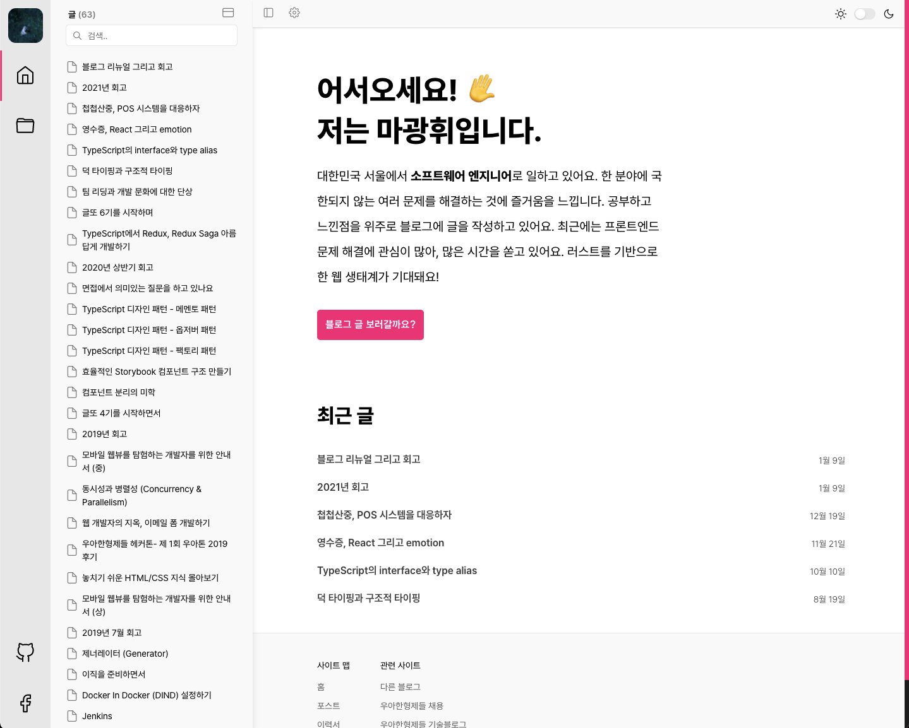

<center>지금의 블로그</center>

지금 블로그는 V3이며, V2의 디자인을 기준으로 일관성있는 디자인과 코드 개편 등 다양한 피쳐를 추가한 하나의 프로젝트였다. 크게 신경쓴 사항은 다음과 같다

- Windows, Mac OS 두 환경에서의 크로스 브라우징 대응 (Chrome, Safari...)
- 모바일 대응 (Android, iOS)
- 모노레포를 이용한 사이드 프로젝트에서 사용할 디자인 컴포넌트의 구축
- 다크 모드 지원
- GraphQL query 성능 향상
- 컴포넌트 모듈화

먼저, 이 요구사항을 만들기 위해 사전 디자인 컴포넌트 라이브러리를 구현했다. 디자인 컴포넌트 라이브러리는 react와 emotion 기반으로 컴포넌트를 구현했고, 그 안에서 별도로 storybook을 사용하진 않았다. playground를 위한 별도의 playground 프로젝트를 모노레포로 새로 만들었다.

- lerna + yarn workspace 기반으로 모노레포를 구성했다. nx, rush 등 다양한 모노레포 프레임워크가 있지만 프로덕션 내에서 세부적으로 나누기보단 큼지막하게 프로젝트 단위로 나누는 것이 목적이었기에 lerna + yarn workspace면 충분하다고 보았다
- 해당 모노레포 프로젝트는 [Vallista Land](https://github.com/Vallista/vallista-land)에서 볼 수 있다. vallista land로 정한 이유는, 앞으로 해당 프로젝트에 사이드프로젝트 관련 코드와 나만의 라이브러리를 응집할 예정이기 때문이다. 이렇게 모아두면 나중에 어딘가에서 사용될 수 있고 특히 이직하거나 할 때 코드리뷰 자료로 활용할 수 있을 것이다.

### 디자인 컴포넌트 라이브러리

**디자인 컴포넌트 라이브러리**를 디자인 시스템으로 칭하지 않은 이유는, 디자인 시스템은 디자이너와 웹 프론트 개발자, 그리고 비즈니스 요구조건이 충족되어 어떠한 하나의 컨텍스트를 갖고 디자인 후 개발하는 플로우 전체를 시스템화 하는걸 뜻한다. 그렇기 때문에 나의 추상적 생각을 담은 단순한 디자인 컴포넌트의 집합은, 디자인 시스템이 되기에 부적절하며 그리고 해당 컴포넌트들의 디자인이나 철학은 [Vercel Design](https://vercel.com/design)에서 참고했다. 내부 로직 전체를 따라하지 않고 (애초에 열람할 수 있는 곳이 없더라) 사용되는 인터페이스와 레이아웃 정도를 참고해서 만들었다.

#### tsc

크게 TypeScript의 역할은 두 개로 나눌 수 있는데, Type Checker와 Transpiler이다. 그래서 Core라고 불리는 디자인 컴포넌트 라이브러리는 웹팩등의 번들러를 쓰지 않고 tsc를 사용하여 ES5 문법으로 코드를 뽑아냈다. 다만 tsc의 transpile 기능이 매우 구리기 때문에.. hot reload를 rebase 하거나 merge 등의 작업으로 tsbuildinfo 파일이 아에 변경되거나 감지를 못하도록 없어지면 제대로 인식을 하지 못한다. 그래서 중간중간 tsbuildinfo 파일을 지워줘야 하는 문제가 발생한다. 여러명이서 개발하는 경우 esbuild나 웹팩등 지원이 잘 되는 라이브러리를 사용해서 개발하는걸 추천한다. 또한 tsc는 트리셰이킹이 제대로 안되므로, 이 점도 생각하는게 좋다.

#### 다크모드 지원

이번 디자인 컴포넌트 라이브러리에선 다크모드 지원을 위한 테마 정책을 구성했다.

```tsx {numberLines}
const Themes: BaseThemeMapper = {
  light: {
    colors: Colors,
    layers: Layers,
    shadows: Shadows
  },
  dark: {
    colors: {
      ...Colors,
      PRIMARY: {
        ACCENT_1: Colors.PRIMARY.ACCENT_8,
        ACCENT_2: Colors.PRIMARY.ACCENT_7,
        ACCENT_3: Colors.PRIMARY.ACCENT_6,
        ACCENT_4: Colors.PRIMARY.ACCENT_5,
        ACCENT_5: Colors.PRIMARY.ACCENT_4,
        ACCENT_6: Colors.PRIMARY.ACCENT_3,
        ACCENT_7: Colors.PRIMARY.ACCENT_2,
        ACCENT_8: Colors.PRIMARY.ACCENT_1,
        BACKGROUND: Colors.PRIMARY.FOREGROUND,
        FOREGROUND: Colors.PRIMARY.BACKGROUND
      }
    },
    layers: Layers,
    shadows: Shadows
  }
}
```

테마의 경우 PRIMARY에 있는 색만 수정하면 되도록 테마 단위의 설정을 격리했고, 다크모드 시 PRIMARY 컬러를 역순으로 배치했다.

```tsx {numberLines}
export const ThemeProvider: FC<{ theme?: ThemeKeys }> = ({ theme = 'LIGHT', children }) => {
  const [themeState, setThemeState] = useState(theme)

  return (
    <Context state={{ changeTheme }}>
      <Reset />
      <BaseThemeProvider theme={Themes[themeState]}>
        <ToastProvider>{children}</ToastProvider>
      </BaseThemeProvider>
    </Context>
  )

  function changeTheme(state: 'LIGHT' | 'DARK'): void {
    setThemeState(state)
  }
}
```

그리고 `ThemeProvider`를 감싸면 컬러팩등을 사용할 수 있도록 제공했고 (emotion.js의 ThemeProvider를 래핑해서 구현) 기본 theme은 light 설정으로 지정했다. 그리고, RootContext를 만들어서 해당 Context를 custom hook으로 찔러 테마를 변경할 수 있게 제공했다.


<center>다크모드 지원</center>

### 반응형 지원


<center>반응형 지원</center>

반응형은 3가지를 지원했다. 모바일, 태블릿, PC (너무 당연한 이야기지만) 조금 더 상세히 이야기하면 **PC, 모버일, PC와 모바일 사이의 이상한 것** 으로 코딩을 했다. 사실 태블릿의 점유율은 매우 낮기 때문이다.

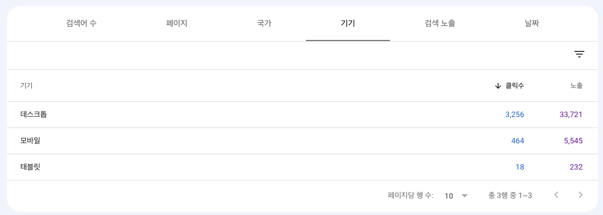

<center>빈약한 태블릿 점유율</center>

약 40000개의 노출수 대비 232이면 1%도 되지 않는다! 하지만, 1%를 위해 대응해야하는게 인지상정, 그래서 PC와 모바일을 주요로 코딩하고, PC와 모바일 사이에 이상한 것으로 코딩을 했다.

```css {numberLines}
/* 넓은 PC */
@media screen and (min-width: 1350px) {
}
/* 태블릿 겸 PC */
@media screen and (min-width: 1025px) {
}
/* 모바일 */
@media screen and (max-width: 1024px) {
}
```

사이드바 관련된 부분은 1024px 미만으로 내려가면 숨기고, navbar를 위로 올리는 형태로 구현했다. 이렇게 한 이유는 컨텐츠의 크기가 최소 600px 이상은 유지되기 바랏기 때문이다. 좌측 영역은 400px정도 되므로, 1024px이면 624px까진 지원한다는 이야기다.

### 트러블 슈팅

여러 트러블 슈팅을 한 경험을 빼놓고 말할 순 없는데, 트러블 슈팅을 경험한 사례는 다음과 같다

- Windows, Mac의 viewport 렌더링 방식이 다르기에 스크롤바 정책이 다르다. 윈도우는 스크롤바 영역을 width로 인정하기 때문에 삭제하면 그만큼 공백이 생겨, 내부 width가 커지게 된다. 그래서 windows와 스크롤바를 잘 적용하기 위해선 현재 스크롤바가 없는 상황일때와 있는 상황일 때를 체크해 width를 줄여주거나 늘려주어야 한다. 그렇지 않다면 Mac은 상관없지만 윈도우에서 width가 늘어나고 줄어드는 사용자 입장에서 썩 달갑지 않은 경험을 줄 것이다.
- create react app으로 된 playground와 gatsby 기반의 프로젝트가 충돌나는 현상이 있었다. 이는 lerna + yarn workspace의 환경에서의 문제인데, yarn workspace의 경우 root에서 node_modules에 공통 노드 라이브러리를 들고있고, 세부적으로 각각의 패키지에 scope된 모듈을 디펜던시로 들고있는 것이다. 그러다보니 cra는 react-scripts 기준으로 webpack이나 여러 라이브러리의 버전을 들고 있고, gatsby는 gatsby 기준으로 webpack등의 여러 라이브러리 버전을 들고있는 것이다. 그래서 충돌이나서 제대로 실행이 안되는 경우가 있었다. 그 후 playground를 gatsby로 변경하니 성공적으로 실행이 되었다. 관련해서 여러 stack overflow 글이 있었는데, 정확히 모두가 인지하지 못해 답변이 제대로 없었다. 그래서 수많은 삽질 끝내 알아냈다.
- rebase 나 package가 변경되었을때 lerna는 제대로 반응하지 못한다. 이는 핫 리로드의 부재보단 각각의 package에 들어있는 모듈에 대한 dependency까진 업데이트가 안되기 때문인데, 이를 위해 반복적으로 `lerna clean`과 `yarn`을 계속 해주어야 했다. 이 점은 어떻게 고칠 수 있을까 했는데 어쩔수 없는것으로..
- gatsby는 dev 환경과 publish된 결과물이 조금 다르다. 이 조금의 차이는 `gatsby browser API`에서 생기는데, dev의 경우 browser API의 `wrapRootElement`, `wrapPageElement`를 바로 해당 레이아웃대로 출력하지만 prod는 `wrapRootElement`를 먼저 렌더링 한 후, 페이지를 그린다. 그 다음 페이지가 그려지고 나서 `wrapPageElement`가 동작하여 페이지를 래핑한다. 이는 SSR의 차이에서 생겨난 문제인데, SSR의 경우 `wrapPageElement`를 제외한 채 사용자에게 바로 보일수 있는 페이지 (html) 에셋을 제작하고, 먼저 보여준 후 client 로드가 끝나면 `wrapPageElement`된 결과물을 보여준다. 그래서 만약, `wrapPageElement`에서 레이아웃을 렌더링 해주는 경우 사전에 `wrapRootElement`에서 무언가 SSR 로드시 Client를 부드럽게 로드할 수 있도록 어떠한 작업을 해주어야 사용자가 버그라고 생각할 수 있는 요소를 제거할 수 있다.
- 페이지를 제외한 고정된 영역에선 staticQuery를 이용해 한 번만 데이터를 패칭하고 지속적으로 유지하는게 좋다. gatsby의 graphQL을 처음 사용했을때 페이지를 로드할 때마다 전체 쿼리를 호출하여 빈번한 깜빡임이 있었다. 해당 깜빡임은 화면 전체를 리렌더 했기 때문에 그러한 문제가 발생했고, 그래서 `wrapPageElement`에서 틀을 그려주었다. `wrapRootElement`의 경우 node 환경에서 이루어지기 때문에 location등의 이벤트가 안먹혀서 에러가 발생하므로 유의해야한다.

### 얻은 경험

- Semantic web을 제공하기위해 aside, header, main, article, section등 HTML5의 semantic tag를 최대한 사용했다. nav가 nav 요소인 버튼 등 하나하나 들어가는 줄 알았는데, 그게 아니더라. navigating을 하는 하나의 그룹을 묶는 태그였고, 이러한 정확한 쓰임처를 언제 사용해야할지 습득하게 되었다.
- [currentColor](https://developer.mozilla.org/ko/docs/Web/CSS/color_value#currentcolor_%ED%82%A4%EC%9B%8C%EB%93%9C) 라는 옵션이 있다. 이 옵션은 상속받은 color 속성으로 여러 css 속성에 값을 분배할 수 있다. 이 속성으로 하여금, 하위에 있는 svg의 fill 옵션을 쉽게 변경하는 등의 액션을 지정할 수 있고 가장 많이 사용한 사례는 border와 text color 등을 맞출때 많이 사용했다. 대다수의 디자인의 경우 border - inner text, 그리고 background가 다르게 색상으로 동작되는 경우가 많으므로, 이러한 경우에 쓰면 좋은 효과를 얻을 수 있다.
- 초기 블로그를 구축한다면 url을 어떻게 설정할지 정책을 생각해두어야 한다. vallista.kr 블로그의 경우 초기 url 디자인이 이러했다. `https://vallista.kr/yyyy/mm/ss/post-name` 그런데, 이번 블로그를 리뉴얼하면서 정책을 다시 변경했다. `https://vallista.kr/post-name` 으로 말이다. 이렇게 되니 이전 URL이 웹에 퍼져있는 상황에서 그 링크에서 넘어오는 유저를 위한 또다른 처리가 필요했다. 그래서, 초기에 url 정책을 명확하게 정해서 가야 추후 고생을 덜할 수 있다.

## 끝으로

블로그를 몇 번이나 갈아엎으면서 다양한 경험을 얻었고, 그러면서 글쓰는 능력도 향상된 것을 느꼈다. 이번엔 조금 더 블로그를 커다란 프로젝트로 하여금 이력서/블로그 등 나에대한 모든 도메인을 갖고있는 사이트로 만드는 중이다. 이번에 디자인 컴포넌트 라이브러리도 제작한 것처럼 앞으로 개발하면서 유용한 서버 로직이나 클라이언트 로직 (훅, 유틸 등)이 있다면 모아두고 사전의 개념으로 들고있으려한다.

다음 피쳐로 디자인 컴포넌트 라이브러리에 storybook을 붙이고 테스트 로직을 추가해보려 한다. 이미 회사에선 시각적 회귀 테스트도 들어가 있는 만큼 회사에서 개발한 만큼 동일하게 이번년도 안에 해보도록 하겠다.
