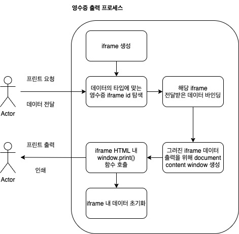
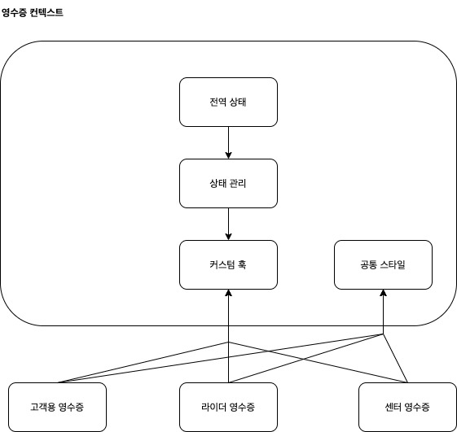
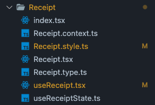
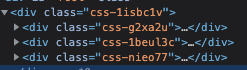
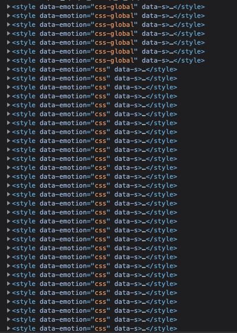

4년 넘도록 커머스 도메인의 웹 프론트엔드를 개발해오면서 사용자(대고객)와 맞닿는 영역 그리고 사용자에겐 보이지 않는 영역 두 가지를 개발해왔다. 오늘은 그 중에서, "사용자에겐 보이지 않는 영역" 쪽의 영수증 이야기를 해볼까 한다.

## 영수증

영수증을 위키백과에서 찾아보자.

> 채권자가 채무자에게 발부하는 채무의 변제를 받았다는 것을 증명하는 내용의 증서를 말한다. 변제자가 변제를 하더라도 변제를 한 것을 증명하지 않는 한 채권이 아직 존재하는 것으로 추정받게 된다. 또 변제한 것...

너무 어려운 말이 써져있다. 쉽게 이야기 하면 내가 어떤 행위(구매, 환불, 이행 등)을 했다는 걸 증명하는 증표이다. 커머스에서는 이 영수증이 굉장히 중요한 영역을 담당하는데, O2O(Online to Offline) 서비스 인 만큼 온라인에서 자신의 가상 자산(은행에 입금되어있는 전산상의 자신의 돈)으로 해당 물품을 구매해서, 실제 받아야 하기 때문이다. 이 과정에서, 실제 못받았거나 받은 물품이 잘못된 경우 해당 영수증을 통해 상품에 대한 환불, 리콜 등의 피드백을 받을 수 있다.

그렇듯, 영수증은 온라인 상거래에서 굉장히 중요한 위치를 차지한다. 사용자는 "쿠팡에서 구매했으니 내일 오전에 오겠지" 혹은 "배민으로 주문했으니 1시간 내로 음식을 받을 수 있겠지"의 기저에는 영수증으로 하여금, 서로간의 약속이 되어있기 때문이다. (그 외에도 전산상의 DB 데이터들이 있겠지만)

### 다양한 종류의 영수증

영수증은 종류가 다양하다. 아니, 다양해야한다. 그렇다면 왜 다양해야할까? 예시를 한 가지 들어보자.

1. 배달의민족을 키고, B마트에 들어가 코카콜라 4개를 장바구니에 담았다.
2. 장바구니에 담은 코카콜라 4개를 현대카드로 결제한다.
3. 결제가 완료되고, 물류센터에 주문정보가 전달된다.
4. 물류센터에서 주문정보를 확인하고 라이더에게 전달하도록 포장한다.
5. 라이더는 배차된 주문건을 센터에서 픽업하고 고객에게 전달한다.
6. 고객에게 전달 후, 라이더는 정산받고 고객은 자신이 주문한 물품을 배송받는다.

B마트의 앱으로 고객이 주문해서 전달받기까지의 간략한 플로우를 작성해보았다. 이 플로우 내에서 필요한 영수증은 다음과 같다.

- 신용카드/현금 영수증: 고객은 자신이 어떤 뭎룸을 구매했는지 영수증을 볼 수 있어야 한다.
- 이메일고지: 어떤 물품을 구매했는지 영수증을 볼 수 있어야 하지만, 법적으로 등록한 연락처(이메일)에 고지를 해야한다.
- 라이더 영수증: 라이더가 고객의 정보를 확인하여 해당 위치로 배달할 수 있도록 제공하는 라이더용 영수증.

그 외에도 신용카드 매출 전표 등 다양한 결제 데이터를 보여줘야하지만, 여기서 중요한 내용은 아니므로 스킵한다.

영수증이 다양한 이유는

- 첫 째로 사용자의 구매수단이 천차만별이기 때문이고, 해당 결제수단으로 인해 결제가 거쳐지는 업체, 국세청에 제공해야하는 데이터들이 달라지기 때문이다.
- 두 번째는 법적으로 고지를 해야하기 때문인데, 각 나라마다 다르겠지만, 기본적으로 한국은 신용카드/현금 영수증, 이메일 고지등은 기본적으로 제공해주어야 한다.
- 세 번째는 전달받는 주체가 다르기 때문이다. 회사의 여러 팀, 혹은 도메인 입장에서 고객의 대상이 다르다. 예를들어 센터에서는 라이더가 고객일 것이고, 라이더에게는 사용자가 고객일 것이다. 그런 것처럼 주체가 다르므로 영수증의 종류는 달라질 수 밖에 없다.

### 개발 요건으로 추려보기

앞서 영수증은 다양한 종류가 존재한다는 사실을 깨닫게 되었다. 그렇다면 이를 개발상에서는 어떻게 재사용성을 고민하면서 개발을 할 수 있을까? 먼저, 다양한 영수증에서 공통적인 영역을 추출해봐야한다.

1. 출력이 되어야 한다
2. 컴포넌트는 동일하다 (테이블, 텍스트, 하이라이트 등)
3. HTML 형태는 동일하다. (영수증 기기 표준 규격이 존재)

3개의 동일한 요건이 있다.

#### 출력이 되어야 한다

영수증의 가장 큰 목표는 사용자에게 전달이 되어야 한다는 목적이 있다. 그렇기 때문에 매장 혹은 센터에서 출력을 통해 사용자에게 전달할 수 있도록 해야한다.

그러므로, 공통적으로 출력을 할 수 있도록 제공해야한다.

#### 컴포넌트는 동일하다

영수증 레이아웃은 도메인에 따라 대부분 비슷하다. 그렇기 때문에 컴포넌트로 인해서 모든 영수증 레이아웃이 동일하게 관리되어도 된다.

#### HTML 형태는 동일하다

영수증 기기는 표준 규격이 존재하기 때문에 사이즈 (400\*min600)으로 구현하면 대다수의 경우에 잘 출력이 된다.

### 실제 구현하기

프로세스를 구축해보면 다음과 같다.



1. 사전에 영수증 컴포넌트에서, iframe을 생성해둔다.
2. 사용처에서 프린트를 요청하면 해당 영수증의 id에 맞는 iframe을 탐색한다.
3. 탐색한 iframe 내에 전달받은 데이터를 기반으로 레이아웃을 제작한다
4. 완성된 레이아웃의 iframe을 document content로 프린트 윈도우를 생성한다.
5. 완성된 window에서 onload되었을 때 window.print()를 호출한다.
6. 사용자는 프린트 출력으로 용지를 받고, iframe 내 데이터를 초기화하여 마크업을 제거한다.

영수증을 출력하기위해 사용자는 위 과정을 몰라도 쉽게 가져와 쓸 수 있도록 해야한다. 그렇기 때문에 사진에서 border로 바운더리를 형성해두었다. 바운더리가 형성된 내부의 로직 및 프로세스는 일정하게 진행되며, 유저에게 프린트 요청을 받고, 프린트 출력을 진행해준다.
이러한 프로세스를 구축해두면 추후 로직이 수정되야 할 때 혹은, 브라우저 지원으로 인해서 다양한 대응로직이 들어가야할 때 등 관심사의 분리를 진행할 수 있다.

> **iframe을 왜 사용하는가?**
>
> window.print() 기능은 현재 페이지의 보이는 모든 요소들(graphics layer로 출력되어야 할 요소를 추린 것들)을 프린트한다.
> 그렇기 때문에 보통 브라우저에서 영수증 개발을 진행할 때는, iframe을 기반으로 새로운 html 요소를 만들어 그 안에 데이터를 렌더링하고 body의 이벤트로 onload 이벤트를 걸어, 모두 로드가 되었을 때 print() 를 호출한다.

### 영수증 컨텍스트 만들기

영수증을 출력하기위해 컨텍스트를 분리해야한다. 컴포넌트 구조는 다음과 같다.



1. 영수증의 컨텍스트내에서는 전역으로 상태를 관리하며, 컨텍스트 내에서 커스텀훅이 reducer 역할을 맡고, 상태 관리에서 로직을 갱신한다.
2. 커스텀 훅에서는 현재 영수증의 발급 상태, 영수증 발급을 요청할 수 있는 함수가 존재한다. 필요한 각 영수증 도메인 별로 훅을 가져와서, 데이터를 매핑하여 사용하도록 한다.
3. 다양한 영수증을 공통적으로 포괄할 수 있는 스타일을 제공하여, 각 영수증에서 스타일을 가져다 사용한다.

대략적인 컴포넌트 구조는 잡았다. 그러면 기술 스택을 선정해보자.

1. React: 애초에 구동되는 프로젝트가 React다.
2. context api: 전역 상태를 담기위한 방법. 상태관리 라이브러리를 사용하지 않는 이유는, 굳이 복잡한 상태(렌더링 성능에 해당하는)가 없고 플래그만 존재하기 때문이다. redux등 상태관리 라이브러리를 추가해봐야 디펜던시만 늘어나고, 상태관리의 장점이 없기 때문에 컨텍스트를 context api로 감싸서 사용할 것이다.
3. emotion.js: 프로젝트 전역적으로 styled-component 스타일의 css in js를 사용한다. 그러므로 영수증도 emotion으로 css 스타일링 할 것이다.

본격적으로 코딩을 해보자. 먼저, 폴더 스트럭쳐는 아래와 같다.



1. index.tsx: 외부에서 노출될 모듈을 한번에 export 해서 내보낸다. 일종의 캡슐화를 위한 레이어라고 보면 된다.
2. Receipt.context.ts: context api 로직을 들고 있다.
3. Receipt.style.ts: 모든 영수증 컴포넌트에서 바라봐야하는 스타일 로직들 모음
4. Receipt.tsx: 영수증 컨텍스트를 Provider화 하는 컴포넌트. 사용할 프로젝트의 페이지 root에 Provider를 설정한다. -> 이렇게 만든 이유는 렌더링의 영향을 적게 받을 수 있도록 컨텍스트를 사용자가 지정할 수 있기 위함이다.
5. useReceipt.tsx: 외부에서 기능을 사용하기 위한 커스텀 훅
6. useReceiptState.ts: 영수증 컨텍스트 내에서 상태관리를 하기위한 커스텀 훅

#### Receipt.context.ts

```tsx {numberLines}
import { createContext } from '_utils/createContext'

import { ReceiptState } from './Receipt.type'

const [context, useContext] = createContext<ReceiptState>()

export const ReceiptContext = context
export const useReceiptContext = useContext
```

- createContext라는 유틸을 제작하여, context와 useContext를 쉽게 빼내어 중복되는 로직 혹은 에러를 캐치할 수 있도록 한다.
- 외부에서 ReceiptContext와 useReceiptContext로 컨텍스트 데이터와 컨텍스트를 참조할 수 있도록 한다.

#### Receipt.style.ts

```tsx {numberLines}
import { css } from '@emotion/react'
import styled from '@emotion/styled'

const Container = styled.iframe<{ test: boolean }>`
  ${({ theme, test }) => css`
    position: absolute;
    z-index: ${theme.layers.CONCEAL};

    background-color: ${theme.colors.white};

    ${test
      ? css`
          left: 50%;
          top: 50%;
        `
      : css`
          left: ${-theme.layers.CONCEAL}px;
          top: ${-theme.layers.CONCEAL}px;
        `}
  `}

  width: 400px;
  height: 600px;
`

// ... 그 외 많은 스타일

export { Container, ... }
```

- Container는 각 영수증 컴포넌트를 제작할 때 강제적으로 루트에 제공해야한다. 그 이유는, iframe 본체이기 때문이며, 각 iframe 마다 id를 지정하여 id로 하여금 element를 가져와 출력 레이아웃을 가져온다.
- test 기능이 있는데, 레이아웃을 확인해야하므로 test가 true인 경우 화면 중앙에 출력되도록 한다. 그렇지 않으면 미리 지정한 theme.layers.CONCEAL(9999)를 이용하여 z-index 상으로 제일 위로 나오도록 설정하고 화면에서 컬링되도록 밖으로 보낸다

### Receipt.tsx

```tsx {numberLines}
import { FC } from 'react'

import { ReceiptContext } from './Receipt.context'
import { useReceiptState } from './useReceiptState'

/**
 * # ReceiptProvider
 *
 * @description Receipt의 상태를 관리하는 훅입니다.
 */
export const ReceiptProvider: FC = (props) => {
  const { children, ...otherProps } = useReceiptState(props)

  return <ReceiptContext state={otherProps}>{children}</ReceiptContext>
}
```

- 전역 상태를 가지고 있으며, useReceiptState에서 상태관리가 진행된다.

### Receipt.type.ts

```tsx {numberLines}
import { FC } from 'react'

type ReceiptType = 'USER_ORDER_RECEIPT_ID'

interface Receipt {
  orderId: number
  type: ReceiptType
}

interface ReceiptState extends Receipt {
  /**
   * # changeState
   *
   * 속성을 변경합니다.
   *
   * @param {Receipt} orderId {@link Receipt}
   */
  readonly changeState: (state: Partial<Receipt>) => void
}

interface ReceiptHook extends Receipt {
  /** 현재 print 가능한 상태 유무 */
  readonly availablePrint: boolean
  /**
   * # requestPrint
   *
   * 프린트를 실행 할 수 있도록 요청합니다.
   * 해당 동작을 진행해야 {@link executePrint} 를 할 수 있습니다.
   *
   * 1. requestPrint를 진행한 후, orderId를 기반으로 각 Receipt 컴포넌트에서 API를 호출
   * 2. API 호출 후 데이터를 가공하여 마크업 렌더링을 해주세요.
   * 3. 모두 렌더링이 되었다면 executePrint를 실행해주세요.
   *
   * @param {number} orderId 주문 아이디
   * @param {ReceiptType} type 영수증 타입
   */
  readonly requestPrint: (orderId: number, type?: ReceiptType) => void
  /**
   * # executePrint
   *
   * @description [중요] requestPrint를 꼭 먼저 실행해주세요. 그리고 설명을 참고해주세요.
   *
   * 실제 프린트를 진행하는 함수입니다.
   */
  readonly executePrint: () => void
  /**
   * # ReceiptContainer
   *
   * @description [중요] 필수적으로 Receipt으로 사용할 컴포넌트의 최상위 container로 래핑해두어야 합니다.
   */
  readonly ReceiptContainer: FC<ReceiptContainerProps>
}

interface ReceiptContainerProps {
  /**
   * 테스트 유무
   *
   * true로 설정하면 레이아웃을 바로 볼 수 있도록 화면의 중앙에 출력됩니다.
   *
   * @default false
   */
  test?: boolean
  /** 해당 receipt의 타입을 설정합니다. */
  type: ReceiptType
}

export type { Receipt, ReceiptState, ReceiptHook, ReceiptContainerProps, ReceiptType }
```

설명이 내부에 있으므로 생략한다.

#### useReceiptState.ts

```tsx {numberLines}
import { useState } from 'react'

import { Receipt, ReceiptState } from './Receipt.type'

export function useReceiptState<T>(props: T): T & ReceiptState {
  const [receipt, setReceipt] = useState<Receipt>({
    orderId: -1,
    type: 'USER_ORDER_RECEIPT_ID'
  })

  const changeState: ReceiptState['changeState'] = (state) => {
    setReceipt((state_) => ({ ...state_, ...state }))
  }

  return {
    ...props,
    ...receipt,
    changeState
  }
}
```

- 상태가 많지 않으므로 type을 바이패싱 가능하도록 props를 generic으로 받아서, 함께 반환하도록 제공한다.
- 또한 기본적인 상태를 initialize 한다.

#### useReceipt.tsx

```tsx {numberLines}
/**
 * # useReceipt
 *
 * @description [중요] 상위에 ReceiptProvider가 존재해야합니다!
 *
 * Receipt의 기능을 사용할 수 있도록 제공합니다.
 *
 * @returns {ReceiptHook} {@link ReceiptHook}
 */
export function useReceipt(): ReceiptHook {
  const _context = useReceiptContext()
  if (!_context) {
    throw new Error(ErrorMessage.NOT_FOUND_CONTEXT)
  }

  const requestPrint: ReceiptHook['requestPrint'] = (orderId, type = 'USER_ORDER_RECEIPT_ID') => {
    _context.state.changeState({ orderId, type })
  }

  const executePrint: ReceiptHook['executePrint'] = () => {
    const printDiv = document.getElementById(_context.state.type) as HTMLIFrameElement

    if (!printDiv) {
      throw new Error(ErrorMessage.FAILED_PRINT_RECEIPT)
    }

    const printWindow = printDiv.contentWindow
    printWindow?.document.open()
    printWindow?.document.write(createReceiptHTML(printDiv))
    printWindow?.document.close()
    _context.state.changeState({ orderId: -1 })
  }

  return {
    ..._context.state,
    availablePrint: _context.state.orderId >= 0,
    requestPrint,
    executePrint,
    ReceiptContainer
  }
}

const ReceiptContainer: FC<ReceiptContainerProps> = (props) => {
  const { test = false, type, children } = props

  return (
    <Styled.Container test={test} id={type}>
      {children}
    </Styled.Container>
  )
}
```

- 핵심 로직이다. Context가 없다면 에러가 나오도록 유도한다.
- requestPrint, executePrint를 type.ts 에서 정의한 데로, ReceiptHook 양식에 맞춰 로직을 구현한다.
- requestPrint: 상태를 변경하여 print 되고 있는 상태로 변경한다. (orderId가 있으면 프린트가 되고 있는 상태이다.)
- executePrint: 실제 컴포넌트에서 request를 받으면 데이터를 fetch 받아 사용할 수 있도록 제공한다. executePrint를 실제로 사용해야 프린트를 진행한다. createReceiptHTML에 관해서는 밑에서 서술한다.
- ReceiptContainer로 React Component가 존재하고, field로 받게 되는데, Styled로만 제공하면 따르지 않을 수 있으므로 아에 제공을 해버렸다.

```tsx {numberLines}
interface CustomHeadParam {
  /** html의 헤드 타이틀 @default "Receipt"*/
  title: string
  /** 커스텀하게 스타일을 넣고 싶을때 추가 */
  customHeadStyle: string
  /** head의 style (emotion.js 같은)을 복사하므로써 기존의 스타일을 사용할 수 있도록 제공합니다. @default true */
  inheritHead: boolean
}

/**
 * # createReceiptHTML
 *
 * Receipt 용 HTML을 생성합니다.
 *
 * @param {HTMLIFrameElement} printTarget print할 iframe
 * @param {}
 */
function createReceiptHTML(printTarget: HTMLIFrameElement, head?: Partial<CustomHeadParam>): string {
  const title = head?.title ?? 'Receipt'
  const customHeadStyle = head?.customHeadStyle
  const inheritHead = head?.inheritHead ?? true

  /**
   * 참고 링크: https://github.com/emotion-js/emotion/issues/595
   * emotion.js는 build 되어 나오는 경우, css의 insertRule로 직행하여 CSS DOM을 직접 넣어버림.
   * 문제는 CRA 같이 페이지 많아지면 인메모리로 들고있어서 메모리 소모가 많아진다는 문제가 있음.
   */
  const headStyle = `${[...document.styleSheets]
    .map((it) => it.cssRules)
    .flatMap((it) => [...it].flatMap((it_) => it_.cssText))
    .join(' ')}`

  return `
  <html lang="ko">
  <head>
    <meta charset="UTF-8">
    <meta name="viewport" content="initial-scale=1, maximum-scale=1, width=400, height=600">
    <title>${title}</title>
    <style>@page {size: auto;margin: 0mm;}</style>
    <style>
      /** RESET CSS... */
  
      ${inheritHead && headStyle}
      ${customHeadStyle && customHeadStyle}
    </style>
  </head>
  <body onload="window.print()">
    ${printTarget.innerHTML}
  </body>
  </html>
  `
}
```

여기서 중요한 부분이 나온다. createReceiptHTML는, iframe에서 html을 생성할 때 베이스가 되는 html을 제작해 넣어준다. 그런데, 이 html은 기존의 프로젝트의 css 스타일을 inherit 받거나 복제하여 가져가지 않는다. 이 말인 즉슨, 기존에 만들어둔 css in js의 emotion.js 스타일들이 먹히지 않는다는 뜻이다. 조금 더 자세히 들여다보면.



emotion.js으로 스타일을 하게 되면, 위와 같이 element에 class 이름으로 해쉬로 부여된 유니크한 아이디가 붙는다. 이 유니크한 아이디의 발급되는 프로세스는 다음과 같다.

1. emotion.js의 css 혹은 styled.???`` 형태로 스타일링하면 내부 카운트가 선언한 순서대로(혹은 빌드에서 읽는 순서대로) 증가한다. 이 증가하게되면 모든 style은 일단, 유니크한 값을 보장받는다. (css-1, css-2 ...)
2. 하지만 해쉬는 만에하나 중복될 확률이 존재한다. (DB를 공부하다보면, 혹은 개발하다보면 수많은 데이터에서 중복되는 경우들이 생긴다.) 그렇기 때문에 emotion.js는 겹치지 않도록 특정한 알고리즘을 사용해 (궁금하면 찾아보기) 중복을 피하며, 유니크한 값을 보장하여 생성한다.
3. 유니크한 아이디를 발급 받은 이후, 웹팩 빌드 과정에서 일괄적으로 정리하여 head에 css style 태그를 만들어, 저장한다.

여기서 styled-component와 emotion.js의 차이가 존재한다.



위의 사진은 Head의 css style에 emotion.js를 로컬에서 실행했을때의 결과이다. styled-component는 이처럼 하나의 스타일마다 css 스타일 블록을 만들어, 하위에 스타일을 정의해서 갖는다.

반면, emotion.js를 프로덕션으로 빌드한 결과물은 다음과 같다.


위의 사진을 보면, 내용물을 확인할 수 없고, 그저 data-emotion에 css-global과 css 두 개만 존재하는 것을 볼 수 있다.

이 테크닉은 최신 브라우저의 cssRules 속성으로 다이나믹하게 css 스타일 readonly 형태로 제공하는 방법이다. (최신 브라우저라고 하기에는 IE8부터 됐다.) 그래서, 복사하거나 데이터를 가져오려면 다른 방법을 사용해야한다.

- 상세 스펙: https://developer.mozilla.org/en-US/docs/Web/API/CSSStyleSheet/cssRules
- 데이터를 주입하려면: https://developer.mozilla.org/en-US/docs/Web/API/CSSStyleSheet/insertRule

이러한 rule로 제공된 css를 가져오려면 아래와 같은 코드를 작성하면 된다.

```ts {numberLines}
;[...document.styleSheets].map((it) => it.cssRules).flatMap((it) => [...it].flatMap((it_) => it_.cssText))
```

- document.styleSheets는 현재 문서의 모든 styleSheets를 가져온다.
- 해당 styleSheets는 CSSStyleSheet 타입이므로, 가져올 때마다 새로운 배열을 생성해준다.
- 안의 cssRules를 추출하고, flatMap으로 cssText를 추출한다.

실행하면 다음과 같은 데이터를 가져올 수 있다.


정리하면 다음과 같다.

- iframe으로 생성한 HTML에서는 기존에 css in js로 가져오던 css style이 없으므로 html을 생성하고 내부에 styled-component, emotion 등으로 제작한 컴포넌트의 스타일이 출력되지 않는다.
- 그러므로, html 생성 시 현재 프로젝트의 head에 있는 stylesheet 데이터를 가져와서 iframe의 html에 주입해주어야 한다.
- 그런데, emotion.js의 경우 cssRules 형태로 다이나믹하게 가져오기 때문에 그에 맞게 cssRules의 cssText를 뽑아오는 처리를 해주어야 한다.

그렇다면 emotion은 cssRule 형태로 사용하는 이유가 무엇일까?

1. cssRule을 사용하게 되면 head의 태그가 많아져 document 상에서 찾기 어려운 데이터를 스타일을 제외하고 찾을 수 있다.
2. cssRule로 감싸진 스타일을 말 그대로 메모리 내에서 다이나믹하게 반응하며, 변경되면 CSS DOM을 바로 갱신시킨다. 일반적인 stylesheet 변경에 비해 훨씬 변경이 용이하다.
3. 하지만, 그런만큼 메모리로 들고있으므로 SPA 앱의 CSS 데이터가 커지거나 페이지 내에서 사용되는 스타일이 굉장히 많아지면 브라우저 메모리가 커질 수 있다.

### 사용해보기

```tsx {numberLines}
export const UserOrderReceipt: VFC = () => {
  const { orderId, executePrint, availablePrint, ReceiptContainer } = useReceipt()

  const [orderDetail, getOrderDetail] = useAsyncWithTokenFlow(API.getOrderReceipt)

  useEffect(() => {
    if (!availablePrint) return

    getOrderDetail(orderId)
  }, [orderId])

  useEffect(() => {
    if (!availablePrint) return
    if (orderDetail.loading) return
    if (!orderDetail.value) return

    executePrint()
  }, [orderDetail])

  // ... 로직

  return (
    <ReceiptContainer type='USER_ORDER_RECEIPT_ID'>
      {detail && (
        <>
        <!-- 레이아웃 로직 -->
      )}
    </ReceiptContainer>
  )
}
```

- 사용자의 주문 영수증을 출력하는 컴포넌트에 적용한다.
- 각 컴포넌트별로 서버 데이터를 가져와서 적용해야하므로, 해당 처리를 진행한다.
- 해당 처리를 진행할 하고나서, executePrint()를 실행하면 <ReceiptContainer> 하위의 데이터가 출력되도록 한다.

### 결과


화면에서 보이는 영수증 출력 버튼을 누르면 `useReceipt()`의 `requestPrint()`를 요청하며, 위에서 설계한 프로세스대로 실행된다.

## 끝으로

현재의 모던 브라우저는 출력을 잘 제공하고 있다. 위에서의 프로세스는 여러 모던 브라우저에서 별 문제 없이 동작한다.
이는 모던 브라우저와 OS 생태계가 발전한 것 뿐만 아니라, 영수증 기기의 ISO 표준 확립, 종이의 배출에 따른 크기의 조정.. 등 다양한 발전이 함께 있었다.

불과 20년전만 해도, 각 영수증 기기는 저마다의 표준을 갖고 있었고 각 OS, 브라우저 별 기능도 다른 상황이었다. 지금은 그렇지 않다는 것에 안도하며...
다음 글은 현재 Context + React + Emotion 형태로 어느정도 오버헤드 있는 코드를 작성하고 있는데, 이를 더욱 쉽게 개발할 수 있도록 고도화하는 글을 작성하고자 한다.

## 그 외

모바일 기기 표준 규격에 관한 자료

- https://scienceon.kisti.re.kr/srch/selectPORSrchArticle.do?cn=JAKO201372478761324
- http://www.dsds.co.kr/info_midas/index05_billprinter.html
