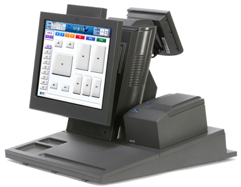
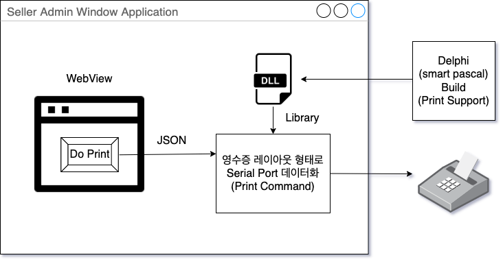
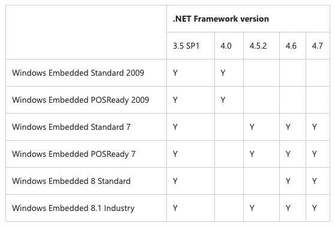

(아..)

이 전 글에서, React와 Emotion을 사용해 영수증을 출력했다. 그리고 다음글로 코드 리펙토링을 하는 것을 진행한다고 고지까지 했는데, 갑자기 "첩첩한중, POS 시스템을 대응하자" 라는 주제로 글을 쓰는지 의문인 사람이 있을 것이다.

결론적으로 이야기를 하면, 앞서 개발한 React 기반의 영수증 출력 프로그램은 윈도우 7 이상의 크롬, 파이어폭스 등 모던 브라우저에서 동작하도록 제공한 코드인데,
현재 다양한 매장에서 사용되는 포스 시스템은 2010년 전후로 작동되는 프로그램이 대다수이고, 이러한 포스 시스템에서는 윈도우 XP, IE 기반의 브라우저에서 동작한다.

그래서 이번 글에서는 React Emotion 기반의 포스 시스템을 해결하기 위한 일종의 "야크 셰이빙" 과정을 이야기하려 한다.

## 왜 갑자기 POS?

이전 영수증을 개발하는 프로세스에서 고려를 하지 않았던 것은 일종의 개발환경에 대한 믿음이었다.
배민의 전사적인 방향성도 그렇고, 니즈에 대한 운영체제, 현황을 확인하였을 때 문제 없는 스펙이었기에 크로미움 혹은 파이어폭스 기반으로 정상적으로 돌아가겠다는 생각으로 스펙을 정하게 되었다. 하지만 이는 좋지 않은 판단이었다.

비즈니스 초기에는 어떤 업체가 들어와서 이 영수증 소프트웨어를 사용할 지 모르는 상황이었기 때문에 어느정도 스펙을 우리가 정해서 가져갈 수 있는 자유도가 있었으나.
우리가 강제로 가져갈 수 있다는 판단은 오만이었고, 결국 폭넓은 기기에 대한 대응을 쉽게 할 수 있는 방법이 필요했다.

이러한 실제 매장에서 사용하는 서비스는 언제든 최악의 상황을 가정하여 개발해야한다. 비즈니스별로 개발자가 결정하고, 해당 결정을 따르도록 통보 형태로 매장에 가이드를 제공할수도 있지만,
비즈니스에는 갑과 을이 존재하는 만큼, 갑과 을의 관계 중 대다수의 소프트웨어 제공 업체 혹은 플랫폼 업체는 초기 시작 시 "을"의 경우에서 되는 경우가 많다.

"을"의 입장에서는 첫 시작에 수많은 업체를 제공해야하는 만큼 초기 환경 설정을 폭넓게 가져갔어야 하는데 이 것은 작업 일정에 치여 제대로 생각하지 못해, 나중 업체가 입점하면서 문제가 발생했다.
이러한 문제 상황에서 어떻게 대응/해결하고 추후 프로세스를 어떻게 개선해야할 것인지 이야기를 해보도록 하겠다.

### POS의 운영체제

[윈도우 임베디드 인더스트리(Windows Embedded Industry)](https://ko.wikipedia.org/wiki/%EC%9C%88%EB%8F%84%EC%9A%B0_%EC%9E%84%EB%B2%A0%EB%94%94%EB%93%9C_%EC%9D%B8%EB%8D%94%EC%8A%A4%ED%8A%B8%EB%A6%AC) 라는 OS가 있다. 쉽게 말하면, POS용으로 윈도우가 운영체제를 만든거라 보면된다.
현재 매장들에 존재하는 대다수의 POS기기는 윈도우 임베디드 인더스트리의 "윈도우 임베디드 POSReady 2009"와 "윈도우 임베디드 POSReady 7"이다.

이는 최근 매장들에도 최신 운영체제보다 기존에 생산하던 업체들이 지속적으로 2009를 사용하고 있었기 때문이다. 최근 윈도우 POSReady 7으로 올라간 까닭은. POSReady 2009의 점유율이 너무 높아 2019년까지 지원을 해주었고, 2019년 이후로부터 POSReady 7을 지원하기 때문에 사용했기 때문이다. 그나마도 곧 POSReady 7도 2021년까지 지원이고, 곧 8.1로 올려서 점유율은 차근차근 올라갈 것이다.

그래서, 웹 개발자 입장에서 어떤걸 고려해야하는가 하면 OS에 따라 브라우저 호환을 신경써야한다. 윈도우 XP의 경우 IE6~IE8이 구동한다. 그렇다면 일단 HTML5는 물론 CSS3도 구동하지 않는 것이다. javascript도 ES5에서 더 내려야하는데, 이는 너무 고통스럽기 떄문에 XP에서 크로미움을 올리는게 현명한 방법일 것이다.
그렇다면 크로미움 기반의 브라우저를 사용할 수 있을 지 봐야한다. 일단, 크롬 레거시 빌드에서 윈도우 XP를 제공하는 버전이 존재한다. 그렇다면 크롬 레거시 빌드에서 동작하도록 제공하는 것이 좋은 것인가?를 생각해봐야 한다.

1. POSReady는 2009, 7 등 다양한 버전이 존재한다. 2009는 XP 기반, 7은 7 기반이다.
2. 크롬 레거시 빌드를 쓰려면 현재 OS 운영체제에 따라 레거시 빌드를 다운받도록 제공해야하며, 이 때 실수로 잘못 받을 가능성과 이미 깔렸을 때의 가능성을 고려해야한다.
3. 다양한 OS에 따라 여러 서드파티 소프트웨어를 제공하는 것은 해당 서드파티 소프트웨어 버전도 관리해주어야 하기 때문에 올바르지 않다.

결론적으로 소프트웨어를 하나만 제공해야하며, 사용하는 입장에서 버전관리는 소프트웨어 한 개만 생각하도록 해야한다. 물론 이 마저도 공수가 많이 들겠지만 최선의 방법일 것이다.

### POS의 프린터

POS기의 운영체제도 신경을 써야하지만. POS기에 연결되어있는 프린터도 신경써야한다. 프린터는 EPSON, 도시바, 파나소닉등 다양한 프린터가 쓰인다. 이 프린터들은 일반적으로 윈도우에서 사용될 때 드라이버를 제공하게 되는데,
이 드라이버는 우리가 여러 프린터의 디펜던시를 신경쓰지 않아도 해결할 수 있게 제공한다. 조금 더 깊게 이야기를 하면, 사용자가 드라이버를 통해 컴퓨터 하드웨어 장치와 상호작용을 할 수 있도록 도와주기 떄문이다.

여기서의 트러블 슈팅 이야기 이전에, 프린트 프로세스를 한 번 보자.

1. 프린터를 진행할 데이터를 지정한다
2. 스풀러에서 프린터를 진행할 대기열에 등록한다. (스풀 - spool)
3. 스풀에 등록된 데이터를 이미지화를 시켜, 하드디스크(SSD)에 임시적으로 저장한다. (이미지 파일을 스풀 파일 이라고 한다.)
4. 저장된 이미지를 CPU에서 다른 작업을 병렬적으로 진행하면서 프린터로 데이터를 전송한다.
5. 다음 스풀에 등록된 데이터 출력준비를 진행한다. (1번으로 복귀)

이 과정이 일어나는 이유는 CPU 자원을 병렬적으로 사용하기 위해서인데, 만일 프린터를 사용할 때 CPU를 모두 점유하고 있다면 문제가 발생할 것이다. 특히나, 중앙처리장치와 입출력장치(특히 프린터 등)가 서로간 처리할 수 있는 속도가 다르기 때문에 중앙처리장치는 입출력장치의 속도에 맞추어 데이터를 내보내줘야하기 때문이다.

만약 중앙처리장치가 입출력장치의 속도와 상관없이 데이터를 내보내준다면 데이터가 중간에 짤리거나 문제가 생기는 일들이 많아질 것이다. 그래서 사용 효율을 늘리기 위해 프린터로 전송될 데이터를 하드디스크에 저장(스풀파일)하고 프린터에서 요청을 할 때마다 비동기적으로 데이터를 제공해주므로써 (해당 데이터는 스풀러에서 관리) 효율을 늘린다.

그런데 여기서 체크해야할 부분은 크게 두 가지인데,

1. POS기의 성능
2. 프린터기의 성능

첫 번째로 POS기의 성능을 확인해야 하는 이유는, 이미지화(스풀파일화)과정과 CPU에서 프린터로 데이터를 전달하는 속도적인 문제에 있다. CPU가 좋지 않다면, 이미지화 하는 속도가 매우 느려질 것이고, 프린터에 데이터 또한 느리게 들어가면서 문제가 생길것이다.

두 번째로 프린터기의 성능인데, 프린터기에서 처리할 수 있는 레지스터 메모리 혹은 캐시 용량에 따라 프린터 데이터 크기에 따라 프린팅할 수 있는 속도가 정해진다.

대다수의 보급된 프린터와 POS의 경우, 2010년 전후로 제공되는 경우가 대다수이다. 그렇기 때문에 어느정도 성능이나 위의 프린트 프로세스를 제공해주는 드라이버들이 존재하는 경우들이 많다. 하지만, 이번 프로젝트의 경우 POS, 프린터기가 너무나 폭넓은 사양을 커버할 수 있어야 했다.

그런데 문제가 발생했다. 2000년대 초반에 생산된 POS, 프린터에서 영수증 출력에 약 30초가량이 걸리는 문제가 발생한 것이다. 이렇게 걸리는 문제는 POS기 성능이 좋지 못해 이미지화를 시키고 프린터로 보내는 CPU 성능이 문제가 되었기 때문이다.

그래서, 접근 방법을 다르게 해야했다. 드라이버를 사용하지 않고 직접적으로 프린터 기기에 전달하는 방법을 사용해야했고, 이는 COM 포트 연결을 통해 Serial 통신을 해야했다. Serial 통신은 UDP 기반의 데이터 통신이며, UDP 기반으로 직접 하드웨어와 통신하기 떄문에 위의 스풀러 프로세스를 진행할 필요가 없었다.

### COM 포트 통신

프린터에 Serial Port 통신으로 데이터를 보낼때, 프린터 커맨드라는게 존재한다. 쉽게말하면 프린터기의 레지스터에서 처리할 수 있는 어떤 특정한 코드를 보내는 것으로 해석하면 된다. [대충 이렇게 생겼다.](http://www.sam4s.co.kr/files/DOWN/2019012393432_1.pdf)

어떤 특정한 포맷으로 문자열 형태를 만들어서 데이터를 보내주면 되는데, 이 과정이 상당히 고통스럽다. 예를들어 "Hello World" 문자열을 출력해주고 싶다면 대략 4줄되는 커맨드 메소드를 보내야한다. 이러한 특정한 규칙을 "프린터 커맨드"라고 한다.

그런데 문제는, 프린터별로 대응되는 커맨드가 다르다. 이 시기는 각 프린터 제조사별로 정책을 정하던 시기라 통합이 되어있지 않기 떄문이다. 그래서, 이를 해결하려면 수많은 프린터에 대한 매핑 테이블을 작성해서 매칭을 해주어야 한다.

수많은 프린터 데이터를 모아서 지금 당장 매핑 테이블을 만드는 건 거의 불가능에 가깝다. 그렇기에 기존에 있는 라이브러리를 사용해야하는데, 이 라이브러리는 어찌되었건 윈도우 기반으로 동작하므로 DLL 파일을 만들어서 윈도우 어플리케이션에서 제공될 수 있도록 하면된다.

## 소프트웨어 제작

결국 윈도우 전용 소프트웨어를 개발해야한다. 해당 소프트웨어를 개발하기위해 여러가지 필수적인 사항을 체크해보자.

1. 윈도우 기반의 소프트웨어를 개발해야한다.
2. 만들어져있는 웹 프로덕트를 활용할 수 있어야 한다.
3. 빠른 시간 내 (2주일)로 개발해야한다.

이러한 필수적인 사항을 적용하려면 일단, 크로미움 기반의 웹이 돌아갈 수 있도록 소프트웨어를 제작해야한다. 그래서 다음과 같은 프로세스를 생각했다.

 

(프린터가 출력되기까지의 어플리케이션 프로세스)

1. 윈도우 어플리케이션 위에 웹뷰가 전체 사이즈로 올려진다.
2. 웹뷰에서 어드민이 제공되며, 어드민에서 영수증을 출력할 수 있는 버튼이 존재한다.
3. 버튼을 클릭하면 서버에서 제공된 영수증을 그리기 위한 데이터(JSON)이 윈도우 어플리케이션으로 전달된다.
4. 윈도우 어플리케이션에서 해당 데이터를 DLL 파일의 함수를 사용해서 프린터의 시리얼 포트 데이터 규격화하여 프린터 기계로 전달한다.

간단하다. 현 시대의 하이브리드 앱처럼 동작한다.

### Delphi 기반의 DLL 개발

여기서 짚고 넘어갈 부분은 `Delphi 기반의 smart pascal로 빌드된 DLL)`이다. 이 것을 사용한 이유는 다음과 같다.

1. 성능상의 이슈가 있으니, 네이티브 퍼포먼스가 훌륭한 언어와 환경을 사용해야한다.
2. 프린터를 쉽게 핸들링하는 라이브러리가 존재해야한다.

pascal은 최근 modern 화가 되면서, 객체지향을 사용할 수 있는 object pascal과, 현 시대에 맞게 똑똑해진 smart pascal 등 다양한 진화가 이루어졌다. 또한 pascal을 사용하는 Delphi에는 printer 라이브러리가 존재한다. 그렇기에 두 가지 경우에 매우 적합하다.

가장 큰 장점은 배민 내에 파스칼 개발자가 존재하여, 이미 파스칼 기반으로 프린터 양식으로 데이터를 보내는 라이브러리가 존재하기 떄문이다. 관련 서포트를 받으면 작업 일정을 굉장히 축약할 수 있다. 그렇기 떄문에 pascal을 선택하여 개발하게 되었다.

### 윈도우 어플리케이션

윈도우 어플리케이션은 C#과 닷넷 프레임워크 기반으로 개발을 진행한다. 그 이유는 다음과 같다.

1. 닷넷 프레임워크는 폭넓은 버전을 가지고 있으며, 해당 버전으로 하여금 OS에 맞는 빌드를 뽑아낼 수 있다.
2. C#은 전통적으로 윈도우 어플리케이션에 많이 쓰이던 언어이고, 지금도 그렇다.
3. C/C++과 같은 거의 저레벨 수준의 언어, 메모리 등을 관리하는 수준까지 내려가면 피곤해진다.

적정한 수준이 C#이라고 판단되었고, 닷넷 프레임워크는 윈도우 운영체제를 쉽게 핸들링 할 수 있는 다양한 문법을 제공한다.

#### 버전

이제 버전을 맞춰보자. 닷넷 프레임워크의 버전에 따라 OS를 제공할 수 있을 것이다. [버전 참조하기](https://techcommunity.microsoft.com/t5/windows-embedded-blog/microsoft-net-framework-versions-supported-by-windows-embedded/ba-p/286129)

3.5는 SP1이기 때문에, XP의 SP1, 2, 3 등을 전부 제공한다. 그렇기 때문에 3.5를 사용하는게 베스트로 보인다. 그런데 여기서 문제는 우리는 크로미움을 사용해야 한다는 점이다. 크로미움을 윈도우 어플리케이션에 올리기 위해서는 [CEF (Chromium Embedded Framework)](https://ko.wikipedia.org/wiki/%ED%81%AC%EB%A1%9C%EB%AF%B8%EC%97%84_%EC%9E%84%EB%B2%A0%EB%94%94%EB%93%9C_%ED%94%84%EB%A0%88%EC%9E%84%EC%9B%8C%ED%81%AC)라는 것을 사용해야한다.

크로미움 임베디드 프레임워크는 C++로 개발되었으며, 다양한 OS에서 동작하는 크로미움 기반의 응용 프로그램을 만들 수 있다. C#에도 이 CEF를 래핑한 라이브러리가 존재하는데, 바로 [CefSharp](https://cefsharp.github.io/) 이라는 친구이다. 이 CefSharp은 특정 버전 이상의 닷넷 프레임워크에서 동작한다.

최소 4.0 이상에서 동작하는데, 이렇게 되면 문제가 생긴다. 모든 버전을 호환하는 닷넷 프레임워크는 3.5이기 때문이다. 그렇다면 우리는 닷넷 버전 4.0과 4.5.2, 4.6 세 가지 빌드를 준비해야한다.

- POSReady 2009: 4.0
- POSReady 7: 4.5.2
- Embedded 8.1 Industry: 4.6

소스는 한 개만 존재하도록 4.0 문법으로 작성하되, 각각의 버전별로 빌드를 진행해야한다. 마이크로소프트는 이러한 버전별 빌드를 잘 제공하며, 쉽게 쉬프트할 수 있도록 제공한다.
그래서 이러한 빌드는 어렵지 않다.

## 결과

<iframe src="https://drive.google.com/file/d/1mK2bCn8EX6qPzmZZx3OKBmSSrIM7W7me/preview" width="100%" height="480px" allow="autoplay"></iframe>

실행 영상

- 좌측의 윈도우 어플리케이션: 어드민이 출력된다.
- 오른쪽 상단의 어플리케이션: 가상 시리얼 포트를 생성한 시리얼 포트 테스터이다.
- 오른쪽 하단은 COM 포트간 연결을 도와주는 소프트웨어이다.

## 끝으로

윈도우 어플리케이션에 웹뷰를 생성하고 웹뷰에 어드민을 띄운 후, 영수증을 출력 시 윈도우 어플리케이션에서 데이터를 가공하고 프린터 기기로 전달한다. 언뜻보면 문제는 해결한 것 같지만 여전히 문제는 존재한다.

앞으로 서비스 운영에서 C# 기반의 윈도우 어플리케이션이 존재하는 만큼 해당 언어에 대한 디펜던시는 존재할 수 밖에 없고 운영 인력이 필요해진다. 이게 과연 좋은 구조인지 다시 생각해봐야 한다.

그렇기 때문에 모든 웹 개발자가 윈도우 어플리케이션을 개발할 수 있는 모종의 방법을 찾아야 하며, 찾기위해 재 설계를 진행해야한다.

다음 글은 이를 찾기위한 여정을 이야기할 것이다.

## Reference

- [PrintDemon: Print Spooler Privilege Escalation, Persistence & Stealth (CVE-2020-1048 & more)](https://windows-internals.com/printdemon-cve-2020-1048/)
