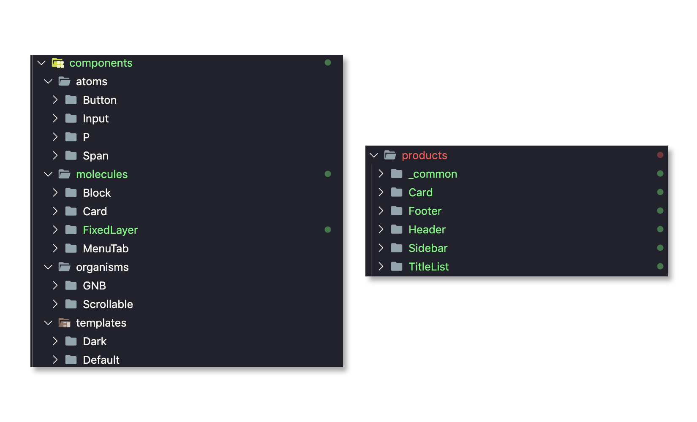

최근 Storybook을 활용한 디자인 시스템 개발을 많은 회사에서 진행하고 있습니다. 디자인 시스템을 구축하면서 수많은 컴포넌트가 생성되고 사라지고를 반복하는데 이러한 컴포넌트 관리를 위해 `Atomic Design`을 많은 회사에서 채택하고 있는 듯 보입니다.

여기서 `Atomic Design`을 채택한다는 것은 `컴포넌트를 재사용할 수 있는 단위로 나눈다` 라는 것 입니다. [이전 글](https://vallista.kr/2020/03/29/Component-%EB%B6%84%EB%A6%AC%EC%9D%98-%EB%AF%B8%ED%95%99/)에서도 언급했지만, 컴포넌트를 분리한다는 것은 그저 보기좋게 변경을 하는게 아닙니다.

실용적이고 아름다운 스트럭쳐를 구현하는 것이 컴포넌트를 효율적으로 분리하는거라 볼 수 있고, `Atomic Design`을 사용해서 그저 컴포넌트의 크기로 무분별하게 `Atomic하게` 나눈 것은 올바른 사용방법이 아니라고 생각합니다.

중요한 포인트는 `Atomic Design 재사용될 수 있는 레이아웃 컴포넌트를 나누는 기준` 입니다. 이번 글에서는 `Atomic Design`에 집중해서 구현하기보다, 더 효율저으로 구현할 수 있는 방법에 대해서 나름대로 찾은 컴포넌트 구조를 설명합니다.

<br/>

> 디자인 시스템이란?
> \_ > [https://story.pxd.co.kr/1434](디자인 시스템) 포스트를 보면 더 도움이 될 수 있습니다.
> "쉽게 말하면 디자인 시스템은 디자인 원칙, 규격, 다시 사용할 수 있는 UI 패턴과 컴포넌트, 코드를 포괄하는 종합 세트입니다."

## 스토리북


(예시 이미지: 스토리북으로 디자인 시스템을 구현중인 화면)

예시 링크: https://github.com/Vallista/DesignSystem

### 스토리북이란?

스토리북(Storybook)은 UI를 개발하고 플레이그라운드에서 테스트를 해볼 수 있는 UI Component 개발을 위한 툴 입니다. 테스팅, 프리뷰와 같은 기능을 사용할 수 있으며, 카테고리별로 컴포넌트를 열람할 수 있기 때문에 최근 디자인 시스템을 구축하는데 편리해 많이 사용되고 있습니다

### 사용하기

[Create React App에서 Storybook 추가하는 방법](https://github.com/Vallista/DesignSystem#issue)을 참고하시면 쉬운 환경설정을 하실 수 있습니다.

Storybook은 [Stories 파일](https://github.com/Vallista/DesignSystem/blob/master/src/products/Blog/Card/index.stories.tsx)에 작업을 해서 Storybook에서 보일 수 있게 설정할 수 있으며 링크를 달아놓은 Stories 파일을 클릭해 들어가보시면, 아래와 같은 코드가 나오게 됩니다.

**Card/index.stories.tsx**

```jsx {numberLines}
import React from 'react'
import { withKnobs, text, number } from '@storybook/addon-knobs'

import Card, { ITheme } from './index'
import { ColorPalette } from '../../../models/color'

import { Background } from '../_common'

export default {
  title: 'Card',
  component: Card
}

export const Default = () => {
  const title = text('타이틀', '컴포넌트 관리 기법')
  const description = text('설명', '안녕하세요 오늘은 컴포넌트 관리에 대해서 알아볼 것이에요')
  const image = text(
    '이미지',
    'http://img.lifestyler.co.kr/uploads/program/1/1765/menu/2/html/f131755988183457049(0).jpg'
  )
  const viewCount = number('열람 수', 5)

  return (
    <Background>
      <Card title={title} description={description} image={image} viewCount={viewCount} />
    </Background>
  )
}

export const White = () => {
  const theme: ITheme = {
    backgroundColor: ColorPalette.White.WHITE,
    textColor: {
      title: ColorPalette.Black.LIGHT,
      description: ColorPalette.Gray.DARK,
      viewCount: ColorPalette.Black.LIGHT
    }
  }

  const title = text('타이틀', '컴포넌트 관리 기법')
  const description = text('설명', '안녕하세요 오늘은 컴포넌트 관리에 대해서 알아볼 것이에요')
  const image = text(
    '이미지',
    'http://img.lifestyler.co.kr/uploads/program/1/1765/menu/2/html/f131755988183457049(0).jpg'
  )
  const viewCount = number('열람 수', 5)

  return (
    <Background background={ColorPalette.Gradient.RED_TO_YELLOW}>
      <Card title={title} description={description} image={image} viewCount={viewCount} theme={theme} />
    </Background>
  )
}

Default.story = {
  name: 'Default',
  decorators: [withKnobs]
}

White.story = {
  name: 'White',
  decorators: [withKnobs]
}
```

이렇게 코드를 작성하면 아래와 같은 이미지로 스토리북에서 출력됩니다.


### Component Story Format (CSF)

위 스토리북 코드는 기존 스토리북을 사용하셨던 분이라면, 익숙하지 않을 소스일텐데요. 최근 스토리북 5.2 버전 이상에서는 [Component Story Format (CSF)](https://storybook.js.org/docs/formats/component-story-format/) 형식으로 stories를 작성하도록 권장하고 있습니다.

**기존 스토리북 사용법**

```jsx {numberLines}
storiesOf('Button', module).addDecorator(withKnobs).addParameters({ notes: someNotes })
```

**변경된 스토리북 사용법**

```jsx {numberLines}
export default {
  title: 'Button',
  component: module,
  decorators: [withKnobs],
  parameters: [{ notes: someNotes }]
}
```

변경이 되면서 기존 스토리북을 사용하던때와 달리, JS 친화적으로 변경된 걸 볼 수 있습니다. 기존에 문제였었던, component 안에 인라인 ReactNode가 들어가거나 Decorator가 많아져서 행이 추가되는 문제점이 사라져 가독성이 좋아지는 효과를 얻을 수 있었습니다.

## 컴포넌트 관리

Storybook을 사용해서 디자인 시스템을 구현하다보면 컴포넌트가 점점 많아져서 분리가 필요합니다. 이 분리라는 것은 컴포넌트를 물리적으로 분리하는 것도 있지만 가시적으로도 분리가 되어 보이도록 구현을 해야합니다.

### 분리하기


최초로 분리해야 하는 것은 `외장(external)` 컴포넌트와 `내장(internal)` 컴포넌트의 분리입니다.

위의 그림처럼 internal 컴포넌트는 internal component 내부에서 사용될 수 있으며, 그렇게 서로 사용되어 만들어진 컴포넌트를 external 컴포넌트에서 가져와 사용할 수 있습니다.

#### 내장 컴포넌트


내장 컴포넌트는 스토리북에서 보여지지 않지만, **외장 컴포넌트에서 사용되는 재사용 가능한 레이아웃 컴포넌트 요소**를 일컫습니다. 이 요소들은 레이아웃 단위로 재사용되기 때문에 **Atomic Design**을 사용하여 분리하면 효율적입니다.

**[component/molecules/Block/index.tsx](https://github.com/Vallista/DesignSystem/blob/master/src/components/molecules/Block/index.tsx)**

```jsx {numberLines}
import React from 'react'
import classNames from 'classnames'

import { IComponentProps } from 'models/common'
import { CalculateBox } from 'utils'

import styles from './style.module.scss'

export enum Direction {
  ROW = 'row',
  ...
}

export enum Sort {
  TOP_LEFT = 11,
  ...
}

interface IProps extends IComponentProps {
  children: React.ReactNode
  direction?: Direction
  sort?: Sort
}

const CalculateSort = (sort: Sort): string[] => {
  const horizontalNumber = sort % 10
  ...
  return [ horizontal, vertical ]
}

const Block: React.FC<IProps> = ({
  children,
  className,
  direction = Direction.ROW,
  sort = Sort.CENTER_CENTER,
  margin = [ 0 ],
  padding = [ 0 ],
  style
}) => {
  const classProps = classNames(styles.default, className)
  ...

  return (
    <div className={classProps} style={styleProps}>
      {children}
    </div>
  )
}

export default Block
```

위 코드는 레이아웃에 대한 정렬 및 위치 조정을 담당하는 Block 컴포넌트 입니다. 해당 컴포넌트는 외장 컴포넌트에서 배치를 효율적으로 하는데 도움을 줍니다

#### 외장 컴포넌트


외장 컴포넌트는 스토리북에서 보여지는 컴포넌트를 일컫습니다. 위의 사진에서 왼쪽의 Sidebar에 Libraries, Products로 분리가 되어있는걸 볼 수 있는데요. Libraries와 Products 분리는 조금 있다가 다루도록하고, 중요하게 봐야하는 점은 보여지는 컴포넌트들이 **외장 컴포넌트** 라는 것 입니다.

이 컴포넌트는 실제 프로덕트 레벨에서 사용되는 컴포넌트이며, 디자인 요소가 완성된 컴포넌트입니다. 추후에 rollup 등의 패키지 매니저들로 export 되어 사용됩니다.

**[products/Card/index.tsx](https://github.com/Vallista/DesignSystem/blob/master/src/products/Blog/Card/index.tsx)**

```jsx {numberLines}
import React from 'react'
import classNames from 'classnames'
...
import Block, { Direction, Sort } from 'components/molecules/Block'
...

const BlogCard: React.FC<IProps> = ({
  className,
  image,
  title,
  description,
  viewCount,
  theme = defaultTheme,
  margin
}) => {
  ...

  return (
    <Card className={classProps} style={styleProps} radius={[ 12 ]} margin={margin}>
      <Block
        className={styles.card}
        direction={Direction.COLUMN}
        padding={isWhiteTheme ? [ 42, 12, 24, 12 ] : [ 24 ]}
        style={{ background: backgroundColor }}
        sort={isWhiteTheme ? Sort.SPACE_BETWEEN_CENTER : Sort.BOTTOM_LEFT}
      >
        <Block className={styles.header}>
          
          <Span className={styles.watchCount} color={theme.textColor.viewCount} size={16} weight={500} lineHeight={1.4}>
            {viewCount}
          </Span>
        </Block>
        ...
      </Block>
    </Card>
  )
}

export default BlogCard
```

내장 컴포넌트를 적극적으로 사용하여 외장 컴포넌트를 제작하였습니다.

#### 결과



간단하게 컴포넌트를 두 종류로 나누어보았습니다. 코드 상에서도 같은 레벨의 컴포넌트를 호출하지 않고 분기를 주니, 파일을 불러올 때도 일관적으로 변경이 된 걸 볼 수 있습니다. 또한 이미지나 폰트등의 디자인이 변경되거나 할 때 내장 컴포넌트를 한번 변경해주면 모두 동일하게 변경이 될 수 있어 용이합니다.

### 심화

이렇게 진행하다보면, 외장 컴포넌트가 비대해지는 걸 볼 수 있습니다. 외장 컴포넌트가 내장 컴포넌트를 사용하는데 같은 외장 컴포넌트끼리 중복되는 코드가 많아질 것 입니다. 이를 방지하기 위해 외장 컴포넌트에 레이어 하나를 더 추가하면 좋습니다.

#### Libraries

위에서 언급했던 Libraries가 여기서 출현했습니다. Libraries는 외장 컴포넌트에서 외장 컴포넌트끼리의 동일한 코드를 묶는 역할도 담당하지만 가장 중요한 내용이 있습니다. 바로 **도메인에 영향받지 않는 공통 컴포넌트** 라는 점입니다.


(이미지 참고: https://story.pxd.co.kr/1434)

카카오톡을 예시로 들어봅시다. 카카오톡이 성공하고 플랫폼이 커짐에 따라 카카오맵, 카카오스타일 등의 여러 서비스가 추가로 나오고 있습니다. 카카오톡에서 이후로 나오는 서비스들은 **카카오가 만들었어요!** 라는 느낌이 들어야 할 것 입니다. 그렇기 때문에 **디자인 일관성**을 주어야 하는데, 이 작업을 위해서 디자인 시스템을 만들어 매니지먼트를 하는게 가장 편할 것입니다.

하지만 여기서 중요한 점은 **동일한 컴포넌트를 사용해도 레이아웃이 조금은 달라질 수 있다는 점** 입니다. 예를들어 카카오페이와 카카오톡이 100% 동일한 레이아웃이 아닌 것처럼, **각 도메인에 따라 레이아웃이 달라질 수 있다** 라는 것 입니다.

그래서, **Libraries는 동일한 레이아웃, 레이아웃 디자인을 일관성 있는 컴포넌트 꾸러미**라면, **Products는 각 도메인에 맞는 레이아웃 디자인 컴포넌트 꾸러미** 라고 할 수 있습니다.

<br/>


(clean architecture와 흡사한 형태의 구현이 된다)

#### 결과


왼쪽은 내장, 오른쪽은 외장 컴포넌트 입니다. 어느정도 규격이 잡혀가는 걸 볼 수 있습니다. 외장 컴포넌트에서 Products, Libraries는 번들링되어 프로덕트 레벨에서도 사용되지만, Libraries는 Products 레벨에서도 사용됩니다. 이렇게 구현하면 중복코드가 줄어듦을 확인할 수 있습니다.

## 정리

1. 외장, 내장 컴포넌트 분리를 하여 사용 용도에 맞게 컴포넌트를 분리하는게 좋다.
2. 외장 컴포넌트에서도 레벨을 나누어 클린아키텍쳐 형태로 구현하면 재사용 가능한 컴포넌트도 늘어나고, 코드 개선에 도움이 된다.
3. Atomic Design에 몰입해서 컴포넌트 분리를 `atomic` 에만 의존하지 말자.
